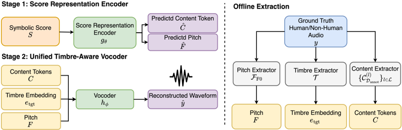

> [!abstract] arXiv · 2025 · Preprint
> **Jionghao Han et al.** (Carnegie Mellon University) · [→ Paper](https://arxiv.org/abs/2511.21045) · Demo: ✓ · Code: ✗
>
> Formalizes Non-Human Singing Generation (NHSG) and introduces CartoonSing, a two-stage synthesis and conversion framework that generates musically coherent singing in timbres outside the human vocal range, such as instrumental, animal, and general-sound "voices."

## Problem

Singing voice synthesis (SVS) and singing voice conversion (SVC) research has focused almost entirely on reproducing natural, human-like timbres, both in training objectives and in evaluation design. Creative media, however, routinely use voices that deliberately deviate from human realism (stylized commercial singing synthesizers, video-game character voices, pitch-shifted or robotic character voices in film), and these effects are currently achieved through manual digital signal processing or professional voice acting rather than a trainable generative model. No prior singing-generation system had been built or evaluated specifically for timbres that lie outside the human distribution. The paper identifies three obstacles unique to this setting: non-human singing training data is scarce and stylistically narrow, non-human audio has no natural phonetic structure that can be aligned to a musical score, and the timbral distance between human and non-human sounds is wide enough that models trained only on human data cannot transfer in a zero-shot manner.

## Method

The paper formalizes two new tasks, Non-Human Singing Voice Synthesis (NHSVS) and Non-Human Singing Voice Conversion (NHSVC), as conditional generative modeling problems: given either a symbolic musical score or a source singing waveform plus a target timbre embedding drawn from outside the human timbre manifold, produce a waveform that preserves the musical content of the input while carrying the target's timbral characteristics.

To make training possible without phonetic annotations for non-human audio, CartoonSing factorizes the signal into three intermediate, frame-level components: multi-layer discrete content tokens obtained by K-means quantization (K=1024) of features from four layers (5, 8, 9, 12) of the timbre-disentangled self-supervised model ContentVec, a continuous frame-level F0 contour (estimated with DIO for human singing and CREPE for non-singing audio), and a timbre embedding extracted with a pretrained RawNet3 model. Because the content tokens and F0 contour do not require score alignment, both human and non-human audio can supply supervision.

The framework is a two-stage pipeline. Stage 1 is a score representation encoder, a non-autoregressive, XiaoiceSing-style Transformer (6-layer encoder, 6-layer decoder, relative self-attention, duration and pitch predictors) trained only on annotated human singing to map a symbolic score to the frame-level content/F0 representation. Stage 2 is a unified timbre-aware vocoder, adapted from BigVGAN-v2 with a multi-resolution CQT and multi-period discriminator, that reconstructs a waveform from the content tokens, F0 contour, and timbre embedding; this stage is trained jointly on human and non-human audio, since it consumes the frame-level representation rather than the score directly.

After pretraining, the Stage 2 vocoder undergoes domain-specific fine-tuning (separately for instrumental, bird, and general-audio domains) using an unpaired timbre-conditioning scheme: for each training example, the source content and F0 are paired with a randomly sampled target timbre embedding, and a shared predictor network with per-task heads re-estimates the content tokens, F0, and timbre embedding from the generated audio to supply auxiliary token-, F0-, and timbre-prediction losses. This lets the model learn from timbre/content combinations that were never observed as ground truth during pretraining.

## Key Results

Across Chinese and Japanese human singing references paired with instrumental, general-audio, and bird target timbres, CartoonSing (both the SVS and SVC configurations, after domain-specific fine-tuning) achieves substantially higher timbre similarity to the non-human targets than baselines trained only on human voices: on Chinese-instrumental SVS, SIM-A rises from 0.493 (VISinger 2) to 0.603 (CartoonSing finetune), and on Chinese-instrumental SVC, SIM-A rises from 0.398 (SaMoye-SVC) to 0.589, with parallel gains on Japanese and on general-audio and bird timbres (Tables 1-3). Subjective MOS-T (timbre-similarity rating) shows the same pattern, e.g. 3.2 vs. 2.71 for SVC on Chinese-instrumental (Table 10). Domain-specific fine-tuning consistently improves pitch accuracy (LF0 RMSE) and voiced/unvoiced error rate over the pretrained model across all three non-human domains. On human singing reconstruction (Table 4), CartoonSing matches or exceeds the VISinger 2 baseline on SIM-S and SingMOS, indicating the framework does not sacrifice human-voice synthesis quality to gain non-human generalization.

However, the same subjective study (Table 10, Appendix A.8) shows that CartoonSing trails the human-voice baselines substantially on MOS-C (intelligibility, 2.99 vs. 4.09 for SVC) and MOS-Q (audio quality, 2.8 vs. 4.02), because the baselines never actually transfer to non-human timbre and therefore retain clean human-like articulation. An ablation replacing the ContentVec-derived content tokens with HuBERT tokens shows the opposite pattern from the main system: HuBERT improves timbre similarity for human reconstruction but degrades it for non-human timbre transfer, which the authors attribute to timbre leakage from HuBERT's less disentangled content representation (Appendix B.2, Tables 11-14).

## Novelty Assessment

The primary contribution is conceptual: the paper is the first to formalize non-human singing voice synthesis and conversion as a distinct machine learning problem with an explicit mathematical formulation, extending the zero-shot SVS/SVC paradigm to timbre embeddings drawn from outside the human manifold. The architectural contribution, factorizing audio into disentangled content tokens, F0, and timbre embedding so that a score-conditioned encoder (trainable only on annotated human data) and a timbre-aware vocoder (trainable on unannotated non-human audio) can be decoupled, is a genuine design response to the specific alignment problem this task introduces, rather than a reapplication of an existing SVS/SVC architecture. The individual components (ContentVec content tokens, BigVGAN-v2 vocoder, RawNet3 timbre embeddings, XiaoiceSing-style score encoder) are all pre-existing; the novelty is in how they are recombined and jointly trained to bridge two acoustically disjoint domains without paired non-human supervision. Compared to the only closely related prior work (SaMoye, zero-shot SVC evaluated on five cat/dog timbres), CartoonSing extends the task to include synthesis (not just conversion) and to a broader set of non-human domains (instrumental, general sound, bird vocalization).

## Field Significance

moderate. This paper opens a new, narrowly scoped sub-task within singing voice generation with a working end-to-end system and a defined evaluation protocol (objective F0/timbre metrics plus a dedicated subjective listening study), providing a concrete reference point for creative-application-driven singing synthesis beyond human timbre reproduction. It also surfaces a previously undocumented trade-off, that timbre transfer to non-human targets degrades intelligibility and perceived quality, that gives the field a concrete open problem (modeling consonant-like transients under strongly non-human timbre) for follow-up work.

## Claims

- **supports:** Factorizing singing audio into disentangled content tokens, a continuous F0 contour, and a timbre embedding, rather than relying on phoneme-aligned score supervision, allows a synthesis and conversion system to generalize to timbres well outside its human training distribution.
  > *Evidence:* CartoonSing, trained with this factorization, achieves consistently higher timbre similarity (SIM-A) to instrumental, general-audio, and bird target timbres than SVS/SVC baselines trained only on human voices, e.g. 0.603 vs. 0.493 for Chinese-instrumental SVS and 0.589 vs. 0.398 for Chinese-instrumental SVC. *(§4.2, Tables 1-3)*
- **complicates:** Transferring a generative singing voice system to a target timbre that departs strongly from human vocal acoustics trades off against perceptual audio quality and intelligibility, because baselines that fail to transfer timbre retain clean human-like articulation by default.
  > *Evidence:* In the subjective listening study, CartoonSing scores far higher on MOS-T (timbre similarity, 3.2 vs. 2.71 for SVC) but lower on MOS-C (intelligibility, 2.99 vs. 4.09) and MOS-Q (quality, 2.8 vs. 4.02) than the human-timbre baseline, attributed to weakened consonantal transients when the output timbre becomes vowel-like and instrument-like. *(§A.8, Table 10)*
- **supports:** Content representations that explicitly disentangle timbre from linguistic/phonetic content are more robust than richer, less disentangled self-supervised representations when a system must generalize to out-of-distribution timbre spaces.
  > *Evidence:* Replacing the ContentVec-derived (timbre-disentangled) content tokens with HuBERT tokens improved timbre similarity for human singing reconstruction but reduced it for non-human timbre transfer across instrumental, general, and bird targets, which the authors attribute to timbre leakage in the less disentangled HuBERT representation. *(§B.2, Tables 11-14)*
- **complicates:** Extending a cross-domain (human/non-human) generative audio system to a new target-timbre domain requires domain-specific fine-tuning rather than transferring zero-shot from a single pretrained model.
  > *Evidence:* The Stage 2 vocoder is fine-tuned separately for each of three non-human domains (instrumental, bird vocalization, general audio) with domain-specific oversampling ratios, and this fine-tuning yields consistent LF0 RMSE and VUV improvements over the pretrained-only model in every domain. *(§4.1, §4.2, Tables 1-3)*

## Limitations and Open Questions

> [!warning] The system's gains in non-human timbre similarity come with a documented drop in intelligibility (MOS-C) and audio quality (MOS-Q) relative to human-timbre baselines; the authors attribute this to the loss of transient consonant cues as target timbre becomes more vowel-like and instrument-like, and identify better modeling of consonant-like transients under non-human timbre as an open problem rather than a solved one.

NHSVS remains only indirectly trainable: the score representation encoder (Stage 1) is trained solely on annotated human singing, since non-human recordings have no natural phonetic counterpart to align against a symbolic score, so the model's ability to generate genuinely novel non-human singing at synthesis time still depends on the Stage 2 vocoder's generalization rather than any direct non-human-score supervision. The main evaluation prioritizes the instrumental timbre domain "due to its cleaner recordings," with general-audio and bird-vocalization results reported as secondary; F0 extraction also fails on a nonzero fraction of segments in the smaller-scale ablation setting (F0 NaN rates up to several percent for some content/timbre configurations), suggesting some target timbre categories are harder to evaluate reliably than others. No overall model parameter count is reported, and code was not yet available at the time of this paper (release planned but not confirmed as public).

## Wiki Connections

- [[singing|Singing Voice Synthesis and Conversion]] — formalizes and jointly trains both non-human singing voice synthesis (score-conditioned) and non-human singing voice conversion (audio-conditioned) under one framework, extending the human-timbre SVS/SVC paradigm to non-human targets.
- [[zero-shot-tts|Zero-Shot TTS]] — extends the zero-shot SVS/SVC paradigm (unseen timbre embeddings at inference without per-timbre fine-tuning) to timbre embeddings drawn from outside the human distribution entirely.
- [[multilingual-tts|Multilingual TTS]] — trains and evaluates the score representation encoder and vocoder jointly on Chinese and Japanese singing data, reporting separate metrics per language.
- [[voice-conversion|Voice Conversion]] — formalizes and evaluates Non-Human Singing Voice Conversion as one of its two core tasks, converting a source singing waveform's timbre while preserving its musical content.
- [[self-supervised-speech|Self-Supervised Speech]] — builds its core content representation on K-means-quantized ContentVec features, a self-supervised, timbre-disentangled speech model.
- [[disentanglement|Disentanglement]] — factorizes audio into separate content, pitch, and timbre streams and provides ablation evidence that disentangled content representations generalize better to non-human timbre than less disentangled alternatives.
- [[gan-vocoder|GAN Vocoder]] — adapts BigVGAN-v2 as a timbre-aware GAN vocoder trained adversarially with a multi-resolution CQT and multi-period discriminator to reconstruct waveforms across both human and non-human domains.
- [[2508.16332|Vevo2]] — related recent work on unified controllable speech/singing generation; CartoonSing's related-work discussion distinguishes its non-human timbral conditioning from Vevo2's humming-to-singing and instrument-to-singing settings, where non-vocal inputs serve only as melodic/prosodic guidance rather than timbral conditioning.
