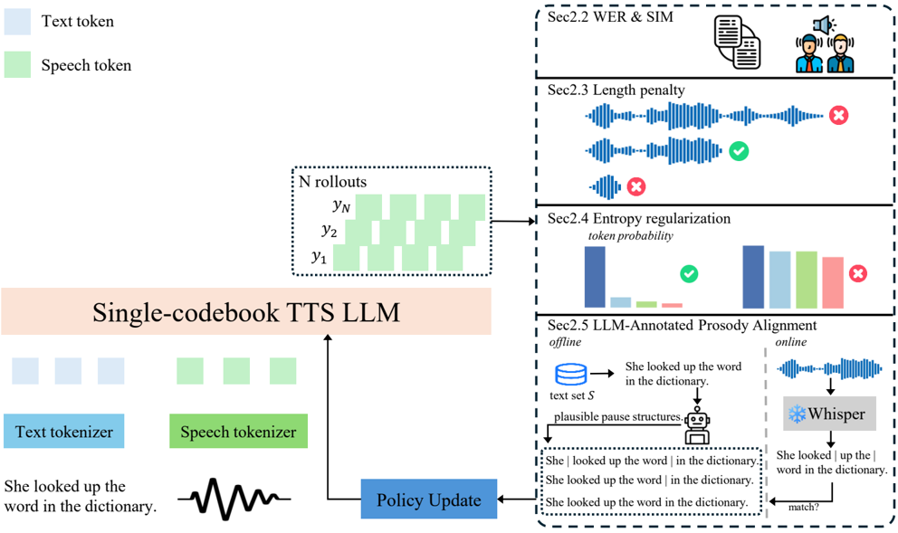

> [!abstract] arXiv · 2025 · Preprint
> **Zhong et al.** (Tencent) · [→ Paper](https://arxiv.org/abs/2511.21270) · Demo: ? · Code: ?
>
> Introduces a multi-reward Group Relative Policy Optimization (GRPO) framework that directly fine-tunes the token-generation policy of a single-codebook TTS LLM, combining intelligibility, speaker-similarity, length, entropy, and LLM-annotated prosody rewards to improve stability and naturalness.

## Problem

Single-codebook TTS LLMs generate semantic and acoustic information jointly in one autoregressive token stream, which makes them compact and streamable but leaves the decoding policy prone to unstable prosody, speaker drift, and degraded naturalness. Supervised fine-tuning of these models does not directly optimize for the perceptual qualities that matter at inference time (rhythm, stability, speaker consistency), and prior reinforcement learning attempts for TTS either rely on uncertainty-aware heuristics, synthetic preference construction, or DPO-style objectives that are sensitive to preference noise and expensive to scale. The paper targets a training-time RL mechanism that can directly shape the AR policy without dense human preference labels.

## Method

The paper formulates policy improvement for a single-codebook TTS LLM as reinforcement learning: starting from a pretrained autoregressive policy π_θ(a_t | s_t) (the LLaSA backbone), Group Relative Policy Optimization (GRPO) is used to maximize expected cumulative reward over generated token trajectories, using group-wise advantage normalization instead of a learned value function or dense preference labels (§2.1).

The reward is decomposed into five interpretable terms, each contributing a separate signal during rollout scoring (§2.1–2.5):
- **Intelligibility reward** — Whisper transcribes generated audio and the CER/WER (via Levenshtein distance) against the input text penalizes unintelligible output.
- **Speaker similarity reward** — cosine similarity between WavLM-large speaker embeddings of generated and reference audio.
- **Length penalty reward** — a binary reward checking whether the ratio of generated duration to a text-length-derived target falls within a tolerance band, discouraging premature stopping or runaway generation.
- **Entropy regularization reward** — penalizes average token-level entropy above a target estimated from high-quality samples, discouraging erratic decoding.
- **LLM-annotated prosody alignment reward** — offline, an auxiliary reasoning LLM (DeepSeek-R1) is given few-shot examples and annotates training texts with pause structures (discrete pause markers for Chinese, Prosodic Word/Prosodic Phrase labels for English). During GRPO training, Whisper timestamps are converted into pause symbols via a handcrafted rule-based mapping and compared against the offline pseudo-labels; a match yields a binary reward.

Training uses a bilingual (Chinese/English, 1:1) corpus of about 1 million (reference text, reference speech, target text) triplets sampled from Emilia and LibriHeavy, totaling roughly 5,115 hours (§3.1). GRPO optimization runs with batch size 16, learning rate 1e-6, and group size 12 on 8×H20 GPUs, with vLLM decoding (top-k 75, top-p 0.9, temperature 1.1, repetition penalty 1.1). Reward coefficients are set empirically, with the length penalty weighted lowest (0.1) relative to the other four terms (1.0 each). To test whether the RL-trained policy's gains are complementary to acoustic refinement, a flow-matching decoder is optionally attached on top of the GRPO-optimized AR backbone (LLaSA+RL+FM).

## Key Results

On the SEED benchmark (test-zh, test-en, test-hard), GRPO-optimized LLaSA (LLaSA+RL) improves over the SFT-only variant of the same backbone across every reported metric: CER on test-zh falls from 1.51 to 1.1, SIM on test-zh rises from 0.688 to 0.758, and CER on the harder test-hard split falls from 10.63 to 6.04 while SIM rises from 0.674 to 0.731 (Table 1, §3.2). The RL-tuned model also achieves the highest MOS among all compared systems (4.12, rising to 4.21 with a flow-matching refinement stage attached), including Seed-TTS, FireRedTTS, MaskGCT, F5-TTS, Spark-TTS, and the CosyVoice family. Despite CosyVoice3 being trained on roughly 1M hours versus 250k hours here, the GRPO model attains lower CER and comparable SIM (§3.2).

An ablation over the five reward terms (Table 2) shows each component contributing incrementally: adding intelligibility and speaker-similarity rewards alone reduces zh CER from 1.59 to 1.31 and raises MOS from 3.68 to 3.77; the length penalty and entropy rewards each add further gains; the full system with the LLM-annotated prosody reward reaches CER 1.1 and MOS 4.25 on zh, with the prosody term contributing the single largest MOS gain of the ablation (§3.4).

A scalability sweep across 1B/3B/8B model sizes and 1K–1M GRPO training samples shows a monotonic trend: larger backbones and more RL data both improve CER and SIM, with measurable gains already visible at 10K samples (§3.3, Figure 2).

## Novelty Assessment

The core RL algorithm (GRPO) is adopted directly from the LLM math-reasoning literature and applying reinforcement learning to optimize TTS-LLM decoding policies is not new in itself — the paper's own related work cites uncertainty-aware RL, reverse-inference preference construction, and differentiable reward optimization as prior efforts in the same direction. The genuinely new element is the specific reward decomposition, particularly the LLM-annotated prosody alignment reward, which uses an external reasoning LLM to generate pseudo pause-structure labels offline and a rule-based Whisper-derived pause extractor for online comparison. This gives the framework an explicit, interpretable rhythm-supervision signal that prior RL-for-TTS work does not use. The systematic scalability analysis across model size and data volume is also a useful empirical contribution, though secondary to the reward design. Overall the contribution reads as an incremental but carefully ablated training-recipe advance rather than a new architecture or algorithm.

## Field Significance

Moderate — this paper provides additional, well-ablated evidence that RL fine-tuning improves prosodic stability and speaker consistency in single-codebook TTS-LLMs beyond supervised fine-tuning of the same backbone, and it contributes a specific reward-design pattern (LLM-generated pseudo-labels for prosody supervision) that other RL-for-TTS work does not use. Its main value is empirical and methodological rather than a new training paradigm: it operationalizes and scales an existing RL optimization technique rather than introducing one.

## Claims

- **supports:** Reinforcement learning fine-tuning of an autoregressive TTS-LLM policy can improve prosodic stability, speaker similarity, and naturalness beyond what supervised fine-tuning of the same pretrained backbone achieves.
  > *Evidence:* On the same LLaSA backbone, RL fine-tuning (LLaSA+RL) reduces test-hard CER from 10.63 (SFT-only) to 6.04 and raises MOS from 3.76 to 4.12, without changing the underlying architecture. *(§3.2, Table 1)*
- **supports:** Decomposing an RL reward into multiple interpretable, independently ablatable components (intelligibility, speaker similarity, duration, entropy, prosody) allows each dimension of TTS quality to be attributed to a specific training signal.
  > *Evidence:* Sequential ablation over the five reward terms shows monotonic improvement in both objective (CER/WER, SIM) and subjective (MOS) metrics as each term is added, with the LLM-annotated prosody reward contributing the largest single MOS gain (3.68 → 4.25 on zh across the full sequence). *(§3.4, Table 2)*
- **supports:** Gains from RL-optimizing an autoregressive TTS-LLM's decoding policy are complementary to, rather than subsumed by, downstream acoustic refinement modules.
  > *Evidence:* Attaching a flow-matching decoder on top of the GRPO-optimized AR backbone yields further improvement over the RL-only model (SIM 0.758 → 0.79, MOS 4.12 → 4.21 on test-zh), rather than making the RL gains redundant. *(§3.2, Table 1)*
- **supports:** The benefit of RL fine-tuning for TTS-LLMs scales with both training data volume and backbone parameter count, with gains already measurable at comparatively small RL data scales.
  > *Evidence:* A sweep across 1B/3B/8B models and 1K–1M GRPO training samples shows monotonically decreasing CER and increasing SIM as either axis grows, with improvements over the supervised baseline visible at as few as 10K samples. *(§3.3, Figure 2)*
- **complicates:** Using an external reasoning LLM to generate prosody pseudo-labels for RL reward supervision introduces a dependency on handcrafted symbolic mappings to compare generated audio against those labels, rather than a fully learned or acoustically-grounded reward.
  > *Evidence:* Online reward computation converts Whisper-derived silence durations into discrete pause symbols through "a handcrafted rule-based mapping" before comparing them to the offline DeepSeek-R1-annotated pseudo-labels, and the reward itself is a binary exact-match signal rather than a graded one. *(§2.5)*

## Limitations and Open Questions

The paper is a 4-page short-format report and does not detail reward-coefficient sensitivity beyond the single empirically-set configuration used, nor does it report training stability across random seeds or repeated runs. The MOS evaluation is based on 100 utterances rated by 10 participants, a modest listener pool with no reported statistical significance testing. The comparison to CosyVoice3 acknowledges an asymmetry in training data scale (250k vs. 1M hours) rather than controlling for it. The framework's prosody reward and speaker-similarity reward both depend on auxiliary pretrained models (Whisper, WavLM, DeepSeek-R1) whose own errors could propagate into the reward signal in ways the paper does not analyze. Generalization of the specific reward design to single-codebook TTS-LLM backbones other than LLaSA is not tested.

## Wiki Connections

- [[rlhf-speech|RLHF Speech]] — proposes a multi-reward GRPO framework as a concrete RL training mechanism for TTS-LLMs, with reward-term ablations that directly evidence which training signals drive quality gains.
- [[autoregressive-codec-tts|Autoregressive Codec TTS]] — applies RL policy optimization to a single-codebook autoregressive codec-token TTS-LLM backbone rather than proposing a new architecture.
- [[zero-shot-tts|Zero-Shot TTS]] — evaluates on the SEED zero-shot voice-cloning benchmark using a reference-audio-prompted backbone.
- [[subjective-evaluation|Subjective Evaluation]] — reports a genuine MOS listening test (100 utterances, 10 raters) alongside objective CER/WER/SIM metrics.
- [[multilingual-tts|Multilingual TTS]] — trains and evaluates the RL framework on a balanced bilingual Chinese/English corpus and separate test-zh/test-en splits.
- [[2502.04128|LLaSA]] — the single-codebook TTS-LLM backbone that this paper's GRPO framework directly fine-tunes; also used as the SFT-only and untuned baselines in Table 1.
- [[interspeech-2025-0704|DiffRO]] — a prior differentiable-reward alternative to GRPO for optimizing TTS-LLM policies, cited as related but distinct from this paper's group-relative approach.
- [[2406.00654|Enhancing Zero-Shot TTS with Human Feedback]] — an earlier RLHF-style approach for zero-shot TTS cited alongside DPO-style methods as motivation for GRPO's group-wise advantage normalization.
- [[2501.12948|DeepSeek-R1]] — the reasoning LLM used offline to generate the pseudo pause-structure labels that supervise the prosody alignment reward.
- [[2407.05361|Emilia]] — one of two corpora sampled to build the bilingual training triplets used for GRPO training.
- [[2406.02430|Seed-TTS]] — originates the SEED evaluation benchmark used throughout, and is the strongest non-LLaSA baseline on test-zh CER in Table 1.
- [[2505.17589|CosyVoice 3]] — a hybrid-architecture baseline trained on substantially more data (1M vs. 250k hours), against which the paper explicitly contrasts its data efficiency.
- [[2025.acl-long.313|F5-TTS]] — a flow-matching baseline compared against in Table 1's main SEED results.
