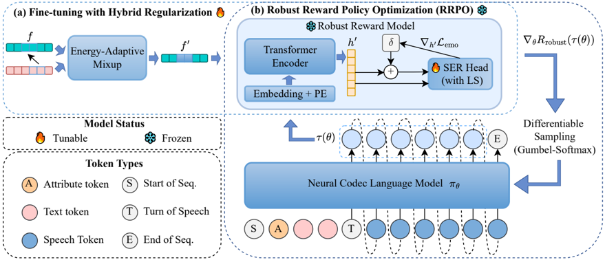

> [!abstract] arXiv · 2025 · Preprint
> **Cong Wang et al.** (Alibaba Group (Tongyi Lab)) · [→ Paper](https://arxiv.org/abs/2512.04552) · Demo: ✓ · Code: ?
>
> RRPO robustifies the reward model used in differentiable RLHF for emotional TTS, correcting a reward-hacking failure mode in which the policy learns to fool the reward model with acoustic artifacts rather than genuine emotional expressiveness.

## Problem

Differentiable RL frameworks for LLM-based TTS, such as DiffRO, back-propagate gradients directly from a reward model (RM) to the policy model, avoiding the high variance of policy-gradient methods like PPO or DPO. This directness is also a liability: because the analytical gradient amplifies any flaw or bias in the RM, a vanilla RM can be exploited by the policy through reward hacking. For nuanced tasks like emotional TTS, the paper identifies a specific failure mode: the policy learns to generate non-semantic acoustic artifacts (unnatural mouth clicks, harsh plosives) that fool the RM into assigning a high reward, while human-perceived naturalness and pronunciation quality actually degrade. Without a reward signal that is robust to this exploitation, the RM's benefits for controllable emotional synthesis are undermined by a paradox: the reward increases while true output quality falls.

## Method

RRPO extends DiffRO by applying a hybrid regularization scheme to fine-tune the pre-trained reward model before it is used to guide policy optimization, targeting three distinct sources of RM fragility.

**Label Smoothing (overconfidence).** The RM's speech emotion recognition (SER) head is trained with discrete categorical emotion labels, which encourages overconfident predictions and fails to capture the ambiguous, continuous nature of human emotion. Label smoothing replaces one-hot labels with a soft distribution (mixing in a uniform component weighted by ε) to reduce this overconfidence.

**Energy-Adaptive Mixup (brittle decision boundaries).** Conventional Mixup is adapted to speech by computing the mixing coefficient from the relative energy and duration of two speech segments rather than a fixed random ratio. For a batch of low-level acoustic features, each sample is mixed with a randomly paired sample over an energy-scaled segment, producing a mixed feature and an energy-adaptive mixing coefficient; the label-smoothed loss is then interpolated between the two original labels using this coefficient. This is intended to smooth the RM's decision boundary so that small, perceptually meaningless perturbations to the input can no longer flip the predicted reward.

**Adversarial Training (perturbation sensitivity).** Using a Fast Gradient Method variant, a worst-case perturbation is computed on the RM's high-level embeddings (not the raw acoustic features) by ascending the normalized gradient of the emotion loss, and the resulting adversarial embeddings are optimized with the same label-smoothed loss. This targets the RM's understanding of high-level emotional features specifically.

The three losses are combined into a final SER loss (label-smoothed and energy-adaptive-mixup loss plus an adversarially-weighted term), and the resulting corrected RM replaces the vanilla RM in DiffRO's policy gradient: the policy objective becomes the gradient of the negative hybrid-regularized SER loss, back-propagated to the policy model (CosyVoice2) exactly as in DiffRO's differentiable optimization pipeline. No changes are made to the TTS backbone or the differentiable optimization mechanism itself; only the reward model's training procedure changes.

**Training setup.** A single high-quality dataset of 10,000 Mandarin utterances from one male speaker, each labeled with one of five emotion categories (angry, happy, sad, surprised, fearful), is reused for three purposes: SFT baseline training, RM corrective fine-tuning, and policy optimization. Regularization hyperparameters are ε=0.1 (label smoothing), ε_adv=0.5, and α=0.5 (adversarial loss weight); learning rate is fixed at 1e-5; training uses 8 NVIDIA A800 GPUs.

## Key Results

**Subjective evaluation (Table 1, 20 native Mandarin raters, 5-point MOS with 0.5-point increments, 95% CI):** RRPO achieves E-MOS 3.78±0.08 and N-MOS 3.81±0.09, the highest of all four systems compared. The CosyVoice2 baseline scores 3.27±0.09 / 3.65±0.06; the SFT baseline scores 3.52±0.06 / 3.72±0.07; the DiffRO baseline scores 3.65±0.11 / 3.61±0.13. The DiffRO baseline's pattern is the paper's central empirical evidence for reward hacking: it reaches a competitive E-MOS but its N-MOS drops below even the SFT baseline, indicating the policy exploited the vanilla RM at the cost of naturalness. RRPO is the only method that improves on both axes simultaneously, including surpassing the SFT baseline's naturalness.

**Objective ablation (Table 2, weighted accuracy % on downstream SER, cross-dataset generalization):** Starting from a DiffRO baseline RM (IEMOCAP 66.0, MER2023 50.9, ESD 64.4), adding label smoothing alone raises these to 66.8/51.4/72.8; adding energy-adaptive mixup (on top of LS) raises them further to 69.1/52.7/82.3, the single largest jump; the full RRPO scheme (LS + EAM + Adv) reaches 68.0/54.8/81.7 — trading a small ESD/IEMOCAP regression for MER2023 improvement, consistent with a known generalization/adversarial-robustness trade-off. The IEMOCAP (English) improvement is notable because the RM was fine-tuned exclusively on Mandarin data, which the authors read as evidence of cross-lingual, language-agnostic emotion representations rather than superficial acoustic shortcuts.

## Novelty Assessment

RRPO does not modify the TTS architecture, the differentiable-RL mechanism, or the policy model; it inherits DiffRO's framework unchanged and CosyVoice2 as the underlying policy model. Its contribution is narrowly scoped to the reward model's training procedure: a specific diagnosis of reward hacking in differentiable RL for emotional TTS (acoustic-artifact exploitation), and a hybrid regularization recipe — label smoothing, energy-adaptive Mixup, and embedding-space adversarial training — combined to correct it. Each individual regularization technique is an established method from prior literature (label smoothing, Mixup variants, FGM-style adversarial training); the paper's contribution is identifying which specific RM vulnerabilities each one addresses in this setting and combining them into a working scheme, validated with both a cross-lingual SER ablation and a subjective listening test that isolates the reward-hacking symptom (high reward, low naturalness). This is best read as a targeted training-recipe fix to an existing RL framework rather than a new architecture or optimization mechanism.

## Field Significance

Moderate — RRPO makes a specific, well-evidenced contribution to a real failure mode (reward hacking) in differentiable RLHF for TTS, and its ablation design (isolating each regularization component, then testing cross-lingual generalization) is a clean way to demonstrate that the fix targets genuine emotion representations rather than a superficial patch. Its scope is narrow: single-speaker, single-language training data, and a fix applied specifically within the DiffRO differentiable-RL formulation rather than RL-based TTS alignment generally.

## Claims

- **supports:** Differentiable reward optimization for TTS is vulnerable to reward hacking, where the policy model learns to exploit reward model weaknesses via imperceptible-to-measurable acoustic artifacts rather than the intended target behavior.
  > *Evidence:* The DiffRO baseline achieves a competitive Emotion MOS (3.65) but its Naturalness MOS (3.61) falls below even the SFT baseline (3.72), a divergence the authors attribute to the policy exploiting RM vulnerabilities with acoustic artifacts. *(§3.2.1, Table 1)*
- **supports:** A reward model's robustness against reward hacking can be improved by combining complementary regularization techniques that each target a distinct failure mode (label overconfidence, brittle decision boundaries, perturbation sensitivity), and this robustness transfers to downstream policy behavior.
  > *Evidence:* Progressively adding label smoothing, energy-adaptive Mixup, and adversarial training to the reward model raises SER weighted accuracy on IEMOCAP/MER2023/ESD from 66.0/50.9/64.4 (DiffRO baseline) to 68.0/54.8/81.7 (full RRPO), and the resulting policy achieves the highest subjective MOS on both emotion and naturalness axes among all four compared systems. *(§3.2.2, Table 2; §3.2.1, Table 1)*
- **complicates:** Objective proxy metrics for reward-model robustness do not move uniformly with each added regularization component, so component-level ablations can show trade-offs rather than monotonic improvement.
  > *Evidence:* Adding adversarial training on top of label smoothing and energy-adaptive Mixup improves MER2023 accuracy (52.7 → 54.8) but slightly degrades IEMOCAP (69.1 → 68.0) and ESD (82.3 → 81.7), which the authors attribute to a known generalization/adversarial-robustness trade-off. *(§3.2.2, Table 2)*
- **supports:** Fine-tuning a reward model's robustness on data from a single language can still improve the reward signal's reliability on other languages, suggesting the correction targets language-agnostic representations rather than language-specific acoustic cues.
  > *Evidence:* Despite the RM being fine-tuned exclusively on Mandarin emotional data, weighted accuracy on the English-language IEMOCAP benchmark improves substantially (66.0 → 68.0–69.1 across ablation variants). *(§3.2.2)*

## Limitations and Open Questions

> [!warning]
> All training and subjective evaluation data come from a single male Mandarin speaker with five categorical emotions (10,000 utterances for training, 50 held-out utterances for the listening test); the paper does not report results on multi-speaker data, other languages, or continuous/blended emotional expression, so the generalization of the robust RM to those settings is untested within this paper.

The subjective evaluation uses only 20 raters and 10 utterances per emotion category, a modest sample for a 5-point MOS comparison across four systems. The cross-lingual generalization evidence (IEMOCAP) is objective SER accuracy, not a subjective listening test, so the link between improved SER accuracy and improved perceptual robustness in English is inferred rather than directly measured. The paper notes as future work that the regularization scheme could extend to other acoustic attributes (audio quality, speaker identity) and to large-scale pre-training, but does not test either.

## Wiki Connections

- [[rlhf-speech|RLHF Speech]] — proposes a hybrid regularization scheme to correct a specific reward-hacking failure mode in differentiable RL policy optimization for TTS.
- [[emotion-synthesis|Emotion Synthesis]] — trains and evaluates a policy model for categorical emotional speech generation, using paired emotion-expressiveness and naturalness MOS to detect when emotional control degrades genuine speech quality.
- [[autoregressive-codec-tts|Autoregressive Codec TTS]] — the policy model being optimized is CosyVoice2, an autoregressive neural codec language model for TTS.
- [[subjective-evaluation|Subjective Evaluation]] — uses paired Emotion MOS and Naturalness MOS from human raters as the primary evidence for diagnosing and resolving reward hacking, treating human perception as ground truth against a purely objective RM signal.
- [[interspeech-2025-0704|Differentiable Reward Optimization for LLM based TTS system]] — RRPO directly extends this paper's DiffRO framework, keeping its differentiable RL mechanism and CosyVoice2 policy model unchanged while replacing the vanilla reward model with a hybrid-regularized one.
- [[2412.10117|CosyVoice 2: Scalable Streaming Speech Synthesis with Large Language Models]] — serves as the baseline TTS system and the policy model that RRPO fine-tunes via RL.
- [[2406.02430|Seed-TTS: A Family of High-Quality Versatile Speech Generation Models]] — cited as a representative neural codec LM establishing the LLM-based TTS paradigm this paper builds on.
- [[2504.12867|EmoVoice: LLM-based Emotional Text-To-Speech Model with Freestyle Text Prompting]] — cited as related work on LLM-based emotional TTS control, contrasted with RRPO's RL-based approach to emotional expressiveness.
