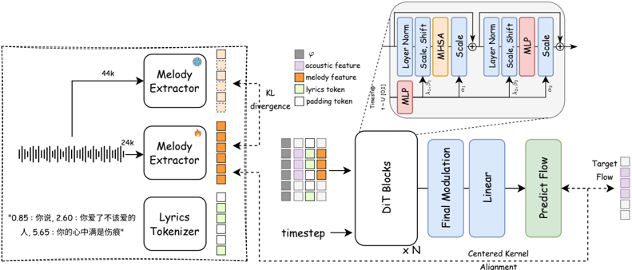

> [!abstract] arXiv · 2025 · Preprint
> **Junjie Zheng et al.** (GiantNetwork AI Lab / ASLP Lab, Northwestern Polytechnical University) · [→ Paper](https://arxiv.org/abs/2512.04779) · Demo: ? · Code: ✓
>
> Proposes a melody-driven singing voice synthesis system that generates arbitrary lyrics against any reference melody, without phoneme-level duration or MIDI-level pitch annotation at training or inference time.

## Problem

Singing Voice Synthesis (SVS) systems have historically depended on precise phoneme-level duration and pitch/MIDI annotations for both training and inference. Producing this data requires specialized annotation pipelines that are expensive and difficult to scale across languages or singing styles, and most existing systems support only fixed lyric-melody pairs seen during training: substituting lyrics, mixing languages, or altering musical structure produces phoneme-count and melodic-beat mismatches that manifest as robotic pronunciation and rhythmic drift. Prior SVS approaches such as XiaoiceSing, VISinger, and diffusion-based systems (DiffSinger, SmoothSinger) improved sound quality but retained this annotation dependency, and even recent zero-shot-oriented systems (TCSinger 2, CoMeLSinger, Transinger) still require external conditional inputs such as MIDI or pitch sequences at inference and lack zero-shot voice-cloning capability. The paper targets this annotation bottleneck directly: can an SVS system synthesize arbitrary lyrics against any reference melody, including for unseen speakers, without phoneme-level alignment or manual MIDI annotation?

## Method

YingMusic-Singer is a Diffusion Transformer (DiT) flow-matching model whose decoder is initialized from the pretrained flow-matching TTS backbone F5-TTS (12 decoder layers, 1024 hidden size, 16-head self-attention, roughly 0.3B parameters). The system couples two components: an online melody extraction module E_φ that derives frame-level melody representations directly from a reference audio waveform, and a DiT-based synthesis module G_θ that predicts the acoustic flow conditioned jointly on lyrics tokens, an audio prompt, and the extracted melody representation.

The melody extractor is trained jointly with the synthesis model rather than as a fixed pre-processing stage. A frozen teacher model (SOME, pretrained on a small MIDI-annotated music dataset) supplies a KL-divergence distillation signal that keeps the online extractor's output melodically faithful, while gradients from the synthesis model's own denoising loss simultaneously push the extractor toward representations useful for generation. A second constraint, based on Centered Kernel Alignment (CKA), explicitly maximizes the correlation between the melody representation and an intermediate layer of the flow model, enforcing structural adherence between the generated acoustic flow and the reference melody's progression. The total pre-training loss sums the standard flow-matching denoising loss with the KD and CKA terms.

Duration is handled without phoneme-level timestamps: lyrics are padded following the DiffRhythm strategy and separated from the audio prompt with a single timestamp at inference, letting the model infer duration allocation from sentence-level-timestamped weak alignment rather than manual annotation.

After pre-training, a post-training stage applies Flow-GRPO-style reinforcement learning: the deterministic ODE flow is reinterpreted as a stochastic policy by injecting noise at a single uniformly sampled timestep (keeping the rest of the trajectory deterministic to avoid credit-assignment ambiguity), and the model is optimized with a group-relative multi-objective reward combining a content-accuracy reward (1 minus WER, from a FireRedASR transcription of the generated singing) and a melodic-similarity reward (Pearson correlation between generated and reference F0 contours extracted with RMVPE, computed only on voiced frames). Both reward weights are set to 1. Training uses 3.7K hours of Mandarin singing vocals, source-separated from public songs following the DiffRhythm data pipeline, with a 500-hour high-quality subset (filtered by DNSMOS, WER, and Meta Audiobox aesthetic score) used for the multi-objective post-training stage.

## Key Results

On zero-shot singing voice synthesis (timbre transfer to five unseen in-the-wild speakers), YingMusic-Singer achieves 1.28% WER versus 3.47% for TCSinger and 9.83% for Vevo, while its F0 correlation (81.28%) trails Vevo's 87.96% but stays above 80%. On zero-shot singing voice editing (lyrics-only and structural-plus-lyrical modification), the model substantially outperforms Vevo on WER (15.18% and 12.62% vs. Vevo's 67.31% and 73.97%) while maintaining comparable speaker similarity and F0 correlation. Subjective evaluation on zero-shot editing shows YingMusic-Singer preferred over Vevo on naturalness (N-CMOS 0.00 vs. -0.75) and a higher Melody-MOS (1.76 vs. 1.62). Ablations show post-training raises FPC from 76.64% to 82.84% and lowers WER from 16.75% to 15.18% relative to the pre-trained-only model, and that CKA-based alignment speeds convergence of melody-following behavior but must have its loss weight annealed during training, otherwise F0 correlation improves at the cost of higher WER.

## Novelty Assessment

The core generative backbone (DiT-based flow matching, initialized from F5-TTS) is not new, and the constituent techniques underlying the two proposed mechanisms, KL-based knowledge distillation and CKA-based representation alignment, are themselves established tools borrowed from other domains. What is new is their combination into a jointly-optimized, annotation-free melody-conditioning pipeline for SVS, together with what the paper describes as an early application of Flow-GRPO-style reinforcement learning to a DiT-based singing synthesis system, using a multi-objective reward that couples an ASR-based content reward with an F0-correlation melody reward. The contribution reads as an architectural and training-recipe advance within the SVS subfield rather than a fundamentally new generative paradigm: it removes a real practical bottleneck (phoneme- and MIDI-level annotation) that prior zero-shot-oriented SVS systems (TCSinger 2, CoMeLSinger, Transinger) had not eliminated.

## Field Significance

moderate - demonstrates that phoneme-level and MIDI-level annotation can be removed from both the training and inference paths of a zero-shot-capable singing voice synthesis system, while matching or exceeding annotation-dependent baselines on content accuracy and melody adherence. It extends flow-matching TTS techniques, via an F5-TTS-initialized backbone, and GRPO-style reinforcement learning post-training, previously applied to text-to-speech, into the singing synthesis domain.

## Claims

- **supports:** Annotation-free melody extraction, learned end-to-end via teacher-student distillation and jointly optimized with the synthesis model, can substitute for manually-annotated phoneme and pitch alignment as a conditioning signal for singing voice synthesis without degrading output quality.
  > *Evidence:* An online melody extractor is trained with a KL-divergence distillation loss against a frozen MIDI-pretrained teacher, jointly with the DiT synthesis model, using only sentence-level-timestamped weakly-aligned data; the resulting system achieves aesthetic scores (CE, CU, PC, PQ) comparable to or better than baselines trained with precise phoneme/MIDI annotation. *(§3.2, §4.5, Table 1)*
- **supports:** Reinforcement learning post-training with a multi-objective reward combining content-accuracy and melodic-similarity terms can jointly improve intelligibility and melody adherence in a flow-matching-based singing synthesis model, particularly in zero-shot and lyric-editing conditions.
  > *Evidence:* Flow-GRPO post-training (single-timestep stochastic noise injection into the ODE flow) reduces WER from 16.75% to 15.18% and raises F0 Pearson correlation from 76.64% to 82.84% relative to the pre-trained-only model. *(§3.3, §4.6, Table 3)*
- **complicates:** An explicit representation-alignment loss between a conditioning signal and internal model features can accelerate convergence of conditional behavior, but risks degrading a competing objective unless its loss weight is annealed during training.
  > *Evidence:* The CKA-alignment loss speeds early convergence of melody-following behavior, but the paper reports that its weight must be gradually reduced during training; leaving it too high yields strong F0 correlation at the cost of increased WER. *(§4.1, §4.6, Table 3)*
- **supports:** Zero-shot singing-voice timbre transfer, conditioned on a short reference audio prompt, can generalize to unseen speakers without dedicated fine-tuning when the synthesis backbone is initialized from a pretrained zero-shot flow-matching TTS model.
  > *Evidence:* Evaluated on five unseen in-the-wild speakers absent from training, the system achieves 1.28% WER, 93.95% speaker similarity, and 81.28% F0 correlation in the zero-shot timbre-transfer setting, outperforming TCSinger and Vevo baselines on WER. *(§4.3, §4.5, Table 1)*
- **complicates:** Structural and lyrical editing that changes phoneme counts and sentence structure remains harder for annotation-free singing synthesis than straightforward zero-shot synthesis, since intelligibility degrades for the editing task even when melody adherence and relative comparisons to baselines remain favorable.
  > *Evidence:* WER rises to 12.62-18.44% for zero-shot lyric and structural editing versus 1.28% for zero-shot synthesis on the same model, though this is still far below Vevo's 67.31-73.97% WER on the identical editing tasks. *(§4.5, Table 1)*

## Limitations and Open Questions

> [!warning] Trained and evaluated exclusively on Mandarin singing data (3.7K hours, source-separated from public songs); no cross-lingual or multilingual results are reported, so the annotation-free and zero-shot claims are demonstrated only within a single language and a comparatively narrow set of evaluation songs and speakers.

Additional limitations noted or implied by the paper: F0 correlation (FPC) in the zero-shot synthesis setting trails the Vevo baseline despite lower WER, indicating a residual accuracy-versus-melody-fidelity trade-off; the CKA-alignment loss weight requires manual annealing during training to avoid degrading intelligibility, adding a tuning burden; and the authors flag output audio fidelity (the current pipeline lacks an advanced neural vocoder or latent-diffusion refinement stage) and fine-grained disentangled control over emotional and stylistic vocal attributes as open directions for future work.

## Wiki Connections

- [[singing|Singing Voice Synthesis and Conversion]] — proposes an annotation-free, melody-driven SVS framework that removes phoneme-level duration and MIDI-level pitch annotation from both training and inference.
- [[flow-matching|Flow Matching]] — builds its DiT-based synthesis backbone directly on a flow-matching TTS model, extending flow-matching-based generation from speech into singing.
- [[zero-shot-tts|Zero-Shot TTS]] — evaluates zero-shot timbre transfer to five unseen in-the-wild speakers, extending prompt-based zero-shot conditioning from TTS into singing synthesis.
- [[prosody-control|Prosody Control]] — introduces an online-learned, distillation- and CKA-guided melody extraction module that conditions generation on pitch and melody independently of lyrics content and speaker timbre.
- [[rlhf-speech|RLHF Speech]] — applies Flow-GRPO reinforcement learning with a multi-objective reward, ASR-based content accuracy plus F0-correlation melody similarity, as a post-training stage for a DiT-based singing synthesis model.
- [[subjective-evaluation|Subjective Evaluation]] — reports N-CMOS and Melody-MOS listening tests comparing the model against a Vevo baseline on zero-shot singing voice editing.
- [[2502.07243|Vevo]] — used as the primary baseline throughout zero-shot synthesis and editing comparisons; YingMusic-Singer reports substantially lower WER at comparable or better speaker similarity and naturalness.
- [[2025.acl-long.313|F5-TTS]] — the DiT-based decoder backbone is initialized from this pretrained flow-matching TTS model to accelerate convergence and improve generalization.
- [[2508.16332|Vevo2]] — supplies the Melody-MOS subjective evaluation metric used to assess melody-following capability.
- [[2502.05139|Meta Audiobox Aesthetics]] — supplies the CE, CU, PC, and PQ aesthetic quality metrics used for objective evaluation and training-data filtering.
- TCSinger 2 — discussed in related work as a recent zero-shot style-transfer SVS system that, unlike this paper, still requires external MIDI or pitch conditioning and does not support voice cloning (not in this corpus, rejected on scope grounds).
- [[2509.19883|CoMelSinger]] — discussed in related work as a discrete-token zero-shot SVS system with structured melody control, contrasted with this paper's continuous flow-matching approach.
