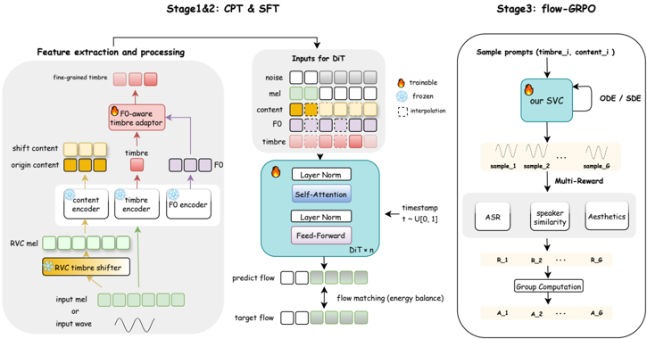

> [!abstract] arXiv · 2025 · Preprint
> **Gongyu Chen et al.** (GiantNetwork AI Lab) · [→ Paper](https://arxiv.org/abs/2512.04793) · Demo: ? · Code: ✓
>
> Introduces a three-stage (pre-training, robust fine-tuning, RL post-training) zero-shot singing voice conversion system with singing-specific inductive biases, designed to stay robust on real production songs containing harmony bleed and noisy pitch, not just clean solo vocals.

## Problem

Zero-shot singing voice conversion (SVC) systems are typically trained and evaluated on clean, isolated solo vocals, but industrial deployment requires converting vocals extracted from full songs by a music-source-separation front-end. That separated "vocal" track frequently retains residual backing vocals or harmony layers, and F0 extraction under these conditions is error-prone. The paper argues existing zero-shot SVC approaches degrade sharply once harmony bleed and F0 noise are present, and that most systems simply bolt an F0 conditioning signal onto a generic speech voice-conversion architecture without inductive biases suited to singing's larger dynamic range and richer high-frequency harmonic content.

## Method

YingMusic-SVC builds on the Seed-VC DiT-based rectified flow matching architecture and trains it through three stages: continuous pre-training (CPT) to adapt newly introduced singing-specific modules, supervised fine-tuning (SFT) with robustness-oriented augmentation, and reinforcement learning (RL) post-training with Flow-GRPO.

The shared conditioning pipeline extracts content, timbre, and F0 features from the input mel-spectrogram using three frozen encoders. To suppress source-timbre leakage into the content stream, the model first passes the input through a pretrained RVC (Retrieval-based Voice Conversion) module trained on singing data, converting it to a random auxiliary singer identity before content encoding; the content encoder then operates on this timbre-shifted audio, becoming more speaker-invariant. A lightweight F0-aware timbre adaptor fuses the global speaker embedding with a time-varying F0 embedding through an MLP, producing a fine-grained, pitch-sensitive timbre representation instead of a static per-speaker vector, intended to mimic how a singer's voice quality changes across pitch register.

The training objective is an energy-balanced rectified flow matching loss that reweights the standard flow-matching MSE by channel-wise inverse energy and a time-dependent factor that increases toward the end of the diffusion trajectory, giving more weight to low-energy, high-frequency mel channels. During SFT, the model is additionally trained on inputs perturbed with simulated F0 jitter, glide, and jump noise, and on lead vocals synthetically mixed with harmony/backing tracks, while still being supervised against the clean lead-vocal mel. Content features are split temporally: an observed region uses original content features and a predicted region uses the timbre-shifted content features, following a stochastic masking scheme adapted from Seed-VC's DiT training procedure.

In the final RL stage, the deterministic rectified-flow ODE is reformulated as an SDE and interpreted as a stochastic policy, following Flow-GRPO. A selective-noise strategy injects stochasticity at a single randomly sampled timestep per group (rather than across the full trajectory) to reduce credit-assignment ambiguity. The policy is updated with a KL-regularized, group-relative-advantage objective against a multi-objective reward combining Meta Audiobox Aesthetics (Content Enjoyment, Content Usefulness), an ASR-based intelligibility reward (1 − WER), and cosine speaker-similarity between generated and reference timbre embeddings.

At inference, a full song is passed through an in-house Band-RoFormer source-separation model trained on ~3,600 multi-track songs (250 hours) to isolate lead vocal, backing vocal, and instrumental stems; only the lead vocal is converted, then resynthesized with a pretrained BigVGAN vocoder and optionally remixed with the instrumental stem. Cross-gender conversion applies a ±12-semitone pitch transposition after F0 extraction. Training data combines 1,000h English + 1,000h Chinese speech from Emilia, ~230h of clean solo vocals from six public singing corpora (GTSinger, M4Singer, OpenCpop, OpenSinger, PopBuTFy, PopCS), and an internal 500h multi-track dataset with aligned lead/backing stems; RL fine-tuning uses only the clean public singing subset to preserve generalization.

## Key Results

On a difficulty-graded internal test suite (100 segments across three settings: GT Leading with clean lead vocals, Mix Vocal with simulated harmony contamination, and Ours Leading using the paper's own separation front-end), the full model (Ours-Full) is compared against Seed-VC and FreeSVC baselines. On GT Leading, Ours-Full reaches SPK-SIM 0.80, CER 9.26%, LogF0PCC 98.12%, NMOS 4.26, and SMOS 3.08, versus Seed-VC's SPK-SIM 0.801, CER 10.89%, LogF0PCC 98.29%, NMOS 3.98, SMOS 3.09 — comparable objective scores but a clear subjective naturalness gain.

The gap widens under Mix Vocal: Seed-VC's CER rises from 10.89% to 17.30% and LogF0PCC drops from 98.29% to 84.02%, while Ours-Full reaches CER 15.9% and LogF0PCC 86.47%, and posts the highest CMOS/NMOS (3.31) and aesthetic scores (CE 5.75, CU 6.40) of any system tested. On the Ours Leading setting (the full production pipeline with the paper's own separation front-end), Ours-Full again leads on CMOS (3.91) and SPK-SIM (0.801).

An ablation (Table 3) attributes the largest single contribution to the RVC-based timbre shifter: removing it degrades SPK-SIM, CER, and aesthetic scores across all three settings, with the largest effect under Mix Vocal (SPK-SIM 0.810 → 0.804, CER 15.70% → 16.30%). Removing the F0-aware timbre adaptor consistently lowers aesthetic CE/CU scores. Removing the energy-balanced loss produces a mixed result: aesthetic scores improve slightly while CER worsens (e.g., GT Leading CER 9.20% with the loss vs. 9.40% without it), which the authors read as a spectral-detail/intelligibility trade-off. A staged comparison (CPT → SFT → RL) shows each stage contributing distinct, complementary gains, with RL's improvements concentrated in perceptual/aesthetic dimensions rather than objective intelligibility or pitch metrics.

## Novelty Assessment

The contribution is primarily an engineering integration of existing techniques into a singing-specific, production-oriented pipeline, with two modestly novel components validated by ablation. The RVC timbre shifter reuses an existing open-source VC tool (RVC) as a source-timbre-suppression pre-processing step rather than introducing a new disentanglement mechanism. The F0-aware timbre adaptor and energy-balanced flow-matching loss are new module/loss designs specific to this paper, each shown by ablation to contribute measurably, though the underlying ideas (pitch-conditioned style adaptation, frequency-reweighted spectral losses) draw on cited prior work. The Flow-GRPO RL stage applies an existing algorithm (Flow-GRPO, originally for text-to-image flow matching) to SVC; the paper's own framing is that this is the first RL post-training applied to a DiT-based SVC model specifically, though GRPO-style RL for flow-matching speech generation had already been demonstrated for TTS (F5R-TTS). The SFT-stage robustness augmentations (F0 perturbation, harmony-track mixing) are explicitly adapted from a companion paper by an overlapping author set (R2-SVC). Overall this reads as a systems paper assembling known building blocks around a coherent robustness-and-RL recipe for industrial SVC, rather than a new architecture or training paradigm.

## Field Significance

moderate — This paper demonstrates that combining source-timbre suppression, pitch-aware timbre conditioning, frequency-reweighted losses, and multi-objective RL post-training yields consistent, ablation-supported gains for zero-shot SVC specifically under harmony-contaminated, real-song conditions, an evaluation regime under-represented in prior zero-shot SVC work that mostly reports on clean solo vocals. Its main value is as an integration recipe and a difficulty-graded evaluation protocol rather than a new architectural or training paradigm.

## Claims

- **supports:** Passing a zero-shot voice/singing conversion model's input through a separate, pretrained single-shot conversion model to strip source-speaker identity before content-feature extraction improves the invariance of the resulting content representation and downstream conversion fidelity.
  > *Evidence:* Ablating the RVC-based timbre shifter is the single largest degradation across all three test settings, e.g. under Mix Vocal SPK-SIM drops from 0.810 to 0.804 and CER rises from 15.70% to 16.30%. *(§5.3.1, Table 3)*
- **supports:** Making speaker/timbre conditioning a function of the local pitch contour, rather than a single static per-speaker embedding, improves perceived quality of converted singing by allowing timbre to shift with vocal register.
  > *Evidence:* Removing the F0-aware timbre adaptor lowers aesthetic Content Enjoyment/Usefulness scores across all settings, e.g. GT Leading CE/CU falls from 5.79/6.50 to 5.75/6.46. *(§5.3.1, Table 3, Figure 3a)*
- **complicates:** Reweighting a flow-matching training loss to emphasize under-represented high-frequency spectral content does not uniformly improve all quality dimensions; it can trade improved spectral/aesthetic detail against measured intelligibility.
  > *Evidence:* On the clean GT Leading set, including the energy-balanced loss lowers CER (9.20% vs. 9.40% without it) but very slightly reduces aesthetic CE/CU (5.79/6.50 vs. 5.81/6.54 without it), a pattern the authors attribute to a spectral-detail/intelligibility trade-off. *(§5.3.1, Table 3)*
- **supports:** Online RL post-training with a multi-objective, non-differentiable perceptual reward (aesthetic quality, intelligibility, speaker similarity) can improve a flow-matching voice/singing conversion model on dimensions not directly optimized by its supervised training objective.
  > *Evidence:* After SFT, the RL stage further raises CMOS from 3.23 to 3.31 and aesthetic CE/CU from 5.73/6.35 to 5.75/6.40 on Mix Vocal, and yields the highest CMOS (3.91) on the full production pipeline (Ours Leading). *(§5.2)*
- **complicates:** Zero-shot SVC systems evaluated only on clean, isolated solo vocals substantially overstate real-world performance, because harmony bleed and F0 errors from imperfect source separation degrade intelligibility and pitch stability even for otherwise strong baselines.
  > *Evidence:* The Seed-VC baseline's CER rises from 10.89% (GT Leading, clean) to 17.30% (Mix Vocal, harmony-contaminated) and LogF0PCC drops from 98.29% to 84.02%, a degradation the paper's own robustness-trained model only partially closes (CER 15.90%, LogF0PCC 86.47%). *(§5.1, Table 2)*

## Limitations and Open Questions

> [!warning] The paper's "state-of-the-art" claim is only benchmarked against two baselines, Seed-VC and FreeSVC. The related-work section discusses several more recent zero-shot SVC systems the authors themselves position against (SaMoye, LDM-SVC, R2-SVC, HQ-SVC), but none of these are included as quantitative comparisons in the experiments, so the paper's superiority claims are established relative to a narrower baseline set than the related-work framing implies.

The evaluation corpus is modest in scale: 100 total segments sampled from internal multi-track data, with only 20 of those used for subjective evaluation by a panel of 10 listeners, and only five target timbres tested. Training and evaluation rely heavily on internal, non-public assets (the 500h multi-track dataset, the in-house Band-RoFormer separation model, the difficulty-graded test suite itself), which the released code and model checkpoints do not resolve for independent reproduction of the reported numbers. The RVC timbre shifter and F0-aware adaptor are evaluated only within the CPT ablation; their interaction with the later SFT and RL stages is not separately ablated. The paper also does not report an overall parameter count for the resulting model.

## Wiki Connections

- [[singing|Singing Voice Synthesis]] — applies a three-stage training pipeline and singing-specific inductive biases (pitch-aware timbre conditioning, frequency-reweighted loss) to the voice-conversion side of singing generation.
- [[voice-conversion|Voice Conversion]] — is a zero-shot SVC system built by adapting a general voice-conversion DiT backbone (Seed-VC) with singing-specific robustness and conditioning mechanisms.
- [[zero-shot-tts|Zero-Shot TTS]] — evaluates exclusively on target singers and songs unseen during training, providing genuine zero-shot evidence for the conversion setting rather than a title-only claim.
- [[flow-matching|Flow Matching]] — trains a DiT-based rectified flow matching model with a custom energy-balanced reweighting of the flow-matching loss for high-frequency spectral fidelity.
- [[rlhf-speech|RLHF Speech]] — applies Flow-GRPO, an online, KL-regularized, group-relative-advantage RL algorithm, as a post-training stage optimizing a multi-objective non-differentiable perceptual reward (aesthetics, intelligibility, speaker similarity).
- [[speaker-adaptation|Speaker Adaptation]] — introduces an F0-aware timbre adaptor that adapts the target-speaker embedding to the local pitch contour instead of using a static per-speaker vector.
- [[2411.09943|Seed-VC (Zero-shot Voice Conversion with Diffusion Transformers)]] — is the DiT-based rectified flow matching backbone this paper builds on and one of its two quantitative baselines.
- [[2510.20677|R2-SVC]] — the SFT-stage F0 perturbation strategy is explicitly adapted from this companion paper's robustness augmentation approach.
- [[2511.08496|HQ-SVC]] — a contemporaneous zero-shot SVC system discussed as related work but not included as a quantitative baseline in this paper's experiments.
- [[2504.02407|F5R-TTS]] — prior work applying GRPO-style RL to a flow-matching speech generator (TTS), cited as the closest precedent for combining RL with flow-matching speech models.
- [[2407.05361|Emilia]] — supplies the English and Chinese speech subset used during continuous pre-training for broad linguistic coverage.
- [[2206.04658|BigVGAN]] — used as the pretrained vocoder that converts predicted mel-spectrograms back to waveform.
- [[2502.05139|Meta Audiobox Aesthetics]] — supplies the Content Enjoyment and Content Usefulness reward signals used in the Flow-GRPO RL stage.
- [[2210.02747|Flow Matching for Generative Modeling]] — is the underlying generative-modeling formulation the rectified flow matching training objective is built on.
