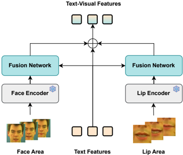
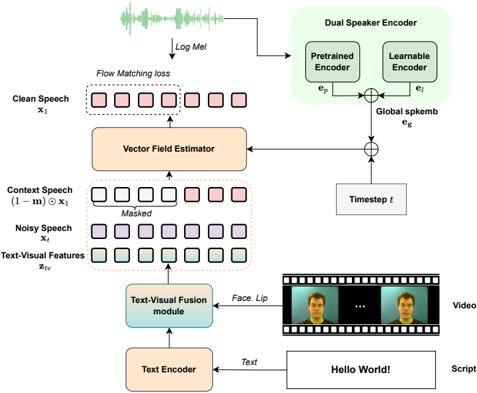

> [!abstract] arXiv · 2025 · Preprint
> **Kaidi Wang et al.** (Xiamen University / Xiaomi Inc.) · [→ Paper](https://arxiv.org/abs/2512.05126) · Demo: ? · Code: ?
>
> Adapts a pretrained flow-matching TTS model to video dubbing by fusing visual (lip and face) cues into the generation process and introduces a dual-pathway speaker encoder to hold speaker identity stable across languages.

## Problem

Video dubbing requires speech that is both natural and precisely synchronized to a speaker's lip movements, but prior systems fall short in two ways. Approaches trained from scratch on audiovisual corpora are data-starved, since paired video-speech data is scarce and low-quality relative to large speech-only corpora, which caps naturalness and synchronization accuracy. Approaches that instead start from large pretrained TTS models and fine-tune on audiovisual data improve naturalness but have not been extended beyond monolingual settings. A separate line of work performs video translation with pure TTS models that ignore visual input entirely, which produces speech that is well aligned to the target text but misaligned with the original lip movements. The paper targets both gaps: bringing visual conditioning to a pretrained TTS backbone, and extending video dubbing to cross-lingual video translation, where lip-sync mismatch with the source video is unavoidable because the spoken language changes.

## Method

SyncVoice builds on ZipVoice, a flow-matching zero-shot TTS model with a text encoder and a vector field estimator that generates mel-spectrograms from a text-conditioned latent trajectory, rather than training a video dubbing model from scratch. Two components are added on top of this backbone.

The Text-Visual Fusion Module extracts facial-action and lip-motion features per frame from cropped face and lip regions using pretrained visual encoders, projects each modality into the text latent space with lightweight bottleneck adapters (LayerNorm, GELU, residual connection), and fuses the adapted visual features with text embeddings through a residual linear fusion layer, producing a fused text-visual condition that preserves linguistic content while injecting visual timing dynamics.

The Dual Speaker Encoder combines two pathways to form a global speaker embedding: a frozen CAM++ speaker-verification encoder that provides robust but discrimination-optimized identity features, and a learnable encoder (1D convolution, six attention blocks, mean-and-standard-deviation pooling, linear projection) trained to capture voice characteristics suited to synthesis rather than verification. The two embeddings are summed, and the paper motivates this design by noting that speaker-verification embeddings are optimized for discrimination, not for capturing the natural voice variation TTS needs.

Training follows a masked flow-matching objective over mel-spectrograms: a random binary mask selects which time-frequency bins are generated versus observed as context, the observed context speech and the (possibly masked) global speaker embedding are fed to the vector field estimator alongside the fused text-visual condition, and a stochastic condition-masking strategy randomly drops either the context speech or the speaker embedding during training so the model can synthesize from either signal alone. At inference, a multi-condition classifier-free guidance strategy independently scales the facial-action, lip-motion, and text conditions, combining predictions from different conditioning subsets to trade off pronunciation accuracy, prosody, and lip-sync strength. Waveforms are reconstructed from mel-spectrograms with a pretrained Vocos vocoder. Two model variants are trained: a monolingual version initialized from a LibriTTS-pretrained ZipVoice checkpoint and trained on the GRID corpus, and a bilingual version initialized from an Emilia-pretrained checkpoint and fine-tuned on an internal bilingual dataset (338 hours Chinese, 721 hours English); the Dual Speaker Encoder is used only in the bilingual version.

## Key Results

On the GRID corpus (monolingual, lip-consistent dubbing), the proposed model outperforms two video-dubbing baselines, EmoDubber and ProDubber, on lip-sync confidence (LSE-C 7.22 vs. 7.06 and 4.74), lip-sync distance (LSE-D 6.75 vs. 6.94 and 8.55), and intelligibility (WER 11.82 vs. 17.63 and 15.24), while slightly trailing ProDubber on speaker similarity (SIM-o 0.67 vs. 0.675) *(§4.1, Table 1)*.

For the bilingual model on the monolingual EN-EN test set (1,054 samples from HDTF), incorporating visual features (M3) achieves the strongest audio-visual synchronization of all configurations tested, exceeding even the ground-truth video's own lip-sync scores (LSE-C 8.04 vs. 7.33 ground truth), though at a moderate cost to speaker similarity and intelligibility relative to a zero-shot TTS baseline with no visual conditioning *(§4.1, Table 3)*.

On the cross-lingual EN-ZH test set, replacing context-speech conditioning with the global speaker embedding (comparing M1 to M2) sharply reduces WER (16.78 to 4.81), demonstrating that reference-audio content otherwise leaks into the generated speech's language. Adding visual conditioning trades off against this gain: the best-synchronization configuration (M4, using both lip and face features) raises WER by 4.21 over the no-visual baseline, while the face-only configuration (M5) raises WER by only 1.38 and still improves synchronization over no visual input, which the paper adopts as the preferred configuration for cross-lingual video translation *(§4.2, Table 4)*.

## Novelty Assessment

The core TTS backbone (ZipVoice) and the vocoder (Vocos) are unmodified pretrained components; the paper's contribution is the design of two new modules layered on top of that backbone (the Text-Visual Fusion Module and the Dual Speaker Encoder) and a multi-condition classifier-free guidance scheme for combining text, face, and lip conditions at inference. This is an architecture-and-recipe contribution rather than a new generative model from scratch: the flow-matching TTS mechanism itself is inherited. The most novel element is applying visual conditioning to control synchronization in a cross-lingual video translation setting where the source and target languages differ and lip-sync mismatch is inherent; the paper explicitly frames this as a first attempt at using visual information for temporal control under language mismatch, which is a genuinely underexplored problem rather than an incremental restatement of monolingual video dubbing.

## Field Significance

moderate — This paper demonstrates that a general-purpose zero-shot flow-matching TTS backbone can be adapted to video dubbing without training a dedicated audiovisual model from scratch, and it isolates a specific, previously unaddressed failure mode in cross-lingual dubbing: reference-audio language leaking into generated speech content, which the dual speaker encoder design directly targets. The ablations quantify a concrete trade-off between lip-synchronization strength and intelligibility under visual conditioning, giving the field a measured data point on how much synchronization gain costs in WER for a given visual-feature configuration.

## Claims

- **supports:** Replacing raw reference-audio conditioning with a distilled global speaker embedding reduces language leakage from the reference audio into synthesized content in cross-lingual generation.
  > *Evidence:* Switching from context-speech conditioning (M1) to a global speaker embedding (M2) drops WER from 16.78 to 4.81 on the EN-ZH cross-lingual test set, with the paper attributing M1's high WER to speech content becoming "significantly influenced by the language of the reference audio." *(§4.2, Table 4)*
- **supports:** Combining a pretrained, discrimination-optimized speaker-verification embedding with a separately trained, synthesis-oriented embedding improves speaker identity preservation over using either alone.
  > *Evidence:* An ablation shows the pretrained-encoder-only variant underperforms overall and the learnable-encoder-only variant achieves low WER but poor speaker similarity (SIM-o 0.495 vs. 0.655 for the full dual encoder), attributed to limited fine-tuning data. *(§4.3, Table 6)*
- **complicates:** Adding visual conditioning for lip-synchronization control trades off against intelligibility in cross-lingual video translation.
  > *Evidence:* The full visual-conditioning configuration (lip + face features, M4) achieves the best synchronization but raises WER by 4.21 over a no-visual baseline; a face-only configuration (M5) recovers most of the synchronization gain while raising WER by only 1.38. *(§4.2, Table 4)*
- **complicates:** Fine-tuning a pretrained zero-shot TTS model on audiovisual data can degrade baseline speech generation quality before any visual conditioning is added.
  > *Evidence:* After fine-tuning on audiovisual data with no visual features (M1), speech quality shows a slight degradation relative to the original TTS model, attributed to the limited scale of the audiovisual training data. *(§4.1)*

## Limitations and Open Questions

> [!warning] The cross-lingual translated test set is machine-generated: EN-ZH text pairs are produced by translating original English transcripts with the Gemini API rather than using human-translated or naturally bilingual dubbing data, which may not reflect real-world dubbing/localization text distributions or translation quality variance.

The bilingual audiovisual training set is small relative to the monolingual GRID setup (338 hours Chinese, 721 hours English) and is internal/proprietary, limiting reproducibility. The paper itself notes that fine-tuning on this limited-scale audiovisual data causes a quality regression before visual conditioning is even introduced, and the learnable speaker encoder underperforms on speaker similarity, both attributed to limited fine-tuning data rather than resolved. The cross-lingual video translation setting is evaluated only for English-to-Chinese; generalization to other language pairs and to languages with different phonetic-visual correspondence (e.g., different viseme sets) is not tested. Code and demo availability are not stated in the paper.

## Wiki Connections

- [[flow-matching|Flow Matching]] — SyncVoice inherits its generative mechanism entirely from a pretrained flow-matching TTS backbone (ZipVoice) rather than proposing a new generative process.
- [[zero-shot-tts|Zero-Shot TTS]] — the backbone's zero-shot voice-cloning capability is preserved and extended with a dual-pathway speaker embedding for use under audiovisual and cross-lingual conditioning.
- [[multilingual-tts|Multilingual TTS]] — trains and evaluates a dedicated bilingual (Chinese/English) variant with its own cross-lingual test set and a speaker encoder specifically designed to mitigate cross-lingual reference-audio interference.
- [[speaker-adaptation|Speaker Adaptation]] — the Dual Speaker Encoder is a purpose-built mechanism for preserving speaker identity across languages and audiovisual conditioning without retraining per speaker.
- [[subjective-evaluation|Subjective Evaluation]] — reports MOS-based naturalness (MOS-N) and similarity (MOS-S) listening tests alongside objective synchronization and intelligibility metrics.
- [[2506.13053|ZipVoice]] — the flow-matching zero-shot TTS backbone that SyncVoice fine-tunes and extends with visual conditioning and a dual speaker encoder.
- [[2025.acl-long.313|F5-TTS]] — cited as an example of a pure TTS model used for video translation without visual input, motivating SyncVoice's visual-conditioning approach to avoid lip-sync misalignment.
- [[2506.21619|IndexTTS2]] — cited alongside F5-TTS as a pure TTS model applied to video translation without visual grounding, contrasted against SyncVoice's vision-augmented approach.
- [[2505.07916|MiniMax-Speech]] — cited to motivate the learnable branch of the Dual Speaker Encoder, noting that speaker-verification-trained embeddings are not optimized for capturing natural voice variation needed in synthesis.
- [[2403.16973|VoiceCraft]] — the underlying zero-shot TTS/speech-editing model that a related audiovisual dubbing baseline (VoiceCraft-Dub) builds on, discussed in the paper's related work on pretrained-TTS-based dubbing.
