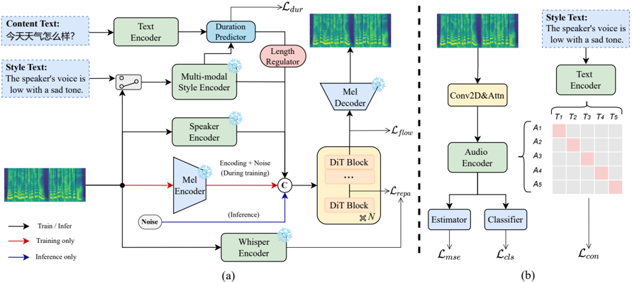

> [!abstract] arXiv · 2025 · Preprint
> **Yin et al.** (USTC / Kuaishou Technology) · [→ Paper](https://arxiv.org/abs/2512.09504) · Demo: ? · Code: ?
>
> Introduces a flow-matching diffusion transformer TTS system that disentangles speaker timbre from speaking style using a contrastively-trained multi-modal style encoder, then exposes each attribute (content, timbre, style) to independent inference-time control through a chained classifier-free guidance mechanism.

## Problem

Controllable TTS systems that let users independently adjust speaker timbre and speaking style tend to entangle the two: conditioning on a reference audio clip for style often leaks timbre information into the output, shifting the synthesized voice away from the intended target speaker, and most systems accept only a single style-prompting modality (audio or text) rather than both. The closest prior multi-modal disentanglement system, ControlSpeech, is tightly coupled to one specific backbone (NaturalSpeech3) and its textual style prompts can themselves carry identity-related cues (e.g., gender), which undermines strict style-timbre separation and is English-only, precluding direct comparison on Chinese data.

## Method

DMP-TTS is a latent diffusion transformer (DiT) trained with Conditional Flow Matching (CFM), following the F5-TTS backbone configuration, operating on mel-VAE latents (40-dim, 43Hz, from a Kling-Foley-style mel encoder). Three conditioning streams feed the DiT: a text encoder for content, a speaker encoder (initialized from CosyVoice's pretrained cam++ model) for timbre, and a new style encoder called Style-CLAP for speaking style. Style-CLAP fine-tunes a pretrained CLAP model to align reference-audio and descriptive-text style cues (curated over emotion, energy, and speech-rate categories, explicitly excluding age/gender/pitch descriptors to avoid speaker-identity leakage) in a shared embedding space, using a contrastive InfoNCE loss plus multi-task supervision (cross-entropy for the discrete emotion label, MSE for continuous energy and rate).

For inference-time control, the paper introduces chained classifier-free guidance (cCFG): rather than the standard all-or-nothing conditional/unconditional dropout of ordinary CFG, training uses hierarchical condition dropout, treating style as the highest-level (most likely to be dropped) attribute, then timbre, then content text, so that each attribute has its own conditional/unconditional branch. At inference this yields separate guidance-scale terms for text, speaker, and style, which can each be tuned independently rather than moving together under a single global scale. Style perturbation (feeding the speaker encoder a different utterance from the same speaker during training) further regularizes the timbre branch against style leakage. Finally, Representation Alignment (REPA) distills features from a frozen pretrained Whisper Large-v3 encoder into an intermediate (6th) DiT block via a cosine-similarity alignment loss, intended to stabilize and speed up training convergence. Waveform synthesis uses a BigVGAN vocoder. Training used an internal ~300-hour, 250k-utterance, ~1,000-speaker Chinese corpus with automatically annotated emotion, energy, and speech-rate labels.

## Key Results

On a 100-utterance, style-balanced held-out test set using cross-speaker style transfer (timbre from one speaker, content and style from another), DMP-TTS outperforms open-source Chinese-capable zero-shot baselines (CosyVoice, CosyVoice2, IndexTTS2) on style controllability: with text prompts, emotion/energy/rate accuracy reach 0.64/0.85/0.73, and with audio prompts 0.55/0.82/0.74, exceeding the best baseline's 0.54/0.40/0.70. Intelligibility (WER) is 0.038 (text prompt) and 0.043 (audio prompt), second only to IndexTTS2's 0.028. Naturalness and quality MOS under audio prompting (3.82/3.83) are close to ground-truth recordings (3.86/3.89). Speaker similarity (0.71-0.72) trails CosyVoice2 (0.80) and IndexTTS2 (0.76), which the authors attribute to those models' larger-scale pretraining and to information loss from mel-spectrogram compression. Ablations show multi-task style supervision is chiefly responsible for style-attribute accuracy (removing it drops emotion accuracy from 0.64 to 0.54), while REPA is chiefly responsible for intelligibility (removing it raises WER from 0.038 to 0.046) with minimal cross-effects between the two.

## Novelty Assessment

The individual components draw on established techniques, CLAP-based contrastive alignment, classifier-free guidance, and representation alignment, but their combination is new: extending CFG to a hierarchical, chained form trained via nested condition dropout for genuinely independent per-attribute guidance is a real mechanism-level contribution not previously demonstrated for TTS timbre/style disentanglement at this granularity, and applying REPA (previously used to stabilize image diffusion transformers) to a TTS DiT with a speech-domain teacher (Whisper) is a reasonable but incremental adaptation. The comparison set is limited to open-source zero-shot baselines rather than the most directly comparable prior system (ControlSpeech), which the authors could not evaluate due to a language mismatch (English-only) with their Chinese training data.

## Field Significance

moderate — DMP-TTS provides a concrete, ablated mechanism (chained CFG with hierarchical condition dropout) for independently controlling content, timbre, and style in a diffusion-transformer TTS system, addressing a real limitation (style-timbre entanglement, single-modality style prompting) in multi-modal controllable TTS. The empirical validation is solid within its scope (ablations isolate each component's contribution, human NMOS/QMOS ratings are reported), but the evaluation is confined to a single internal Chinese dataset and does not include a comparison against the most architecturally similar prior system, leaving open how the disentanglement mechanism performs relative to that closest baseline.

## Claims

- **supports:** Combining multi-task attribute supervision with contrastive audio-text alignment in a style encoder yields stronger downstream style control than contrastive alignment alone.
  > *Evidence:* Removing multi-task supervision (keeping only the contrastive loss) drops emotion control accuracy from 0.64 to 0.54 and energy accuracy from 0.85 to 0.80, while speaker similarity and WER change negligibly. *(§4.3.2, Table 2)*
- **supports:** Distilling acoustic-semantic features from a pretrained ASR encoder into intermediate diffusion-transformer layers can improve TTS intelligibility with little effect on style or speaker control.
  > *Evidence:* Removing Whisper-based representation alignment (REPA) raises WER from 0.038 to 0.046, while style-accuracy and speaker-similarity metrics remain nearly unchanged, and REPA is reported to reach intelligible speech earlier in training. *(§4.3.2, Table 2)*
- **supports:** Hierarchical condition dropout during classifier-free guidance training enables each conditioning attribute's guidance strength to be tuned independently at inference, rather than a single scale strengthening all conditions together.
  > *Evidence:* Independently varying the speaker or style guidance scale from 6.0 to 21.0 produces a corresponding upward trend in speaker similarity or emotion accuracy respectively, without requiring joint adjustment of the other attributes' guidance scales. *(§4.3.3, Figure 2)*
- **complicates:** Per-attribute guidance decomposition does not fully eliminate cross-attribute interaction: pushing a single attribute's guidance scale too high still degrades overall naturalness and can slightly reduce accuracy on attributes not being adjusted.
  > *Evidence:* Excessively high guidance scales were observed to introduce over-conditioning that degrades naturalness and can slightly reduce the non-target attribute's accuracy, even under chained CFG's nominal per-attribute decomposition. *(§4.3.3)*
- **complicates:** Choice of style-prompting modality (audio vs. descriptive text) trades off stability of attribute control against perceived naturalness, rather than one modality dominating the other.
  > *Evidence:* Text-prompted synthesis gives more stable, generally higher style-attribute accuracy, while audio-prompted synthesis gives higher naturalness MOS (3.82 vs. 3.73), attributed to audio carrying richer prosodic and acoustic information than discrete text labels. *(§4.3.1, Table 1)*

## Limitations and Open Questions

The paper does not compare against ControlSpeech, the prior system most directly targeting the same style-timbre disentanglement problem, because ControlSpeech is English-only and the authors' training data is Chinese; the comparison set instead consists of large-scale zero-shot baselines pretrained on far more data (~100k hours) than DMP-TTS's ~300-hour training set. Speaker similarity trails the strongest baselines (CosyVoice2, IndexTTS2), which the authors attribute to less large-scale pretraining and to information loss from mel-spectrogram compression, rather than to the disentanglement mechanism itself. The style taxonomy (emotion, energy, rate) is built from static, manually curated discrete labels; the authors identify extending to dynamic, temporally varying style descriptors and scaling to multilingual data and larger backbones as future work.

## Wiki Connections

- [[disentanglement|Disentanglement]] — trains a style encoder with contrastive and multi-task objectives plus hierarchical condition dropout specifically to separate speaker timbre from speaking style, with ablations isolating each mechanism's contribution.
- [[instruction-conditioned-tts|Instruction-Conditioned TTS]] — supports descriptive-text style prompting as an alternative to reference-audio prompting, aligned to the same embedding space via Style-CLAP.
- [[emotion-synthesis|Emotion Synthesis]] — treats emotion as one of three explicitly disentangled and independently controllable style attributes, evaluated with a dedicated emotion-accuracy metric.
- [[zero-shot-tts|Zero-Shot TTS]] — evaluates cross-speaker timbre transfer to unseen speaker pairings and compares against zero-shot baselines (CosyVoice, CosyVoice2, IndexTTS2).
- [[prosody-control|Prosody Control]] — exposes speech rate as an explicit, independently controllable style attribute via chained guidance, separate from content and timbre.
- [[subjective-evaluation|Subjective Evaluation]] — reports human-rated naturalness (NMOS) and quality (QMOS) mean opinion scores alongside objective metrics.
- [[2407.05407|CosyVoice]] — used as a zero-shot TTS baseline in the style-controllability and intelligibility comparison (Table 1).
- [[2412.10117|CosyVoice 2]] — used as a zero-shot TTS baseline; achieves the highest speaker similarity among compared systems.
- [[2506.21619|IndexTTS2]] — used as a zero-shot TTS baseline; achieves the lowest WER among compared systems.
