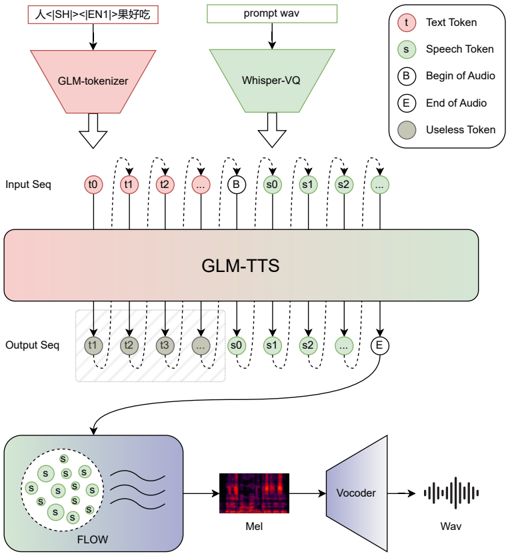
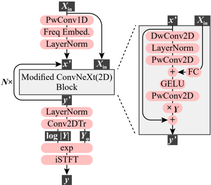

> [!abstract] arXiv · 2025 · Preprint
> **Jiayan Cui et al.** (Zhipu AI / Tsinghua University) · [→ Paper](https://arxiv.org/abs/2512.14291) · Demo: ✓ · Code: ✓
>
> GLM-TTS is a production-level Chinese-focused TTS system combining an optimized Whisper-VQ tokenizer with fundamental frequency constraints, a GRPO-based multi-reward RL framework, LoRA-based voice customization, and a novel 2D convolution vocoder — achieving state-of-the-art results among 1.5B open-source models on Seed-TTS-eval with only 100k hours of training data.

## Problem

Production TTS deployment requires solving several distinct challenges simultaneously: (1) voice cloning quality from short references, (2) emotional expressiveness without explicit emotion labels, (3) pronunciation accuracy for polyphonic characters and rare words in Chinese, (4) stable RL alignment without gradient vanishing or reward hacking, and (5) cost-efficient voice customization for personalized premium voices. Prior open-source models trained on 1M+ hours (CosyVoice 3, FireRedTTS-2) achieve better raw metrics, but GLM-TTS targets matching those results with a tenth of the data while adding production-critical features.

## Method

GLM-TTS follows a two-stage architecture: a text-to-token autoregressive LM (1.5B parameters) followed by a token-to-waveform diffusion model. The text-to-token stage is built on the GLM-4-Voice (Zhipu) backbone.

**Speech Tokenizer.** The Whisper-VQ tokenizer (from GLM-4-Voice) is upgraded in four ways: (1) token rate doubled from 12.5 to 25 Hz with codebook expanded from 16k to 32k entries; (2) a Pitch Estimator (PE) module added to improve prosody alignment between cloned output and reference; (3) non-causal architecture replacing causal convolutions for better ASR/PE accuracy; (4) significantly expanded training data including dialects and singing voice.

**Text Tokenizer.** Vocabulary is pruned to remove tokens composed of more than two Chinese characters, improving alignment stability by normalizing information density across text granularities.

**GRPO-based RL.** A GRPO (Group Relative Policy Optimization) framework with four rewards: CER (pronunciation), SIM (timbre similarity), Emotion (expressive naturalness), and Laughter (paralinguistic realism). Training stability is achieved through: (1) hierarchical multi-dimensional regularization of reward distributions; (2) a dynamic sampling strategy that resamples batches with zero advantage up to three times; (3) adaptive gradient clipping with asymmetric bounds (ε_high > ε_low) to encourage low-probability token generation while preventing reward hacking.

**LoRA Voice Customization.** Only 15% of backbone parameters are fine-tuned for approximately 100 epochs, requiring only ~1 hour of single-speaker audio. This outperforms both minimal LoRA (0.3–5% of params, limited style transfer) and full fine-tuning (unstable, data-hungry).

**Phoneme-In.** A hybrid phoneme+text input scheme: at training time, characters are stochastically replaced with phonemes (p=0.2 trigger probability, up to 50% of characters). At inference, a G2P module converts polyphonic/rare characters to phonemes for precision control, while standard characters remain as text. This reduces PER on a hard-case dataset from 13.23% to 5.14%.

**Vocos2D Vocoder.** A redesigned GAN vocoder replacing 1D convolutions with 2D convolutions for frequency-subband modeling. Key changes from original Vocos: 2D depth-wise convolutions with per-frequency embeddings, removal of the multi-period discriminator (which degraded linear-spectrogram inputs), and addition of discriminator augmentation. Mixed training with singing voice data extends pitch range.

## Key Results

On Seed-TTS-eval, GLM-TTS achieves CER 1.03% and SIM 76.1 (test-zh), WER 2.23% and SIM 67.2 (test-en) at 1.5B scale with 100k hours of training — matching IndexTTS2 (CER 1.03, SIM 76.5) and outperforming CosyVoice2 (CER 1.38). After GRPO RL, GLM-TTS_RL improves to CER 0.89% and SIM 76.4, narrowing the gap with closed-source systems like MiniMax-Speech (CER 0.83%) and Seed-TTS (SIM 79.6). Vocos2D outperforms original Vocos on all metrics: UTMOS 1.91 vs. 1.87, MOS 4.16 vs. 3.58, NISQA 3.4 vs. 3.16.

## Novelty Assessment

The primary novelty is the GRPO multi-reward framework with laughter modeling and dynamic sampling — RL alignment for TTS is underexplored, and this is a practical, stability-focused implementation. The Phoneme-In scheme is a useful engineering contribution for Chinese industrial deployment. Vocos2D is an incremental architectural improvement over Vocos with clear empirical gains. The LoRA voice customization formulation (15% parameter tuning with 1-hour data target) provides a concrete recipe for production personalization. Overall this is a strong industrial systems paper rather than a novel algorithmic contribution; its value is in the integrated production-level design and rigorous ablations.

## Field Significance

Moderate — GLM-TTS demonstrates that a production-level TTS system can match models trained on 10x more data by combining careful tokenizer design, multi-reward RL alignment, and parameter-efficient voice customization. The GRPO reward formulation with laughter modeling and dynamic sampling provides a concrete engineering blueprint for RL-aligned TTS training stability that other practitioners can adapt. The Vocos2D architectural modification offers a straightforward improvement to GAN vocoder frequency modeling.

## Claims

- A hybrid phoneme-text input scheme that selectively activates at inference for polyphonic and rare characters can reduce phoneme error rate by more than half compared to text-only input in Chinese TTS. *(§2.6, §3.4, Table 7)*
- Multi-reward GRPO reinforcement learning with asymmetric gradient clipping and dynamic resampling improves both pronunciation accuracy and speaker similarity simultaneously without reward hacking. *(§2.4, §3.3, Table 4)*
- Laughter reward optimization in RL-aligned TTS creates a fundamental trade-off: increasing laughter naturalness degrades CER and speaker similarity because laughter segments resist ASR transcription and differ acoustically from the speaker's regular voice. *(§3.3, Table 6)*
- Replacing 1D convolutions with 2D depth-wise convolutions in a GAN vocoder backbone improves subjective quality across all evaluation metrics. *(§2.7, §3.5, Table 8)*
- LoRA fine-tuning at 15% of backbone parameters achieves voice customization quality comparable to full fine-tuning while reducing data requirements to approximately one hour of single-speaker audio. *(§2.5)*

## Limitations and Open Questions

GLM-TTS is trained on limited English data (less than half of Chinese) and shows correspondingly weaker English results (WER 2.23 vs. 1.03 CER in Chinese). The laughter reward trades off pronunciation accuracy and speaker similarity, revealing a fundamental tension in multi-reward RL for speech. The system does not address multilingual synthesis beyond Chinese and English.

## Wiki Connections

- [[rlhf-speech]] — GRPO multi-reward RL framework with laughter and emotion rewards
- [[neural-codec]] — Whisper-VQ tokenizer with pitch estimator and expanded 32k codebook
- [[emotion-synthesis]] — emotion and laughter reward modeling in RL alignment
- [[zero-shot-tts]] — production voice cloning results on Seed-TTS-eval benchmarks
- [[autoregressive-codec-tts]] — AR text-to-token LM backbone architecture
- [[gan-vocoder]] — Vocos2D with 2D depth-wise convolutions
- [[2406.02430|Seed-TTS]] — primary benchmark used for evaluation
- [[2407.05407|CosyVoice]] — baseline comparison and architectural inspiration for two-stage design
- [[2412.10117|CosyVoice 2]] — direct open-source baseline on Seed-TTS-eval
- [[2412.02612|GLM-4-Voice]] — backbone AR model that GLM-TTS builds upon
- [[2025.acl-long.313|F5-TTS]] — flow-matching baseline in Seed-TTS-eval comparison
- [[2503.01710|Spark-TTS]] — open-source baseline in Seed-TTS-eval comparison
- [[2409.00750|MaskGCT]] — open-source baseline in Seed-TTS-eval comparison
- [[2502.03930|DiTAR]] — diffusion transformer baseline in Seed-TTS-eval comparison
- [[2502.18924|MegaTTS 3]] — closed-source baseline in Seed-TTS-eval comparison
- [[2503.20215|Qwen2.5-Omni]] — omnimodal baseline in Seed-TTS-eval comparison
- [[2505.07916|MiniMax-Speech]] — closed-source baseline with leading CER on test-zh
- [[2508.19205|VibeVoice]] — open-source 1.5B baseline in Seed-TTS-eval comparison
- [[2509.02020|FireRedTTS-2]] — open-source baseline trained on 1.1M hours
- [[2506.21619|IndexTTS2]] — open-source 1.5B baseline with matched CER on test-zh
