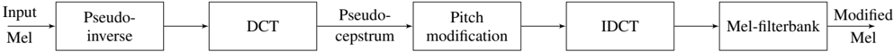

> [!abstract] arXiv · 2025 · Preprint
> **Ellinas et al.** (Innoetics, Samsung Electronics) · [→ Paper](https://arxiv.org/abs/2512.16519) · Demo: ✓ · Code: ?
>
> Introduces a training-free, cepstrum-domain pitch-shifting method that operates directly on mel-spectrograms, making pitch control available for any pretrained mel-based neural vocoder without retraining, architectural changes, or explicit F0 conditioning.

## Problem

Most neural vocoders that support pitch modification require explicit F0 conditioning, either baked into the model architecture or supplied as an external module, and F0 estimation is itself error-prone, so any such method inherits F0- and voicing-detection errors. Traditional DSP-based pitch shifting (TD-PSOLA, STRAIGHT, WORLD) operates directly on the waveform and remains state-of-the-art within its operating range, but has no direct analog for mel-spectrogram-domain manipulation, meaning it cannot be inserted into the now-standard two-stage TTS/VC pipeline (intermediate mel-spectrogram, then vocoder) without dropping back to the waveform domain. This leaves a gap: the many existing pretrained mel-based neural vocoders that were never designed with F0 conditioning cannot be given pitch-control capability without retraining or architectural modification.

## Method

The method exploits the classical cepstrum's separation of a speech signal's source (pitch/harmonic structure) and filter (vocal tract/spectral envelope) components, where pitch appears as a distinct peak in the quefrency domain, but adapts this idea to operate on mel-spectrograms specifically rather than the standard log-magnitude spectrum. Since mel-frequency cepstral coefficients (MFCCs) are computed on a log-frequency axis where harmonics are not linearly scaled and produce no clean cepstral peak, the paper instead first applies the pseudo-inverse of the mel-filterbank matrix to recover an approximate linear-frequency log-magnitude spectrum, then applies the discrete cosine transform (DCT) to obtain what the authors term the pseudo-cepstrum, which preserves the source/filter separation property while remaining derivable from, and invertible back to, mel-spectrogram features. Pitch modification is performed by shifting the entire source component (the part of the pseudo-cepstrum above a single threshold quefrency corresponding to the maximum expected F0, the method's only required parameter) non-linearly in the quefrency domain via interpolation, since a naive linear shift would not correspond to a linear shift in frequency; no F0 estimation or cepstral-peak localization is needed. The modified pseudo-cepstrum is converted back to a modified mel-spectrogram via inverse DCT followed by the mel-filterbank transform, and the whole pitch-shift-and-convert-back pipeline can be collapsed into a single linear transformation, making it essentially free at inference time. The resulting pitch-shifted mel-spectrogram is then synthesized into audio using any compatible pretrained vocoder, unmodified.

## Key Results

The method is validated on 10 LJ Speech test utterances, each pitch-shifted from -12 to +12 semitones (24 variants per utterance) and synthesized with four pretrained neural vocoders spanning GAN (HiFiGAN, BigVGAN, Vocos) and flow-matching (WaveFM) architecture families, plus Griffin-Lim and TD-PSOLA as DSP baselines. Objectively (Gross Pitch Error, Voicing Decision Error, F0 Frame Error against pitch-shifted ground-truth F0 targets), Vocos, HiFiGAN, and WaveFM show the most stable performance across the full modification range, while BigVGAN degrades fastest, particularly for negative pitch shifts, and Griffin-Lim scores worst overall reflecting its inherently lower baseline audio quality. Subjectively, a Prolific-based MOS naturalness test (10 raters per sample) shows all neural vocoders scoring above 4.0 near the unmodified condition, with naturalness declining gradually and more steeply toward the extremes of the pitch range; TD-PSOLA, HiFiGAN, and Vocos score highest and roughly overlap, with the authors noting TD-PSOLA can be considered close to an upper bound since it directly modifies the ground-truth waveform. The authors recommend a safer, more practically useful pitch-shift range of ±6 semitones, where all tested methods remain comparatively stable.

## Novelty Assessment

The core contribution, defining a pseudo-cepstrum via pseudo-inverse mel-filterbank transform plus DCT (rather than the standard MFCC formulation) specifically to preserve a clean, shiftable source/filter separation in the mel domain, is a genuinely new signal-processing formulation the authors position as the first DSP-based approach to pitch shifting operating directly in the mel-spectrogram domain. Because it requires only the mel-spectrogram and a single threshold parameter (no F0 estimation, no model retraining, no architectural modification), it is immediately applicable as a drop-in addition to any existing mel-based TTS/VC/vocoder pipeline, which is a meaningfully different practical proposition from prior neural pitch-control methods that require F0-conditioned training from the start.

## Field Significance

> [!tip] high — Because the method requires no retraining, no architectural change, and no F0 estimation, and is validated as compatible with both GAN-based and flow-matching-based pretrained vocoders, it is immediately applicable to a large existing population of deployed mel-based TTS and voice conversion systems that were never designed with pitch control in mind.

Achieving subjective naturalness on par with TD-PSOLA (the long-standing DSP state-of-the-art for pitch modification) when paired with strong vocoders, at negligible computational cost, indicates the technique is not just novel but immediately practically competitive with the best available alternative.

## Claims

- **supports:** Pitch modification can be performed directly in a training-free signal-processing transform of the mel-spectrogram domain and remain compatible with any pretrained mel-based neural vocoder, without model retraining, architectural changes, or explicit F0 conditioning.
  > *Evidence:* The method is validated by applying pitch shifts of -12 to +12 semitones to mel-spectrograms and synthesizing audio with four different pretrained, unmodified neural vocoders (HiFiGAN, BigVGAN, Vocos, WaveFM) spanning GAN and flow-matching architecture families, with no vocoder-specific adaptation. *(§3, §2.3)*
- **supports:** Directly shifting the source-component peak in a cepstrum-like representation of the mel-spectrogram can achieve pitch modification without explicitly estimating F0 or voicing decisions, avoiding a class of errors that F0-conditioned pitch-control methods are exposed to.
  > *Evidence:* The pseudo-cepstrum method shifts the cepstral source component above a single threshold quefrency (corresponding to the maximum expected F0) without any F0 estimation step, unlike the majority of prior neural vocoder pitch-control approaches, which require explicit F0 conditioning as a model input. *(§1, §2.3)*
- **supports:** When paired with strong, high-fidelity neural vocoders, a mel-domain pitch-shifting method with no access to the original waveform can achieve subjective naturalness comparable to TD-PSOLA, the established DSP state-of-the-art for pitch modification performed directly on the waveform.
  > *Evidence:* In subjective MOS tests across the pitch-shift range, the pseudo-cepstrum method combined with HiFiGAN or Vocos scores on par with TD-PSOLA, which the authors treat as close to an upper bound since it directly modifies the ground-truth waveform. *(§3.2, Figure 4)*
- **complicates:** A vocoder's robustness to feature-space manipulation of its own conditioning input varies substantially by architecture, so a pitch-modification technique operating purely in the mel-spectrogram domain does not guarantee uniform output quality across different pretrained vocoders.
  > *Evidence:* BigVGAN shows the fastest quality degradation among the four tested vocoders as pitch-shift magnitude increases, particularly for negative shifts, scoring lowest of the neural vocoders on both objective pitch-tracking metrics and subjective naturalness. *(§3.1-3.2, Figures 3-4)*

## Limitations and Open Questions

The authors note that F0 estimation algorithms used for the objective evaluation are themselves sensitive to modified input and can miscalculate pitch values or voiced/unvoiced regions, meaning the true perceptual quality at extreme pitch shifts may be understated by the objective metrics reported. Performance is explicitly less stable at the tails of the tested range (beyond roughly ±6 semitones), which the authors identify as the practically recommended operating range rather than the full ±12 semitones tested. As future work, the authors suggest splitting the pseudo-cepstrum at the cutoff quefrency to obtain separate vocal-tract and pitch-contour representations that could serve as disentangled inputs to a neural representation model, a direction not explored or validated in this paper.

## Wiki Connections

- [[prosody-control|Prosody Control]] — introduces an explicit, training-free mechanism for pitch modification operating directly on mel-spectrogram features, independent of the downstream vocoder's architecture.
- [[gan-vocoder|GAN Vocoder]] — validated extensively as a drop-in addition to pretrained GAN-based vocoders (HiFiGAN, BigVGAN, Vocos) without any retraining or modification.
- [[subjective-evaluation|Subjective Evaluation]] — reports a Prolific-based MOS naturalness study across the full pitch-modification range for each tested vocoder and DSP baseline.
