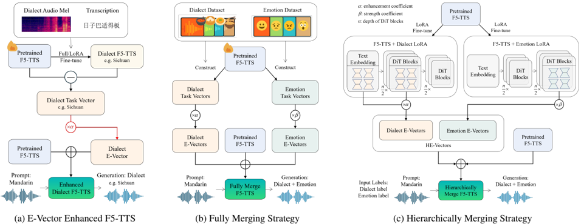

> [!abstract] arXiv · 2025 · Preprint
> **Feng, Xiao, Ma et al.** (Shanghai Jiao Tong University) · [→ Paper](https://arxiv.org/abs/2512.18699) · Demo: ✓ · Code: ?
>
> A task-vector-based method for jointly controlling dialect and emotion in TTS without requiring any data labeled with both attributes simultaneously, by building independent style vectors from F5-TTS fine-tunes and hierarchically merging them at different layers of the model.

## Problem

Enhancing TTS expressiveness through subjective style attributes (dialect, emotion) is harder than manipulating objective acoustic features, because the alignment between abstract style and acoustic spectra is weak and labeled data is scarce. Jointly controlling multiple styles compounds this: dialectal speech data with reliable emotional labels is scarce or nonexistent, and naively combining separately-learned style representations tends to produce interference between them, degrading both dialect fidelity and emotional expressiveness.

## Method

The approach builds on F5-TTS, a zero-shot flow-matching TTS model based on a Diffusion Transformer (DiT). In the first stage, the paper constructs an Expressive Vector (E-Vector) for each style (dialect or emotion) using the task-vector formulation: a pretrained F5-TTS is fine-tuned separately on data for a given style, and the parameter difference between the fine-tuned and pretrained checkpoints is treated as a task vector capturing that style's direction in parameter space. This task vector is then linearly scaled by an enhancement coefficient (fixed for categorical attributes like dialect, or continuously adjustable within a range for graded attributes like emotion intensity) and added back to the pretrained model's parameters, a construction the authors relate to classifier-free guidance. A parameter-efficient LoRA-based variant of the E-Vector inserts low-rank adapters into the modules with the largest parameter shifts during full fine-tuning, allowing multiple per-style E-Vectors to coexist on a single shared backbone without full-model duplication. In the second stage, to combine a dialect E-Vector and an emotion E-Vector for joint emotional-dialectal synthesis without any jointly-labeled data, the paper proposes a Hierarchical Expressive Vector (HE-Vector): rather than fully merging both style vectors into the same parameters (which causes interference), the dialect LoRA E-Vector is applied to the text embedding layer and the early half of the DiT blocks (associated with phonetic/pronunciation patterns), while the emotion LoRA E-Vector is applied to the later half of the DiT blocks (associated with prosody, rhythm, and intonation), so the two styles are integrated at inference by modulating disjoint layers rather than the same parameters.

## Key Results

On dialect synthesis from Mandarin prompts (the harder cross-dialect setting) across 8 Chinese dialects, the full-fine-tune E-Vector model achieves the highest average subjective MOS (3.18), outperforming CosyVoice2 (2.62, trained on thousands of hours of data) and both a standard F5-TTS fine-tune (1.85) and an over-fine-tuned F5-TTS variant (2.85), while requiring only about one-fifth of the training steps of the over-fine-tuned baseline. Objective WER and speaker similarity for E-Vector (15.41% WER, 0.65 SIM-O) are comparable to the other approaches, indicating the style enhancement does not come at the cost of intelligibility or speaker identity preservation, though the paper cautions that Seed-ASR-based WER on dialectal speech carries measurement error. On the harder joint emotional-dialectal synthesis task, HE-Vector achieves the best average MOS (2.83), ahead of the Fully-merged E-Vector (2.76), a sequential dual-stage pipeline (2.56), and CosyVoice2 (1.87), though all systems' absolute MOS scores are noticeably lower than in the single-style dialect task, reflecting the difficulty of the joint-style setting. Applying the E-Vector technique to CosyVoice instead of F5-TTS produced degraded synthesis quality, which the authors attribute to interference between CosyVoice's LLM-based text encoder and its flow-matching acoustic model.

## Novelty Assessment

The core building block, task vectors constructed by subtracting pretrained from fine-tuned parameters, is adapted from prior task-arithmetic work outside speech, and the base TTS model (F5-TTS) is not new to this paper. The genuine contribution is the application of this formulation to expressive style control in TTS, specifically the hierarchical merging strategy that resolves interference between simultaneously-controlled styles by assigning each style to disjoint DiT layers rather than fusing them into the same parameters. This directly targets the paper's stated goal, joint dialect-emotion control without jointly-labeled data, and the ablation-like comparison against a fully-merged baseline and a dual-stage pipeline supports that the layer-separation design choice, not just the task-vector idea itself, is doing real work.

## Field Significance

moderate — This is a focused methodological contribution that demonstrates a data-efficient way to compose independently-learned expressive styles in a pretrained TTS model, validated on a genuinely difficult and previously underexplored problem (dialect and emotion without joint labels). Its architectural contribution (layer-separated style modulation) is a plausible template for combining other independently-trained style controls in similar DiT-based TTS backbones, though results on the joint emotional-dialectal task remain modest in absolute terms and the method's generalization beyond F5-TTS is explicitly shown to be limited.

## Claims

- **supports:** A style-specific parameter direction, extracted by subtracting a model's pretrained parameters from its style-fine-tuned parameters, can be linearly scaled and added back to the pretrained model to enhance that single expressive style without full fine-tuning.
  > *Evidence:* The E-Vector method, built by scaling a dialect or emotion task vector and adding it to F5-TTS's pretrained parameters, achieves higher average dialect-synthesis MOS (3.18) than both a standard fine-tune (1.85) and an over-fine-tuned model (2.85), using roughly one-fifth of the over-fine-tuned model's training steps. *(§4.2, Table 2)*
- **supports:** Two independently-learned expressive style controls can be combined for joint multi-style speech synthesis, without any data labeled for both styles simultaneously, by applying each style's parameter modulation to a disjoint subset of model layers rather than merging them into the same parameters.
  > *Evidence:* The hierarchical merging strategy, which applies the dialect LoRA E-Vector to the text embedding and early DiT layers and the emotion LoRA E-Vector to the later DiT layers, achieves the best average MOS (2.83) on joint emotional-dialectal synthesis, ahead of a fully-merged variant (2.76) and a sequential dual-stage pipeline (2.56). *(§4.3, Table 3)*
- **complicates:** A style-enhancement technique validated on one TTS backbone does not necessarily transfer to another backbone with a different architecture, particularly when the target model couples an LLM-based component with a separate acoustic generation component.
  > *Evidence:* Applying the same E-Vector construction to CosyVoice, which combines an LLM-based text encoder with a flow-matching acoustic model, produced degraded synthesis quality, attributed to interference between the two components. *(§5)*
- **complicates:** Jointly controlling two expressive styles in speech synthesis remains substantially harder than controlling either style alone, even with an interference-mitigating combination strategy.
  > *Evidence:* All evaluated systems' average MOS scores on the joint emotional-dialectal synthesis task (HE-Vector 2.83, Fully E-Vector 2.76) are markedly lower than the best single-style dialect-synthesis MOS (E-Vector 3.18), and the paper explicitly notes existing models often fail when controlling two or more expressive styles simultaneously. *(§4.3, Table 3)*

## Limitations and Open Questions

The paper's own analysis finds that parameter shifts during style fine-tuning are not strictly linear, which the authors identify as a limitation of the E-Vector's linear-scaling construction, and report that assigning different enhancement coefficients per DiT layer brought no significant additional gain, leaving the hierarchical merging strategy's specific layer split as a heuristic rather than a derived optimum. Evaluation relies on an in-house 8-dialect, 10-hours-per-dialect corpus not available for independent verification, and the objective WER evaluation is explicitly flagged as unreliable for some dialects due to Seed-ASR recognition errors on dialectal speech, limiting the precision of the objective results. The method's failure to transfer to CosyVoice indicates its applicability may be specific to F5-TTS-like architectures rather than general across TTS backbones.

## Wiki Connections

- [[flow-matching|Flow Matching]] — builds the entire style-control mechanism on top of F5-TTS, a flow-matching Diffusion Transformer TTS model, and manipulates its DiT-layer parameters directly.
- [[emotion-synthesis|Emotion Synthesis]] — introduces a continuously-adjustable, task-vector-based emotion control mechanism and jointly combines it with dialect control without jointly-labeled emotional-dialectal data.
- [[zero-shot-tts|Zero-Shot TTS]] — inherits F5-TTS's zero-shot speaker cloning from a reference prompt and evaluates emotional-dialectal synthesis in a zero-shot cross-style setting.
- [[2025.acl-long.313|F5-TTS]] — the pretrained backbone on which all E-Vector and HE-Vector fine-tunes and merges are constructed.
- [[2412.10117|CosyVoice 2]] — used as the primary open-source baseline for both dialect and emotional-dialect synthesis comparisons.
- [[2407.05407|CosyVoice]] — tested as an alternative backbone for the E-Vector technique, which failed to generalize due to interference between its LLM-based and flow-matching components.
