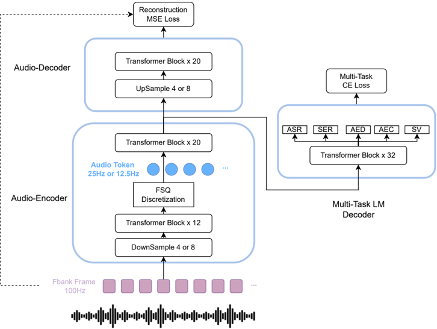

> [!abstract] arXiv · 2025 · Preprint
> **Yu, Wang, Wu et al.** (JD.com Inc.) · [→ Paper](https://arxiv.org/abs/2512.19090) · Demo: ✓ · Code: ?
>
> A jointly-trained end-to-end Transformer-DiT foundation model for zero-shot TTS that natively synthesizes unsegmented, boundary-free conversational audio with up to eight speakers and five minutes of duration in a single generation pass, paired with a new low-bitrate semantic tokenizer and a new multi-speaker long-form evaluation benchmark.

## Problem

Speech generation is shifting from single-speaker, short-sentence synthesis toward multi-speaker, long-form conversational generation, but current systems are largely constrained to two-speaker, turn-based interaction and rely on two-stage pipelines (an autoregressive model predicting discrete tokens, followed by a separate diffusion/flow-matching model recovering acoustic detail). This two-stage design creates an information bottleneck (discrete tokens lose fine-grained prosodic detail), optimization inconsistency (the token-prediction model is never trained with the downstream reconstruction objective in mind), and error propagation with no feedback path. One-stage continuous-representation alternatives address some of these issues but face their own limitations: their local diffusion components have limited receptive fields that compromise timbre similarity, and noise in the prompt speech can propagate instability through the continuous representations. Meanwhile, existing multi-speaker dialogue benchmarks are restricted to two speakers and short (sub-one-minute) segments, making it hard to even measure progress on richer, more naturalistic multi-speaker long-form conversation.

## Method

JoyVoice couples a Qwen2.5-0.5B-initialized causal autoregressive Transformer with a global causal Diffusion Transformer (DiT, architecturally derived from F5-TTS, ~300M parameters) in a single jointly-optimized system: the autoregressive model's hidden states, rather than only its discrete token outputs, directly condition the DiT, and gradients from the flow-matching loss backpropagate through these hidden states into the autoregressive model's parameters. This lets the flow-matching stage guide the autoregressive stage toward representations that are simultaneously good for token prediction and for continuous acoustic reconstruction, and lets the full instruction context (style, speaker characteristics, prosody), not just discrete phonetic tokens, reach the acoustic-detail stage. Multi-speaker, multi-turn dialogues are represented as a single unsegmented sequence of speaker tags, speaker embeddings, per-turn text, and a continuous, unsegmented speech-token stream spanning the whole conversation, letting attention learn speaker-content correspondence without explicit utterance-level segmentation or forced alignment. Discrete acoustic tokens are produced by a new MM-Tokenizer, a Whisper-large-v3 encoder augmented with a Finite Scalar Quantization layer inserted at its 12th Transformer block and trained with a multi-task objective spanning ASR, speech emotion recognition, audio event detection/captioning, speaker verification, age, and gender classification, combined with a reconstruction loss from an external decoder that recovers the mel-spectrogram; this yields a semantic-and-acoustic-aware token stream compressible to 12.5 Hz. Streaming synthesis is enabled via a causal, chunk-wise attention mask on the DiT with randomized chunk sizes during training, allowing arbitrary chunk sizes at inference. Training uses a two-stage curriculum (single-speaker short clips, then a mixed corpus of long single- and multi-speaker audio up to five minutes and eight speakers) and a post-training reinforcement-learning stage using Acoustic Preference Optimization (APO), a DPO-style method operating at the acoustic-token level: multiple candidate token sequences are sampled per text input, sequences with zero character error rate form the "chosen" set and those with errors form the "rejected" set, and all chosen-rejected pairs are used as DPO training pairs.

![An overview of JoyVoice. It Consists of several key components: 1) Causal Autoregressive Transformer: This module takes the system prompt plus text with speaker tags as input, and predicts the discrete tokens generated by the MM-Tokenizer. 2) Dynamic Chunk Diffusion Transformer: Using the hidden representations from the Causal Autoregressive Transformer as input, this component predicts the mel-spectrogram output. 3) MM-Tokenizer and Vocoder: These modules are responsible for converting audio into discrete token representations and reconstructing the mel-spectrogram back to waveform audio, respectively.](assets/2512.19090/figure-2.png)

## Key Results

On the single-speaker Seed-TTS-Eval benchmark, JoyVoice achieves state-of-the-art or near-state-of-the-art results among the compared systems, with CER 0.97/WER 1.69 on test-zh/test-en and CER 5.55 on the challenging test-hard set, outperforming its own two-stage JoyVoice-Cascade ablation (relative CER/WER improvements of 14.2%, 3.4%, and 8.6% on test-zh/test-en/test-hard respectively) and other published single-speaker baselines including Seed-TTS, MaskGCT, F5-TTS, Spark-TTS, CosyVoice 2/3, and Qwen2.5-Omni-7B-RL. Applying the APO reinforcement-learning stage to JoyVoice-Cascade yields large additional relative CER/WER reductions (48.4% on test-zh, 17.2% on test-en, 8.4% on test-hard). On the paper's new JoyVoice-MSMT-eval benchmark (2-4 speaker, 1-5 minute Chinese/English dialogues), JoyVoice achieves the lowest WER and cpWER (concatenated minimum-permutation WER) among compared multi-speaker systems (Mooncast, MOSS-TTSD, VibeVoice-1.5B/7B), though performance degrades noticeably on 4-speaker dialogues (cpWER rising sharply relative to 2- and 3-speaker cases), which the authors attribute to under-representation of >4-speaker conversations in the training data. Reducing the MM-Tokenizer's frame rate from 25 Hz to 12.5 Hz causes a cascaded baseline to degrade substantially, while the end-to-end JoyVoice architecture maintains near-identical performance at either rate, and a streaming variant trained by freezing the language model and fine-tuning only the chunk-wise flow-matching module matches or exceeds the non-streaming model's content consistency while improving speaker similarity on the hardest test set.

## Novelty Assessment

The MM-Tokenizer's supervised multi-task training scheme is explicitly modeled on CosyVoice 3's tokenizer, the DiT component's architecture is directly derived from F5-TTS, and the multi-speaker fine-tuning procedure explicitly reuses CosyVoice 2's mSFT paradigm, so several individual pieces are adapted rather than invented. The paper's genuine architectural contribution is the bidirectional joint-training mechanism itself: conditioning the flow-matching stage on the autoregressive model's continuous hidden states (rather than only its discrete tokens) and backpropagating flow-matching gradients into the autoregressive model, which the paper credits with removing the need for explicit speaker-boundary annotation in multi-speaker sequences and with closing much of the gap to the two-stage cascade at reduced token rates. Acoustic Preference Optimization is a genuinely new formulation of DPO-style preference learning at the acoustic-token level for TTS, using CER-based chosen/rejected set construction rather than reward-model outputs. The JoyVoice-MSMT-eval benchmark is a real, if modest-scale, evaluation-methodology contribution addressing a concrete gap (existing multi-speaker dialogue benchmarks cap at two speakers and under one minute).

## Field Significance

> [!tip] high — JoyVoice demonstrates a working joint-gradient-flow mechanism between an autoregressive acoustic model and a flow-matching detail-recovery model, extends zero-shot TTS from two-speaker turn-based synthesis to boundary-free generation with up to eight speakers and five minutes of duration in one pass, and contributes a new evaluation benchmark specifically for that regime.

As an unreviewed industry preprint without independent replication, its state-of-the-art claims rest entirely on the authors' own benchmark comparisons (including several baselines "decoded through the open-source model by ourselves," which the paper itself flags as a caveat), but the underlying architectural idea, letting a downstream generative stage's loss shape a token-prediction stage's hidden representations rather than only its output distribution, is a reusable design pattern for other two-stage-to-one-stage TTS efforts, and JoyVoice-MSMT-eval fills a genuine benchmark gap for multi-speaker, multi-turn, long-form synthesis.

## Claims

- **supports:** Conditioning a downstream acoustic-detail-recovery model on an upstream token-prediction model's continuous hidden states, and allowing gradients to flow back from the detail-recovery loss into the token-prediction model, can substantially close the quality gap between a two-stage cascaded TTS pipeline and its jointly-trained end-to-end counterpart, particularly under aggressive token-rate compression.
  > *Evidence:* At a 12.5 Hz tokenizer frame rate (a 50% compression relative to 25 Hz), a cascaded two-stage baseline suffers notable degradation, while the jointly-trained end-to-end JoyVoice model maintains performance comparable to its own 25 Hz setting. *(§2.1, §4.3, Table 2)*
- **supports:** A TTS system trained on continuous, unsegmented multi-turn dialogue sequences with only speaker tags (rather than explicit per-utterance boundaries or forced alignment) can learn to bind speech content to the correct speaker across many turns and speakers using standard attention mechanisms alone.
  > *Evidence:* JoyVoice is trained on unsegmented multi-speaker sequences using only speaker tags and speaker embeddings as boundary information, and achieves the lowest WER and cpWER among compared multi-speaker systems on 2-4 speaker dialogues in the paper's new JoyVoice-MSMT-eval benchmark. *(§2.2, §4.5, Table 5)*
- **supports:** Preference optimization for TTS can be effectively formulated at the level of discrete acoustic tokens, using an automatically-computable per-sample error metric to construct chosen/rejected training pairs, without requiring a learned reward model.
  > *Evidence:* Acoustic Preference Optimization constructs chosen/rejected sequence pairs based purely on whether sampled acoustic-token sequences achieve zero character error rate, and applying it to JoyVoice-Cascade yields large relative CER/WER reductions of 48.4%, 17.2%, and 8.4% on the test-zh, test-en, and test-hard Seed-TTS-Eval subsets respectively. *(§2.7.3, §4.4, Table 3)*
- **complicates:** Multi-speaker long-form conversational TTS quality degrades as the number of simultaneous speakers in a single generated dialogue increases, even for a system explicitly designed to support up to eight speakers, when training data for higher speaker counts is comparatively scarce.
  > *Evidence:* On the JoyVoice-MSMT-eval benchmark, cpWER/cpCER for 4-speaker dialogues shows noticeably worse degradation than 2- and 3-speaker results, attributed by the authors to under-representation of >4-speaker conversations in the training data distribution. *(§4.5, Table 5, Figure 4)*

## Limitations and Open Questions

The paper's own limitations section identifies three open issues: audio quality and stability degrade for dialogues with more than four speakers, attributed to insufficient training-data coverage of highly dynamic multi-speaker interactions; the large-scale reinforcement-learning phase is explicitly described as still in progress, with the authors noting unexplored potential for RL to improve long-term multi-speaker stability and anthropomorphic emotional expression; and the model is restricted to pure speech generation, with no support for general audio events or music. Several baseline comparisons in the paper's own tables (Mooncast, MOSS-TTSD, VibeVoice) are decoded by the authors themselves using open-source checkpoints rather than sourced from each baseline's own reported numbers, and multi-speaker evaluation relies on an external speaker-diarization model (pyannote) whose own limitations the authors explicitly note affect the reported metrics.

## Wiki Connections

- [[flow-matching|Flow Matching]] — introduces a joint end-to-end training mechanism in which an autoregressive model's hidden states directly condition a flow-matching Diffusion Transformer, with gradients flowing back from the flow-matching loss into the autoregressive model.
- [[zero-shot-tts|Zero-Shot TTS]] — extends zero-shot voice cloning from single-speaker short utterances to boundary-free multi-speaker (up to 8), long-form (up to 5-minute) conversational synthesis.
- [[rlhf-speech|RLHF for Speech]] — introduces Acoustic Preference Optimization, a DPO-style preference-learning method operating on discrete acoustic tokens using character-error-rate-based chosen/rejected set construction.
- [[multilingual-tts|Multilingual TTS]] — trains and evaluates across Chinese, English, Japanese, and Korean, with Chinese and English comprising over 90% of training data.
- [[2025.acl-long.313|F5-TTS]] — its Diffusion Transformer architecture is directly adopted as JoyVoice's flow-matching acoustic-detail-recovery component.
- [[2505.17589|CosyVoice 3]] — JoyVoice's MM-Tokenizer training scheme is explicitly modeled on CosyVoice 3's supervised multi-task tokenizer design, and CosyVoice 3-0.5B (with and without RL) serves as a primary comparison baseline throughout.
- [[2412.10117|CosyVoice 2]] — its multi-speaker fine-tuning (mSFT) paradigm is directly reused for JoyVoice's speaker fine-tuning experiments.
- [[2406.02430|Seed-TTS]] — its Seed-TTS-Eval benchmark (test-zh/test-en/test-hard) and its own reported results serve as the primary single-speaker evaluation benchmark and baseline throughout the paper.
- [[2508.19205|VibeVoice]] — the main existing large-scale multi-speaker long-form TTS system compared against, decoded by the authors and evaluated on both single- and multi-speaker benchmarks.
- [[2503.14345|MoonCast]] — a zero-shot multi-speaker podcast-generation baseline decoded by the authors and compared on both single- and multi-speaker benchmarks.
- [[2507.09318|ZipVoice-Dialog]] — cited as an existing multi-speaker dialogue benchmark limited to two speakers, motivating the paper's own JoyVoice-MSMT-eval benchmark covering 2-4 speakers.
- [[2505.07916|MiniMax-Speech]] — a strong single-speaker zero-shot TTS baseline compared against on the Seed-TTS-Eval benchmark.
