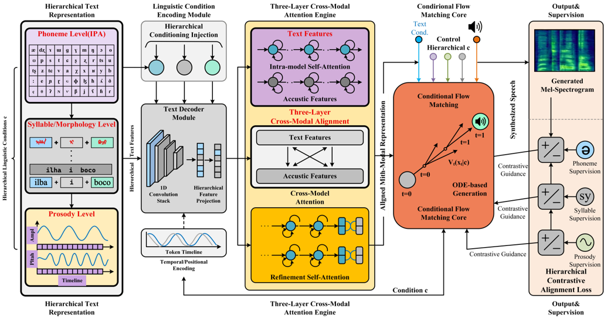

> [!abstract] arXiv · 2025 · Preprint
> **Wang, Wang, Sun et al.** (Changchun Humanities and Sciences College, Northeast Normal University, and Zhejiang University) · [→ Paper](https://arxiv.org/abs/2512.22491) · Demo: ? · Code: ?
>
> A flow-matching TTS system for Manchu, a critically endangered agglutinative language with fewer than 100 fluent speakers, that conditions generation on a three-tier phoneme-syllable-prosody linguistic representation via cross-modal attention and a hierarchical contrastive alignment loss, achieving a MOS of 4.52 with only 5.2 hours of training data and introducing the first public Manchu TTS dataset.

## Problem

Manchu, the official language of China's Qing Dynasty and now UNESCO-classified as critically endangered with fewer than 100 fluent speakers, has left behind vast archives of untranslated historical documents whose interpretation is hindered by the language's near-disappearance. Building speech synthesis for Manchu compounds two hard problems: severe data scarcity (far below the minimum thresholds assumed by prior low-resource TTS methods like LRSpeech) and strong phonological agglutination, in which vowel harmony, stem-suffix coupling, and morphologically-driven prosodic variation are difficult for conventional TTS models to capture. Existing flow-based TTS models such as F5-TTS and ReFlow-TTS have no explicit mechanism for agglutinative morphological structure, and standard alignment methods show 25-35% error rates under low-resource conditions, while duration predictors tend to produce rigid, unnatural rhythms in this regime.

## Method

ManchuTTS conditions a flow-matching generation process on a three-tier hierarchical linguistic representation designed around Manchu's morphology: phoneme-level features (IPA sequences capturing vowel harmony and coarticulation), syllable/word-level features (explicit [root+suffix] decomposition modeling stem-suffix transitions), and prosody-level features (global intonation and rhythm patterns, including sentence-type-dependent pitch contours). These three condition streams are fused with acoustic features through a three-layer cross-modal attention mechanism following a self-attention → cross-attention → self-attention pattern: text and acoustic features are each first refined independently via intra-modal self-attention, then exchanged bidirectionally via cross-modal cross-attention (text attending to acoustic context and vice versa), then refined once more independently to consolidate the fused information. The resulting hierarchical conditions jointly steer an 8-layer Diffusion Transformer that models a conditional flow-matching vector field between Gaussian noise and target mel-spectrograms via linear interpolation, trained with the standard conditional flow-matching regression loss. To ensure the generated speech actually respects the hierarchical linguistic structure rather than only using it as a generic conditioning signal, the model adds a hierarchical contrastive alignment loss: for each linguistic tier, positive pairs (generated speech, matching condition) are contrasted against negative pairs (generated speech, mismatched condition) via an InfoNCE-style objective, with per-tier weights summed into the total loss. A separate 3-layer LSTM duration predictor handles alignment timing. To build training data, the authors collected and annotated the first public Manchu speech corpus (6.24 hours, 44.1kHz/16-bit, SNR-filtered, expert-validated, covering 90% of core phonemes and six intonation types), using Praat-based multi-layer annotation validated by linguists.

## Key Results

Trained on just 5.2 hours of Manchu speech, ManchuTTS achieves a MOS of 4.52 (± 0.11), outperforming all compared baselines (Tacotron 2, FastSpeech 2, Glow-TTS, VITS, F5-TTS, and a cloning-based voice-conversion adaptation approach) trained under identical low-resource conditions on every objective metric (MCD, F0-RMSE, WER, speaker similarity, PESQ), while remaining measurably behind ground-truth recordings (MOS 4.68). An ablation isolating the three hierarchical guidance layers shows each tier contributes independently: phoneme-only conditioning yields MOS 3.94 with 70.8% agglutinative word pronunciation accuracy (AWPA) and 70.4% prosodic naturalness; adding the syllable layer raises MOS to 4.21 (AWPA 84.7%, prosodic naturalness 80.5%), with a measured 12ms narrowing of the stem-suffix energy gap in example agglutinative words; adding the prosody layer completes the model at MOS 4.52 (AWPA 92.7%, prosodic naturalness 89.4%), including a jump in pitch-curve correlation with native speakers on interrogative sentences from 0.63 to 0.91. A training-data-scale sensitivity analysis (1h, 2h, 5.2h subsets) shows MOS growing non-linearly toward the ground-truth ceiling and WER dropping sharply, with gains largely saturating by around 5 hours for this studio-recorded setting. In a zero-shot cross-lingual generalization test, ManchuTTS synthesizes Ewenki (a related, also endangered language) without any Ewenki training data, achieving MOS 3.78, only marginally below a FastSpeech 2 model trained directly on 0.8 hours of real Ewenki data (MOS 4.01), despite a higher WER (19.8% vs. 15.3%). The system is also reported as deployment-efficient (RTF 0.12, 86ms first-chunk latency, 4.1GB VRAM on an RTX 4090, sustaining 3x real-time synthesis after INT8 quantization on a Jetson Orin Nano edge device).

## Novelty Assessment

The underlying flow-matching generative backbone follows established flow-matching TTS design (the paper explicitly contrasts itself against F5-TTS and E2/E3-TTS as baselines it extends rather than departs from architecturally); its genuine contribution is conditioning that flow vector field jointly on a three-tier, linguistically-motivated hierarchical representation specifically designed around agglutinative morphology, paired with a hierarchical contrastive loss that directly supervises acoustic-linguistic correspondence at each tier rather than only at the whole-utterance level. The ablation study (Configurations A/B/C) provides a clean, quantified decomposition of how much each linguistic tier contributes, which substantiates the paper's specific claim that hierarchical guidance (not just more model capacity or more data) is what drives the agglutinative-word-accuracy and prosodic-naturalness gains. The first public Manchu TTS dataset, with linguist-validated multi-layer Praat annotation, is itself a concrete resource contribution independent of the modeling approach, extending accessibility for an otherwise severely under-documented critically endangered language.

## Field Significance

> [!tip] high — ManchuTTS provides both a genuinely novel, linguistically-motivated architectural mechanism for agglutinative-language TTS under severe data scarcity, and the first public speech synthesis dataset for a UNESCO critically-endangered language, with an ablation study that cleanly isolates the contribution of each part of its hierarchical design.

Beyond its results on Manchu specifically, the paper's hierarchical phoneme-syllable-prosody conditioning framework and hierarchical contrastive alignment loss are explicitly positioned as a template extensible to other agglutinative and endangered languages, and its demonstrated zero-shot transfer to the related Ewenki language, without any Ewenki training data, suggests the linguistic priors learned are not narrowly overfit to Manchu alone, which is directly relevant to language-preservation applications of speech technology beyond this single case.

## Claims

- **supports:** Conditioning a flow-matching TTS model's vector field on an explicit, linguistically-motivated hierarchy of phoneme, syllable/morpheme, and prosodic features improves synthesis quality and morphological pronunciation accuracy for agglutinative languages beyond what phoneme-only conditioning achieves, with each additional tier contributing independently and measurably.
  > *Evidence:* Progressively adding the syllable and prosody conditioning tiers raises MOS from 3.94 (phoneme-only) to 4.21 (+syllable) to 4.52 (+prosody), with agglutinative word pronunciation accuracy rising from 70.8% to 84.7% to 92.7% and prosodic naturalness from 70.4% to 80.5% to 89.4% across the same progression. *(§III.B.2, Table IV, Fig. 5)*
- **supports:** A TTS model can achieve near-ground-truth perceptual quality for a severely low-resource, morphologically complex language using only a few hours of carefully curated training data, when the model architecture is explicitly designed around that language's linguistic structure rather than applied generically.
  > *Evidence:* Trained on 5.2 hours of Manchu speech, ManchuTTS achieves MOS 4.52 (± 0.11), close to the ground-truth recording's MOS of 4.68, and outperforms all compared baselines (Tacotron 2, FastSpeech 2, Glow-TTS, VITS, F5-TTS, CBVC) trained under identical data constraints on every objective metric. *(§III.B.1, Table III)*
- **supports:** Linguistic priors learned by a hierarchically-conditioned TTS model trained on one low-resource agglutinative language can transfer zero-shot to a closely related, also-endangered language, approaching the quality of a model trained directly on a small amount of the target language's own data.
  > *Evidence:* ManchuTTS, with no Ewenki training data, achieves MOS 3.78 on zero-shot Ewenki synthesis, only 0.23 points below a FastSpeech 2 model trained directly on 0.8 hours of real Ewenki speech (MOS 4.01), while preserving key phonetic features such as vowel formants (r=0.87). *(§III.B.2, Table V, Fig. 8)*
- **complicates:** Increasing training data for a low-resource agglutinative language's TTS system yields diminishing returns past a modest threshold, so further quality gains for such languages likely require more diverse or higher-quality recording conditions rather than simply more hours of the same studio-recorded data.
  > *Evidence:* A data-scale sensitivity analysis on 1-hour, 2-hour, and 5.2-hour training subsets shows MOS growth from 3.22 to 4.52 (approaching the ground-truth ceiling of 4.68) and sharp WER reduction, but DNSMOS improvements diminish after 2 hours, with the authors identifying roughly 5 hours as a practical saturation point for this studio-recorded setting. *(§III.B.2)*

## Limitations and Open Questions

The authors' own conclusion explicitly notes ManchuTTS remains limited to studio-recorded speech, with accuracy decreasing on dialect variations, and identifies expanding data coverage to real-world recording environments and different dialects, along with noise-robustness training, as necessary steps before practical deployment beyond laboratory validation. The zero-shot Ewenki generalization result, while promising, is demonstrated on a single related language rather than a broader typological range, leaving open how far the hierarchical linguistic priors generalize to less closely related agglutinative languages. Qualitative listener feedback noted limited emotional expression in long sentences and occasional stress drift, which the authors flag as a direction for future prosodic modeling improvement despite the model's otherwise strong naturalness scores.

## Wiki Connections

- [[flow-matching|Flow Matching]] — conditions an 8-layer Diffusion Transformer flow-matching backbone on a novel three-tier hierarchical linguistic representation via cross-modal attention, specifically designed for agglutinative morphology.
- [[prosody-control|Prosody Control]] — introduces a dedicated prosody-level conditioning tier and hierarchical contrastive alignment loss that measurably improves pitch-curve correlation with native speakers and captures morphology-driven prosodic rules like function-word weakening.
- [[multilingual-tts|Multilingual TTS]] — demonstrates zero-shot cross-lingual transfer of its hierarchically-conditioned model from Manchu to the related endangered language Ewenki, without any Ewenki training data.
- [[2025.acl-long.313|F5-TTS]] — used as a flow-matching TTS baseline under identical low-resource training conditions, directly compared across quality, agglutinative-accuracy, and inference-efficiency metrics.
- [[2006.04558|FastSpeech 2]] — used as a non-autoregressive TTS baseline, including as the direct-training comparison point for the zero-shot Ewenki cross-lingual transfer evaluation.
