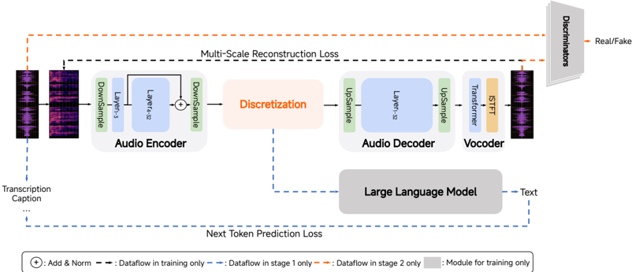
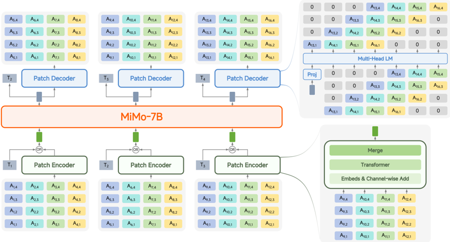

> [!abstract] arXiv · 2025 · Preprint
> **Xiaomi LLM-Core Team** · [→ Paper](https://arxiv.org/abs/2512.23808) · Demo: ✓ · Code: ✓
>
> A 7B-parameter unified audio-language model, pretrained on over 100 million hours of speech (an order of magnitude beyond prior open-source models), that empirically demonstrates a "GPT-3 moment" for speech: after crossing a critical pretraining-data threshold, few-shot in-context learning abilities for tasks never seen in training (voice conversion, style transfer, speech denoising, speech translation) emerge in a sharp, non-linear phase transition, while a novel lossless unified tokenizer and patch-based architecture preserve full paralinguistic information through the modeling pipeline.

## Problem

Existing audio language models achieve individual speech tasks (spoken dialogue, speech translation, voice style transfer) only through task-specific fine-tuning, unlike humans who flexibly generalize vocal communication to new situations from just a few examples. GPT-3 showed that scaling next-token-prediction pretraining unlocks broad task generalization in text; prior attempts to apply this principle to speech (Moshi, GLM-4-Voice, Kimi-Audio, Step-Audio 2) have not achieved comparably broad, general-purpose generalization. The authors identify two likely reasons: first, mainstream speech tokenizers lose paralinguistic information (either semantic tokens discard fine acoustic detail, or acoustic tokens fail to align with text semantics), preventing the lossless information flow that text-domain scaling relies on; second, no open effort has scaled speech pretraining data anywhere near GPT-3-era orders of magnitude, since the largest existing open-source speech models use far less data than the 100+ million hours this work targets.

## Method

The system has two parts: a tokenizer and a language model built on top of it. MiMo-Audio-Tokenizer is a 1.2B-parameter Transformer tokenizer (32-layer bidirectional encoder, 20-layer RVQ discretization with 1024-entry codebooks for the first two layers and 128-entry codebooks thereafter, a causal decoder, and a Vocos-style Transformer vocoder), trained from scratch on 11 million hours of audio in two stages: first, joint audio-reconstruction and audio-to-text training (with an auxiliary LLM supervising an A2T next-token-prediction loss) to align semantic and acoustic representations within a single encoder, aided by summing layer-3 hidden states into the final-layer output to reduce semantic-acoustic conflict; second, adversarial fine-tuning of only the decoder and vocoder (encoder and quantizer frozen) using multi-period and multi-scale-STFT discriminators under a Hinge-GAN objective, to sharpen fine-grained waveform reconstruction without disturbing the token space's semantic structure. MiMo-Audio itself is a unified generative model that interleaves text tokens and audio "patches" (four consecutive 25Hz RVQ frames grouped into one 6.25Hz unit, closing the frame-rate gap between text and audio) within a single autoregressive sequence, using a bidirectional-attention patch encoder to fold each patch into one vector for the LLM (initialized from the text-pretrained MiMo-7B-Base) and a causal patch decoder to expand LLM hidden states back into per-codebook RVQ tokens, using a Delay-pattern-style offset across the 8 RVQ codebooks used for LM training to make joint multi-codebook prediction tractable. Pretraining proceeds in two stages initialized from MiMo-7B-Base: an understanding stage (2.6T tokens: speech-text interleaved data, ASR, audio captioning, text-only data; loss computed only on text) that trains the patch encoder and LLM, followed by an understanding-generation joint stage (5T tokens across seven task formats including speech continuation, ASR, TTS, and instruction-following TTS) that trains all three components together with loss on both text and audio tokens, using a text-guided interleaving strategy (text and speech patches alternate in a fixed 5:5 ratio) to improve generation quality. Post-training then fine-tunes the full model on a curated 100-billion-token instruction corpus spanning ASR, TTS, audio understanding, spoken dialogue, instruction-following TTS, and text dialogue, with spoken-dialogue training data synthesized by an in-house MiMo-TTS system (itself trained on 7 million hours of data) to convert text conversations into diverse-style, diverse-timbre speech, and with chain-of-thought "thinking" data introduced for both understanding and generation tasks.

## Key Results

On tokenizer reconstruction (Seed-TTS-Eval, evaluated using only the 8 codebooks that feed the downstream LM), MiMo-Audio-Tokenizer achieves the best PESQ, speaker similarity, and STOI among GLM-4-Voice-Tokenizer, Baichuan-Audio-Tokenizer, XY-Tokenizer, Mimi, XCodec2.0, and BigCodec at a comparable bitrate. The paper's central empirical claim is a measured emergent phase transition: on 5-shot SpeechMMLU (T2S/S2S) and 16-shot voice conversion and speech-to-speech translation, performance stays near zero until pretraining crosses roughly 0.7 trillion tokens, then rises sharply and non-linearly before stabilizing, a pattern the authors present as direct evidence of a "GPT-3 moment" for speech rather than gradual, incremental improvement. MiMo-Audio-7B-Base achieves the highest SpeechMMLU scores among evaluated open-source base models (S2S 69.1, S2T 69.5, T2S 71.5) with the smallest modality gap (3.4 points between text-to-text and speech-to-speech performance, versus 22.3-58.9 points for Step-Audio2-mini-base, Baichuan-Audio-base, and Kimi-Audio-base), and the highest overall MMAU score (66.0) among open-source base models, with balanced performance across speech, sound, and music subdomains where competitors show larger gaps between their best and worst subdomain. After post-training, MiMo-Audio-7B-Instruct achieves the best open-source scores on MMSU, MMAU, MMAU-Pro, and MMAR audio understanding/reasoning benchmarks, approaching or exceeding Gemini 2.5 Flash on several; on spoken dialogue, it leads all open-source models on Big Bench Audio (72.90 S2T / 60.20 S2S) and MultiChallenge Audio (15.15 S2T / 10.10 S2S), trailing only GPT-4o-audio-preview; and on InstructTTSEval, it outperforms GPT-4o-mini-tts on both English (72.59 vs. 68.50 overall) and Chinese (70.52 vs. 51.07 overall) instruction-following TTS. ASR and standard TTS (Seed-TTS-Eval) results are reported as competitive with, though not uniformly better than, Step-Audio2-mini and Kimi-Audio-Instruct.

## Novelty Assessment

The individual architectural pieces (RVQ tokenization, patch-based sequence compression, delay-pattern multi-codebook generation, GAN-based vocoder fine-tuning) each draw on established techniques from the broader speech/audio LM literature; the paper's contribution is combining them into a specific, information-preserving design explicitly optimized against the failure mode the authors identify in prior work (lossy tokenization breaking the scaling hypothesis), and then validating that design at a data scale an order of magnitude beyond any open-source precedent. The genuinely novel empirical contribution is the phase-transition evidence itself: rather than only reporting a leaderboard-topping final checkpoint, the paper tracks few-shot task performance across the pretraining data trajectory and shows a sharp, non-linear jump at a specific data threshold, which is a stronger form of evidence for "emergent capability" than a single end-of-training snapshot. The instruction-following TTS result beating a closed-source system (GPT-4o-mini-tts) on its own benchmark is also a notable, concretely falsifiable claim rather than a qualitative assertion.

## Field Significance

> [!important] foundational — MiMo-Audio combines an unprecedented open-source speech pretraining scale (100M+ hours, an order of magnitude beyond prior open efforts), a specifically information-preserving tokenizer and architecture designed to make that scale actually useful, and direct, tracked evidence of emergent few-shot generalization across a broad span of speech understanding and generation tasks, together with full open-source release of checkpoints and evaluation suite.

This "foundational" rating reflects the combination of scale, architectural rigor, and the phase-transition evidence specifically, not just competitive benchmark numbers; as with any single-lab industry technical report, its claims have not yet been independently replicated, and its own limitations section documents real remaining instability (spoken-dialogue timbre discontinuities, mispronunciation of complex symbols, degraded sound/music understanding when its "thinking" mechanism is enabled). If the emergent few-shot capabilities and the "GPT-3 moment" framing hold up under independent scrutiny and community adoption, this paper is likely to become a reference point for how the field approaches large-scale speech-LM pretraining; readers should treat the "foundational" level here as provisional pending that independent validation, similar to other single-lab scaling claims in this corpus.

## Claims

- **supports:** Scaling next-token-prediction pretraining on massive-scale, information-preserving speech data induces few-shot in-context learning capabilities for tasks entirely absent from the training data, emerging as a sharp, non-linear phase transition at a specific data-scale threshold rather than through gradual improvement.
  > *Evidence:* Performance on 5-shot SpeechMMLU (T2S/S2S) and 16-shot voice conversion and speech-to-speech translation remains near zero until pretraining data crosses approximately 0.7 trillion tokens, after which it undergoes a sharp non-linear surge before stabilizing, tracked directly across the pretraining trajectory rather than measured only at a final checkpoint. *(§3.4, Figure 1)*
- **supports:** An audio tokenizer that jointly optimizes semantic alignment and acoustic reconstruction fidelity, trained at sufficient scale from scratch rather than distilled from a separate pretrained semantic model, can close the modality gap between speech and text performance in a downstream language model more effectively than prior semantic-distillation or dual-encoder tokenizer designs.
  > *Evidence:* MiMo-Audio's modality gap (the difference between text-to-text and speech-to-speech SpeechMMLU scores) is 3.4 points, versus 22.3 points for Step-Audio2-mini-base, 39.2 for Baichuan-Audio-base, and 58.9 for Kimi-Audio-base, while MiMo-Audio-Tokenizer also achieves the best reconstruction fidelity (PESQ, STOI, speaker similarity) among six compared tokenizers on the exact codebooks used for downstream modeling. *(§2.1.3, §3.4, Table 1, Table 6)*
- **supports:** A single unified audio-language model can be trained to follow complex natural-language style-control instructions for text-to-speech synthesis well enough to outperform a specialized closed-source instruction-following TTS system on its own benchmark.
  > *Evidence:* MiMo-Audio-7B-Instruct outperforms GPT-4o-mini-tts on the InstructTTSEval benchmark in both English (72.59 vs. 68.50 overall) and Chinese (70.52 vs. 51.07 overall). *(§4.4, Table 9)*
- **complicates:** Introducing an explicit chain-of-thought "thinking" mechanism into an audio-language model does not uniformly improve audio understanding; it can help speech-specific reasoning while degrading performance on non-speech audio domains due to hallucination during the thinking process.
  > *Evidence:* The authors report that enabling thinking yields performance improvements exclusively on speech-related understanding tasks while inducing degradation on sound and music understanding tasks, attributed in failure-case analysis to hallucinations introduced during the thinking process. *(§6, Limitations and Future Work)*

## Limitations and Open Questions

> [!warning] The authors' own limitations section documents three unresolved instabilities: in-context learning remains weak for speech generation involving background music or complex sound events; spoken dialogue generation is prone to timbre discontinuities, unstable audio quality, mispronunciation of complex symbols and formulas, and inconsistent system-prompt compliance; and the chain-of-thought "thinking" mechanism improves speech understanding but degrades sound/music understanding due to documented hallucination failure modes. The authors state they plan to address dialogue stability and audio-reasoning quality via reinforcement learning in future work.

As a single-lab industry technical report without independent third-party replication, its SOTA and "GPT-3 moment" claims rest on the authors' own benchmark selection, evaluation protocol, and baseline reproduction. Several less-automatable capabilities (general speech-to-speech task generalization, speech continuation quality for singing, debate, and talk-show scenarios) are demonstrated only via qualitative demo-page samples rather than quantitative metrics in the paper itself. Standard ASR and TTS results (LibriSpeech, AISHELL-1, Seed-TTS-Eval) are reported as competitive with, but not consistently superior to, existing open-source systems like Step-Audio2-mini and Kimi-Audio-Instruct, indicating the model's primary advantage lies in generalization breadth and instruction-following rather than uniformly leading on every conventional metric.

## Wiki Connections

- [[spoken-language-model|Spoken Language Models]] — presents a unified audio-text language model consuming external speech input and generating synchronized spoken-dialogue output, evaluated on speech-to-speech spoken dialogue benchmarks with explicit emphasis on emotional intelligence and instruction-following.
- [[neural-codec|Neural Codec]] — introduces MiMo-Audio-Tokenizer, a from-scratch unified semantic-and-acoustic RVQ tokenizer trained at unprecedented scale (11M hours) specifically to preserve lossless information flow for downstream language modeling.
- [[zero-shot-tts|Zero-Shot TTS]] — demonstrates zero-shot generalization to voice conversion, emotion conversion, speech rate control, and speech denoising via in-context few-shot exemplars alone, without any task-specific fine-tuning or parameter updates.
- [[instruction-conditioned-tts|Instruction-Conditioned TTS]] — MiMo-Audio-7B-Instruct's instruction-following TTS capability, evaluated on InstructTTSEval, outperforms the closed-source GPT-4o-mini-tts system on both English and Chinese subsets.
- [[evaluation-metrics|Evaluation Metrics]] — introduces SpeechMMLU, a novel four-way (text-to-text, speech-to-text, text-to-speech, speech-to-speech) cross-modal evaluation derived from MMLU, specifically designed to measure "modality gap" as a diagnostic for speech-text representation alignment.
- [[2406.02430|Seed-TTS]] — its Seed-TTS-Eval benchmark is used both to evaluate MiMo-Audio-Tokenizer's reconstruction fidelity and to evaluate MiMo-Audio-7B-Instruct's own TTS generation quality.
- [[2412.02612|GLM-4-Voice]] — its tokenizer and end-to-end spoken chatbot both serve as comparison baselines across the tokenizer-reconstruction and spoken-dialogue evaluation tables.
- [[2504.18425|Kimi-Audio]] — a primary open-source baseline compared against across few-shot SpeechMMLU/MMAU, spoken dialogue, and ASR/TTS evaluation tables.
- [[2507.16632|Step-Audio 2]] — the closest open-source competitor compared against across nearly every evaluation table, including ASR and standard TTS where results are closely matched rather than one-sided.
- [[2503.20215|Qwen2.5-Omni]] — a primary open-source baseline compared against on audio understanding and spoken dialogue benchmarks.
- [[2410.19168|MMAU]] — used as both a few-shot in-context learning evaluation benchmark for the base model and a post-training audio understanding benchmark for the instruct model.
- [[2506.16381|InstructTTSEval]] — used as the primary instruction-following TTS evaluation benchmark, on which MiMo-Audio-7B-Instruct outperforms GPT-4o-mini-tts.
- [[2506.23325|XY-Tokenizer]] — discussed directly as a prior dual-stream semantic/acoustic tokenizer design and used as a reconstruction-quality baseline for MiMo-Audio-Tokenizer.
