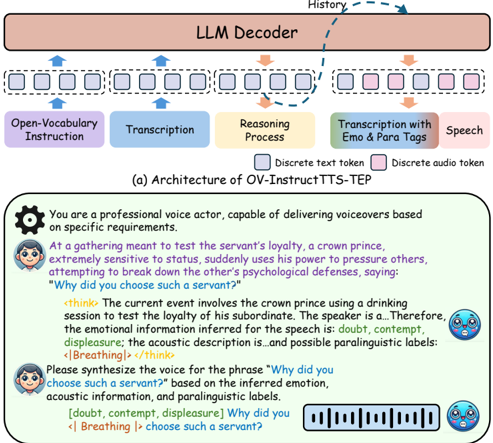

> [!abstract] arXiv · 2026 · Preprint
> **Yong Ren et al.** (Institute of Automation, Chinese Academy of Sciences) · [→ Paper](https://arxiv.org/abs/2601.01459) · Demo: ✓ · Code: ?
>
> Introduces open-vocabulary InstructTTS, where a reasoning-driven framework infers emotional, acoustic, and paralinguistic attributes from free-form, narrative-grounded natural language instructions before synthesizing speech, paired with a newly curated dataset built for this task.

## Problem

Existing InstructTTS systems accept natural language style prompts, but those prompts are typically constructed by combining or rephrasing a fixed set of predefined acoustic labels (pitch, speaking rate, emotion category, and similar attributes). This constrains what a user or content creator can actually express: instructions remain tied to a small vocabulary of acoustic descriptors rather than the flexible, high-level, situational language a director might give a voice actor. Prior InstructTTS training data is generated the same way, from label rephrasing, so it does not teach a model to bridge genuinely open-ended, narrative-style instructions to the low-level acoustic realizations needed for synthesis. A recent benchmark (InstructTTSEval) identified this gap through a Role-Play Instruct task but evaluated on a small set without proposing a training solution.

## Method

The paper contributes two pieces: the OV-Speech dataset and the OV-InstructTTS-TEP framework.

OV-Speech is built on top of the ContextSpeech corpus (476.8 hours of multi-speaker audiobook audio paired with source novels) through a five-stage pipeline. First, for each utterance the surrounding 1000-word narrative context is distilled by Qwen3-32B into structured elements (environment, current event, speaker personality, interlocutor state, speaker intent). Second, 2-5 of these elements are randomly sampled and given to Qwen3-32B to generate an open-vocabulary instruction grounded in that narrative context, rather than in acoustic labels. Third, a consistency filter (Deepseek-R1 predicting attributes from context, judged against ground-truth ContextSpeech labels by Qwen3-32B) discards samples with low emotion or acoustic alignment scores. Fourth, each retained sample is annotated with a step-by-step reasoning chain connecting the high-level instruction to inferred emotional and acoustic attributes. Fifth, transcriptions are enriched with 18 paralinguistic tags (e.g. [Laughter], [Cough]) from NVSpeech, using a Qwen2-Audio-7B model fine-tuned on NVSpeech170k; the paper compares three tagging strategies and selects the one with the lowest transcription-corruption rate (Stability CER 0.35%) despite a small tag-positioning accuracy trade-off against the alternatives.

OV-InstructTTS-TEP fine-tunes Step-Audio-2-mini-Base, a pretrained large audio language model (LALM), via supervised fine-tuning on OV-Speech. At inference, the model first generates a textual reasoning chain ("thinking") that deconstructs the open-vocabulary instruction into contextual elements and infers emotion labels, acoustic descriptions, and paralinguistic tags. Conditioned on this reasoning, the model then generates an interleaved sequence of text and audio tokens, where the text tokens are an enriched transcript in the format `[emotion label] Transcript with <|paralinguistic tags|>`. The resulting discrete audio tokens are converted to waveform using the same flow-matching model and HiFi-GAN vocoder already used by Step-Audio-2-mini-Base; this synthesis back end is inherited unchanged rather than modified by the paper.

## Key Results

Against baselines including CosyVoice2, GPT-4o, Higgs-Audio-V2, and the unmodified Step-Audio-2-mini backbone, OV-InstructTTS-TEP achieves the best Gemini-judge instruction-following score (70.42) and rank (3.39/6, excluding ground truth) among evaluated systems. In human listening tests (8 native Mandarin raters), it reaches MOS 4.28, exceeding the ground-truth recordings' own MOS of 4.10, and ICMOS (instruction-consistency MOS) of 3.91, well above the next-best baseline (Higgs-Audio-V2 at 3.00). It also attains the best speaker similarity (SIM 0.722) while maintaining competitive intelligibility (CER 3.61%). An ablation study isolates two contributions: fine-tuning on OV-Speech alone raises Gemini Score from 61.49/63.18 (no-instruction/instruction baselines) to 66.34/67.70, and adding the explicit reasoning step raises it further to 68.71, with the full reasoning-plus-enriched-transcript system reaching 71.57. Enriched-transcript prediction without reasoning underperforms the plain instruction-conditioned baseline (66.98 vs. 67.70), indicating the gain depends on reasoning rather than on predicting more tokens per se.

## Novelty Assessment

The synthesis back end (flow-matching decoder plus HiFi-GAN vocoder) is entirely inherited from Step-Audio-2-mini-Base and is not a contribution of this paper. The genuine contributions are (1) OV-Speech, a dataset whose instructions are grounded in narrative context rather than derived from acoustic-label rephrasing, which the paper's own ablation shows produces real generalization gains over the un-finetuned backbone, and (2) the explicit "think before speaking" reasoning-chain mechanism, whose isolated contribution is also demonstrated by ablation rather than merely asserted. The comparison set (CosyVoice2, GPT-4o, Higgs-Audio-V2, Step-Audio-2-mini) is reasonably strong and current, though all comparisons use the paper's own Gemini-based judge and human raters rather than a pre-existing shared benchmark, and the LLM-as-a-judge components used throughout the data pipeline (Qwen3-32B, DeepSeek-R1) introduce upstream dependency on those models' own judgment quality that the paper does not separately validate.

## Field Significance

> [!tip]
> High, this paper demonstrates a genuinely new capability for InstructTTS: following open-ended, narrative-grounded instructions rather than combinations of predefined acoustic labels, backed by both a purpose-built dataset and an ablation-validated reasoning mechanism. The approach and its dataset construction pipeline are directly reusable by other instruction-conditioned TTS work, and the demonstrated gap between reasoning and non-reasoning variants is a useful, reproducible-in-principle finding for the broader instruction-following speech generation direction.

## Claims

- **supports:** Explicitly generating an intermediate reasoning chain before speech synthesis improves instruction-following fidelity in open-vocabulary instruction-conditioned TTS beyond directly mapping high-level instructions to acoustic attributes.
  > *Evidence:* Adding the reasoning ("thinking") step raises Gemini Score from 67.70 to 68.71 and both MOS (4.23 to 4.27) and ICMOS (3.74 to 3.90) relative to the same fine-tuned model without reasoning, and combining reasoning with enriched-transcript prediction achieves the best overall results (Gemini Score 71.57). *(§4.4, Table 3)*
- **supports:** Grounding style instructions in narrative context, rather than in reformulated acoustic or emotion labels, produces training data that improves instruction-following generalization in TTS.
  > *Evidence:* Fine-tuning the same backbone on the narrative-context-derived OV-Speech dataset raises Gemini Score from 61.49 to 66.34 in a no-instruction setting and from 63.18 to 67.70 in an instruction setting, compared to the un-finetuned backbone. *(§4.4, Table 3)*
- **supports:** A reasoning-driven, text-first conditioning strategy that predicts enriched transcript tokens with inferred emotion and paralinguistic labels before audio can match or exceed the naturalness of ground-truth recordings while improving instruction consistency.
  > *Evidence:* The full system reaches MOS 4.28 versus a ground-truth MOS of 4.10, and ICMOS 3.91 versus the strongest baseline's 3.00, while maintaining competitive CER (3.61%) and the best speaker similarity (SIM 0.722) among compared systems. *(§4.3, Table 2)*
- **complicates:** Predicting enriched transcription tokens (emotion labels, paralinguistic tags) without an explicit reasoning step does not reliably improve instruction-following quality over a simpler instruction-conditioned baseline.
  > *Evidence:* The enriched-transcript-only ablation variant, without reasoning, scores lower on Gemini Score (66.98) than the plain instruction-conditioned baseline (67.70); the full performance gain is only realized when enriched-transcript prediction is combined with reasoning. *(§4.4, Table 3)*

## Limitations and Open Questions

- The data-construction pipeline depends on multiple LLM judges (Qwen3-32B for instruction generation and consistency scoring, DeepSeek-R1 for attribute prediction) whose own reliability is not independently validated; systematic biases in these judges would propagate into the dataset and the reasoning-chain supervision.
- Evaluation is conducted on Mandarin audiobook narration (ContextSpeech-derived, 3 held-out novels, 8 native-Mandarin listeners); generalization to other languages, domains, or less narratively structured content is untested.
- The core generative back end (flow-matching decoder and HiFi-GAN vocoder) is unchanged from the underlying Step-Audio-2-mini-Base model, so audio-quality ceilings inherited from that base system are not addressed by this work.

## Wiki Connections

- [[instruction-conditioned-tts|Instruction-Conditioned TTS]] — proposes moving InstructTTS from predefined-label-based instructions to open-vocabulary, narrative-grounded instructions, with a purpose-built dataset and a reasoning-chain mechanism to bridge the resulting semantic gap.
- [[subjective-evaluation|Subjective Evaluation]] — reports a human listening test with 8 native Mandarin raters scoring both naturalness (MOS) and instruction consistency (ICMOS) on a 5-point scale.
- [[2507.16632|Step-Audio 2]] — the paper fine-tunes Step-Audio-2-mini-Base as its pretrained LALM backbone and reuses its flow-matching decoder and HiFi-GAN vocoder unchanged.
- [[2412.10117|CosyVoice 2]] — used both as a quantitative baseline in the main comparison and as the timbre-conversion tool applied to other baselines to match target speaker identity.
- [[2410.21276|GPT-4o]] — evaluated via its official API as one of the instruction-following baseline systems in the main comparison.
- [[2506.16381|InstructTTSEval]] — identified the open-vocabulary instruction-following gap this paper addresses (via a Role-Play Instruct task) but did not itself propose a training solution.
- [[2504.12867|EmoVoice]] — cited as a prior freestyle text-prompting InstructTTS system that this paper's narrative-grounded, reasoning-driven approach extends beyond.
