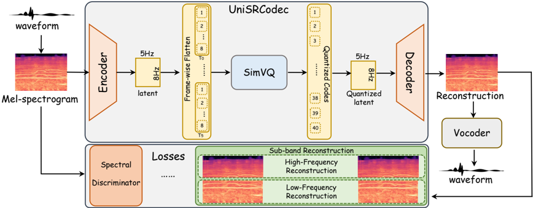

> [!abstract] arXiv · 2026 · Preprint
> **Zhisheng Zhang et al.** (Tsinghua University) · [→ Paper](https://arxiv.org/abs/2601.02776) · Demo: ✓ · Code: ?
>
> Proposes UniSRCodec, a single-codebook neural audio codec that compresses Mel-spectrograms (rather than raw waveforms) with a sub-band-weighted reconstruction loss, reaching state-of-the-art cross-domain reconstruction quality among single-codebook codecs at an ultra-low token rate of 40.

## Problem

Neural audio codecs split into multi-codebook designs (high fidelity via residual vector quantization, but structurally complex and hard to adapt into downstream ALM/TTS pipelines) and single-codebook designs (structurally simple, but historically low-fidelity, poor at unifying speech/music/general-audio modeling in one codebook, and unable to model high-frequency content without impractically high bandwidth). Prior single-codebook codecs such as BigCodec are domain-constrained, while WavTokenizer and UniCodec operate at limited sampling rates (16-24kHz) that cap achievable fidelity, and the closest prior spectral-domain single-codebook approach, MelCap, still requires a relatively high 260 token rate (3.4kbps) and lacks audio-domain-specific design (it reuses image-domain pretrained VGG weights for its Mel-spectrogram processing).

## Method

UniSRCodec compresses the Mel-spectrogram of input audio, rather than the raw waveform, arguing this is more information-dense: a 2D spectral representation yields a quadratic compression gain (n² for an n-times downsampling factor in each of time and frequency) versus the purely 1D gain available from waveform compression, and phase information discarded during compression can be recovered by a separately trained vocoder. The encoder-quantizer-decoder architecture is adapted from Open-MagViT2: a fully convolutional 2D encoder with three residual-block stages progressively downsamples a 128x128 Mel-spectrogram to an 8x8 latent (16x16 overall compression), which is flattened frame-wise (preserving each time frame as a complete spectral unit, chosen over band-wise flattening for train/inference consistency under variable-length audio) and quantized with a single SimVQ codebook. The decoder mirrors the encoder to reconstruct the Mel-spectrogram, which a pretrained BigVGAN-v2 vocoder then converts to waveform, recovering the phase information discarded during compression.

Training combines five loss terms: a proposed sub-band reconstruction loss that splits the Mel-spectrogram into low- and high-frequency halves and computes a weighted L1 loss over each half (weighted more heavily toward low frequencies, since the authors observe full-spectrogram reconstruction under-serves the more fine-grained low-frequency content), a discriminator loss adapted from DAC's multi-band multi-scale STFT discriminator (simplified since the Mel input already has fixed frequency resolution), an adversarial loss with frequency-domain feature matching, and a commitment loss for the SimVQ codebook. Two model variants are trained: UniSRCodec-B (base, 40 tokens/second, 0.52kbps) and UniSRCodec-L (a higher-bitrate variant, 176 TPS, intended to compete more directly with multi-codebook methods). Training uses ~10,000 hours of cross-domain data (VCTK, LibriTTS, and Common Voice for speech; MusicDB and Jamendo for music; AudioSet for general sound) on 8 NVIDIA RTX 4090 GPUs for roughly 12 hours, which the authors note is substantially lighter than UniCodec's training requirements.

## Key Results

Against single-codebook baselines (BigCodec, TAAE, WavTokenizer variants, UniCodec) on cross-domain reconstruction (Mel and STFT distance on AudioSet and MusicDB, PESQ/STOI on LibriTTS), UniSRCodec-B achieves the best results among single-codebook codecs on music and general-audio domains at a 40 token rate, and UniSRCodec-L outperforms the multi-codebook codecs SNAC and Encodec at a lower bitrate while matching or exceeding DAC on two music-domain metrics (STFT-44, Mel-16). In the speech domain specifically, UniSRCodec-B trails UniCodec, which the authors attribute to UniCodec's much larger (~700,000-hour), overwhelmingly speech-focused training data and its additional semantic-learning objective; UniSRCodec-L at a 24kHz/90-TPS setting closes this gap while still outperforming UniCodec on general audio. In a 10-expert MUSHRA-style subjective listening test across audio, music, and speech domains, UniSRCodec-B and UniSRCodec-L score second-highest and highest respectively; in the music domain the margin over UniCodec is large (UniSRCodec-L: 80.967 vs. UniCodec: 33.933). On downstream understanding tasks (urban/environmental sound, music genre, and emotion classification via the xares benchmark), UniSRCodec's quantized embeddings outperform WavTokenizer (matched token rate) on all four tasks and approach the continuous WavLM representation on emotion recognition.

## Novelty Assessment

The core architectural components (2D convolutional encoder/decoder from Open-MagViT2, DAC-style discriminator, SimVQ single-codebook quantization, BigVGAN vocoding) are all adopted from prior work rather than newly invented. The genuine contribution is the combination: applying Mel-spectrogram-domain compression with a single codebook, and specifically the sub-band-weighted reconstruction loss that the paper's own ablation shows meaningfully improves low-frequency fidelity without a demonstrated high-frequency cost. The comparison set is broad and current (both multi- and single-codebook SOTA baselines across three audio domains, plus a downstream-task evaluation), and the ablation study is thorough (discriminator, sub-band loss, learning-rate schedule, and flattening strategy are each isolated). The paper is candid about where its design underperforms (speech-domain modeling versus UniCodec), which is a useful honesty check on the "SOTA" framing.

## Field Significance

> [!tip]
> High, achieving state-of-the-art cross-domain reconstruction quality among single-codebook codecs at a 40-token-rate is a genuinely useful advance for downstream applications where codec token rate directly bounds sequence length and computational cost, such as audio/speech language models. The lightweight training requirement (8 consumer GPUs, ~12 hours) also makes the specific design choices here (Mel-domain compression, sub-band-weighted loss) practically reproducible and adoptable by others, though the paper's own results show it is not uniformly superior to domain-specialized codecs like UniCodec on speech specifically.

## Claims

- **supports:** Compressing audio in the Mel-spectrogram domain rather than the raw waveform domain enables substantially higher token-rate efficiency for single-codebook neural audio codecs, because 2D spectral compression yields a quadratic reduction in sequence length relative to 1D waveform compression at an equivalent per-axis downsampling factor.
  > *Evidence:* UniSRCodec-B reaches state-of-the-art reconstruction quality among single-codebook codecs at a token rate of only 40 (0.52kbps), well below comparable single-codebook baselines such as UniCodec (75 TPS) and MelCap (260 TPS). *(§III-A, §V-C, Table I)*
- **complicates:** Discarding phase information during audio compression and relying on a separately trained vocoder to reconstruct it is only viable for high-fidelity codecs when the compression architecture is paired with adversarial (discriminator-based) training.
  > *Evidence:* Removing the discriminator and its associated adversarial/feature-matching losses, retaining only reconstruction and codebook losses, causes the largest single degradation observed in ablation (AudioSet Mel-44 distance rising from 0.904 to 1.261) and produces synthesized audio with audible electronic artifacts. *(§V-D, Table II)*
- **supports:** Explicitly reweighting reconstruction loss toward low-frequency spectral content improves low-frequency fidelity in codecs that jointly compress the time and frequency dimensions of a spectral representation.
  > *Evidence:* Replacing the proposed sub-band-weighted reconstruction loss with an unweighted full-spectrogram L1 loss degrades the low-frequency Mel-16 metric from 0.901/0.900 to 0.922 in ablation on AudioSet. *(§V-D, Table II)*
- **complicates:** Single-codebook codec designs optimized for unified, low-bitrate, cross-domain modeling can trade off performance in narrower, data-rich single-domain settings relative to codecs specialized and trained at much larger scale for that specific domain.
  > *Evidence:* UniSRCodec-B shows lower speech-domain reconstruction quality than UniCodec, which the authors attribute to UniCodec's training data being overwhelmingly speech-focused at roughly 700,000 hours and its use of an additional semantic-learning objective that UniSRCodec does not include. *(§V-C)*

## Limitations and Open Questions

- Speech-domain reconstruction quality trails UniCodec at the base (40-TPS) operating point; closing this gap requires the higher-bitrate UniSRCodec-L variant (90 TPS at 24kHz), which reduces the token-rate advantage that is the paper's central selling point.
- Subjective evaluation uses only 9 audio clips (3 per domain) rated by 10 experts, a small sample for a MUSHRA-style listening test relative to the number of systems and domains compared.
- The high-frequency data filtering procedure (energy-threshold-based native sampling-rate detection) is empirically tuned (-60dB threshold, 22.05kHz Nyquist cutoff) without a stated sensitivity analysis of these specific values.
- The paper reports no explicit total parameter count for either UniSRCodec variant, limiting direct compute/efficiency comparison against baselines beyond token rate and training GPU-hours.

## Wiki Connections

- [[neural-codec|Neural Audio Codec]] — proposes a single-codebook codec design intended to unify speech, music, and general-audio modeling at an ultra-low token rate, positioned directly against both multi-codebook and prior single-codebook approaches.
- [[subjective-evaluation|Subjective Evaluation]] — conducts a MUSHRA-style listening test with 10 experts across speech, music, and general-audio domains to validate reconstruction quality beyond objective metrics.
- [[evaluation-metrics|Evaluation Metrics]] — evaluates cross-domain reconstruction with domain-appropriate objective metrics (Mel/STFT distance for music and general audio, PESQ/STOI for speech) and adds a downstream-task (xares) evaluation of codec embeddings.
- [[2025.acl-long.937|UniCodec]] — the paper's primary comparison baseline throughout; UniSRCodec is explicitly positioned as achieving lower bitrate and better high-frequency modeling at the cost of some speech-domain quality relative to this system.
- [[2408.16532|WavTokenizer]] — discussed as the precedent that pioneered consolidating multi-level codebooks into a single codebook, and used as a token-rate-matched baseline for downstream classification tasks.
- [[2409.05377|BigCodec]] — a single-codebook baseline noted for scaling model parameters to improve compression, but domain-constrained (speech-only) and operating at a lower sampling rate than UniSRCodec.
- [[2210.13438|EnCodec]] — a multi-codebook baseline compared against in the cross-domain reconstruction evaluation.
- [[2206.04658|BigVGAN]] — the pretrained vocoder UniSRCodec uses to recover phase and synthesize waveform from its reconstructed Mel-spectrograms.
