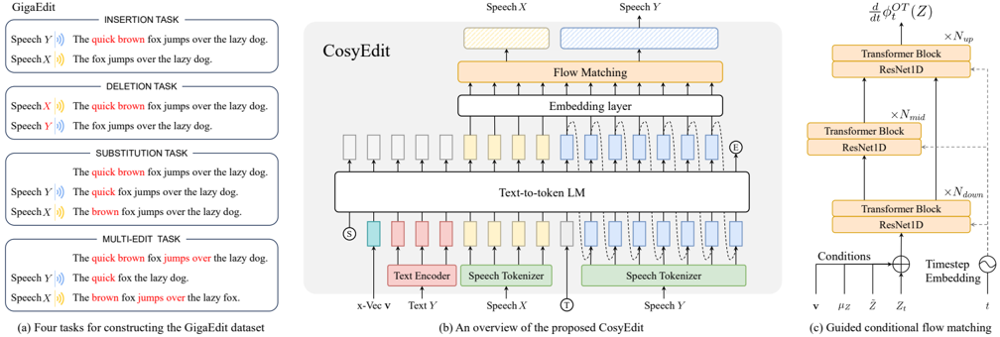

> [!abstract] arXiv · 2026 · Preprint
> **Junyang Chen et al.** (Nankai University) · [→ Paper](https://arxiv.org/abs/2601.05329) · Demo: ? · Code: ?
>
> Adapts CosyVoice into CosyEdit, a 400M-parameter end-to-end speech editing model that internalizes speech-text alignment (eliminating external forced-alignment tools) and, fine-tuned on only 250 hours of curated data, outperforms billion-parameter speech-language-model editing baselines while matching state-of-the-art cascade systems.

## Problem

Automatic speech editing (inserting, deleting, or substituting spoken content per textual instructions while preserving fluency and paralinguistic consistency) traditionally relies on cascade pipelines: an external forced aligner (e.g. Montreal Forced Aligner) establishes speech-text alignment, the edit span is located by comparing target and original text, the speech is segmented into preserved and edited regions, and a separate zero-shot synthesis model fills in the edited region. This pipeline is computationally heavy and struggles with prosodic consistency and editing robustness. Recent end-to-end speech language models (Step-Audio-EditX, MiMo-Audio, Ming-UniAudio) avoid external alignment but require enormous scale (3B-16B parameters, hundreds of thousands to millions of hours of training data) and are trained from scratch or via large-scale pretraining rather than adapted from an existing capable model.

## Method

CosyEdit adapts CosyVoice's four-component architecture (text encoder, S3 supervised semantic speech tokenizer, an autoregressive LLM, and a non-autoregressive conditional flow-matching model), keeping the text encoder and S3 tokenizer fixed and adapting only the AR LLM and NAR flow-matching model with task-specific training objectives and inference strategies.

The AR LLM is reformulated to treat speech editing as autoregressive speech-token generation conditioned jointly on the target text and the original speech tokens, reusing tokens in regions aligned between target text and original speech while generating new tokens for non-aligned regions, implicitly internalizing the text-speech alignment that cascade systems compute externally. The NAR stage extends Optimal-Transport Conditional Flow Matching with a reference-guided design (GOT-CFM): rather than only masking the edited region's acoustic features as cascade systems do, GOT-CFM conditions generation on the complete probability-density path from the original speech's noisy to clean mel-spectrogram, giving the flow-matching module access to the full original-speech context and improving timbre and fine-grained acoustic consistency across both edited and unedited regions.

Training and inference use deliberately different input formats. Zero-shot in-context training conditions only on the target text and the original speech (withholding the original transcript), which exposes prosodic and semantic cues from the original speech while preventing the model from learning a degenerate shortcut of simply attending to explicit alignment signals and copying the original speech rather than executing the edit. One-shot in-context inference instead provides the original text-speech pair as a real temporal-alignment reference alongside the target text, since a matched ground-truth alignment signal is available and useful at inference time even though it was withheld during training.

To train the model, the authors construct GigaEdit, a 250-hour supervised speech-editing dataset derived from GigaSpeech-S via a general procedure: for each utterance, Montreal Forced Aligner establishes time alignment, then segments are removed (with the shortened result serving as the "original" side) to construct insertion tasks; deletion is the symmetric counterpart; substitution splits a deleted segment into two parts reinserted elsewhere to form paired original/target utterances; and a multi-edit variant extends substitution to multiple non-contiguous deleted segments to simulate more realistic multi-location editing.

## Key Results

On the RealEdit benchmark, CosyEdit (400M parameters, 250 hours of fine-tuning data) achieves the best WER (4.5%) and Edit MOS (4.15) among all compared systems, including three end-to-end baselines with far more parameters and training data: Step-Audio-EditX (3B, >200k hours, WER 10.76%), MiMo-Audio (7B, 100M hours, WER 16.86%), and Ming-UniAudio (16B, >390k hours, WER 9.98%). On acoustic-consistency metrics (SpkSIM, SMOS), CosyEdit surpasses all end-to-end baselines and approaches the best cascade systems (SSR-Speech, VoiceCraft) without matching them exactly. After a postprocessing step that replaces unedited regions with the original audio (to isolate how well models preserve unedited content before this correction), CosyEdit achieves the best WER, SpkSIM, and MCD (below 5dB) among end-to-end models, and shows more stable performance before and after replacement than Step-Audio-EditX, which the authors note has large performance swings indicating weaker underlying region-preservation. Ablation shows the ordering of contributions: adding task-specific LLM training alone raises substitution-error WER (from enforcing prosodic reference to the original) without changing MOS much; adding task-specific flow-matching training (GOT-CFM) reduces WER from 4.49% to 4.18% and improves MCD but introduces a MOS drop attributed to preserved background-noise patterns; and switching from zero-shot to one-shot in-context inference substantially reduces WER (6.41% to 4.5%) at a small MCD cost.

## Novelty Assessment

The paper's stated framing, unlocking speech editing from an existing zero-shot TTS model via post-training rather than training a speech-language model from scratch, is well supported by its own comparison table showing an order-of-magnitude-to-two-orders-of-magnitude reduction in both parameters and training data relative to the SLM-based end-to-end baselines it outperforms. GOT-CFM is a targeted, well-motivated extension (the full-context conditioning idea is intuitive and its ablated contribution, improved MCD, is directly measured), and the zero-shot-training/one-shot-inference split is a specific, non-obvious design choice with a clear rationale (avoiding a training-time shortcut) that is validated by the corresponding ablation showing the expected inference-time trade-off. The GigaEdit construction procedure is a reusable methodological contribution (a general recipe for turning any aligned speech corpus into insertion/deletion/substitution/multi-edit supervision) rather than merely a one-off dataset. One limitation in the comparison itself: the postprocessing replacement step applied to all end-to-end models before Table III somewhat obscures how much of CosyEdit's raw (non-replaced) unedited-region preservation is inherent to the model versus corrected by postprocessing.

## Field Significance

> [!tip]
> High, demonstrating that a 400M-parameter model fine-tuned on 250 hours of data can outperform 3B-16B-parameter end-to-end speech-editing systems on intelligibility and edit-quality metrics is a strong, concrete efficiency result with direct practical implications: it suggests post-training adaptation of existing zero-shot TTS models is a viable, far cheaper alternative to training or pretraining dedicated large speech-language models for this task. The GOT-CFM extension and the GigaEdit construction procedure are both reusable beyond this specific paper.

## Claims

- **supports:** Task-specific post-training and inference-strategy adaptation of an existing pretrained zero-shot TTS model can unlock competitive end-to-end speech editing capability at a fraction of the parameter count and training data required by speech-language-model baselines built for general-purpose editing.
  > *Evidence:* A 400M-parameter model fine-tuned on 250 hours of curated data outperforms 3B-16B-parameter end-to-end baselines (Step-Audio-EditX, MiMo-Audio, Ming-UniAudio) on WER and Edit MOS on the RealEdit benchmark, while approaching the acoustic-consistency performance of dedicated cascade speech-editing systems. *(§IV.D, Table II)*
- **supports:** Conditioning a flow-matching speech-editing model's generation trajectory on the complete probability-density path of the unedited original speech, rather than only masking the edited region, improves fine-grained acoustic consistency between edited and unedited regions.
  > *Evidence:* Adding task-specific flow-matching training (GOT-CFM, conditioned on the full original-speech trajectory) reduces mel-cepstral distortion from 6.17 to 5.59 relative to the LLM-training-only variant, and the full model achieves an MCD below 5dB after unedited-region replacement. *(§III.B, §IV.D, Table III, Table IV)*
- **complicates:** Withholding the original transcript during in-context training is necessary to prevent an autoregressive speech-editing model from collapsing to a degenerate shortcut of copying the original speech, but the same withholding increases word-error rate at inference relative to providing the original transcript as an alignment reference.
  > *Evidence:* Zero-shot in-context inference (original speech only) favors preserving the original speech (lower MCD but higher WER of 6.41%), while one-shot in-context inference (providing the original text-speech pair as reference) substantially reduces WER to 4.5% with only a small MCD cost. *(§III.C, §IV.D, Table IV)*
- **complicates:** Fine-tuning a studio-quality-trained zero-shot TTS model on in-the-wild, noisier speech-editing data improves word-level discrimination and edited-region acoustic fidelity but can reduce perceived speech quality by preserving background noise patterns present in the training data.
  > *Evidence:* Task-specific flow-matching training reduces WER from 4.49% to 4.18% and improves MCD relative to the unmodified CosyVoice zero-shot TTS baseline, but also causes a noticeable MOS drop attributed to background-noise patterns preserved from the GigaSpeech/GigaEdit training data. *(§IV.D, Table IV)*

## Limitations and Open Questions

- The authors explicitly flag minimizing distortion in unedited regions as future work, indicating CosyEdit's raw (non-postprocessed) region-preservation is not yet fully solved even though postprocessing largely corrects it.
- Evaluation is limited to the RealEdit benchmark and its four edit types (insertion, deletion, substitution, mixed); generalization to other languages (GigaEdit is derived from English GigaSpeech) is listed as future work.
- The paper commits to open-sourcing code and datasets to support watermarking and forgery-detection research, explicitly acknowledging speech-editing deepfake misuse risk, but this release had not yet occurred as of publication.
- Comparisons in Table III (post-replacement) apply the same alignment-based postprocessing to all end-to-end baselines, which corrects for weak unedited-region preservation uniformly; the paper notes Step-Audio-EditX shows large performance swings between Tables II and III, indicating its raw (pre-replacement) consistency is comparatively weaker, a distinction CosyEdit's own raw performance is not separately isolated from.

## Wiki Connections

- [[flow-matching|Flow Matching]] — extends Optimal-Transport Conditional Flow Matching with a reference-guided design (GOT-CFM) that conditions generation on the full original-speech probability-density path rather than only masking the edited region.
- [[zero-shot-tts|Zero-Shot TTS]] — adapts a pretrained zero-shot TTS model (CosyVoice) into a speech editor via post-training, explicitly building on and preserving its zero-shot voice-cloning capability.
- [[subjective-evaluation|Subjective Evaluation]] — collects 10-listener ratings on speech-editing-specific Edit MOS (semantic correctness, boundary naturalness) and Similarity MOS (timbre and unedited-region preservation) criteria.
- [[2407.05407|CosyVoice]] — CosyEdit is directly adapted from this paper's zero-shot TTS architecture via task-specific fine-tuning of its AR LLM and NAR flow-matching components.
- [[2403.16973|VoiceCraft]] — the RealEdit benchmark used for all evaluations in this paper originates from VoiceCraft, which is also compared against as a cascade AR speech-editing baseline.
- [[2511.03601|Step-Audio-EditX]] — a 3B-parameter end-to-end speech-editing baseline that CosyEdit outperforms on WER and Edit MOS despite CosyEdit's much smaller scale.
- [[2512.23808|MiMo-Audio]] — a 7B-parameter end-to-end speech-editing baseline, evaluated in dialogue/few-shot mode, that CosyEdit outperforms on WER and Edit MOS.
- [[2511.05516|Ming-UniAudio]] — a 16B-parameter end-to-end speech-editing baseline restricted to single-location edits, compared against across all evaluation tables.
- [[2025.acl-long.313|F5-TTS]] — discussed in related work as a representative flow-based non-autoregressive speech editing approach using ODE solvers for infilling.
- [[2409.00750|MaskGCT]] — discussed in related work as a representative diffusion-based non-autoregressive speech editing approach.
