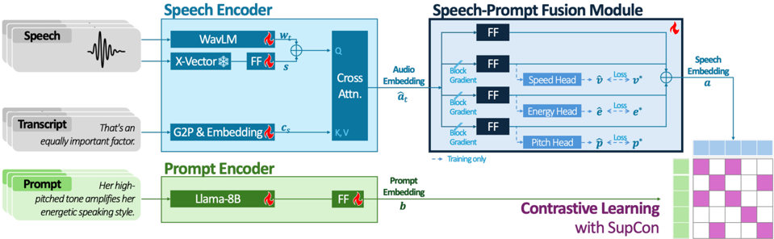

> [!abstract] arXiv · 2026 · Preprint
> **Chanhee Cho et al.** (Chung-Ang University) · [→ Paper](https://arxiv.org/abs/2601.05554) · Demo: ? · Code: ?
>
> Introduces SPAM, a CLAP-inspired automatic metric for how well synthesized speech adheres to a style text prompt, factorizing speech into acoustic attributes and training with a supervised contrastive loss, validated to correlate strongly with human judgments and to respond faithfully to semantically equivalent versus dissimilar prompt variations.

## Problem

Prompt-based TTS systems generate speech conditioned on fine-grained style descriptions in text, but automatic evaluation of whether the synthesized speech actually adheres to a given prompt remains underdeveloped. Prior automatic approaches either inspect style-embedding clusters (subjective, not validated against human perception) or use an LLM-as-a-judge on prompt-speech pairs (sensitive to small prompt perturbations, so judgments may not be reliably grounded in prompt content). The paper frames the requirements formally: a good metric must be plausible (its judgments should track human MOS ratings) and faithful (semantically similar prompts should yield consistent scores, while semantically distinct prompts should yield divergent ones), and argues no prior automatic metric satisfies both.

## Method

SPAM adapts a CLAP-style (Contrastive Language-Audio Pretraining) framework to align speech and style-prompt embeddings in a shared space, with two modifications targeting the paper's plausibility/faithfulness requirements. The speech encoder combines a WavLM waveform encoder, a frozen X-Vector speaker embedding (via a feed-forward adapter), and a phoneme embedding of the transcript, fused via cross-attention between waveform-plus-speaker vectors and transcript vectors to produce a frame-level audio embedding.

This audio embedding is then passed through four parallel branches, a global waveform branch (for regularization, preventing overfitting to any single attribute) and three attribute-specific branches (speed, energy, pitch), each guided by an auxiliary prediction head (a variance predictor for speed, MLP heads for energy and pitch) that produces frame-level estimates supervised against ground-truth acoustic measurements. The four branch embeddings are summed and averaged across frames to produce the final speech embedding. The prompt encoder uses a Llama-3.1-8B language model with a feed-forward adapter to produce the prompt embedding, chosen for its capacity to distinguish subtle stylistic differences in text. Training combines a supervised contrastive (SupCon) loss between speech and prompt embeddings with the three auxiliary attribute-prediction losses (Huber loss for pitch, speed, energy). SupCon is used instead of standard CLAP's InfoNCE loss because popular prompt-based TTS datasets provide categorical style keys (e.g. "male voice, high pitch, normal speed"), making prompt-audio matching a many-to-many problem within a training batch (multiple positive pairs sharing a style key), which InfoNCE does not handle.

## Key Results

In a plausibility experiment (320 CloudResearch annotators rating 5-point MOS on prompt-speech pairs from TextrolSpeech and LibriTTS-P, the latter testing unseen style prompts, across five prompt-based TTS systems plus ground truth), SPAM (WavLM variant) achieves LCC around 0.58 with human MOS, higher than the RA-CLAP baseline (0.520 on TextrolSpeech, 0.429 on LibriTTS-P). Per-model correlation analysis shows SPAM remains stable across both datasets on ground-truth audio (~0.72 on each), while RA-CLAP's correlation drops sharply on the unseen-style dataset (0.726 to 0.545), a pattern the authors attribute to SPAM's attribute-factorized fusion module and the Llama-3-based prompt encoder's stronger context understanding. In a faithfulness experiment (10 semantically equivalent "positive" and 10 semantically dissimilar "negative" paraphrases generated per prompt-speech pair), SPAM achieves a higher adherence rate than RA-CLAP (0.862 vs. 0.852 on TextrolSpeech, 0.771 vs. 0.750 on LibriTTS-P) and, in a paired t-test, is the only metric variant that fails to reject the hypothesis that positive paraphrases receive equal scores to the original prompt (i.e. SPAM correctly treats them as equivalent, while RA-CLAP does not). All metrics correctly assign lower scores to negative (semantically dissimilar) prompts than to the original.

## Novelty Assessment

The core CLAP-style contrastive text-audio alignment framework is not new, and the paper is explicit that its contribution is adapting this framework with two specific modifications for the prompt-adherence task: explicit acoustic-attribute factorization (which prior CLAP-style evaluators, including the closely related RA-CLAP, did not implement) and a supervised contrastive loss to handle the multi-positive structure induced by categorical style keys (standard CLAP/InfoNCE loss does not account for this). Both modifications are individually well-motivated and the paper's two-experiment validation design (plausibility against human MOS, faithfulness under controlled prompt paraphrasing) is a genuinely rigorous methodology for validating an evaluation metric, rather than simply asserting the metric is good. The faithfulness experiment's positive-paraphrase test in particular is a meaningful differentiator: RA-CLAP passes the easier negative-discrimination test but fails the harder positive-paraphrase consistency test, which SPAM alone passes.

## Field Significance

Moderate, this is a focused, well-validated evaluation-methodology contribution addressing a real and previously underexplored gap (no automatic prompt-adherence metric for TTS had been validated for both plausibility and faithfulness). Its practical value depends on adoption as a standard evaluation tool by future prompt-based TTS papers in place of costly MOS studies or unvalidated LLM-as-a-judge approaches; the comparison set (against a single prior automatic metric, RA-CLAP, which was not originally designed for this exact task) is narrow, and broader adoption evidence is not yet available within the paper itself.

## Claims

- **supports:** An automatic metric for style-prompt adherence in TTS evaluation, built by factorizing speech into discrete acoustic attributes before aligning with text prompts, correlates more strongly and consistently with human mean-opinion-score judgments than an undifferentiated contrastive audio-text scorer.
  > *Evidence:* SPAM (WavLM) achieves LCC around 0.58 with human MOS ratings, higher than RA-CLAP's 0.520/0.429, and shows stable per-model correlation on ground-truth audio across both test datasets (~0.72) where RA-CLAP's correlation drops sharply between datasets (0.726 vs. 0.545). *(§4, Table 1, Table 2)*
- **supports:** Training a contrastive text-audio scorer with a supervised contrastive loss that exploits multiple positive examples per style key produces more faithful score behavior under semantically equivalent prompt paraphrases than an evaluator that does not account for this multi-positive structure.
  > *Evidence:* In a paired t-test, only the SPAM variants failed to reject the hypothesis that semantically equivalent (positive) prompt paraphrases receive equal scores to the original prompt, while RA-CLAP rejected this hypothesis, indicating its scores are unfaithfully sensitive to paraphrasing that should not change the evaluation outcome. *(§3.2, §4, Table 1)*
- **complicates:** Automatic metrics for prompt-based TTS can reliably distinguish semantically dissimilar prompts from a speech sample's true prompt, but this discrimination is easier to achieve than faithfulness to semantically equivalent paraphrases, which is a harder and more differentiating test of metric quality.
  > *Evidence:* All compared metrics passed the negative-prompt discrimination test (correctly scoring dissimilar prompts lower, p < .001 across all conditions), while only SPAM passed the harder positive-paraphrase consistency test. *(§3.2, §4, Table 1)*
- **supports:** A prompt-adherence metric that separately predicts fine-grained acoustic attributes as auxiliary training signals, combined with a large language model as its text-prompt encoder, generalizes more robustly to previously unseen style-prompt vocabulary than a metric without such factorization.
  > *Evidence:* SPAM's correlation with human MOS on ground-truth audio remains consistently high on both a training-distribution dataset (TextrolSpeech, LCC 0.721) and an unseen-style test dataset (LibriTTS-P, LCC 0.718), a stability the authors attribute to the attribute-factorized fusion module and the Llama-3-based prompt encoder. *(§4, Table 2)*

## Limitations and Open Questions

- Faithfulness and plausibility are validated against only one prior automatic metric (RA-CLAP), which was originally designed for a related but distinct task (emotional speaking style retrieval) rather than general prompt adherence, limiting how broadly the comparison generalizes.
- The plausibility experiment's human MOS collection (320 CloudResearch annotators, 8 ratings averaged per pair) is itself the ground truth SPAM is validated against; no independent replication of these human ratings is reported.
- Evaluation covers only English prompt-based TTS systems and datasets (TextrolSpeech, LibriTTS-P, SpeechCraft); generalization to other languages is untested.
- The paper does not report SPAM's own inference cost or model size in aggregate, which would matter for practical adoption as a routine evaluation tool given its use of an 8B-parameter language model as the prompt encoder.

## Wiki Connections

- [[evaluation-metrics|Evaluation Metrics]] — introduces a new automatic metric for TTS style-prompt adherence, validated for both correlation with human MOS (plausibility) and consistent behavior under controlled prompt paraphrasing (faithfulness).
- [[subjective-evaluation|Subjective Evaluation]] — collects 5-point MOS ratings from 320 human annotators as the ground truth used to validate the proposed automatic metric's plausibility.
- [[2006.04558|FastSpeech 2]] — SPAM's speed-attribute auxiliary prediction head adopts the variance predictor design introduced in this paper.
- [[2506.16381|InstructTTSEval]] — discussed as a related benchmarking effort for natural-language instruction following in TTS, part of the broader evaluation landscape SPAM aims to improve on.
- [[2407.21783|Llama 3]] — used as the backbone for SPAM's prompt encoder, chosen for its capacity to distinguish subtle stylistic differences in style-prompt text.
