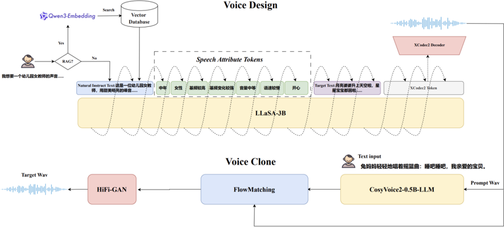

> [!abstract] arXiv · 2026 · Preprint
> **Jingbin Hu et al.** (Northwestern Polytechnical University (ASLP@NPU)) · [→ Paper](https://arxiv.org/abs/2601.10629) · Demo: ✓ · Code: ✓
>
> Presents VoiceSculptor, a fully open-sourced system that designs speaker timbre from natural-language instructions using chain-of-thought attribute reasoning and retrieval-augmented generation, then renders the designed voice into a prompt waveform for downstream zero-shot cloning, achieving open-source state-of-the-art on InstructTTSEval-Zh.

## Problem

Open-source TTS systems can now generate highly natural speech and clone speaker timbre from reference audio (CosyVoice2, LLaSA, F5-TTS, SparkTTS, IndexTTS2), but they offer limited direct, fine-grained control over acoustic attributes (pitch, speaking rate, age, emotion, style) from natural-language descriptions. Prior controllable-TTS approaches either relied on fixed templates and limited attribute spaces (PromptStyle, PromptSpeaker), or compressed rich voice attributes into a single continuous vector for cross-modal alignment (UniStyle, FleSpeech, HiStyle), leaving downstream generation with only an implicit, entangled, low-bandwidth control signal. Systems that do use LLM-based instruction understanding (VoxInstruct) still compress content and style into a single token sequence, limiting precise control over individual prosodic attributes. This leaves a gap between commercial closed-source systems (which offer flexible instruction-following control but no transparency or reproducibility) and open-source frameworks (which typically lack this level of expressiveness).

## Method

VoiceSculptor integrates two modules: a voice design (VD) model built on LLaSA-3B (a LLaMA-based LLM fine-tuned to generate discrete speech tokens via the XCodec2 neural audio codec, reformulating speech synthesis as sequence-to-sequence generation), and a voice cloning (VC) model using CosyVoice2 for downstream high-fidelity timbre transfer once a voice has been designed.

Three components underpin the voice design module. First, a comprehensive data processing pipeline collects large-scale in-the-wild and in-house audio, applies automatic cleaning (denoising, VAD, multi-speaker detection, perceptual quality filtering), transcribes and force-aligns it (FireRedASR for Chinese, Whisper for English, SenseVoice for cross-validation and emotion/language recognition), then annotates it at multiple levels: advanced acoustic annotation via Gemini 2.5 Pro (pitch, rate, loudness, gender, age, emotion, paralinguistics, context) with DeepSeek-generated natural-language captions and regex-based hallucination filtering; cross-validated emotion labeling via Emo2Vec, Qwen3-72B, SenseVoice, and Qwen3-Omni; and prosodic annotation via DataSpeech (continuous pitch/energy/rate statistics, discretized into 5 intervals per dimension) and VoxProfile (gender, 4-category age), calibrated with distributional analysis and human listening.

Second, a chain-of-thought (CoT)-based fine-grained attribute modeling strategy explicitly decomposes natural-language instructions into structured intermediate attribute-reasoning steps (auxiliary attribute tokens) before generating speech tokens, jointly modeling instruction text, CoT attribute tokens, and discrete speech tokens within a unified autoregressive framework. Training uses a joint cross-entropy objective over both text and speech tokens (rather than speech tokens alone), and a stochastic attribute-token dropout (0.2 probability) that forces the model to infer attributes from natural language alone, preventing over-reliance on explicit attribute tokens.

Third, a retrieval-augmented generation (RAG) mechanism embeds 500K in-domain natural-language instructions (via Qwen3-Embedding-0.6B) into a Milvus vector database; at inference, the input instruction is embedded and matched via cosine similarity to retrieve semantically relevant in-domain examples, which are injected into the model's input to ground interpretation and improve robustness to out-of-domain phrasing.

## Key Results

On InstructTTSEval-Zh (measuring Acoustic-Parameter Specification/APS, Descriptive-Style Directive/DSD, and Role-Play/RP instruction-following, LLM-judged), VoiceSculptor-VD (with RAG enabled) reaches an average score of 67.6%, the best among open-source systems, ahead of MiMo-Audio-7B-Instruct (64.5%), VoxInstruct (47.5%), and GPT-4o-Mini-TTS (51.1%), though behind commercial Gemini 2.5-Flash (85.4%) and Gemini 2.5-Pro (84.8%). VoiceSculptor leads specifically on APS (75.7%) and RP (61.5%) among open systems. Chaining the voice design output into CosyVoice2 for downstream cloning (VoiceSculptor-VD&VC) largely preserves these scores (AVG 67.3%), indicating the designed voice prompt transfers its style reasonably faithfully to a separately trained cloning model. A scaling study (1B vs. 3B parameters, three SFT data scales from 1,000 to 4,000 hours, plus a 9,000-hour continual pretraining stage) shows consistent gains from both larger models and more/richer data, with the best configuration (3B, CPT+SFT) reaching AVG 67.6% and IMOS 3.67 versus AVG 45.1%/IMOS 3.09 for the smallest 1B/1,000-hour configuration. Ablations show each proposed component matters: removing CoT attribute tokens drops AVG from 67.6% to 63.5%; removing the text-side cross-entropy loss drops it to 61.8%; and removing RAG drops it most sharply, to 59.4%, with the largest single-metric loss on Role-Play (-13.0 points).

## Novelty Assessment

The individual components (CoT-style reasoning, RAG, LLaSA-based codec-LM TTS, CosyVoice2 cloning) are each drawn from established techniques, but their combination and application to instruction-driven voice design specifically is a coherent, well-validated system rather than an incremental change: each of the three claimed contributions (CoT attribute modeling, joint text-speech supervision, RAG grounding) is isolated via ablation and shown to matter substantively, with RAG providing the largest single improvement. The multi-stage, multi-model annotation pipeline (cross-validating emotion labels across four separate models, combining automatic prosodic estimation with human-calibrated discretization) is a genuinely careful data-construction effort, though it is also the paper's least independently verifiable claim, since the underlying dataset itself is not described as released (only code and pretrained models are). The paper is honest that it trails Gemini's commercial systems by a substantial margin (67.6% vs. 84.8-85.4% AVG) and explicitly frames its contribution as open-source SOTA rather than SOTA overall.

## Field Significance

> [!tip]
> High, as a fully open-sourced system (code, pretrained models, and a public demo) achieving the best instruction-following performance among open TTS systems on a real, externally maintained benchmark (InstructTTSEval-Zh), VoiceSculptor materially advances reproducible research on instruction-controlled voice design, a capability gap the paper documents clearly relative to both prior open systems and closed commercial competitors. Its practical scope (currently Chinese-focused, with acknowledged weaknesses for elderly/child voices and generation stability) is narrower than its benchmark standing might suggest.

## Claims

- **supports:** Decomposing high-level natural-language voice-design instructions into explicit chain-of-thought intermediate attribute-reasoning steps improves instruction-following controllability in autoregressive speech-token generation, compared to treating fine-grained attributes as an implicit, entangled signal.
  > *Evidence:* Adding CoT-based fine-grained attribute tokens improves every evaluated InstructTTSEval-Zh metric (AVG score rising from 63.5% to 67.6%, IMOS from 3.59 to 3.67) without any change to model architecture. *(§3.3, Table 4)*
- **supports:** Retrieval-augmented generation, grounding an instruction-following voice-design model's inference in semantically similar in-domain instruction examples, substantially improves robustness to diverse and out-of-domain natural-language phrasing.
  > *Evidence:* Enabling RAG improves InstructTTSEval-Zh AVG score from 59.4% to 67.6% (+8.2 points), with the largest gains on Role-Play instructions (+13.0 points), indicating the base model alone has limited generalization to instruction phrasing that external retrieval compensates for. *(§3.5, Table 6)*
- **supports:** Jointly supervising both the instruction-text and discrete-speech-token prediction objectives in an autoregressive voice-design model produces stronger instruction-following controllability than supervising the speech-token objective alone.
  > *Evidence:* Removing the text-side cross-entropy loss degrades every InstructTTSEval-Zh metric, with AVG score dropping from 67.6% to 61.8% and IMOS from 3.67 to 3.42. *(§3.4, Table 5)*
- **complicates:** Even a state-of-the-art open-source instruction-following voice-design system exhibits limited output stability and degraded performance for underrepresented demographic voice categories, indicating benchmark performance does not fully capture production readiness.
  > *Evidence:* The authors report that repeated synthesis under the same instruction occasionally fails to maintain precise attribute control, that synthesis occasionally produces long silences or delayed responses, and that naturalness and timbre consistency remain insufficient specifically for elderly and child voices due to limited training-data coverage for these groups. *(§4)*

## Limitations and Open Questions

- Training data predominantly consists of Chinese instruction-speech pairs, and evaluation is conducted only on InstructTTSEval-Zh; English or multilingual instruction-following capability has not yet been comprehensively assessed.
- The model exhibits limited stability under repeated synthesis of the same instruction, and occasional long silences or delayed responses during synthesis and interaction.
- Naturalness and timbre consistency remain insufficient for elderly and child voices specifically, attributed to limited training-data coverage for these demographic groups.
- The authors note the current XCodec2 audio representation may be less semantically expressive than alternatives, and plan to explore replacing it, alongside large-scale text pretraining and instruction data augmentation, to reduce reliance on RAG while maintaining instruction-following performance.

## Wiki Connections

- [[instruction-conditioned-tts|Instruction-Conditioned TTS]] — designs speaker timbre and multiple voice attributes directly from free-form natural-language instructions via chain-of-thought attribute reasoning, the paper's central contribution.
- [[zero-shot-tts|Zero-Shot TTS]] — renders the instruction-designed voice into a prompt waveform consumed by a downstream zero-shot voice-cloning model (CosyVoice2) for final speech synthesis.
- [[subjective-evaluation|Subjective Evaluation]] — conducts a 33-listener Instruction-following Mean Opinion Score (IMOS) study to validate instruction-adherence beyond automated LLM-judged metrics.
- [[2412.10117|CosyVoice 2]] — used as the downstream voice-cloning model that renders VoiceSculptor's designed voice prompt waveform into final synthesized speech.
- [[2502.04128|LLaSA]] — the exact pretrained backbone (LLaSA-3B) that VoiceSculptor's voice design module is built on and fine-tuned from.
- [[2506.16381|InstructTTSEval]] — the InstructTTSEval-Zh benchmark from this paper is the primary evaluation protocol used throughout VoiceSculptor's experiments.
- [[2512.23808|MiMo-Audio]] — the strongest open-source baseline compared against on InstructTTSEval-Zh, notable for slightly outperforming VoiceSculptor specifically on the DSD metric.
- [[2301.02111|VALL-E]] — cited as a foundational neural codec language model approach to zero-shot TTS, part of the technical lineage VoiceSculptor's codec-LM design builds on.
- [[2506.21619|IndexTTS2]] — cited in the introduction as a modern zero-shot TTS system capable of high speaker-timbre fidelity but limited attribute controllability.
- [[2025.acl-long.313|F5-TTS]] — cited in the introduction as a modern neural TTS system with strong naturalness but limited fine-grained attribute control.
- [[2503.01710|Spark-TTS]] — cited in the introduction as a modern LLM-based TTS system with strong naturalness but limited fine-grained attribute control.
