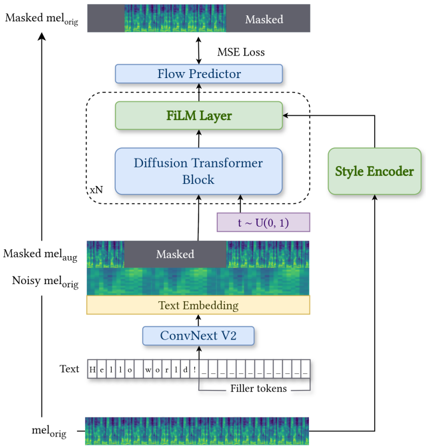
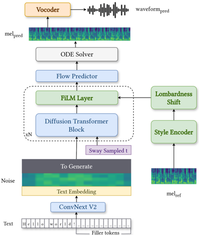

> [!abstract] arXiv · 2026 · Preprint
> **Seymanur Akti et al.** (KIT Campus Transfer GmbH (KCT), Karlsruhe Institute of Technology (KIT), Carnegie Mellon University (CMU)) · [→ Paper](https://arxiv.org/abs/2601.12966) · Demo: ✓ · Code: ?
>
> Introduces a zero-shot Lombard TTS system that manipulates a style embedding's PCA space to control loudness and articulation clarity for any speaker, without training on any Lombard-specific speech data.

## Problem

The Lombard effect, the tendency of speakers to hyperarticulate and raise vocal effort in noisy conditions or when addressing hearing-impaired listeners, is valuable for hearing-assistive applications, noise-robust synthesis, and interactive-system repair strategies, but standard TTS systems trained on read-speech corpora lack the acoustic variability to reproduce it. Prior approaches fine-tune on small dedicated Lombard datasets, manipulate spectral tilt, or adapt loudness dynamically from SNR feedback, all of which either require Lombard-labelled training data or generalize poorly to unseen speakers. The closest prior method learns a mapping between plain and Lombard speaker embeddings and interpolates between them at inference, but this still needs some Lombard training data, can perturb unrelated speaker characteristics during interpolation, and its linear mel-spectrogram stretching produces unnatural speaking rates.

## Method

The system fine-tunes F5-TTS ([[2025.acl-long.313|F5-TTS]]), a flow-matching Diffusion Transformer (DiT) TTS model, replacing its in-context conditioning (a reference audio clip plus its transcription) with a fixed-size style embedding, since in-context conditioning ties the model to the reference transcription and introduces artefacts under cross-lingual reference audio. An ECAPA-TDNN encoder extracts a 1024-dimensional style embedding from a reference mel-spectrogram. The first two DiT blocks of F5-TTS Base are frozen (empirically found most critical for duration alignment), and FiLM conditioning is introduced in the later blocks, scaling and shifting block activations using parameters derived from the style embedding. Masked mel-spectrogram inputs are augmented with formant shifts during training so the model must rely on the style embedding, not the masked input, for speaker identity. At inference, no reference transcription or mel-spectrogram is used; output duration is instead computed from the input text's syllable count at a default speaking rate.

To control Lombardness, the authors run PCA on the style-embedding space learned jointly with the model on the Emilia dataset, separately analyzing loudness (using the AVID corpus, which spans soft/normal/loud/very-loud effort levels measured by speech pressure level) and clarity (using the ALBA corpus, which spans fast, normal, and clear speech). Loudness correlates with the first two principal components; clarity correlates specifically with the second (PC2). Lombardness is then controlled by projecting a style embedding into this PCA space, shifting the relevant components by user-specified coefficients scaled to their variance, and applying the inverse PCA transform to obtain a manipulated embedding. Speaking rate is additionally adjusted via F5-TTS's duration control to reinforce the effect of increased clarity.

## Key Results

On LibriSpeech test prompts, the fine-tuned model (F5TTS-Style) is roughly on par with the F5-TTS baseline for English prompts (WER 2.08 vs. 2.11) but with lower speaker similarity (SPK-SIM 89.1 vs. 95.9) and naturalness (UTMOS 3.53 vs. 3.84), attributed to the loss of in-context adaptation. In the cross-lingual setting (German reference prompts), F5TTS-Style substantially outperforms the baseline on both intelligibility (WER 2.48 vs. 7.04) and naturalness (UTMOS 3.49 vs. 3.18), though SPK-SIM remains lower.

For Lombard control, increasing the Lombardness level (soft → normal → loud → very loud) consistently reduces WER as background noise increases, tracking the trend seen in ground-truth Lombard recordings; at SNR=1, WER falls from 26.56% (soft) to 6.52% (very loud). An ablation isolating the two PCA-controlled attributes shows clarity control is the primary driver of intelligibility at moderate noise levels (SNR=10, 5), while loudness control dominates at severe noise (SNR=1). A comparative MOS (CMOS) listening study on real vs. synthesized speech across normal-clean, loud (SNR=10), and very-loud (SNR=5) conditions found ground-truth speech rated more natural overall (CMOS -1.22), but the synthesized speech rated slightly better for intelligibility (CMOS +0.87). Speaker similarity, measured by SPK-SIM between synthesized and ground-truth clean speech, stays consistent (80.7-81.8%) across all Lombardness levels, and relative speaker-similarity trends across levels closely match ground truth.

## Novelty Assessment

The contribution is a targeted modification of an existing flow-matching TTS architecture (F5-TTS): replacing in-context reference-audio/text conditioning with a fixed-size, FiLM-injected style embedding, combined with a PCA-based control scheme for a specific prosodic attribute (Lombardness) that closely follows prior style-token PCA-control work. The zero-shot, no-Lombard-training-data property and the removal of transcription dependence at inference are the paper's genuine additions over the most similar prior method, which still required Lombard data and used embedding interpolation with associated speaker-identity leakage and unnatural rate stretching. The evaluation is a single-paper, single-architecture study (no comparison against the interpolation-based prior method itself), and the underlying PCA-manipulation idea is not new to this paper.

## Field Significance

Moderate - the paper offers a cleaner, data-free formulation of a known technique (PCA-based style-embedding manipulation) applied to a well-defined, narrow problem (Lombard speech control), with an explicit link between principal components and measurable prosodic attributes (SPL, clarity). Its main value to the field is methodological: demonstrating that a style-embedding space trained only for general prosodic diversity already encodes enough structure to support zero-shot, Lombard-specific control without dedicated Lombard training data.

## Claims

- **supports:** Style embeddings learned from a large, prosodically diverse (non-Lombard) dataset can encode enough structure about vocal effort and articulation clarity to support post-hoc, zero-shot control of Lombard speech attributes via simple linear (PCA) manipulation.
  > *Evidence:* PCA on the style-embedding space trained on Emilia shows the first two principal components correlate strongly with measured speech pressure level on the AVID loudness corpus, and the second component correlates with articulation clarity on the ALBA corpus, without any Lombard-labelled fine-tuning data. *(§2.2, Figure 2)*
- **supports:** Loudness and articulation-clarity control serve complementary, noise-level-dependent roles in preserving intelligibility of hyperarticulated synthetic speech under noise.
  > *Evidence:* An ablation on the "very loud" condition shows removing clarity control (loudness only) raises WER especially at moderate noise (SNR=10, 5), while removing loudness control (clarity only) causes WER to diverge sharply at severe noise (SNR=1), indicating clarity dominates at moderate noise and loudness dominates at severe noise. *(§3.2, Table 2)*
- **complicates:** Replacing a TTS model's in-context reference-audio conditioning with a compact, fixed-size style embedding trades speaker similarity and naturalness for robustness to conditions where in-context conditioning fails, such as cross-lingual prompting.
  > *Evidence:* On matched-language (English) prompts, the style-embedding model shows lower SPK-SIM (89.1 vs. 95.9) and UTMOS (3.53 vs. 3.84) than the F5-TTS in-context baseline, but on cross-lingual (German) prompts it substantially outperforms the baseline on both WER (2.48 vs. 7.04) and UTMOS (3.49 vs. 3.18). *(§3.1, Table 1)*
- **complicates:** Raw WER comparisons between synthesized and ground-truth Lombard/clear speech can be confounded by recording-condition and accent artifacts in the reference recordings, motivating noise-normalized rather than absolute intelligibility metrics.
  > *Evidence:* The synthesized speech frequently achieves lower absolute WER than ground-truth AVID recordings, which the authors attribute to recording conditions and accents in the database rather than a genuine intelligibility advantage; they introduce a relative-WER metric (WER_noisy / WER_clean) to obtain a fairer noise-robustness comparison. *(§3, Equation 1; §3.2)*
- **supports:** Controllable Lombard TTS can preserve speaker identity consistently across Lombardness levels even while it does not fully close the naturalness gap to real Lombard speech.
  > *Evidence:* A CMOS listening study across normal-clean, loud-SNR10, and very-loud-SNR5 conditions shows ground-truth speech preferred for naturalness overall (CMOS -1.22) while the synthesized speech is rated comparably or better for intelligibility (CMOS +0.87); absolute SPK-SIM between synthesized and ground-truth clean speech stays in the 80.7-81.8% range across all Lombardness levels. *(§3.2, §3.3, Table 4, Table 5)*

## Limitations and Open Questions

The evaluation is restricted to LibriSpeech, AVID, and ALBA, and to English (with one cross-lingual German-prompt condition); broader multilingual or spontaneous-speech generalization is untested. The Lombardness levels used for evaluation (soft/normal/loud/very-loud PCA coefficients and speed multipliers) are hand-set to approximate AVID's effort categories rather than derived from a validated psychoacoustic mapping, so the granularity and calibration of the control dimension is not independently verified. The CMOS study finds ground-truth speech still preferred for naturalness at higher Lombardness levels, indicating the naturalness gap to authentic Lombard speech is not closed. WER is computed with Whisper Large-v3, so absolute intelligibility numbers inherit that ASR model's own robustness characteristics under noise. The paper does not directly compare against the most similar prior zero-shot Lombardness-control method (embedding interpolation), only against the F5-TTS in-context baseline.

## Wiki Connections

- [[flow-matching|Flow Matching]] — builds directly on F5-TTS's flow-matching DiT backbone, modifying its conditioning pathway rather than its generative objective.
- [[zero-shot-tts|Zero-Shot TTS]] — achieves Lombard speech control for unseen speakers at inference without any speaker-specific or Lombard-specific training data.
- [[prosody-control|Prosody Control]] — introduces an explicit, interpretable PCA-based mechanism to shift loudness and articulation-clarity components of a style embedding independently of content and (largely) speaker identity.
- [[speaker-adaptation|Speaker Adaptation]] — extracts a fixed-size style embedding from a reference sample at inference to adapt synthesis to a new speaker's identity, including in cross-lingual reference conditions.
- [[subjective-evaluation|Subjective Evaluation]] — validates Lombard-speech naturalness and intelligibility trade-offs with a comparative MOS listening study against ground-truth recordings.
- [[2025.acl-long.313|F5-TTS]] — used as the base flow-matching architecture, fine-tuned here by replacing its in-context conditioning with FiLM-injected style embeddings for zero-shot Lombard control.
