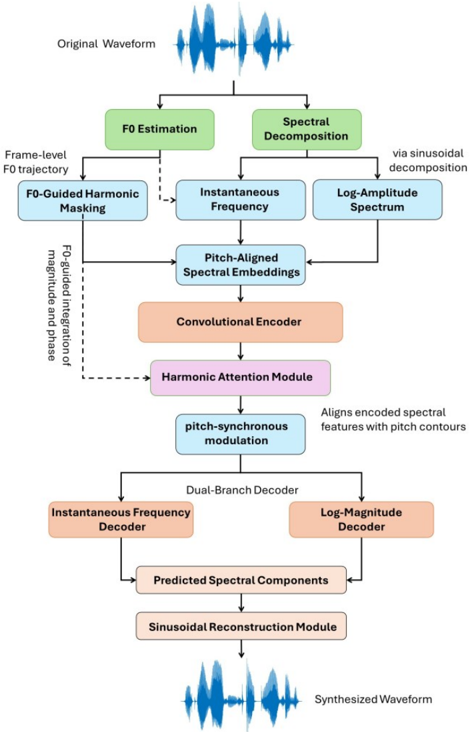

> [!abstract] arXiv · 2026 · Preprint
> **Al-Radhi et al.** (Budapest University of Technology and Economics) · [→ Paper](https://arxiv.org/abs/2601.14472) · Demo: ? · Code: ?
>
> Introduces a neural vocoder that injects F0 into the encoder through a harmonic attention mechanism and predicts the complex STFT spectrum directly, jointly modeling magnitude and phase instead of relying on a mel-spectrogram intermediate.

## Problem

Mel-spectrogram-conditioned vocoders such as HiFi-GAN discard fine-grained harmonic and phase information because mel features are lossy and non-invertible, which produces pitch artifacts, blurred harmonics, and temporal discontinuities in prosodically rich speech. Spectral-domain vocoders like Vocos move beyond mel conditioning by predicting spectral components directly, but do not explicitly leverage prosody-aware mechanisms. Representation-driven vocoders like AutoVocoder condition on learned speech representations but lack explicit phase prediction and prosody alignment. Prior systems generally treat prosody as an auxiliary feature and reconstruct phase indirectly or through post-processing, rather than modeling prosody and phase jointly within one architecture.

## Method

The vocoder takes STFT-derived spectral frames augmented with a fundamental-frequency (F0) contour extracted from the reference waveform using the Harvest algorithm. A convolutional-residual encoder first extracts local time-frequency patterns from the spectral input. A prosody-guided harmonic attention module then refines this representation: given encoded spectral features $H$ and F0 embeddings $F$, attention weights are computed as $A = \text{softmax}((HW_q(FW_k)^T)/\sqrt{d})$ and applied as $\widetilde{H} = A(HW_v)$, where $W_q, W_k, W_v$ are learnable projections. This lets F0 actively reweight the time-frequency representation, emphasizing voiced regions and harmonic structure while leaving unvoiced frames unaffected, in contrast to designs (e.g., BigVGAN) that append F0 as a concatenated auxiliary feature rather than using it to shape an attention distribution.

The prosody-enhanced representation is passed through a convolutional-upsampling decoder that expands it to spectral resolution and outputs 2F values per frame, split into the real and imaginary parts of the predicted complex spectrum $\hat{S}(t,f) = \hat{S}_r(t,f) + j\hat{S}_i(t,f)$. This spectrum is converted to a waveform via inverse STFT (ISTFT), eliminating the need for a separate phase-estimation step. Training combines three objectives: a multi-resolution STFT (MR-STFT) loss for spectral fidelity, an adversarial loss using multi-period and multi-resolution discriminators (following the HiFi-GAN discriminator design, but applied to waveforms reconstructed from the predicted complex spectrum), and a novel phase-aware loss that normalizes predicted and reference complex spectra to unit magnitude before computing an L2 distance, so the term penalizes phase misalignment independently of amplitude scaling. The three losses are combined with empirically tuned weights $\lambda_{STFT}$, $\lambda_{adv}$, $\lambda_{phase}$. Model size is not reported; the paper reports no codec component, operating directly on STFT spectral frames rather than a learned discrete codec.

## Key Results

On LJSpeech 1.1 and VCTK, the proposed vocoder is compared against Griffin-Lim reconstruction (Anchor), HiFi-GAN, AutoVocoder, and Vocos, all trained with identical preprocessing. It achieves the lowest F0-RMSE (16.8, versus 21.6 for HiFi-GAN, 19.7 for AutoVocoder, and 20.5 for Vocos), the lowest voiced/unvoiced error rate (6.5%, versus 7.9% / 7.1% / 7.3%), and the lowest MCD (0.72, versus 0.84 / 0.79 / 0.81). A 20-listener MOS study following ITU-T P.800 guidelines gives the proposed system a MOS of 4.45, above HiFi-GAN (4.2), AutoVocoder (4.3), and Vocos (4.1), with ground truth at 4.6. Pairwise preference scores favor the proposed system in 88% of comparisons, versus 86% for HiFi-GAN, 71% for AutoVocoder, and 66% for Vocos, with the Griffin-Lim anchor selected only 22% of the time. A per-frame residual mel-energy analysis (Fig. 2 in the paper) shows the proposed system tracking the reference more closely than the three neural baselines, consistent with the objective metrics. The margins over the strongest baseline (AutoVocoder) are modest in absolute terms (0.15 MOS points, 2.9-point RMSE reduction).

## Novelty Assessment

The contribution is primarily architectural: a cross-attention mechanism that lets an extracted F0 contour actively reweight encoded spectral features (rather than being concatenated as an auxiliary input, as in BigVGAN), paired with direct prediction of the complex STFT spectrum for phase-coherent ISTFT synthesis, and a new unit-magnitude-normalized phase loss. Two of the three components it combines are established: the adversarial discriminator setup follows HiFi-GAN directly, and multi-resolution STFT loss and direct complex-spectrum prediction follow the line of work established by Vocos. The genuinely new pieces are the harmonic attention mechanism itself and the explicit phase-aware loss term; the paper's contribution is best read as a targeted architectural addition to an existing spectral-vocoder recipe rather than a new vocoding paradigm.

## Field Significance

moderate — This is a short conference paper (ICASSP 2026) that adds a specific, well-motivated F0-attention mechanism and phase loss to the existing spectral-vocoder line established by Vocos and AutoVocoder, evaluated with single-GPU training on two standard English corpora against reasonable baselines. It demonstrates that explicit F0-driven attention and unit-normalized phase supervision can produce consistent, if modest, gains over mel-based and spectral-domain baselines on pitch accuracy and MOS.

## Claims

- **supports:** Conditioning a vocoder's spectral encoder on an explicit F0-driven attention mechanism, rather than treating pitch as an auxiliary input feature, can measurably improve pitch-tracking accuracy relative to mel-spectrogram-conditioned and representation-conditioned vocoders.
  > *Evidence:* The harmonic attention module reduces F0-RMSE by 22% relative to HiFi-GAN (16.8 vs. 21.6) and by 18% relative to AutoVocoder (16.8 vs. 19.7), with a corresponding drop in voiced/unvoiced error rate. *(§4, Table I)*
- **supports:** Predicting the complex STFT spectrum directly and reconstructing via inverse STFT, instead of predicting magnitude-only mel features and estimating phase separately, can reduce spectral distortion and improve perceived naturalness.
  > *Evidence:* The proposed complex-spectrum decoder attains lower MCD (0.72) and higher MOS (4.45) than mel-conditioned HiFi-GAN (MCD 0.84, MOS 4.2) and than Vocos (MCD 0.81, MOS 4.1), which also predicts spectral components directly but without explicit phase supervision. *(§4, Table I)*
- **refines:** Letting a conditioning signal (such as F0) actively reweight a spectral representation via attention is a more effective use of that signal than appending it as a concatenated auxiliary feature.
  > *Evidence:* The paper contrasts its query-key-value harmonic attention formulation, where F0 embeddings shape attention weights over encoded spectral features, with BigVGAN's approach of appending F0 as an auxiliary conditioning feature. *(§2.1)*
- **complicates:** Reported MOS gains between competing neural vocoder designs can be numerically small relative to the scale of the listening study used to measure them.
  > *Evidence:* The MOS study used only 20 listeners rating randomized samples, and the proposed system's 4.45 MOS exceeds the next-best baseline (AutoVocoder, 4.3) by only 0.15 points, with no statistical significance test reported for this gap. *(§3.2, §4)*

## Limitations and Open Questions

The paper reports experiments on a single NVIDIA GPU with a batch size of 16, and does not report an ablation isolating the individual contribution of the harmonic attention module versus the phase-aware loss versus the adversarial loss, so the relative importance of each of the three proposed components is not established. Evaluation is limited to two English-language corpora (LJSpeech, a single female speaker, and VCTK, English speakers with diverse accents); no results are reported for other languages or for expressive/emotional speech, cross-lingual, or low-resource settings. The subjective evaluation uses a 20-listener MOS study, and the paper does not report statistical significance testing for the MOS or preference-rate differences between systems. The authors themselves note that extending to multilingual and expressive speech, richer prosody control via semantic/linguistic cues, and real-time deployment are left to future work.

## Wiki Connections

- [[gan-vocoder|GAN Vocoder]] — extends the GAN-vocoder line (adversarial loss following HiFi-GAN's multi-period/multi-resolution discriminator design) with an added harmonic-attention encoder stage and a phase-aware loss term.
- [[prosody-control|Prosody Control]] — introduces an explicit F0-driven attention mechanism that reweights spectral encoder features to emphasize voiced/harmonic structure, contrasted against auxiliary-feature F0 conditioning.
- [[subjective-evaluation|Subjective Evaluation]] — reports a formal MOS listening study (20 listeners, ITU-T P.800 protocol) alongside pairwise preference scores to validate perceptual quality gains.
- [[2010.05646|HiFi-GAN]] — used as a primary baseline; the proposed vocoder's adversarial loss setup follows HiFi-GAN's discriminator design but is applied to waveforms reconstructed from a predicted complex spectrum rather than from mel-spectrogram-conditioned features.
- [[2306.00814|Vocos]] — used as a baseline and closest architectural relative; both predict spectral components directly, but the proposed method adds prosody-guided attention and explicit phase supervision that Vocos lacks.
- [[2206.04658|BigVGAN]] — cited as a contrasting design for pitch-aware conditioning; BigVGAN appends F0 as an auxiliary feature, while this paper's harmonic attention lets F0 actively shape the attention distribution.

