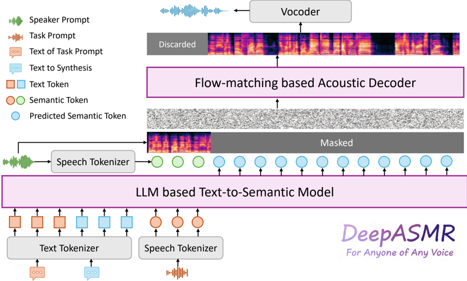

> [!abstract] arXiv · 2026 · Preprint
> **Leying Zhang et al.** (Shanghai Jiao Tong University / VUI Labs) · [→ Paper](https://arxiv.org/abs/2601.15596) · Demo: ✓ · Code: ?
>
> Introduces the first zero-shot framework for generating Autonomous Sensory Meridian Response (ASMR) speech in any speaker's voice using only a short snippet of their ordinary, read-style speech.

## Problem

Modern zero-shot TTS systems achieve high fidelity for neutral, read-style speech but fail to generate ASMR: a low-intensity, often unvoiced speaking style characterized by breathy tones, elongated whispered vowels, and suppressed vocal-fold vibration. Prior attempts fall into three categories, each with a critical shortcoming: in-context learning from large prompt-based models can only reproduce a style already present in the prompt (they cannot convert a normal-voice reference into ASMR); voice-conversion approaches transform whispered speech into modal speech but the reverse direction (normal-to-whisper) is comparatively under-studied and historically limited to signal-processing or GMM/DNN methods; and task-specific fine-tuning on small ASMR datasets from a known speaker cannot generalize to unseen speakers. The paper frames the core obstacle as requiring zero-shot speaker adaptation for an unvoiced, subtle acoustic style without ever having an ASMR-style reference for the target speaker.

## Method

DeepASMR formulates controllable speech synthesis as a mapping from input text `T`, a task prompt `P_task` (encoding the target style), and a speaker prompt `P_spk` (encoding target identity) to an output waveform. The framework covers four sub-tasks spanning intra-style synthesis (Normal-to-Normal, ASMR-to-ASMR) and cross-style synthesis (ASMR-to-Normal, Normal-to-ASMR), with Normal-to-ASMR conversion from only a normal-voice speaker prompt as the central contribution.

The system is a two-stage pipeline that decouples semantic modeling from acoustic reconstruction. The first stage is a decoder-only LLM (initialized from Qwen2.5-0.5B) that functions as a content-style encoder: given the task prompt, target style, and target text, it autoregressively predicts a sequence of discrete S3 tokens (an FSQ-based, ASR-objective codec from CosyVoice2) using a standard cross-entropy loss. The second stage is a conditional flow-matching acoustic decoder, implemented as a 24-layer transformer with U-Net-style skip connections following Voicebox, which reconstructs a mel-spectrogram conditioned on the predicted semantic tokens (content and gross prosody) and the mel-spectrogram of the speaker prompt (fine-grained timbre). A pre-trained HiFi-GAN vocoder converts the mel-spectrogram to a waveform.

The design rests on an empirical analysis of the S3 tokenizer: pre-quantized hidden states show a clear style-dominant separation between Normal and ASMR clusters under t-SNE, yet a speaker classifier trained on those same hidden states still reaches 86.4% accuracy (versus 90% on mel-spectrograms), indicating a "soft factorization" where style dominates the token space but residual speaker information persists. Because this residual signal can cause "timbre leakage" toward the style-prompt speaker during cross-style synthesis, the authors introduce a Virtual Speaker Pool: two synthetic pools of 50 utterances each (Normal, generated by SparkTTS across gender/pitch/speed combinations; ASMR, generated by DeepASMR itself using those Normal utterances as speaker prompts). At inference, a task prompt is retrieved from the appropriate pool by maximizing WeSpeaker cosine similarity to the target speaker's embedding, keeping residual speaker information close to the true target identity. For difficult cross-style cases, an iterative inference refinement option feeds the first-pass output back in as a new speaker prompt for up to two further passes.

Training proceeds in two stages: pre-training on 200,000 hours of internal TTS data (80k hours Chinese, 120k hours English) for 250k steps, followed by fine-tuning for 10 (LLM) and 40 (acoustic decoder) epochs on a mixture of the paper's own DeepASMR-DB corpus and the Emilia normal-speech dataset, which the authors find necessary to prevent catastrophic forgetting of voiced speech.

## Key Results

On the core Normal-to-ASMR (N2A) cross-style task, DeepASMR achieved the lowest error rates of any evaluated system (6.53% WER in English, 19.29% CER in Chinese), a positive LLM-judged style score (+0.58 in English, +0.65 in Chinese) where all cascade TTS+VC baselines (CosyVoice2/F5-TTS combined with CosyVoiceVC/SeedVC) scored negative, and the highest subjective ASMR-MOS (3.91 in English, 3.99 in Chinese) against cascade baselines below 2.6. On the intra-style ASMR-to-ASMR and Normal-to-Normal tasks, DeepASMR remained competitive with fine-tuned CosyVoice2 and outperformed zero-shot F5-TTS, indicating no major regression on conventional TTS. A frame-level unvoiced-speech analysis showed DeepASMR reaching a 74.21% unvoiced ratio in the N2A task versus 14–37% for cascade baselines, evidencing genuine suppression of vocal-fold vibration rather than surface-level style transfer. Ablations show the retrieval-based Virtual Speaker Pool matches a real 50-utterance reference pool while avoiding a single fixed prompt's speaker-similarity collapse (Table III), and that mixing normal speech into fine-tuning data cuts N2A WER from 15.2% to 6.53% relative to ASMR-only fine-tuning (Table IV). Comparison against commercial systems (ElevenLabs v3 Alpha, MiniMax speech-hd-02) on unvoiced ratio shows those systems remain dominated by voiced articulation (25–35% unvoiced) versus DeepASMR's cross-style 73.76%.

## Novelty Assessment

The core architectural pattern (LLM predicting discrete semantic tokens, followed by a flow-matching acoustic decoder and HiFi-GAN vocoder) is a direct application of the CosyVoice2/Voicebox recipe rather than a new backbone. The genuinely new contributions are: (1) the empirical characterization of token-level "soft factorization" between style and timbre in an ASR-trained tokenizer, used as design justification rather than left as an incidental observation; (2) the Virtual Speaker Pool and similarity-based task-prompt retrieval mechanism, a specific engineering solution to the timbre-leakage problem this factorization creates in cross-style generation; (3) DeepASMR-DB, described as the largest bilingual multi-speaker ASMR corpus to date; and (4) a multi-pronged evaluation protocol (objective metrics, human MOS, LLM-based style scoring, and frame-level unvoiced-ratio analysis) built specifically because standard TTS metrics do not capture ASMR-specific qualities. Overall this is a first-of-its-kind system for a narrow but well-motivated application, combining incremental architecture with a genuinely novel dataset, prompt-selection mechanism, and evaluation methodology.

## Field Significance

moderate — This paper opens a previously unaddressed application (zero-shot ASMR generation) with a working system, a purpose-built dataset an order of magnitude larger than prior ASMR resources, and an evaluation protocol tailored to unvoiced, low-intensity speech. Its token-factorization analysis and virtual-pool retrieval mechanism are demonstrated only within the ASMR use case in this paper, so their applicability to other zero-shot style-transfer problems is not established here.

## Claims

- **supports:** A specialized, non-neutral speech style can be synthesized zero-shot for arbitrary speakers using only their ordinary read-style speech as the reference, without requiring any style-matched training or reference data from the target speaker.
  > *Evidence:* DeepASMR generates ASMR speech for unseen speakers from a normal-style prompt alone, achieving 6.53% WER and a +0.58 LLM-judged style score on the Normal-to-ASMR task, versus negative style scores for all cascade baselines. *(§VI-A, Table I)*
- **supports:** Discrete speech tokens from an ASR-objective tokenizer can exhibit a soft factorization in which variance across the token space is dominated by speaking style rather than speaker identity, while still retaining exploitable residual speaker information.
  > *Evidence:* t-SNE visualization of pre-quantized S3-tokenizer hidden states shows a clear separation between Normal and ASMR clusters, while a speaker classifier trained on the same hidden states still reaches 86.4% accuracy (versus 90% on mel-spectrograms and 2.8% chance), confirming reduced but non-zero speaker identity in the token space. *(§III-C)*
- **complicates:** Cascaded pipelines that combine a style-transfer TTS stage with a separate voice-conversion stage struggle to jointly achieve target style intensity and speaker-identity preservation in cross-style speech generation.
  > *Evidence:* Cascade baselines combining CosyVoice2/F5-TTS with CosyVoiceVC/SeedVC produced negative or near-zero LLM-judged style scores and lower unvoiced ratios (14–37%) on the Normal-to-ASMR task, while the integrated two-stage DeepASMR reached a +0.58 style score and 74.21% unvoiced ratio. *(§VI-A, §VI-D, Table I, Table VI)*
- **complicates:** Iteratively feeding a generation pipeline's own output back in as its reference prompt trades off target-style intensity against speaker-identity preservation, with diminishing or reversing returns beyond a small number of iterations.
  > *Evidence:* In the Normal-to-ASMR task, iterating the inference pass from step 1 to step 3 raised the LLM-judged style score from +0.58 to +0.88 but degraded speaker similarity from 0.41 to 0.25, with WER also worsening on the third pass relative to the second (5.72% vs. 4.15%). *(§VI-C-3, Table V)*
- **supports:** Mixing a proportion of normal-style speech into fine-tuning data for a specialized speech style prevents catastrophic forgetting of general speech synthesis ability.
  > *Evidence:* Fine-tuning exclusively on the 670-hour ASMR corpus raised Normal-to-Normal WER from 2.1% to 3.3% and Normal-to-ASMR WER to 15.2%, whereas mixing in the Emilia normal-speech dataset restored Normal-to-Normal performance and cut Normal-to-ASMR WER to 6.53%. *(§VI-C-2, Table IV)*

## Limitations and Open Questions

> [!warning] The authors' own subjective-comfort evaluation rests on a fundamentally variable phenomenon: they acknowledge emerging evidence of neuroanatomical differences between individuals who do and do not experience ASMR responses, which limits how far MOS-style "comfort" and "tingling" ratings from a 12-person listener panel can be generalized.

Beyond that, the DeepASMR-DB dataset is heavily gender-imbalanced (28 female vs. 7 male speakers across 35 total), reflecting the demographics of available ASMR creators but constraining evaluation of the framework's generalization to male voices. The reported speaker-similarity ceiling for cross-style synthesis is itself low even for ground-truth recordings (SIM of 0.47 in Chinese and 0.37 in English between a speaker's own ASMR and normal recordings), meaning SIM as a metric may understate true identity preservation after a style shift. The current framework is limited to vocal speech; the authors note that broader ASMR triggers (tapping, rubbing, and other non-vocal sounds) are left to future work. The paper also flags a dual-use risk: because the system preserves speaker identity zero-shot, it could be misused for voice spoofing or impersonation, and the authors recommend pairing future deployment with synthetic-speech detection.

## Wiki Connections

- [[zero-shot-tts|Zero-Shot TTS]] — DeepASMR extends zero-shot voice cloning to a style that has not previously been addressed zero-shot, requiring only an ordinary-speech reference rather than a style-matched one.
- [[autoregressive-codec-tts|Autoregressive Codec TTS]] — the first stage is an autoregressive LLM (Qwen2.5-0.5B) predicting discrete S3 codec tokens from text, following the CosyVoice2 two-stage recipe.
- [[flow-matching|Flow Matching]] — the acoustic decoder is a conditional flow-matching transformer following Voicebox, reconstructing mel-spectrograms from semantic tokens and a speaker-timbre condition.
- [[neural-codec|Neural Audio Codec]] — the framework depends on the S3 tokenizer's discrete token space, and the paper's central design insight comes from analyzing that codec's style/timbre factorization properties.
- [[speaker-adaptation|Speaker Adaptation]] — the Virtual Speaker Pool and similarity-based task-prompt retrieval are purpose-built mechanisms to preserve target-speaker identity during a large style shift.
- [[multilingual-tts|Multilingual TTS]] — the system is trained and evaluated with matched pipelines and metrics across English and Mandarin Chinese test sets.
- [[2412.10117|CosyVoice 2]] — DeepASMR builds its S3 tokenizer and LLM-based two-stage recipe directly on CosyVoice2 and uses it (both zero-shot and fine-tuned) as a primary baseline.
- [[2025.acl-long.313|F5-TTS]] — used as a zero-shot TTS baseline for both intra-style and (via cascade with a VC model) cross-style synthesis comparisons.
- [[2412.15115|Qwen2.5 Technical Report]] — DeepASMR's LLM-based text-to-semantic model is initialized from Qwen2.5-0.5B pre-trained weights.
- [[2010.05646|HiFi-GAN]] — supplies the pre-trained vocoder that converts DeepASMR's generated mel-spectrograms into waveforms.
- [[2407.05361|Emilia]] — mixed into the fine-tuning data alongside DeepASMR-DB to prevent catastrophic forgetting of normal-speech synthesis.
- [[2506.21619|IndexTTS2]] — cited as a recent zero-shot TTS system using in-context learning, part of the broader landscape DeepASMR positions itself against.
- [[2409.00750|MaskGCT]] — cited as a representative masked-generative zero-shot TTS approach in the related-work discussion of LLM-based TTS.
- [[2504.12867|EmoVoice]] — a same-lab prior example of a two-stage LLM-plus-acoustic-decoder TTS architecture cited in the related-work discussion.
