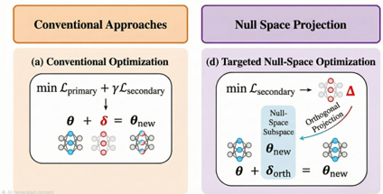

> [!abstract] arXiv · 2026 · Preprint
> **Ayush Pratap Singh et al.** (TU Darmstadt / UMD / Smallest AI) · [→ Paper](https://arxiv.org/abs/2601.17086) · Demo: ? · Code: ?
>
> Introduces SonoEdit, a one-shot, closed-form model-editing technique that corrects pronunciation errors in pretrained LLM-based TTS systems by computing a weight update mathematically constrained to the null space of general speech behavior, requiring no retraining and provably leaving the rest of the model's output unchanged.

## Problem

LLM-based codec-token TTS systems (VALL-E-style, Orpheus, and similar) systematically mispronounce proper nouns and words underrepresented in their predominantly English training data, particularly non-English names, brands, and place names. Existing fixes are all costly or fragile: phoneme dictionaries require manual annotation and don't generalize to morphological variants; global fine-tuning risks catastrophic forgetting, where correcting one pronunciation can degrade prosody or speaker identity elsewhere; and parameter-efficient fine-tuning (LoRA and similar) still requires task-specific training data and offers no explicit guarantee that a correction stays isolated from the rest of the model's behavior. The paper asks specifically where pronunciation "lives" inside an LLM-based TTS model and whether it can be surgically modified for individual words while leaving everything else provably untouched.

## Method

SonoEdit combines three ideas: precise localization, parameter parsimony, and null-space-constrained editing. It targets LLM-based TTS architectures (demonstrated on Orpheus-TTS, a LLaMA-3.2-3B-backed model) in which the LLM autoregressively predicts a flattened sequence of hierarchical SNAC codec tokens per audio frame: one coarse token carrying the primary phonological content, and six finer tokens carrying pitch, voicing, and spectral detail. Because pronunciation errors originate in the LLM's coarse-token planning rather than in the acoustic decoder, the method restricts its analysis and edits entirely to the coarse-token subspace.

To locate where pronunciation is represented, the paper adapts causal tracing (a mechanistic-interpretability technique) to this coarse-token setting: it corrupts the input representation with noise, then selectively restores individual layers' clean activations and measures the resulting recovery in probability of the correct coarse token, an "Acoustic Causal Impact" score per layer. This localizes pronunciation-relevant computation to a narrow, contiguous band of mid-to-late Transformer layers (empirically layers 15-21 of 28 in Orpheus-TTS), confirmed by two independent signals (linear-probe phoneme-classification accuracy and gradient-norm sensitivity) that peak in the same layer range.

The core editing mechanism adapts knowledge-editing techniques from the LLM factual-correction literature (ROME, AlphaEdit) to this TTS setting. The method first characterizes the subspace representing "general speech behavior" by collecting hidden-state keys from the coarse-token prediction step across a diverse reference corpus (LibriTTS) and computing their covariance matrix; an SVD of this covariance yields the dominant "speech manifold" directions, and the orthogonal complement of that manifold is the null space. A weight update is then computed in closed form (following the AlphaEdit estimator) that drives the model's output toward a target pronunciation exemplar for a specific word while being constrained to lie entirely within this null space, which mathematically guarantees near-zero first-order effect on any input whose hidden representation lies in the preserved speech manifold. The update is applied only to the value-projection or feed-forward weight matrices of the localized layers. The entire procedure requires only two forward passes to extract keys/values, a one-time precomputed SVD-based projection matrix, and an O(d²) rank-one weight update — no gradient descent, no additional parameters, and no iterative training loop.

## Key Results

To evaluate the method, the authors construct HardNoun-300: 300 proper nouns across six languages (English, Spanish, French, German, Japanese, Hindi), each embedded in 10 contextually varied sentences, yielding 3,000 test utterances, selected specifically because the baseline Orpheus model mispronounces them with over 80% error. Layer-sensitivity analysis confirms layers 15-21 as the causally responsible range, achieving the lowest Target-WER (2.8%) of any tested layer band. On the main comparison (Table 2), SonoEdit reduces Target-WER from 86.4% (original model) to 2.8%, while Global-WER on a held-out preservation set moves only from 3.12% to 3.15% and speaker similarity (WavLM cosine SIM) remains at 0.99 — versus full fine-tuning (Target-WER 2.1%, but Global-WER balloons to 18.45%, SIM drops to 0.82), LoRA (Target-WER 4.5%, Global-WER 5.12%, SIM 0.91), and ROME's unconstrained rank-one edits (Target-WER 8.2%, Global-WER 12.30%, SIM 0.76). Human raters judged 91% of edited pronunciations correct (up from 42% at baseline), with 88% accuracy on out-of-distribution contexts not seen during editing, and mel-spectrogram distance to reference pronunciations dropped 68-69%. A stability analysis on the preservation set shows only marginal drift after editing (WER +0.1%, F0 RMSE +0.3 Hz, MOS -0.01). An ablation removing the null-space constraint (using an otherwise identical update) shows the constraint is load-bearing rather than cosmetic: Global-WER rises from 3.15% to 9.84% and SIM falls from 0.99 to 0.87, even though Target-WER improves marginally. Editing cost is comparable to ROME (seconds) versus minutes for LoRA and hours for full fine-tuning, with zero additional parameters.

## Novelty Assessment

The paper is the first, by its own account, to apply null-space-constrained knowledge editing to neural TTS. The individual pieces (causal tracing for localization, null-space-constrained rank-one weight updates via the AlphaEdit estimator) are adapted directly from the LLM knowledge-editing literature rather than newly invented, but the cross-domain adaptation to codec-token TTS, and specifically the choice to restrict both localization and editing to the coarse phonological token subspace of a hierarchical audio codec, is a genuine methodological contribution with a clear mechanism and a controlled ablation isolating its necessity. The HardNoun-300 benchmark is a reusable evaluation artifact that fills a gap (systematic, multilingual, high-error-rate proper-noun mispronunciation) not covered by standard TTS evaluation sets.

## Field Significance

> [!tip] high — SonoEdit demonstrates that a class of technique proven for correcting isolated factual errors in text-only LLMs (localized, null-space-constrained, training-free weight edits) transfers effectively to correcting isolated pronunciation errors in LLM-based speech generation, offering a training-free alternative to fine-tuning for narrow post-deployment corrections, with a concrete ablation showing the orthogonality constraint is what prevents collateral damage rather than the localization step alone.

## Claims

- **supports:** Post-hoc, closed-form weight edits constrained to the null space of a model's general-behavior representation subspace can correct a narrow, targeted failure mode while leaving unrelated model behavior essentially unchanged, avoiding the correction-versus-preservation trade-off inherent to full fine-tuning and standard parameter-efficient fine-tuning.
  > *Evidence:* SonoEdit reduces Target-WER from 86.4% to 2.8% while Global-WER on a preservation set rises only from 3.12% to 3.15% and speaker similarity stays at 0.99, versus full fine-tuning (Global-WER 18.45%, SIM 0.82) and LoRA (Global-WER 5.12%, SIM 0.91) on the same edits. *(§4.3, Table 2)*
- **supports:** In an LLM-based codec-token TTS system, pronunciation-relevant computation is causally concentrated in a narrow, identifiable band of mid-to-late Transformer layers rather than distributed uniformly across the network.
  > *Evidence:* Three independent localization signals (causal-mediation Indirect Effect, linear-probe phoneme-classification accuracy, and gradient-norm attribution) converge on layers 15-21 of the 28-layer LLaMA-3.2-3B backbone in Orpheus-TTS, and editing exactly this range yields the lowest Target-WER (2.8%) of any layer band tested. *(§4.2, Table 1)*
- **supports:** Constraining a weight-editing update to be mathematically orthogonal to a general-behavior subspace is necessary, not merely helpful, for preventing collateral degradation of unrelated model behavior when correcting a narrow target error.
  > *Evidence:* Removing only the null-space constraint from an otherwise identical editing procedure degrades Global-WER from 3.15% to 9.84% and speaker similarity from 0.99 to 0.87, even though Target-WER improves marginally (2.8% → 2.5%), showing the constraint drives preservation rather than accuracy. *(§4.4, Table 5)*
- **supports:** Knowledge-editing techniques originally developed for correcting factual associations in text-only large language models transfer to correcting pronunciation associations in LLM-based speech generation systems.
  > *Evidence:* Adapting the AlphaEdit null-space-constrained closed-form estimator to Orpheus-TTS's coarse SNAC tokens achieves a 91% human-rated pronunciation-correctness rate (up from 42% baseline) on a held-out multilingual proper-noun benchmark, while ROME's unconstrained rank-one edits distort speaker identity (SIM 0.76). *(§4.3, Tables 2-3)*
- **complicates:** One-shot editing methods that depend on a null space precomputed offline from a fixed reference speech corpus have untested robustness to deployment-time distribution shift and untested scalability when many edits must be applied cumulatively to the same model.
  > *Evidence:* The authors identify both as open limitations without empirical evaluation: shifts in the deployment speech distribution could weaken the null-space orthogonality guarantee, and cumulative edits across many target words might progressively saturate the null space. *(§5)*

## Limitations and Open Questions

> [!warning] SonoEdit corrects isolated, per-word pronunciation errors and is explicitly not suited to correcting global systematic errors such as accent bias, since each edit targets a single localized weight update rather than a distributional shift in the model's output; the paper does not evaluate how many simultaneous word-level edits the null-space constraint can absorb before interference emerges.

The causal-tracing analysis and editing are restricted to coarse phonological tokens; the paper notes this could miss sub-phonemic errors encoded in the finer acoustic token levels of the SNAC hierarchy. The null space is computed once, offline, from LibriTTS; the authors flag that a deployment distribution meaningfully different from this reference corpus could weaken the orthogonality guarantee, though this is not tested empirically. Evaluation is limited to two LLM-based TTS backbones (Orpheus-TTS, Sesame-TTS) and does not include non-codec-token TTS architectures.

## Wiki Connections

- [[autoregressive-codec-tts|Autoregressive Codec TTS]] — targets and edits an autoregressive, hierarchical-codec-token TTS system (Orpheus-TTS), restricting both localization and editing to the coarse token stream that carries phonological content.
- [[neural-codec|Neural Audio Codec]] — the method's editing target is defined in terms of the SNAC codec's coarse-versus-fine token hierarchy, which determines which token stream carries pronunciation information.
- [[disentanglement|Disentanglement]] — explicitly separates a "pronunciation correction" direction from a "general speech behavior" subspace via null-space projection, with an ablation (Table 5) showing this separation is necessary for preserving unrelated behavior.
- [[subjective-evaluation|Subjective Evaluation]] — reports a human pronunciation-rating study (three raters, 1-5 scale) showing correctness rising from 42% to 91% after editing.
- [[2301.02111|VALL-E]] — cited as an example of codec-based LLM TTS that learns implicit pronunciation mappings and struggles with rare words, motivating the need for post-hoc correction.
- [[2210.13438|EnCodec]] — cited as one of the neural audio codecs (alongside SoundStream) that LLM-based TTS systems use to discretize audio into tokens.
- [[1904.02882|LibriTTS]] — used to estimate the covariance matrix defining the "general speech" manifold whose orthogonal complement forms the editing null space.
- [[2407.21783|Llama 3 Herd of Models]] — provides the LLaMA-3.2-3B backbone underlying Orpheus-TTS, the primary system SonoEdit is evaluated on.
- [[2305.09636|SoundStorm]] — cited as prior LLM-based TTS work improving generation efficiency via parallel decoding.
- [[2304.09116|NaturalSpeech 2]] — cited as prior LLM-adjacent TTS work achieving human-parity naturalness via latent diffusion.
- [[2204.02152|UTMOS]] — used as the automatic MOS predictor for perceptual quality throughout the evaluation.
