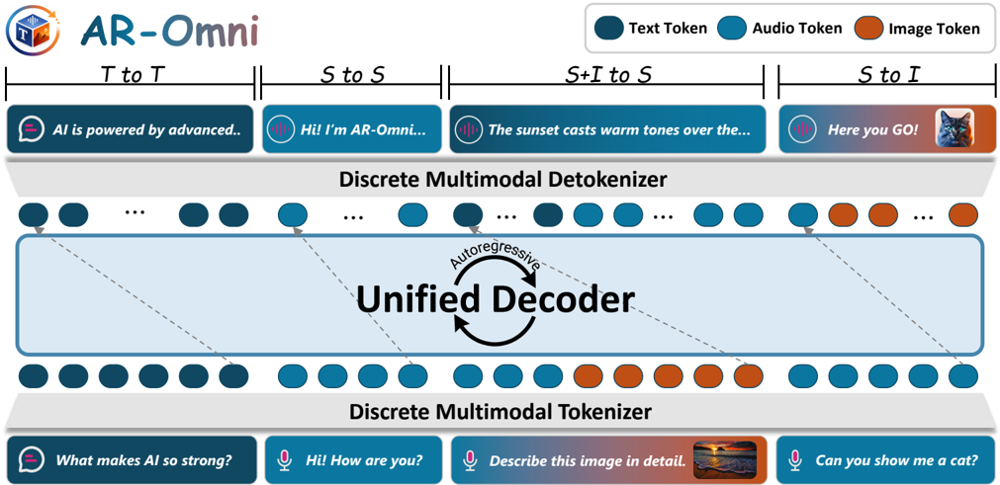

> [!abstract] arXiv · 2026 · Preprint
> **Dongjie Cheng et al.** (The Hong Kong Polytechnic University / University of Science and Technology of China / Harbin Institute of Technology (Shenzhen)) · [→ Paper](https://arxiv.org/abs/2601.17761) · Demo: ? · Code: ?
>
> Presents AR-Omni, a single 7B-parameter autoregressive Transformer decoder that generates text, images, and streaming speech from a joint discrete vocabulary with no external diffusion or non-AR expert decoders, achieving real-time (RTF 0.88) zero-shot TTS via a single-codebook speech tokenizer.

## Problem

Omni multimodal large language models (MLLMs) that both perceive and generate across text, vision, and speech have emerged rapidly, but most still rely on external expert components, diffusion-style image decoders or non-autoregressive speech generators, bolted onto an LLM backbone, so the actual multimodal generation work is still delegated to separate specialist models rather than handled natively by the unified system. This undermines the simplicity that made autoregressive next-token prediction attractive for text in the first place: a single token stream, a single objective, a single decoder. The paper asks whether an omni model can be built with the same AR purity across all three modalities, including speech generation with the low-latency streaming behavior real-time voice interaction requires, and identifies three practical obstacles to doing so: heterogeneous token budgets across modalities skewing training, degraded visual fidelity from token-exact autoregressive image supervision, and the fact that different tasks (ASR/TTS vs. open-ended generation) want different decoding strategies.

## Method

AR-Omni maps text, image, and speech into a single joint discrete vocabulary V = V_text ∪ V_speech ∪ V_image and generates all modalities autoregressively from one Transformer decoder (initialized from Anole, a 7B interleaved image-text AR model) via standard next-token prediction over this shared vocabulary. Text uses the Chameleon SentencePiece BPE tokenizer. Speech uses a purely acoustic, single-codebook tokenizer (WavTokenizer) rather than the dual-codebook (semantic-plus-acoustic) tokenizers common in prior speech-LLM work; this removes the "complete-then-decode" bottleneck of semantic-to-acoustic pipelines, since decoding can begin as soon as a small number of unified tokens are available, enabling low-latency streamed audio output. Images use a scene-aware VQ tokenizer producing a causal 1D sequence of visual codes, avoiding an external diffusion decoder. Modality boundaries within the interleaved token stream are marked by special tokens (`<boa>`/`<eoa>` for speech, `<boi>`/`<eoi>` for image, plus turn/conversation markers), with text serving as the semantic bridge across modality transitions.

Three training-time interventions address the paper's identified obstacles. First, a Weighted Next-Token-Prediction (Weighted NTP) loss assigns larger per-token weights to response text tokens on X2T tasks (ASR, captioning), counteracting the tendency for modalities with longer token sequences (e.g., speech) to dominate the gradient signal purely by token count. Second, a lightweight token-level perceptual loss aligns the model's last-layer hidden states to a frozen, pretrained embedding space of target image codes via an L2 objective, giving the model a smoother notion of similarity between visual tokens than one-hot cross-entropy provides (which treats all non-target codes as equally wrong regardless of semantic proximity). Third, residual-post-norm (swin-norm), applying normalization on the residual branch rather than the standard pre/post-norm placements, stabilizes optimization over long interleaved multimodal sequences. At inference, a finite-state decoding mechanism switches decoding strategy by task: greedy decoding for deterministic tasks (ASR, TTS) and sampling for open-ended generation (text-to-image). Training proceeds in two stages: pretraining on the composite Weighted-NTP-plus-perceptual-loss objective over large-scale text/image-text/speech-text corpora, followed by fine-tuning on omni-interleaved instruction data (built on AnyInstruct, augmented with DEMAND environmental noise and VoiceAssistant-400K, with assistant speech re-synthesized via CosyVoice2 using timbre extracted from the pretrained model itself, to reduce the train/test acoustic distribution gap).

## Key Results

On speech tasks, AR-Omni reaches 9.4% WER on LibriSpeech test-clean ASR (using only 40 input tokens/second, versus 50-200 tok/s for dual-codebook any-to-any baselines AnyGPT and MiO) and 6.5% WER on zero-shot TTS (VCTK), matching the best token-based TTS baseline (USLM, also 6.5%) while achieving substantially better streaming characteristics: 146ms first-token latency and a 0.88 real-time factor (RTF<1, i.e., faster than real-time), versus USLM's 11.6-second latency, AnyGPT's 6.6-second latency and RTF 2.92 (not real-time), and MiO's 29-second latency and RTF 48.9. On image tasks, AR-Omni outperforms its Anole initialization on zero-shot image captioning (CIDEr 56.53 vs. Anole's 15.07), suggesting any-to-any training strengthens rather than degrades captioning, while incurring only a slight text-to-image quality drop relative to Anole; diffusion-based any-to-any systems (AnyGPT, MiO) still score higher on text-to-image CLIP score, reflecting the general quality advantage of diffusion decoders over pure autoregressive image token prediction. Component ablations (at 40k training steps) show each stabilization technique is individually load-bearing but with modality-specific and sometimes divergent effects: removing the perceptual loss degrades TTS and slightly reduces image tasks but improves ASR; removing swin-norm substantially worsens TTS while improving I2T and ASR; and removing all three components together ("Simple NTP") sharply degrades both ASR and TTS and induces visible training instability (loss rebounds and late-stage spikes) over a longer training horizon, whereas the full AR-Omni objective maintains a smooth, convergent loss trajectory throughout training.

## Novelty Assessment

The core novelty is architectural purity: unlike prior any-to-any systems (AnyGPT, MiO, NExT-GPT) that still delegate image or speech generation to external diffusion or non-AR expert decoders, AR-Omni performs all three modalities' generation, including streaming speech, from a single autoregressive Transformer with no external generation modules, achieved specifically by adopting a single-codebook acoustic speech tokenizer (WavTokenizer) rather than the dual-codebook semantic/acoustic split used by most prior speech-LLM and any-to-any systems. The composite training objective (weighted NTP, perceptual loss, swin-norm) and finite-state task-aware decoding are targeted, individually-ablated engineering solutions to the specific problems unified AR training introduces, rather than a single novel mechanism; their value is demonstrated concretely through the "Simple NTP" ablation showing genuine training collapse without them, not merely asserted. The result is a genuine empirical existence proof that AR purity and real-time streaming speech generation are jointly achievable, at some remaining cost in image-generation quality relative to diffusion-based competitors, which the authors acknowledge directly.

## Field Significance

> [!tip] high — this paper provides a concrete empirical demonstration that a single autoregressive decoder, without any external diffusion or non-AR expert component, can support real-time streaming speech generation matching the intelligibility of prior any-to-any systems while achieving dramatically lower latency, specifically by adopting a single-codebook acoustic tokenizer over the dual-codebook semantic/acoustic designs that have dominated recent speech-LLM and any-to-any multimodal work, with individually ablated evidence for why each stabilization component (weighted loss, perceptual alignment, residual-post-norm) is necessary rather than merely additive.

## Claims

- **supports:** A single autoregressive Transformer decoder operating over one joint discrete vocabulary spanning text, image, and speech tokens, with no external diffusion or non-AR expert decoder, can achieve real-time, low-latency streaming speech generation while matching the intelligibility of prior any-to-any systems that rely on dual-codebook tokenizers or heavier generation pipelines.
  > *Evidence:* AR-Omni reaches 146ms first-token latency and 0.88 real-time factor with 6.5% zero-shot TTS WER on VCTK, matching the best token-based baseline's WER while using far fewer speech tokens per second and orders-of-magnitude lower latency than AnyGPT (6.6s) and MiO (29s). *(§4.3, §5.2, Table 6)*
- **supports:** A purely acoustic, single-codebook speech tokenizer can serve as an effective unified interface for both speech understanding and streaming speech generation within an autoregressive multimodal model, without the traditional dual-codebook semantic-then-acoustic modeling pipeline.
  > *Evidence:* Using a single-codebook tokenizer at 40 tokens/second for speech input, AR-Omni achieves ASR WER comparable to any-to-any baselines using dual-codebook tokenizers at higher token rates (50-200 tok/s), while enabling low-latency streamed decoding that dual-codebook designs cannot support until aligned tokens from both codebooks become available. *(§5.2, Tables 5-6)*
- **complicates:** Combining task-aware loss reweighting, a perceptual alignment loss, and residual-post-norm stabilization is specifically necessary, not merely incrementally helpful, to prevent late-stage training collapse in unified multimodal autoregressive training, which a plain next-token-prediction objective does not avoid.
  > *Evidence:* Removing all three components ("Simple NTP") sharply increases ASR and TTS error and exhibits training instability with loss rebounds and abrupt late-stage spikes over an extended training horizon, while the full composite objective maintains a smooth, convergent loss trajectory across the same horizon. *(§6.2, Table 7, Figure 3)*
- **complicates:** Normalization choices tuned for training stability in a unified multimodal model can have divergent, even opposing, effects across different output modalities, so a single stabilization technique cannot be assumed to benefit all modalities uniformly.
  > *Evidence:* Removing residual-post-norm (swin-norm) improves image captioning and ASR accuracy but substantially worsens TTS quality in a component ablation at 40k training steps, indicating the technique is specifically load-bearing for speech synthesis rather than uniformly beneficial. *(§6.2, Table 7)*

## Limitations and Open Questions

The authors' own stated limitation is that diffusion-free autoregressive image generation still lags behind diffusion-based systems in image quality, with future work targeted at closing this gap while preserving AR purity. More broadly, unifying three modalities in one decoder does not yet match the best single-task specialists on every axis: AR-Omni's 9.4% ASR WER trails dedicated ASR systems (Whisper Large V2, wav2vec 2.0: both 2.7%) by a wide margin, indicating the unification trades some single-task accuracy for architectural simplicity and cross-modal capability. The perceptual loss and swin-norm ablations were conducted only at 40k pretraining steps (an intermediate checkpoint), so whether their modality-specific trade-offs persist, narrow, or widen at full convergence is not directly reported.

## Wiki Connections

- [[spoken-language-model|Spoken Language Model]] — extends a pretrained autoregressive Transformer backbone to consume and generate external speech tokens (alongside text and image) within a single joint-vocabulary next-token-prediction framework.
- [[streaming-tts|Streaming TTS]] — targets low first-token latency (146ms) and faster-than-real-time synthesis (RTF 0.88) via a single-codebook tokenizer that removes the semantic-to-acoustic "complete-then-decode" bottleneck.
- [[neural-codec|Neural Audio Codec]] — adopts a purely acoustic, single-codebook speech tokenizer (WavTokenizer) instead of the dual-codebook semantic/acoustic split used by most prior speech-LLM systems.
- [[zero-shot-tts|Zero-Shot TTS]] — evaluates zero-shot text-to-speech synthesis on the VCTK multi-speaker corpus, conditioning generation on text prompts without target-speaker-specific training.
- [[speech-to-speech|Speech-to-Speech]] — supports multi-turn spoken dialogue (speech-in, speech-out) as one of its case-study capabilities, maintaining conversational context across turns within the unified token stream.
- [[2408.16532|WavTokenizer]] — supplies the single-codebook acoustic speech tokenizer that is central to AR-Omni's diffusion-free, streaming speech generation design.
- [[2412.10117|CosyVoice 2]] — used to synthesize assistant speech replies for the omni-interleaved instruction-tuning data, conditioned on timbre extracted from the pretrained model to reduce train/test acoustic distribution gap.
- [[2301.02111|VALL-E]] — cited as a neural codec language model baseline for zero-shot TTS, compared directly on the VCTK evaluation (Table 6).
- [[2305.11000|SpeechGPT]] — cited as an early system discretizing speech to enable direct speech understanding and generation within an LLM, a precedent this paper's unified formulation builds on.
- [[2308.16692|SpeechTokenizer]] — representative of the dual-codebook (semantic-plus-acoustic) speech tokenization approach that AR-Omni's single-codebook design is positioned against.
- [[2209.03143|AudioLM]] — cited as an early language-modeling approach to audio generation, part of the lineage of discrete-token autoregressive speech generation this paper extends.
- [[2408.16725|Mini-Omni]] — cited as a related streaming speech-capable language model, part of the broader landscape of real-time speech-generating LLMs this paper compares against.
- [[2212.04356|Whisper]] — used as the transcriber model (Whisper-Large-V2) to compute WER for the zero-shot TTS evaluation, and cited as a specialized ASR baseline AR-Omni is compared against.
