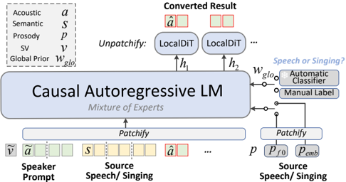
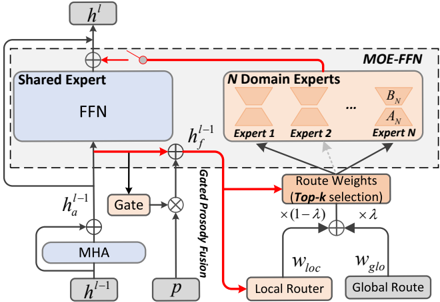

> [!abstract] arXiv · 2026 · Preprint
> **Zhichao Wang et al.** (China Mobile (JIUTIAN Research)) · [→ Paper](https://arxiv.org/abs/2601.18094) · Demo: ✓ · Code: ✓
>
> Introduces OneVoice, a single zero-shot voice conversion model that unifies linguistic-preserving (LVC), expressive (EVC), and singing (SVC) conversion scenarios via a Mixture-of-Experts backbone with explicit shared/domain expert specialization, dual-path routing, and gated scenario-specific prosodic conditioning.

## Problem

Voice conversion research has fragmented into specialized models for distinct scenarios: linguistic-preserving VC (LVC), which disentangles speaker timbre from content for high speaker similarity and intelligibility; expressive VC (EVC), which additionally transfers para-linguistic prosody and emotion; and singing VC (SVC), which must adhere to a melodic contour. Prior attempts at unification select shared features across scenarios but overlook intrinsic differences between them, causing inter-scenario interference and performance degradation. A unified model must simultaneously handle three challenges: modeling what is genuinely shared (linguistic content, speaker timbre) versus scenario-specific (para-linguistic prosody vs. precise melodic contour, which follow different acoustic distributions); learning from severely imbalanced data (speech corpora span hundreds of thousands of hours, singing corpora only hundreds); and maintaining generation efficiency despite VC's inherently long sequences (source and target utterances share duration), without sacrificing fidelity.

## Method

OneVoice is a continuous-feature language model with a Mixture-of-Experts (MoE) backbone and a diffusion-based decoding head, avoiding both discrete audio tokenization and a separate VAE. Speech/singing input is represented as semantic features (from an ASR encoder) and acoustic features (mel-spectrogram), plus scenario-specific prosodic features (shallow ASR bottleneck features for EVC, discretized F0 for SVC), all patchified to a 10Hz sequence (patch ratio 5) before being consumed by a 6-block causal Transformer LM. Given a target-speaker prompt, the model can select MoE experts based on an automatic classifier or manual scenario label, converting semantic features and prosody into a mel-spectrogram (EVC/SVC modes), or discard domain experts and prosody entirely to fall back to plain content-and-timbre conversion (LVC mode). A LocalDiT head (a bidirectional local Transformer diffusion module, following DiTAR) then iteratively reconstructs the mel-spectrogram for each patch, trained with a conditional flow-matching objective under an optimal-transport displacement map; a BigVGAN vocoder converts the final mel-spectrogram to waveform.

The core unification mechanism is a conditional MoE with explicit shared-domain expert specialization: each MoE-FFN layer contains one fixed shared expert (capturing content preservation and speaker cloning common to all scenarios) and several domain experts implemented via LoRA (capturing scenario-specific expressivity). A dual-path routing mechanism steers expert selection: shared-expert isolation guarantees the shared expert always processes every input regardless of routing decisions, while scenario-aware domain-expert assignment combines a global routing signal (a patch-level scenario prior, speech vs. singing, provided manually or predicted automatically) with a local routing signal computed from the current hidden state fused with scenario-specific prosody. The two signals are linearly combined and top-K domain experts are activated per patch. Scenario-specific prosodic features are integrated via a gated fusion mechanism at each LM block: a per-layer sigmoid gate learns how much of the patchified prosodic signal to add to the hidden state at that layer, rather than using fixed addition or concatenation, and the same prosody-augmented hidden state feeds the local router. Training follows a two-stage progressive paradigm: foundational pretraining on the shared-expert LVC pathway using a large speech corpus (Emilia, 100,000 hours), followed by scenario-aware enhancement that continues training the LoRA-based domain experts (higher learning rate) and lightly fine-tunes the pretrained backbone (much lower learning rate) on speech and singing data sampled in equal ratio per batch to counteract the ~250x data-scale imbalance between the two domains.

## Key Results

Against specialized baselines, OneVoice matches or exceeds task-specific models across all three scenarios while operating as a single model. In LVC mode, it beats SeedVC and Metis-VC on Content Enjoyment (A-CE 5.11) and CER (0.88) while reaching speaker similarity (SSIM 0.729) close to SeedVC's 0.733. In EVC mode, it outperforms Vevo and REF-VC on most metrics, though REF-VC achieves higher prosody-consistency scores (PSIM, CMOS_p) at the cost of lower speaker similarity, a trade-off the authors attribute to REF-VC's speaker-identity leakage under highly expressive source speech; OneVoice's switchable LVC/EVC modes let a user choose which side of this speaker-similarity/prosody-transfer trade-off to prioritize. In SVC mode, OneVoice exceeds YINGSVC and SeedVC-Sing on conversion quality and expression (A-CE 6.15) while maintaining competitive speaker similarity (SSIM 0.738), despite singing training data (~400 hours) being roughly 250x smaller than the speech training data (100,000 hours). A component analysis confirms each design choice is load-bearing: removing the gated prosody fusion (direct per-layer injection instead) degrades CER and SSIM across EVC/SVC; removing either the global (scenario-prior) or local (dynamic) routing signal degrades prosody-consistency metrics; and increasing the LM's patch ratio from 5 to 10 (a more aggressive 5Hz sequence rate) causes rapid degradation across CER, F0 correlation, and PSIM, consistent with a similar finding reported for DiTAR. Substituting the flow-matching decoding objective with MeanFlow for faster sampling (2 diffusion steps instead of 8) trades a modest quality drop for substantially faster inference, reaching an RTF of 0.37 on a single A100 GPU (vs. 0.68 for the 8-step flow-matching version).

## Novelty Assessment

The architectural contribution is genuine and specific: rather than merely selecting a feature representation broad enough to span LVC/EVC/SVC (the approach the paper critiques in prior unified systems), OneVoice explicitly models what is shared versus scenario-specific at the parameter level, via a shared-vs-domain MoE expert split with dual-path (global scenario-prior + local dynamic) routing, combined with a per-layer gated prosody-fusion mechanism tailored to each scenario's distinct prosodic signal (ASR bottleneck features for EVC vs. discrete F0 for SVC). The VAE-free next-patch diffusion backbone and LocalDiT head are adopted directly from DiTAR rather than newly proposed, and the flow-matching/MeanFlow decoding choices are likewise established techniques. The two-stage progressive training with LoRA-based domain experts is a practical, well-motivated response to the field's genuine speech/singing data-scale imbalance, backed by a direct ablation (frozen vs. fine-tuned backbone) isolating its effect.

## Field Significance

> [!tip] high — this paper demonstrates that a single model, via explicit shared/specialized parameter separation rather than a common feature representation alone, can match or exceed scenario-specific state-of-the-art voice conversion models across three previously fragmented sub-fields (linguistic-preserving, expressive, and singing conversion), with a thorough component-level ablation isolating which design choices (gated fusion, dual-path routing, progressive LoRA training) are actually responsible for the unification succeeding rather than degrading performance through inter-scenario interference.

## Claims

- **supports:** A single voice-conversion model can jointly handle linguistic-preserving, expressive, and singing conversion scenarios without dedicated per-scenario architectures, matching or exceeding specialized scenario-specific models.
  > *Evidence:* OneVoice's LVC/EVC/SVC modes match or exceed dedicated baselines (SeedVC, Metis-VC for LVC; Vevo, REF-VC for EVC; SeedVC-Sing, YINGSVC for SVC) on the majority of objective and subjective metrics reported. *(§4.2, Tables 1, 2, 4)*
- **supports:** Explicitly separating shared conversion knowledge from scenario-specific expressivity via dedicated shared-versus-domain expert specialization in a Mixture-of-Experts layer, combined with global scenario-prior and local dynamic-context routing signals, improves conversion quality over a single undifferentiated expert pool or a single routing signal alone.
  > *Evidence:* Ablating either the global routing prior or the local dynamic router independently degrades EVC/SVC prosody-consistency metrics (F0 correlation, PSIM) relative to the full dual-path routing design. *(§4.3, Table 3)*
- **complicates:** Injecting scenario-specific prosodic conditioning directly and unregulated into every layer of a language-model backbone degrades conversion quality rather than improving it, compared to an adaptively gated fusion mechanism.
  > *Evidence:* Removing the gating units (unregulated per-layer prosody injection) increases CER and reduces SSIM/F0-correlation/PSIM across EVC and SVC relative to the gated-fusion design; restricting fusion to a single layer instead of every layer similarly degrades results. *(§4.3, Table 3)*
- **supports:** A two-stage training paradigm that first establishes a shared foundation on abundant speech data, then fine-tunes lightweight domain-specific (LoRA) experts on scarce scenario data with balanced per-batch sampling, can close most of the performance gap against models trained on proportionally matched, task-specific data.
  > *Evidence:* OneVoice is pretrained on ~100,000 hours of speech but only ~400 hours of singing data (roughly 250x imbalance), yet reaches SVC quality (A-CE 6.15) exceeding specialized singing-voice-conversion baselines (YINGSVC 5.96, SeedVC-Sing 5.79) trained specifically for that task. *(§4.1 Corpus; §4.2, Table 4)*
- **complicates:** ASR-derived linguistic features, conventionally assumed to discard non-linguistic acoustic information because they are trained under text-based supervision, can retain enough residual signal at sufficient training scale to reproduce non-verbal vocalizations during content-preserving conversion.
  > *Evidence:* OneVoice's LVC mode, conditioned only on ASR-based semantic features without additional prosody conditioning, is observed to successfully convert non-verbal sounds such as laughter and coughs, which the authors note challenges the standard assumption that ASR-driven, text-loss-trained features discard such non-linguistic information. *(§4.2, EVC Evaluation discussion)*

## Limitations and Open Questions

> [!warning] OneVoice's current architecture is explicitly non-streaming, which the authors identify as restricting its use in real-time applications; the paper defers streaming support (via interleaved sequence modeling) to future work rather than addressing it here.

The authors note that conversion results still have some mismatch with subjective human preferences despite strong objective/subjective metric performance, and suggest future work could build preference data for preference optimization to close this remaining gap. The scenario-aware enhancement stage's balanced per-batch speech/singing sampling and domain-expert dropout (0.3 probability) are effective mitigations for data imbalance in this paper's specific training setup, but their generalization to more extreme imbalance ratios or additional scenarios beyond the three studied here is untested.

## Wiki Connections

- [[voice-conversion|Voice Conversion]] — unifies linguistic-preserving, expressive, and singing voice conversion within a single zero-shot model via explicit shared/scenario-specific parameter specialization.
- [[singing|Singing]] — one of the three unified scenarios (SVC), using discretized F0 as the scenario-specific prosodic condition and adaptive pitch-shifting at inference.
- [[prosody-control|Prosody Control]] — introduces a gated, per-layer fusion mechanism that adaptively regulates how much scenario-specific prosody (ASR bottleneck features or discrete F0) influences generation at each layer.
- [[flow-matching|Flow Matching]] — the LocalDiT decoding head is trained with a conditional flow-matching objective under an optimal-transport displacement map, with an alternative MeanFlow variant for faster sampling.
- [[emotion-synthesis|Emotion Synthesis]] — the expressive VC (EVC) scenario transfers para-linguistic prosody and emotional expressivity from source speech while preserving target speaker identity.
- [[2502.03930|DiTAR]] — OneVoice's VAE-free next-patch diffusion paradigm and LocalDiT head directly follow DiTAR's design, including the patch ratio degradation phenomenon reproduced in this paper's ablations.
- [[2502.07243|Vevo]] — used as a direct baseline for expressive voice conversion (EVC), compared on speaker similarity and prosody-consistency metrics.
- [[2508.04996|REF-VC]] — used as a direct baseline for expressive voice conversion (EVC), notable for higher prosody consistency but lower speaker similarity due to speaker-identity leakage.
- [[2508.16332|Vevo2]] — cited as a prior attempt at a unified speech/singing generation framework, whose feature-selection-only approach to unification this paper's MoE-based design is positioned against.
- [[neurips-2025-RTjr4DnS79|Metis]] — Metis-VC is used as a direct baseline for linguistic-preserving voice conversion (LVC).
- [[2210.02747|Flow Matching for Generative Modeling]] — provides the flow-matching training objective and optimal-transport formulation used to train the LocalDiT decoding head.
- [[2407.05361|Emilia]] — supplies the 100,000-hour speech corpus used for foundational pretraining.
- [[2206.04658|BigVGAN]] — used as the vocoder to reconstruct waveforms from OneVoice's predicted mel-spectrograms.
