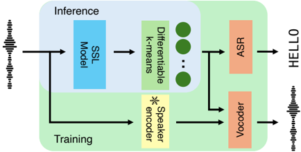

> [!abstract] arXiv · 2026 · Preprint
> **Kentaro Onda et al.** (The University of Tokyo / Sony Group Corporation / Carnegie Mellon University) · [→ Paper](https://arxiv.org/abs/2601.19781) · Demo: ✓ · Code: ?
>
> Introduces the Phonological Tokenizer, a single-codebook speech token that occupies an intermediate space between conventional acoustic and phonetic tokens by fine-tuning SSL-derived phonetic tokens through differentiable k-means under a joint ASR-and-resynthesis multi-task objective, retaining linguistic content and prosody while discarding speaker identity.

## Problem

Discrete speech tokens used as pseudo-text for speech language models (speechLMs) and as intermediate representations for ASR/TTS fall into two categories, each an imperfect match for prosody-sensitive tasks. Acoustic tokens (VQ-VAE-based, trained for waveform reconstruction) retain all acoustic detail, including speaker identity and background noise. Phonetic tokens (k-means clustering over self-supervised model outputs) mainly capture linguistic content, discarding prosody along with speaker information. Human speech comprehension and production, by contrast, abstracts away unnecessary acoustic detail like voice timbre while combining prosody with linguistic content, suggesting neither extreme is the right representation for prosody-sensitive downstream tasks such as speechLMs. Prior hybrid tokens that incorporate SSL models into acoustic-token learning address this partially, but remain built on residual vector quantization (RVQ) with multiple codebooks, which requires more complex downstream architectures to manage multiple token streams and reduces the compression efficiency that is the main appeal of discrete representations in the first place.

## Method

The Phonological Tokenizer fine-tunes phonetic tokens obtained from a pretrained SSL model (WavLM-large, 21st layer) using differentiable k-means, building on the authors' prior work that optimized phonetic tokens for ASR alone. The key extension here is a multi-objective loss combining a weighted ASR loss and a weighted vocoder (speech resynthesis) reconstruction loss: L = (1−α)·L_asr + α·L_voc, where the SSL feature extractor, the differentiable k-means cluster centroids, the ASR encoder-decoder, and the vocoder are jointly optimized end-to-end, with a fixed pretrained speaker encoder providing a speaker embedding as an auxiliary conditioning input to the vocoder only (not to the token stream itself). The ASR loss pulls token properties toward pure linguistic content (as in the authors' prior phonetic-token-only work); the reconstruction loss pulls them toward retaining full acoustic detail including prosody and speaker identity; balancing the two with the weight α is intended to land the resulting tokens at an intermediate "phonological" point that keeps linguistic content and prosody while discarding speaker identity, since the speaker information is separately supplied to the vocoder via the auxiliary embedding rather than needing to be encoded in the token stream. Training proceeds in two stages, following the differentiable k-means recipe: first, the SSL model and cluster centroids are frozen while only the ASR and vocoder heads train; second, the entire module (excluding the speaker encoder) is fine-tuned end-to-end at a lower learning rate, with adversarial vocoder training (a HiFi-GAN discriminator) active throughout both stages. At inference, tokens are produced using only the fine-tuned SSL model and the learned k-means centroids; the ASR and vocoder heads are training-time-only components. The final tokenizer uses a single codebook of size 2000 at 50 tokens/second, fine-tuned with only 44 hours of additional VCTK data (with speed perturbation) on top of a 30-hour LibriSpeech-100h phonetic-token initialization, substantially less than the 960-hour LibriSpeech and 585-hour LibriTTS training sets used by the compared hybrid and acoustic baselines respectively.

## Key Results

On discriminative probing tasks, the Phonological Tokenizer (α=0.1) achieves the best emotion-recognition accuracy of all tested tokenizers (51.7%, versus 41.7% for phonetic-only WavLM tokens and 39.2%/24.2% for the SpeechTokenizer/WavTokenizer baselines), while keeping speaker-identification accuracy low (29.5%, comparable to the phonetic-token baseline's 27.7% and far below WavTokenizer's 82.7%) and ASR WER only modestly above an ASR-only-tuned variant (4.6/8.5 vs. 4.0/7.0 test-clean/other), clearly outperforming both SpeechTokenizer and WavTokenizer on ASR. On generative tasks, in-domain LJSpeech reconstruction shows only minor degradation relative to the acoustic-token baseline (WavTokenizer) despite the single-codebook design, and on out-of-domain voice conversion (converting TIMIT neutral speech and Expresso expressive speech into the LJSpeech target voice) the tokenizer achieves the best or near-best F0 correlation and UTMOS among all baselines, notably preserving the input's speaking style (including emotional expressiveness on Expresso) even though neither the tokenizer nor its vocoder was ever trained on emotional speech. As a speechLM representation, tokens trained with the slam recipe on a 6,000-hour LibriLight subset achieve the best generative perplexity and UTMOS on speech continuation among all tested tokenizers, and outperform all baselines except phonetic-only WavLM and the ASR-only variant on lexical/syntactic ZeroSpeech metrics. An ablation over the vocoder-loss weight α reveals non-monotonic, task-dependent trade-offs: ASR performance degrades monotonically as α increases while speaker-identification accuracy improves, but emotion-recognition accuracy peaks at an intermediate α=0.3 rather than at either extreme, and generative-task UTMOS is lowest at both α=0 (prosody absent) and α=1 (residual speaker leakage), directly motivating the multi-task balance rather than either single-objective extreme.

## Novelty Assessment

The contribution is a genuinely new point in the token-design space rather than an incremental variant: prior hybrid tokens that blend SSL-derived linguistic content with acoustic detail are built on multi-codebook RVQ architectures, while this work achieves a comparable "intermediate" property profile within a single codebook by fine-tuning existing phonetic tokens with a joint ASR-and-resynthesis objective via differentiable k-means, directly extending the authors' own prior ASR-only differentiable-k-means work rather than starting from a codec architecture. The explicit disentanglement result, prosody and linguistic content retained while speaker identity is suppressed, achieved by combining the two competing losses with an auxiliary speaker-conditioned vocoder input, is well-supported by a clean loss-weight ablation isolating the mechanism's effect, distinguishing this from disentanglement claims that rely only on architectural assumption. The demonstrated data efficiency (44 hours of fine-tuning data versus hundreds of hours for competing tokenizers, since the method builds on an already-pretrained large-scale SSL model) is a concrete practical advantage validated directly in Table 1's data-scale comparison, not merely an incidental byproduct.

## Field Significance

> [!tip] high — this paper demonstrates that a single-codebook discrete speech token with genuinely disentangled linguistic, prosodic, and speaker properties, previously achievable only via multi-codebook hybrid designs, can be obtained cheaply by fine-tuning existing large-scale phonetic tokens with a joint ASR-and-resynthesis objective, with consistent gains specifically on prosody-sensitive downstream tasks (emotion recognition, voice conversion, speechLM continuation quality) validated across a genuinely broad evaluation spanning discriminative, generative, and language-modeling settings.

## Claims

- **supports:** Fine-tuning phonetic (SSL-derived) discrete tokens with a joint ASR-and-resynthesis multi-task objective via differentiable k-means produces a single-codebook token representation that retains both linguistic and prosodic information while suppressing speaker identity, occupying an intermediate space between conventional phonetic and acoustic tokens.
  > *Evidence:* The multi-objective tokenizer (α=0.1) achieves the best emotion-recognition accuracy of all tested tokens (51.7%) while keeping speaker-identification accuracy low (29.5%, comparable to phonetic-token baselines) and ASR WER only slightly above ASR-only tuning (4.6/8.5 vs. 4.0/7.0). *(§4.2, Table 2)*
- **complicates:** Optimizing a discrete speech token purely for waveform reconstruction does not, by itself, guarantee that speaker identity is well disentangled from prosody, since reconstruction alone conflates all acoustic detail including speaker timbre.
  > *Evidence:* The Voc-only variant (α=1, tuned solely for resynthesis with SSL initialization and speaker-embedding conditioning) shows lower speaker-identification accuracy (49.0%) than a conventional multi-codebook acoustic-token baseline (WavTokenizer, 82.7%) but substantially higher than the proposed multi-task tokenizer (29.5%), indicating SSL initialization and speaker conditioning alone provide only partial disentanglement without the joint ASR objective. *(§4.2, Table 2)*
- **supports:** A single-codebook token representation that jointly encodes prosody and linguistic content while discarding speaker identity transfers this disentanglement to downstream generative tasks, enabling voice conversion where source speaking style is preserved while only speaker timbre changes.
  > *Evidence:* On out-of-domain voice conversion from expressive (Expresso) and neutral (TIMIT) source speech into the LJSpeech target voice, the tokenizer achieves the best or near-best F0 correlation and UTMOS among all baselines, preserving expressive speaking style even though neither the tokenizer nor its vocoder was trained on emotional speech. *(§4.3, Table 3)*
- **complicates:** Balancing a discrete token's linguistic, prosodic, and speaker-disentanglement properties via a single scalar loss-weighting hyperparameter produces non-monotonic, task-dependent trade-offs, so no single weighting value is uniformly optimal across downstream tasks.
  > *Evidence:* An ablation over the vocoder-loss weight α shows ASR performance degrades monotonically as α increases while speaker-identification accuracy improves, but emotion-recognition accuracy peaks at an intermediate value (α=0.3) rather than at either extreme, and generative-task UTMOS is lowest at both α=0 and α=1. *(§4.5, Figure 2)*
- **supports:** A versatile, prosody-aware, speaker-disentangled speech tokenizer can be obtained by fine-tuning a large pretrained self-supervised model with a modest amount of additional data, rather than requiring the large-scale training corpora used by competing hybrid or acoustic tokenizers.
  > *Evidence:* The Phonological Tokenizer is fine-tuned with only 44 hours of additional VCTK data atop a 30-hour phonetic-token initialization, versus 960 hours (LibriSpeech) for SpeechTokenizer and 585 hours (LibriTTS) for WavTokenizer, while matching or exceeding both on ASR, emotion recognition, and most generative-task metrics. *(§3.2, Table 1; §4.2-4.3)*

## Limitations and Open Questions

> [!warning] The balance between linguistic, prosodic, and speaker-disentanglement properties is fixed at training time by the single scalar weight α and cannot be adjusted at inference; the authors explicitly identify enabling inference-time controllability for flexible adjustment of token properties as future work rather than something this paper provides.

The authors also flag scaling up the (currently modest, 44-hour) fine-tuning training data as a direction for further improving performance, suggesting the reported results may not represent the method's ceiling. On the SALMon speaker-consistency metric specifically, the proposed tokenizer's speaker consistency is lower than WavTokenizer's and the Voc-only variant's, an outlier relative to the otherwise consistent low-speaker-information pattern seen in the SID and other evaluations, which the paper does not further analyze.

## Wiki Connections

- [[neural-codec|Neural Audio Codec]] — introduces a single-codebook discrete speech tokenizer occupying an intermediate design point between conventional phonetic and acoustic tokens, evaluated against both categories directly.
- [[disentanglement|Disentanglement]] — explicitly separates prosodic and linguistic content from speaker identity via a joint ASR-and-resynthesis training objective with a speaker-conditioned vocoder, validated through a targeted loss-weight ablation isolating the disentanglement mechanism.
- [[spoken-language-model|Spoken Language Model]] — evaluates the proposed tokens as the discrete input/output representation for a speechLM trained via the slam recipe, measuring lexical/syntactic knowledge and speech-continuation quality.
- [[voice-conversion|Voice Conversion]] — evaluates the tokenizer on out-of-domain voice conversion (TIMIT, Expresso into LJSpeech target voice), assessing whether speaking style is preserved while only speaker timbre changes.
- [[2308.16692|SpeechTokenizer]] — used as a direct hybrid-token baseline across all discriminative, generative, and speechLM evaluations, which the proposed single-codebook tokenizer is shown to outperform.
- [[2408.16532|WavTokenizer]] — used as a direct acoustic-token baseline across all evaluations, representing the high-fidelity-reconstruction extreme the proposed tokenizer is contrasted against.
- [[2010.05646|HiFi-GAN]] — provides the vocoder architecture (with adversarial training) used both for the tokenizer's own resynthesis loss and for the downstream unit-HiFi-GAN vocoder trained on generated tokens.
- [[2005.07143|ECAPA-TDNN]] — supplies the pretrained speaker encoder used to condition the vocoder during tokenizer training, and is also used as the downstream classifier architecture for the emotion-recognition and speaker-identification probing tasks.
- [[2204.02152|UTMOS]] — used as the automatic naturalness metric for both in-domain reconstruction and out-of-domain voice-conversion evaluation.
- [[2025.findings-acl.631|Slamming]] — supplies the speechLM training recipe used to train and evaluate a speech language model on the proposed tokens.
- [[2308.05725|Expresso]] — used as an out-of-domain expressive-speech source for the voice-conversion evaluation, testing whether the tokenizer preserves speaking style despite never being trained on emotional speech.
- [[interspeech-2025-1106|LSCodec]] — cited as related disentanglement-oriented codec work that separates global speaker information into a distinct branch, a strategy this paper positions its phonetic-token-based approach against.
