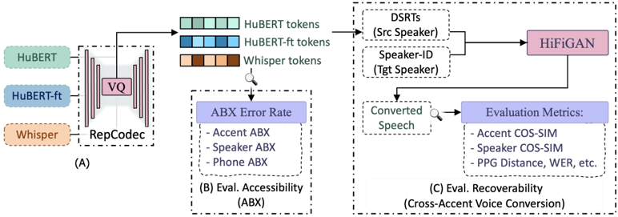

> [!abstract] arXiv · 2026 · Preprint
> **Jinzuomu Zhong et al.** (University of Edinburgh) · [→ Paper](https://arxiv.org/abs/2601.19786) · Demo: ✓ · Code: ?
>
> Presents the first systematic investigation of how accent information is encoded in Discrete Speech Representation Tokens (DSRTs), introducing a novel Accent ABX accessibility metric and a cross-accent voice-conversion recoverability framework, and uses the findings to design new content and content-accent tokens that outperform an existing published token design (Vevo) on accent-controllable voice conversion.

## Problem

Discrete speech representation tokens (DSRTs), quantised from self-supervised speech representations like HuBERT, are now foundational for speechLMs, zero-shot TTS, speech-to-speech translation, and full-duplex dialogue systems. Prior work has extensively studied how phonetic and speaker information is distributed across DSRT design choices, but accent, despite listeners demonstrably preferring accents similar to their own and zero-shot TTS systems being shown to "hallucinate" accents that don't match the reference speaker, has never been systematically measured in DSRTs. Existing published claims about how to achieve accent control, that naive codebook-size reduction naturally disentangles content from style/accent (Vevo), or that ASR-supervised "semantic tokens" support accent-consistent generation (CosyVoice), have not been independently verified, leaving it unclear whether observed accent-generation capabilities in zero-shot TTS come from the token representations themselves or are a byproduct of large-scale pretraining.

## Method

The paper introduces a unified evaluation framework assessing DSRTs along two independent axes: accessibility (how discriminable accent information is directly in the representation) and recoverability (how much accent information survives into resynthesized audio). For accessibility, the paper proposes a novel Accent ABX task, extending the standard ABX paradigm (which measures whether representations pull same-category instances closer than different-category instances): triplets (a, b, x) are constructed so that a and x share the same accent while b differs, all three instances come from different speakers (to avoid conflating accent similarity with speaker similarity), and crucially the triplets share identical lexical content rather than identical phonetic context, since accent differences arise from accent-dependent pronunciation of the same words rather than fixed phonetic environments. A data-driven word-selection scheme identifies the most accent-discriminative (accent-A, accent-B, word) combinations from the 100 most frequent training words, using a supervised Accent Identification model (GenAID) to score discriminability, surfacing well-established linguistic cues like rhoticity, vowel-quality shifts, and consonant lenition as the dominant discriminating features.

For recoverability, the paper trains a unit-to-speech HiFiGAN resynthesis model for each DSRT configuration (three speech representations: HuBERT, ASR-finetuned HuBERT-ft, and Whisper, each RepCodec-quantised via VQ-VAE across multiple layers and codebook sizes) and performs cross-accent voice conversion: DSRTs extracted from a source speaker are combined with a target speaker's ID from a different accent region during resynthesis, fixing the target voice to one accent region (Southern English) to isolate how much accent information survives from the source DSRTs specifically. The converted speech is scored on accent similarity (cosine similarity of GenAID accent embeddings, which are trained with explicit speaker-accent disentanglement), speaker similarity (WavLM speaker embeddings, which are shown to retain some accent information themselves), phonetic similarity (Jensen-Shannon distance between aligned phonetic posteriorgrams), and intelligibility (WER via Whisper transcription), supplemented by 5-point Similarity MOS listening tests recruiting native listeners from the relevant target accent regions via Prolific. Using the resulting findings, the paper then proposes two new token designs validated against this same framework: content-accent tokens (for accent-preserving voice conversion, where the source speaker's accent should be retained) and content tokens (for accent-adaptive voice conversion, where the target speaker's accent should dominate), each selecting representation model, layer, and codebook size based on measured accent/speaker/phonetic recoverability rather than reusing an unvalidated convention.

## Key Results

Layer choice has by far the largest effect on accent information among all DSRT design choices studied: accent recoverability peaks in mid-early HuBERT layers (L6-L9) and declines in both earlier and later layers, distinct from speaker information (most recoverable in early layers, declining monotonically with depth) and phonetic information (most complete in middle layers L9-L12), while accent accessibility (ABX) peaks at a different layer (L12) than accent recoverability, showing ABX accessibility alone cannot identify the optimal layer for synthesis. ASR supervision systematically reduces accent information: HuBERT-ft and Whisper tokens show consistently lower accent recoverability and accessibility than unsupervised HuBERT tokens at matched layers, directly contradicting CosyVoice's use of ASR-supervised "supervised semantic tokens." Reducing codebook size provides only limited disentanglement: sweeping codebook size from 32 to 2048 at a fixed layer degrades accent, speaker, and phonetic recoverability roughly in parallel rather than selectively removing only unwanted attributes, contradicting Vevo's specific claim that a codebook size of 32 yields pure-content tokens while 8,192 yields content-plus-style tokens. Building on these findings, the proposed content-accent tokens (HuBERT layer 9, codebook 8192) and content tokens (HuBERT-ft layer 18, codebook 256) outperform Vevo's content-style and content tokens on most objective metrics (higher source-accent similarity 0.9541 vs. 0.8923, lower PPG distance 0.1265 vs. 0.1427, lower WER 3.44% vs. 4.25%) and on subjective Accent SMOS ratings across multiple source accent regions (e.g., American Midwest: 3.61±0.14 vs. 2.39±0.15 for accent-preserving VC). However, the proposed content-accent tokens show lower speaker similarity than Vevo's content-style tokens in both objective and subjective evaluation, which the authors trace to accent-speaker entanglement in the evaluation methodology itself: the speaker-embedding model used for scoring retains some accent information, and human listeners appear to associate distinct accents with different speaker identities even when instructed to judge speaker similarity independently of accent.

## Novelty Assessment

This is a genuine measurement contribution, the first systematic study to quantify accent information in DSRTs at all, rather than an incidental byproduct of a system paper. The Accent ABX task is a novel evaluation instrument (extending ABX triplet construction to match on lexical content rather than phonetic context, and controlling for speaker identity across all three triplet members), not merely an application of an existing metric to a new attribute. The paper's empirical findings directly overturn two specific, previously unverified published claims (Vevo's codebook-size disentanglement claim and CosyVoice's implicit assumption that ASR-supervised tokens support accent-consistent generation), providing controlled ablation evidence (layer sweep, codebook-size sweep, representation-model comparison) rather than merely asserting disagreement. The proposed content and content-accent token designs are a direct, validated application of the paper's own measurement findings rather than a separately motivated architectural contribution, giving the empirical analysis an unusually tight loop from diagnosis to demonstrated fix.

## Field Significance

> [!tip] high — this paper is the first to systematically measure accent information in discrete speech tokens, and its controlled ablations directly refute two specific, previously unverified claims from published token-design work (Vevo's codebook-size disentanglement, CosyVoice's ASR-supervised token design) with quantitative evidence, while also demonstrating that its own diagnostic findings translate into token designs that measurably outperform the systems whose claims it refutes on both objective metrics and human listening tests.

## Claims

- **supports:** The layer chosen for extracting a discrete speech representation token has a substantially larger effect on how much accent information the token retains than either the choice of speech representation model or the codebook size used to discretize it.
  > *Evidence:* Accent recoverability varies sharply across HuBERT layers (peaking at mid-early layers L6/L9, declining toward later layers) by a much larger margin than codebook-size variation (32 to 2048) produces within a single fixed layer. *(§5.1, §5.3, Figures 2-3)*
- **supports:** ASR-supervised training objectives systematically remove accent information from discrete speech tokens, contradicting the assumption that ASR supervision facilitates accent-consistent generation.
  > *Evidence:* HuBERT-ft (ASR-finetuned) and Whisper (ASR-supervised) tokens show consistently lower accent recoverability and accessibility than unsupervised HuBERT tokens at matched layers, particularly in later layers most affected by the ASR objective. *(§5.2)*
- **contradicts:** Naive reduction of a discrete token's codebook size does not achieve effective disentanglement of accent, speaker, and phonetic information, contrary to a prior published claim that small codebook sizes isolate pure content while larger codebook sizes add style (accent and emotion) information.
  > *Evidence:* Sweeping codebook size from 32 to 2048 at a fixed HuBERT layer degrades accent, speaker, and phonetic recoverability roughly in parallel rather than selectively removing only unwanted attributes, directly contradicting Vevo's claim that codebook size 32 yields pure-content tokens while 8,192 yields content-plus-style tokens. *(§5.3, Figure 3)*
- **supports:** Explicitly selecting representation model, layer, and codebook size based on measured accent/speaker/phonetic recoverability, rather than reusing an unvalidated "style layer" convention, produces discrete tokens that achieve better accent-controllable voice conversion than an existing published token design.
  > *Evidence:* The proposed content-accent and content tokens outperform Vevo's content-style and content tokens on most objective metrics (accent similarity, PPG distance, WER) and on subjective Accent SMOS ratings in both accent-preserving and accent-adaptive voice conversion. *(§5.5, Tables 3-4)*
- **complicates:** Accent and speaker identity remain partially entangled even in tokens explicitly selected to maximize accent recoverability, and this entanglement extends into the evaluation methodology itself, since standard speaker-similarity embeddings and human listeners' perceived speaker identity are both influenced by accent.
  > *Evidence:* The proposed content-accent tokens achieve higher accent similarity than Vevo's content-style tokens but lower speaker similarity in both objective (WavLM embedding cosine similarity) and subjective (Speaker SMOS) evaluation, attributed partly to the speaker-embedding model itself encoding accent information and partly to listeners associating distinct accents with different speaker identities despite instructions to judge speaker similarity independently. *(§5.5, Tables 3-4)*

## Limitations and Open Questions

> [!warning] The paper's own proposed content-accent tokens do not fully resolve accent-speaker entanglement: achieving higher accent similarity comes at a measurable cost to speaker similarity, and the authors explicitly note it remains an open question whether accent and speaker characteristics can be fully disentangled in practice, particularly since training data rarely contains the same speaker producing multiple accents, and additional supervision (explicit accent and speaker classification) may be required.

The study is scoped to English-only speech representations and three specific models (HuBERT, HuBERT-ft, Whisper), leaving investigation of multilingual pretraining or larger-scale pretraining data and models to future work. The 13 accent regions studied are derived from VCTK's country/region labels and are UK/Ireland/North American/Oceanian in coverage, not a globally representative accent set. Information accessibility (ABX) evaluation is restricted to the four accent regions seen during HiFiGAN training, since the remaining nine regions have too few speakers (≤4 each) to construct sufficient valid ABX triplets.

## Wiki Connections

- [[neural-codec|Neural Audio Codec]] — systematically measures how design choices (representation model, layer, codebook size) in discrete speech tokenization affect the accent information a token retains, and proposes new content/content-accent token designs based on these measurements.
- [[disentanglement|Disentanglement]] — diagnoses why naive codebook-size reduction fails to disentangle accent from phonetic and speaker information, and proposes an alternative token-design mechanism (layer and representation selection guided by measured recoverability) that achieves better empirical disentanglement, validated by controlled ablation.
- [[voice-conversion|Voice Conversion]] — validates all proposed and baseline token designs via cross-accent voice conversion, with dedicated objective (accent/speaker/phonetic similarity, WER) and subjective (Similarity MOS) evaluation.
- [[evaluation-metrics|Evaluation Metrics]] — introduces the novel Accent ABX task, extending ABX-based accessibility evaluation (previously applied only to phonetic and speaker information) to accent for the first time.
- [[2502.07243|Vevo]] — used as the direct baseline whose content and content-style token design (and its codebook-size disentanglement claim) this paper's proposed content and content-accent tokens are empirically compared against and shown to outperform.
- [[2407.05407|CosyVoice]] — its ASR-supervised "supervised semantic token" design is directly critiqued, with this paper's HuBERT-ft/Whisper experiments showing ASR supervision removes accent information.
- [[2409.09098|AccentBox]] — cited as the authors' own prior zero-shot accent-generation system, part of the motivating context establishing that accent hallucination is an unresolved problem in current TTS systems.
- [[2508.07426|Scalable Controllable Accented TTS]] — cited as related work on accent-controllable TTS that has not yet incorporated the DSRT-level accent analysis this paper provides.
- [[2212.04356|Whisper]] — one of the three speech representation models directly studied for accent information content (alongside HuBERT and HuBERT-ft), and also used as the ASR transcription tool for computing WER in the evaluation pipeline.
- [[2308.16692|SpeechTokenizer]] — cited as an example of hybrid tokens combining DSRTs with acoustic tokens for both accessible and complete/recoverable speech information.
- [[2409.00750|MaskGCT]] — cited as an example of state-of-the-art zero-shot TTS systems using a hierarchical DSRT-then-acoustic-token prediction approach, part of the motivating landscape for this paper's token-design analysis.
- [[2410.00037|Moshi]] — cited as an example system combining DSRTs with acoustic tokens for full-duplex dialogue, part of the broader landscape of DSRT applications this paper's findings are relevant to.
