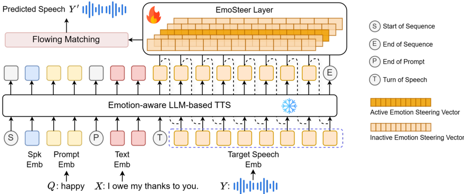

> [!abstract] arXiv · 2026 · Preprint
> **Li Zhou et al.** (The Chinese University of Hong Kong, Shenzhen / The Hong Kong Polytechnic University / Tianjin University) · [→ Paper](https://arxiv.org/abs/2601.22873) · Demo: ? · Code: ?
>
> Introduces EmoShift, a lightweight activation-steering layer (EmoSteer) that learns an explicit, trainable offset vector for each target emotion in an LLM-based TTS model's output embedding space, using only 10M parameters (under 1/30 of full fine-tuning) to outperform both zero-shot and fully fine-tuned baselines on emotional expressiveness while preserving naturalness and speaker similarity.

## Problem

Emotion-aware TTS systems, including LLM-based designs, typically control emotional expression by scaling a fixed emotion embedding shared across all model parameters, whether through relative-attribute learning, geometric emotion representations, discrete emotion quantization, or natural-language-prompt-driven generative guidance. These approaches limit interpretability and prevent the model from directly encoding emotion-specific latent dynamics, since a single shared embedding space must represent all emotional variation without an explicit, separable structure per emotion category. Meanwhile, activation steering, injecting learned directional offsets into a model's latent space at inference time, has emerged as a lightweight, interpretable control paradigm for LLMs (style control, personalization, safety enforcement) but had not yet been applied to emotion-aware speech synthesis specifically.

## Method

EmoShift formulates emotion-aware TTS as conditional autoregressive speech-token generation within an LLM (built on CosyVoice-300M-Instruct), conditioned on a speaker embedding, an emotion prompt (e.g., "happy"), and text embeddings, generating discrete speech tokens later decoded to waveform via a flow-matching-based vocoder. On top of this backbone, the paper introduces a dedicated EmoSteer layer: for a target emotion e, a learnable projection matrix W_e computes a steering vector v_e = hW_e from each hidden state h, and the hidden state is modified as h' = h + ε·v_e during training, where ε is a fixed base scaling factor. Five learnable emotion steering vectors (four non-neutral emotions plus neutral) are trained, one projection matrix per emotion, adding minimal parameter overhead relative to the frozen backbone. At inference, a gain factor α≥1 replaces the fixed training scale (h' = h + αε·v_e), allowing the emotional intensity of generated speech to be smoothly modulated after training without retraining, simply by adjusting α. Because the steering mechanism operates purely on output embeddings via lightweight learned projections, it requires no changes to the core LLM-based TTS architecture and can, in principle, be inserted into other LLM-based TTS pipelines in a plug-and-play manner. The method is trained on the ESD English subset (350 parallel utterances across 10 speakers and 5 emotions: neutral, happy, angry, sad, surprise), with three baselines for comparison: the unmodified CosyVoice backbone, a fully fine-tuned CosyVoice-SFT (311M trainable parameters, roughly 30x more than EmoShift's 10M), and CosyVoice-SFT-Shift, which combines full fine-tuning with the same EmoSteer layer.

## Key Results

With only 10M trainable parameters, less than 1/30 of full fine-tuning, EmoShift outperforms the fully fine-tuned CosyVoice-SFT baseline on overall emotion classification accuracy (74.26% vs. 69.74%) and on 4 of 5 individual emotion categories (all but Angry), while achieving comparable overall accuracy to CosyVoice-SFT-Shift (which combines full fine-tuning with the same steering layer), all without degrading speech quality metrics (WER 7.90%, SpkSIM 82.41, DNSMOS 3.19, close to the unmodified backbone). Subjective evaluation with 10 listeners confirms the objective results: EmoShift achieves both the highest MOS (4.14±0.09) and highest Emo-MOS (3.96±0.12) of any evaluated system, exceeding both the zero-shot backbone and the fully fine-tuned SFT baseline on naturalness and emotional expressiveness simultaneously rather than trading one for the other. Pairwise preference tests isolating the EmoSteer layer's specific contribution show it wins against its corresponding base model in a strong majority of comparisons regardless of whether that base model is the zero-shot backbone (71.95% MOS win rate, 80.65% Emo-MOS win rate) or the fully fine-tuned SFT model (72.00% MOS win rate, 80.30% Emo-MOS win rate), demonstrating the steering layer's benefit generalizes across different base-model states rather than depending on a specific starting point. Scaling the inference-time steering gain α from its training value of 1 up to 4 reveals a non-monotonic effect on emotion-recognition accuracy: accuracy increases steadily and peaks around α=3 (reaching 75.94% overall recall, with particularly strong gains for Sad and Surprise), then drops sharply at α=4, indicating a bounded operating range beyond which the steering vector's magnitude begins to distort rather than strengthen the intended emotion. A follow-up AB preference test on emotional intensity confirms listeners perceive stronger emotional expression at α=3 than α=1 for 4 of 5 emotions (Surprise 68.39% win rate, Angry 64.48%, Sad 61.24%, Neutral 55.84%), with Happy the exception at just under 50%.

## Novelty Assessment

The core contribution, extending activation steering to emotion-aware TTS via a dedicated EmoSteer layer with per-emotion learnable projection matrices, is a targeted, well-motivated application of an established LLM-control paradigm to a new domain. The paper explicitly acknowledges the closely related, contemporaneous EmoSteer-TTS, which derives emotion-specific activation offsets from few-shot neutral/target activation comparisons rather than learning them as trainable parameters; EmoShift's approach of learning the steering vectors directly as part of model training, rather than deriving them post-hoc from activation statistics, is the paper's specific point of differentiation from that concurrent work. The demonstrated parameter efficiency (10M vs. 311M for comparable or better performance) and the inference-time-adjustable intensity control (via the α gain factor, validated with both objective SER accuracy and subjective AB preference tests) are concrete, well-evidenced practical advantages over full-parameter fine-tuning, though the underlying steering-vector mechanism itself is adapted from prior LLM activation-steering literature rather than newly invented.

## Field Significance

> [!tip] high — this paper demonstrates that a lightweight, interpretable activation-steering layer, requiring roughly 30x fewer trainable parameters than full fine-tuning, can match or exceed full fine-tuning's emotional-expressiveness gains in an LLM-based TTS system while simultaneously improving naturalness, and further shows this same mechanism provides a smooth, inference-time-adjustable emotional-intensity control with empirically characterized (non-monotonic) behavior, offering a parameter-efficient alternative to the fixed-embedding-scaling and full-retraining approaches that dominate prior emotion-aware TTS work.

## Claims

- **supports:** A small, dedicated activation-steering layer that learns an explicit per-emotion offset vector in an LLM-based TTS model's output embedding space can match or exceed the emotional-expressiveness gains of full-parameter fine-tuning, using roughly 30x fewer trainable parameters.
  > *Evidence:* With only 10M trainable parameters (vs. 311M for full fine-tuning), EmoShift achieves higher overall emotion classification accuracy (74.26%) than the fully fine-tuned CosyVoice-SFT baseline (69.74%) and outperforms it on 4 of 5 individual emotion categories. *(§4.3, Table 1)*
- **supports:** Explicit, learned per-category steering vectors for emotional control in TTS improve subjective naturalness alongside emotional expressiveness, rather than trading one for the other.
  > *Evidence:* In a 10-listener subjective evaluation, EmoShift achieves both the highest MOS (4.14±0.09) and the highest Emo-MOS (3.96±0.12) among all evaluated systems, exceeding both the unmodified backbone and the fully fine-tuned baseline on both dimensions simultaneously. *(§4.3, Table 2)*
- **supports:** The benefit of an emotion-specific activation-steering layer generalizes across different base-model states, improving perceived naturalness and emotional expressiveness whether added to a zero-shot backbone or layered on top of an already fully fine-tuned model.
  > *Evidence:* In pairwise preference tests, the version with the EmoSteer layer wins against its corresponding base model in the large majority of comparisons for both the zero-shot CosyVoice backbone (71.95% MOS win rate, 80.65% Emo-MOS win rate) and the fully fine-tuned CosyVoice-SFT backbone (72.00% MOS win rate, 80.30% Emo-MOS win rate). *(§5.1, Table 3)*
- **complicates:** Scaling an emotion-specific steering vector's magnitude at inference time to increase perceived emotional intensity has a non-monotonic effect on downstream emotion-recognition accuracy, improving performance only up to a moderate scaling factor before degrading sharply beyond it.
  > *Evidence:* Sweeping the inference-time steering gain α from its training value of 1 up to 4 shows emotion-recognition accuracy increasing steadily and peaking around α=3 before dropping sharply at α=4, indicating an optimal operating range beyond which the steering vector's magnitude distorts rather than strengthens the intended emotional signal. *(§5.2, Figure 3)*

## Limitations and Open Questions

> [!warning] The "Best" configuration (α=3, used to report the paper's headline peak emotion-recognition accuracy of 75.94%) comes with a measurable speech-quality cost relative to the "Default" configuration (α=1): WER rises from 7.90% to 11.60% and DNSMOS drops from 3.19 to 3.13, an explicit intensity-versus-quality trade-off that is only characterized at this single amplified setting, not swept as thoroughly as the emotion-accuracy analysis.

The method is validated on a single dataset (ESD English subset: 5 discrete emotion categories, 10 speakers, 350 utterances total) and a single LLM-based TTS backbone (CosyVoice-300M-Instruct); generalization to other backbones, larger emotion taxonies, or compound/blended emotions is explicitly deferred to future work by the authors, who state they plan to extend EmoShift to more emotional categories including compound emotions and to develop adaptive steering strategies.

## Wiki Connections

- [[emotion-synthesis|Emotion Synthesis]] — introduces a lightweight, per-emotion activation-steering mechanism for LLM-based TTS that learns explicit, interpretable emotion-specific offset directions in the output embedding space, with inference-time-adjustable intensity control.
- [[2407.05407|CosyVoice]] — the frozen LLM-based TTS backbone (CosyVoice-300M-Instruct) that the EmoSteer layer is inserted into without architectural modification or full retraining.
- [[2508.03543|EmoSteer-TTS]] — a closely related, contemporaneous activation-steering approach for emotion-controllable TTS that derives steering vectors from few-shot activation comparisons rather than learning them as trainable parameters, explicitly distinguished from this paper's approach.
- [[2504.12867|EmoVoice]] — cited as an example of LLM-based emotional TTS using freestyle natural-language text prompting, part of the prompt-driven emotional control landscape this paper's steering-vector approach is contrasted against.
- [[2212.04356|Whisper]] — used (Whisper-Large-v3) to compute Word Error Rate for objective speech-quality evaluation of synthesized speech.
- [[2312.15185|emotion2vec]] — used to perform speech emotion recognition on synthesized audio, providing the classification-accuracy metric for objective emotion-generation quality evaluation.
