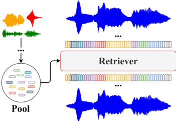

> [!abstract] arXiv · 2026 · Preprint
> **Luca Della Libera et al.** · [→ Paper](https://arxiv.org/abs/2601.23174) · Demo: ? · Code: ✓
>
> Introduces DyCAST, a variable-frame-rate speech tokenizer that dynamically groups frames into character-aligned chunks via a learned hazard-model boundary predictor and negative-binomial duration model, plus retrieval-augmented decoding to recover reconstruction fidelity at the resulting low token rates, achieving competitive resynthesis and downstream performance with 3-8x fewer tokens than fixed-frame-rate codecs.

## Problem

Neural audio codecs are the core building block enabling LLMs to process speech as discrete tokens, but nearly all existing codecs operate at a fixed frame rate, producing tokens uniformly in time regardless of how much information a given segment actually carries. This mismatches the inherently variable temporal structure of speech, where silence and steady regions are information-poor while rapidly changing segments are information-dense, resulting in unnecessarily long token sequences that make downstream generative modeling harder. Existing dynamic-frame-rate approaches either rely on heuristic frame-merging or clustering strategies weakly grounded in linguistic structure, or require transcriptions or alignment information at inference time, which limits their applicability to fully speech-based, text-free generative settings.

## Method

DyCAST extends a modular compressor-quantizer-decompressor codec architecture (the authors' own prior FocalCodec design) with dedicated dynamic pooling modules. A frozen, pretrained self-supervised encoder (WavLM-large, 6th layer) first extracts fixed-frame-rate acoustic-semantic features, which a lightweight compressor projects to a lower-dimensional latent space. A chunker module then groups consecutive frames into variable-length chunks: a boundary predictor estimates a per-frame boundary probability using a discrete-time hazard model (rather than independent per-frame binary classification), which explicitly models the time to the next boundary and naturally enforces a single boundary per chunk with a properly normalized likelihood over variable-length segments; this is trained using character-level durations extracted from a frozen, pretrained character aligner (an MMS-based CTC model). A downsampler then pools each chunk (taking its last frame) into a compact chunk-level representation, discretized by a scalar spherical quantizer (a generalization of binary spherical quantization that decouples bitrate from latent dimensionality for more flexible bitrate control at low frame rates).

On the decoding side, a dechunker reverses the process: a duration predictor, trained with a negative binomial distribution (chosen over geometric or Poisson models for its ability to decouple mean and variance and capture the heavy-tailed, over-dispersed nature of character-level speech durations), estimates how many frames each token should expand to, recovering temporal structure since typically only the token sequence, not explicit chunk boundaries, is transmitted. This supports three decoding regimes: transmitting tokens with explicit per-token durations (highest fidelity, more overhead), transmitting tokens with just a global target utterance length (durations sampled to match a known budget, e.g. for resynthesis), or transmitting tokens alone (durations inferred, useful for TTS and speech language modeling where no length is known in advance). At inference, chunk boundaries can come either from the character aligner directly (useful for TTS-style applications needing accurate speech-text alignment) or from the trained boundary predictor operating alignment-free on the encoded speech alone, with a decoding hyperparameter (minimum inter-boundary gap) providing direct, tunable control over the resulting frame rate.

Because character-aligned tokenization naturally produces very low frame rates (6-18 Hz), reconstructing fine acoustic detail becomes harder as the quantization bottleneck removes high-frequency and speaker-specific information. To address this without increasing bitrate, the paper introduces retrieval-augmented decoding (RAD): a large pool of continuous latents (collected offline from diverse utterances, speakers, and acoustic conditions) is indexed for efficient similarity search, and during decoding, each quantized latent is compared against the pool; if the nearest retrieved candidate exceeds a similarity threshold, the discrete latent is replaced by the retrieved continuous latent before waveform reconstruction, analogous to retrieval-augmented generation but operating on continuous speech latents rather than text documents. The full system is trained on LibriTTS via a multi-stage curriculum: reconstruction pretraining with teacher-forced (character-aligner) durations, boundary-predictor training against character-aligner supervision, adaptation of the compressor-quantizer-decompressor to predicted (rather than ground-truth) boundaries for robustness, and finally duration-predictor training on frozen upstream components.

## Key Results

Across speech resynthesis (LibriSpeech, MLS, VoiceBank, Libri1Mix) and voice conversion (VCTK), DyCAST variants operate at 6-18 Hz, a 3-8x reduction in token count relative to fixed-frame-rate baselines spanning 12.5-80 Hz, while achieving UTMOS, dWER, and speaker similarity closely matching strong fixed-rate codecs such as FocalCodec and Stable Codec; speaker similarity remains consistently high across all DyCAST variants even at the lowest frame rates, and the codec, trained exclusively on English speech, generalizes to multilingual resynthesis with only a moderate dWER increase as frame rate drops. On discriminative probing tasks, the character-aligned variant (DyCAST-CA) achieves the best ASR WER (13.05%) among all codecs compared, including fixed-rate codecs at 3-6x higher frame rates, while speaker-ID and emotion-recognition probing remain competitive with dedicated baselines. On text-to-speech, DyCAST-CA's hard character-to-token alignment uniquely enables a non-autoregressive TTS architecture (mapping each input character directly to its corresponding speech token, eliminating sequential prediction entirely), which achieves by far the best TTS results among all codecs tested (UTMOS 4.20, dWER 3.42, speaker similarity 96.2%), substantially outperforming both autoregressive TTS on other DyCAST configurations and all fixed-frame-rate baselines, particularly advantageous in the paper's limited-data TTS regime. Retrieval-augmented decoding, evaluated with a deliberately challenging 20M-vector heterogeneous candidate pool (all of LibriSpeech train-clean-100/dev-clean/test-clean), consistently reduces dWER and improves speaker similarity at moderate similarity thresholds (τ∈[95,97]) across all DyCAST frame-rate variants, with the largest gains at the lowest token rates (e.g., DyCAST-BP5 dWER improves from 8.84 to 7.22 at τ=95), while naturalness remains stable or decreases only marginally; at a very high threshold (τ=99), results closely match the no-retrieval baseline, effectively disabling the mechanism through over-selectivity.

## Novelty Assessment

The core architectural contribution, learned soft character-level alignment via a hazard-model boundary predictor combined with a negative-binomial duration model for alignment-free, inference-time-controllable variable-frame-rate tokenization, is a genuinely new mechanism distinguishing DyCAST from prior dynamic-frame-rate codecs, which the paper explicitly contrasts against: prior approaches rely on heuristic frame-merging (CodecSlime) or implicit duration encoding via codebook structure (TFC, VARSTok, FlexiCodec), while text-aligned approaches (TASTE, TASLA) require transcriptions or ground-truth alignment at inference time, closer to TTS-oriented pipelines than general-purpose tokenizers. DyCAST's approach of training on character-level alignment supervision but supporting fully alignment-free inference is a distinct design point in this space. Retrieval-augmented decoding is a second, independently validated contribution: while nearest-neighbor retrieval at the latent level has precedent in voice conversion, applying it specifically to recover reconstruction fidelity at very low, character-aligned frame rates, without increasing transmitted bitrate, is a novel application demonstrated with a genuinely challenging (heterogeneous, non-speaker-specific) retrieval pool rather than an easier best-case setup. The scalar spherical quantization scheme, generalizing the authors' own prior binary spherical quantization to decouple bitrate from latent dimensionality, is an incremental but purposeful refinement enabling the flexible bitrates the low-frame-rate regime requires.

## Field Significance

> [!tip] high — this paper demonstrates that learned, character-grounded variable-frame-rate speech tokenization can match fixed-frame-rate codec quality while using 3-8x fewer tokens, with the character-aligned variant simultaneously achieving the best ASR and by far the best TTS results among all compared codecs (the latter specifically because character alignment enables an entirely different, non-autoregressive TTS architecture), and separately validates a novel retrieval-augmented decoding mechanism that recovers reconstruction fidelity at the resulting low frame rates without any bitrate increase, evaluated under a deliberately realistic, heterogeneous retrieval scenario rather than an easy best case.

## Claims

- **supports:** A speech tokenizer that dynamically groups frames into variable-length, character-aligned chunks rather than fixed-duration frames can achieve substantially shorter token sequences than fixed-frame-rate codecs while maintaining resynthesis quality competitive with strong fixed-rate baselines.
  > *Evidence:* DyCAST variants operate at 6-18 Hz (a 3-8x reduction versus 12.5-80 Hz fixed-rate baselines) while achieving UTMOS, dWER, and speaker similarity on LibriSpeech resynthesis closely matching strong fixed-rate codecs such as FocalCodec and Stable Codec. *(§5.1, Table 2)*
- **supports:** Explicitly aligning speech tokens to character-level linguistic units, using a learned boundary predictor trained on forced-alignment supervision, produces discrete tokens especially well-suited for automatic speech recognition, outperforming fixed-frame-rate codecs despite using far fewer tokens.
  > *Evidence:* The character-aligner variant (DyCAST-CA) achieves the best ASR WER (13.05%) among all codecs compared in downstream probing, including fixed-rate codecs at 3-6x higher frame rates. *(§5.2, Table 4)*
- **supports:** Character-aligned speech tokenization enables a fundamentally simpler, non-autoregressive TTS architecture via a direct one-to-one character-to-token mapping, which outperforms autoregressive TTS built on either the same tokenizer's other configurations or fixed-frame-rate codec baselines, particularly in limited-data regimes.
  > *Evidence:* The hard-aligned DyCAST-CA variant, uniquely enabling a non-autoregressive character-to-token TTS architecture, achieves by far the best TTS results among all codecs tested (UTMOS 4.20, dWER 3.42, speaker similarity 96.2%), substantially outperforming autoregressive TTS on other configurations and all fixed-rate baselines. *(§5.3, Table 4)*
- **supports:** Retrieving and substituting continuous latent representations from a large candidate pool at decoding time, conditioned on similarity to the quantized token being decoded, can improve reconstruction fidelity at low token rates without increasing the transmitted bitrate.
  > *Evidence:* At moderate similarity thresholds (τ∈[95,97]), retrieval-augmented decoding reduces dWER relative to standard decoding across all DyCAST frame-rate configurations, with the largest improvements at the lowest token rates, while speaker similarity improves and naturalness remains stable. *(§5.1, Table 3)*
- **complicates:** The benefit of retrieval-augmented decoding for speech reconstruction is highly sensitive to the similarity threshold controlling when a retrieved continuous latent replaces a quantized token, with overly permissive thresholds costing naturalness and overly conservative thresholds effectively disabling the mechanism.
  > *Evidence:* At a very high similarity threshold (τ=99), retrieval-augmented decoding results closely match the no-retrieval baseline across all metrics, while at moderate thresholds (τ=95, 97) UTMOS naturalness decreases modestly relative to the no-retriever baseline even as dWER and speaker similarity improve. *(§5.1, Table 3)*

## Limitations and Open Questions

> [!warning] Silence handling remains an acknowledged rough edge: rather than discarding or specially treating silence segments detected by the character aligner, the current implementation simply aggregates them into the subsequent non-speech token; the authors explicitly state they "leave more refined treatments of silence for future work," so this is a known, unresolved design gap rather than a fully validated design choice.

The retrieval-augmented decoding evaluation deliberately uses a large, heterogeneous candidate pool (20M vectors spanning diverse speakers and utterances) rather than a speaker-specific pool; the authors note a speaker-specific pool would likely yield stronger results, meaning the reported RAD gains may understate the mechanism's full potential in a more targeted deployment scenario. The codec itself is trained exclusively on English speech (LibriTTS); multilingual generalization is evaluated only via the character aligner's inherent multilingual support, not through retraining or dedicated multilingual evaluation of the codec's core representations.

## Wiki Connections

- [[neural-codec|Neural Audio Codec]] — introduces a variable-frame-rate speech tokenizer using learned character-level soft alignment (hazard-model boundary prediction, negative-binomial duration modeling) and a retrieval-augmented decoding mechanism to preserve reconstruction quality at low frame rates without increasing bitrate.
- [[voice-conversion|Voice Conversion]] — evaluates the codec's discrete tokens on voice conversion (VCTK), assessing speaker similarity and intelligibility preservation across different frame-rate configurations.
- [[self-supervised-speech|Self-Supervised Speech]] — relies on a frozen, pretrained WavLM self-supervised speech encoder as the core feature extractor feeding the dynamic chunking and quantization pipeline.
- [[neurips-2025-7Z3wQSu3mH|FocalCodec]] — supplies the modular compressor-quantizer-decompressor architecture and focal modulation blocks that DyCAST directly extends with dynamic pooling, and serves as a direct fixed-frame-rate baseline in the comparison tables.
- [[2510.00981|FlexiCodec]] — a directly cited competing dynamic-frame-rate codec relying on implicit duration encoding via codebook structure, explicitly contrasted against DyCAST's learned character-level soft alignment approach.
- [[2409.05377|BigCodec]] — used as a direct fixed-frame-rate baseline across speech resynthesis, voice conversion, and downstream discriminative/generative task comparisons.
- [[2408.16532|WavTokenizer]] — used as a direct fixed-frame-rate baseline, notably achieving the best speaker-identification error rate among all compared codecs despite DyCAST's more favorable overall efficiency-performance trade-off.
- [[2308.16692|SpeechTokenizer]] — used as a direct fixed-frame-rate baseline across the full evaluation suite (resynthesis, voice conversion, ASR/SI/SER probing, TTS).
- [[2210.13438|EnCodec]] — used as a direct high-frame-rate (75 Hz) fixed-rate baseline representing the earlier generation of general-purpose neural audio codecs.
- [[2410.00037|Moshi]] — the source of the Mimi codec, used as a direct low-frame-rate (12.5 Hz) fixed-rate baseline for comparison against DyCAST's variable-rate approach.
- [[1904.02882|LibriTTS]] — supplies the training corpus (resampled to 16kHz) used for all stages of DyCAST's multi-stage training curriculum.
