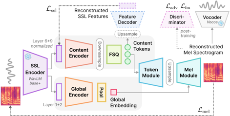

> [!abstract] arXiv · 2026 · Preprint
> **Zhijie Huang et al.** · [→ Paper](https://arxiv.org/abs/2602.00594) · Demo: ✓ · Code: ✓
>
> Kanade is a single-layer speech tokenizer that separates content from acoustic constants using only an information bottleneck, achieving state-of-the-art speaker disentanglement and lexical availability without the auxiliary disentanglement losses that prior disentangled codecs rely on.

## Problem

Speech tokenizers for autoregressive spoken language modeling face a persistent trade-off. Self-supervised learning (SSL) tokens (e.g. k-means over HuBERT/WavLM features) surface phonetic structure well but discard prosody. Neural audio codecs (NACs) built with residual vector quantization (RVQ) retain rich acoustic detail but spread it across many token layers at high token rates, obscuring linguistic structure and complicating downstream modeling. Hybrid codecs that distill SSL features into an RVQ layer, and disentangled codecs that explicitly separate content from speaker identity, both attempt to resolve this, but the paper's own benchmarking shows that disentangled codecs typically rely on auxiliary mechanisms, such as gradient reversal, contrastive/invariance learning, or explicit supervision, and that even with these mechanisms non-linguistic information still leaks into content tokens (poor timbre transfer) or linguistic content leaks into higher RVQ layers (content degradation). The paper asks whether a tokenizer can achieve clean content/speaker disentanglement, high lexical availability, and high-quality resynthesis in a single low-rate token stream, without any of these auxiliary training tricks.

## Method

Kanade is a dual-branch tokenizer built on top of a frozen WavLM Base+ SSL encoder. Deep SSL layers (layers 6 and 9, associated with linguistic content) feed a content branch: a transformer encoder with local window attention, temporally downsampled via strided convolution, followed by Finite Scalar Quantization (FSQ), a codebook-free quantization method that avoids the initialization sensitivity and codebook collapse of standard VQ-VAE codebooks. This branch produces a single stream of discrete tokens at 12.5 Hz or 25 Hz. Shallow SSL layers (layers 1 and 2, associated with speaker characteristics) feed a global branch: a NeXt-TDNN-style stack of ConvNeXt blocks with attentive statistics pooling, producing one continuous, non-discretized global embedding per utterance that carries time-invariant (non-linguistic) information such as speaker identity.

The decoder reconstructs a mel spectrogram from the content tokens and the global embedding: two transformer-based modules (Token Module, Mel Module) process the upsampled content tokens, with the Mel Module conditioned on the global embedding via adaLN-Zero, followed by a convolutional post-net. Vocos converts the mel spectrogram to a waveform. Training has two phases. The main phase combines an SSL feature reconstruction loss (L2, sensitive to phonetic contrasts) with a mel reconstruction loss (L1, sensitive to prosody), training the whole pipeline end to end; the paper's ablations show that training these jointly rather than sequentially avoids losing prosodic information. A second GAN post-training phase (multi-band mel-domain discriminator similar to DAC, adversarial + feature-matching losses in the style of Vocos) updates only the global branch and decoder to sharpen audio quality. The narrow content bottleneck, combined with the presence of a separate global branch that already gives non-linguistic information somewhere to go, is what drives disentanglement, without any adversarial or invariance-learning objective aimed specifically at removing speaker information from the content stream.

The tokenizer is trained on the LibriTTS training subsets (586 hours, 24 kHz multi-speaker audiobook speech) with ~120M trainable parameters (~210M including the frozen WavLM Base+ encoder and the Vocos vocoder), taking about 32 GPU-hours on one NVIDIA 5090. For downstream evaluation, the authors train decoder-only transformer ASR and TTS models (85M backbone parameters) directly on Kanade tokens, and a pure spoken language model by warm-starting Qwen-2.5-0.5B on Kanade tokens using the Slam training recipe over one epoch of Libri-Light.

## Key Results

On LibriSpeech test-clean reconstruction, Kanade 25Hz achieves the best WER (2.4%) among single-layer codecs, approaching multi-layer RVQ codecs (FACodec, PAST, SpeechTokenizer, DualCodec at 100-480 tokens/s) while using a fraction of the token rate, and clearly outperforms k-means SSL tokens on prosody preservation (0.88 F0-correlation vs. 0.67 for 25Hz k-means tokens, at equal token rate). On voice conversion (VCTK, content-from-source/timbre-from-reference resynthesis), Kanade is the only tested codec that avoids both failure modes the paper identifies elsewhere in the literature: poor timbre transfer (EER < 20%, seen in FACodec, BiCodec, TiCodec) and content degradation (WER > 20%, seen in DualCodec, PAST, SpeechTokenizer, and especially Mimi, whose reconstruction nearly loses source content entirely). Kanade's VC performance (EER 30.7, WER 0.7%) matches or exceeds specialized VC systems (LinearVC, FreeVC, CosyVoice 2). A dedicated speaker-discrimination probe (training ECAPA-TDNN classifiers on content-only, global-only, and combined representations) confirms this: speaker identity is essentially inaccessible from Kanade's content tokens (0.2-0.3% SID accuracy) while being highly accessible from the global embedding (78.6-78.8%), a cleaner separation than FACodec, TiCodec, or BiCodec show in the same probe.

On downstream ASR (decoder-only transformer trained on Kanade tokens), Kanade 25Hz achieves the lowest WER among codecs on both LibriSpeech test-clean (7.1%) and out-of-domain SwitchBoard (18.6%), approaching k-means SSL tokens despite a much lower token rate. On downstream TTS, Kanade 25Hz again achieves the best WER among codecs and k-means tokens on LibriTTS test-clean (4.2%) and Seed-TTS-eval (4.0%), with the best prosody-naturalness score (81.0) in MUSHRA-like listening tests. On pure spoken language modeling (sWUGGY, sBLIMP, sStoryCloze, tStoryCloze via the Slam recipe), Kanade 12.5Hz is competitive with k-means and hybrid codec tokens, though not uniformly best. Ablations (Table 7) show that removing the dual-branch design, the SSL reconstruction loss, or FSQ each substantially degrade both reconstruction and downstream ASR quality, and that FSQ clearly outperforms a standard EMA/k-means-initialized VQ codebook.

## Novelty Assessment

The architectural idea, a bottlenecked content branch plus a separate global branch for acoustic invariants, is not entirely new; the paper positions BiCodec as the closest prior single-layer disentangled design and argues its own voice-conversion results show BiCodec's disentanglement is less complete. What is more genuinely novel here is the combination: unsupervised disentanglement (no gradient reversal, contrastive loss, invariance loss, or explicit supervision) achieved purely through information bottleneck design, paired with codebook-free FSQ quantization and joint SSL-plus-mel reconstruction training, and validated with a comprehensive benchmark suite spanning reconstruction, voice conversion, speaker discrimination, ASR, TTS, and pure SLM tasks against a wide range of open-source codec baselines. The contribution is primarily architectural (the dual-branch bottleneck design and its training recipe), reinforced by an empirical-benchmark contribution (the paper assembles and reports a broad multi-axis evaluation suite that several baselines had not previously been compared on directly, such as the voice-conversion failure-mode analysis).

## Field Significance

> [!tip]
> high — Kanade demonstrates that clean, unsupervised content/speaker disentanglement in a speech tokenizer does not require the adversarial, contrastive, or supervised auxiliary mechanisms that prior disentangled codecs use, and that a single low-rate token stream can simultaneously match SSL tokens on linguistic availability and multi-layer codecs on reconstruction quality. Its systematic voice-conversion and speaker-discrimination benchmarking exposes concrete, previously under-documented failure modes (timbre leakage in disentangled codecs, content leakage in hybrid codecs) across a wide set of existing open-source tokenizers, providing a reusable evaluation methodology beyond the proposed model itself.

## Claims

- **supports:** A narrow information bottleneck on the content stream, combined with a separate pathway for time-invariant acoustic information, can achieve content/speaker disentanglement without adversarial, contrastive, invariance, or supervised auxiliary training objectives.
  > *Evidence:* Kanade uses only a content-branch bottleneck plus a global branch, with no gradient reversal, contrastive, or invariance loss, and achieves the best speaker-discrimination separation among tested disentangled codecs (0.2-0.3% content-branch SID accuracy vs. up to 76.8% for FACodec) *(§4.4.2, Table 3)*.
- **supports:** Reconstructing SSL features and mel spectrograms jointly during training extracts more prosodic information in a content-focused tokenizer than a two-stage or SSL-only reconstruction objective.
  > *Evidence:* Removing SSL feature reconstruction loss degrades reconstruction WER (3.5% to 8%) and downstream ASR WER (8.1% to 14.9%); a two-stage variant that decouples SSL and mel losses (similar to RepCodec) achieves slightly lower WER but visibly degrades prosody (F0Corr 0.84 to 0.76) *(§4.5, Table 7)*.
- **complicates:** Existing disentangled and hybrid speech codecs frequently fail to achieve the separation they claim, even when using explicit disentanglement mechanisms.
  > *Evidence:* In voice-conversion resynthesis, FACodec, BiCodec, and TiCodec show poor timbre transfer (EER under 20%, with subjectively noticeable gender mixing), while DualCodec, PAST, SpeechTokenizer, and Mimi show content degradation (WER above 20%, with Mimi nearly losing source content entirely) *(§4.4.2, Table 2)*.
- **refines:** Codebook-free quantization methods can outperform standard VQ-VAE-style codebooks for single-stream speech tokenization, particularly for preserving linguistic content.
  > *Evidence:* Replacing FSQ with an EMA/k-means-initialized VQ codebook (with dead-code restart) causes reconstruction WER to rise from 3.5% to 25.8% and F0Corr to fall from 0.84 to 0.69 *(§4.5, Table 7)*.
- **supports:** A single-layer, low-token-rate speech tokenizer can match the lexical availability of self-supervised k-means tokens while approaching the reconstruction quality of multi-layer neural codecs.
  > *Evidence:* Kanade 25Hz achieves 7.1%/18.6% WER on LibriSpeech/SwitchBoard ASR probing (near k-means tokens at 5.8%/15.0%) while reaching 75.0 MUSHRA and 4.16 UTMOS in reconstruction, comparable to multi-layer codecs using 4-20x more tokens per second *(§4.4.1, §4.4.3, Tables 1 and 4)*.

## Limitations and Open Questions

> [!warning]
> All experiments train on a single dataset family, LibriTTS (with Libri-Light for the pure-SLM probe), which is clean, read, English audiobook speech; the paper's robustness evaluation on noisy, spontaneous, emotional, accented, and unseen-language data is deferred to an appendix and not reflected in the headline results reported here.

Kanade is not uniformly best across every metric: FACodec and PAST exceed it on reconstruction MUSHRA, and on pure spoken language modeling benchmarks Kanade 25Hz underperforms Kanade 12.5Hz and several baselines on sWUGGY/sBLIMP, showing the two token-rate variants trade off reconstruction detail against linguistic modelability differently. The global embedding is continuous and not discretized, so Kanade's design is explicitly not intended for pure autoregressive modeling of speaker/acoustic identity; any application that needs to generate rather than transfer non-linguistic attributes would need a separate mechanism for that embedding. The model relies on a frozen WavLM Base+ encoder trained on its own data distribution, so any biases in that pretrained encoder or in LibriTTS/Libri-Light's speaker and demographic coverage carry through to Kanade, a limitation the authors acknowledge directly in their impact statement without providing a specific dataset composition analysis.

## Wiki Connections

- [[neural-codec|Neural Audio Codec]] — Kanade is proposed as a single-layer, low-token-rate alternative to multi-layer RVQ codecs, aiming to unify SSL-token linguistic availability with codec-level reconstruction quality.
- [[disentanglement|Disentanglement]] — Kanade's dual-branch content/global architecture achieves content-speaker separation purely through an information bottleneck, without the adversarial, contrastive, or supervised mechanisms used by prior disentangled codecs.
- [[self-supervised-speech|Self-Supervised Speech]] — the tokenizer's content and global branches are both built directly on frozen WavLM Base+ SSL features rather than raw audio or mel spectrograms.
- [[spoken-language-model|Spoken Language Model]] — Kanade tokens are evaluated as input to a warm-started Qwen-2.5-0.5B spoken language model trained with the Slam recipe, testing suitability for pure autoregressive spoken language modeling.
- [[voice-conversion|Voice Conversion]] — a dedicated voice-conversion resynthesis benchmark on VCTK is used to measure disentanglement, with Kanade matching or exceeding specialized VC systems on timbre transfer and content preservation.
- [[zero-shot-tts|Zero-Shot TTS]] — downstream TTS experiments condition synthesis on reference-speaker embeddings extracted at inference time, testing Kanade tokens in a zero-shot speaker-cloning setting.
- [[2308.16692|SpeechTokenizer]] — used as the "ST" hybrid-codec baseline across reconstruction, voice-conversion, ASR, and TTS tables, and discussed as an example of incomplete separation between content and higher RVQ layers.
- [[2403.03100|NaturalSpeech 3]] — FACodec is the primary disentangled-codec baseline; Kanade's voice-conversion and speaker-discrimination results are framed as showing FACodec's gradient-reversal disentanglement is incomplete.
- [[interspeech-2025-0669|PAST]] — used as a hybrid multi-layer codec baseline across reconstruction, voice-conversion, ASR, and TTS benchmarks.
- [[interspeech-2025-0468|DualCodec]] — used as a semantically-enhanced multi-layer codec baseline, showing content degradation in the voice-conversion evaluation.
- [[2408.16532|WavTokenizer]] — used as a single-layer codec baseline with substantially higher WER/CER than Kanade at comparable token rates.
- [[2412.10117|CosyVoice 2]] — used as a specialized voice-conversion and TTS comparison system that Kanade's tokenizer-based approach matches or exceeds on several metrics.
- [[2410.00037|Moshi]] — Moshi's Mimi codec is used as a multi-layer baseline; in the voice-conversion evaluation it shows the most severe content-degradation failure among all tested codecs.
- [[2025.findings-acl.631|Slamming]] — the Slam training recipe from this paper is used directly to train Kanade's pure spoken-language-model evaluation on Libri-Light.
