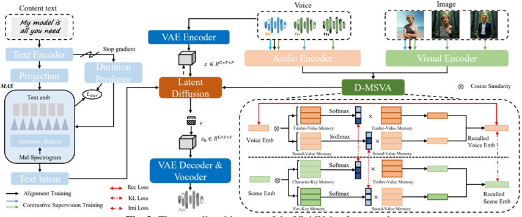

> [!abstract] arXiv · 2026 · Preprint
> **Chengyuan Ma et al.** (Tsinghua University / Ant Group) · [→ Paper](https://arxiv.org/abs/2602.02591) · Demo: ✓ · Code: ?
>
> Defines a new task, Scene-Aware Visually-Driven Speech Synthesis, and proposes VividVoice, a framework that generates speech jointly conditioned on text content and a visual scene, controlling both speaker timbre and environmental acoustics from a single image.

## Problem

Prior environment-aware speech generation either overlaid clean speech with static noise/reverberation, transferred acoustic characteristics from a reference audio clip (constraining controllability to the availability of that reference), or used text descriptions to jointly model speech and environmental sound (VoiceLDM-style approaches). Text conditioning is limited by its low information density: natural-language scene descriptions are too abstract and ambiguous to capture the acoustic detail present in a visual scene. Separately, vision-driven speech work has addressed only single attributes: face-conditioned timbre generation (e.g., FaceTTS) ignores environmental acoustics, while vision-to-sound generation (e.g., SSV2A) produces plausible soundscapes but no linguistic content. No prior system jointly generates speech content, speaker timbre, and environmental acoustics from a visual scene. The paper attributes this gap to two obstacles: the absence of a dataset that strongly aligns visual scenes, speaker identity, and environmental acoustics simultaneously, and the absence of an architecture capable of learning the many-to-one mapping from a single image to two decoupled acoustic attributes (timbre and environment) without entangling them.

## Method

VividVoice consists of three components: a Content Generation Pathway, a Scene Perception Pathway, and a Latent Diffusion Backbone. The Content Generation Pathway follows the VITS paradigm: a text encoder and duration predictor produce text latents aligned to acoustic feature frames via Monotonic Alignment Search, preserving linguistic content and natural prosody. The Scene Perception Pathway takes multimodal scene inputs, a mixed voice+environment audio embedding (from a pretrained CLAP audio encoder) and a face image (from a pretrained MetaCLIP visual encoder), and passes them into the core alignment module, Decoupled Multimodal Scene-Voice Alignment (D-MSVA), which produces a unified "Recalled Scene Embedding." The text latents and the recalled scene embedding jointly condition a Latent Diffusion Model (a U-Net matching the AudioLDM architecture, trained from scratch) that iteratively denoises acoustic latents; these are decoded via a pretrained VAE decoder and vocoder into the waveform.

D-MSVA decouples entangled visual and auditory features into independent timbre and environmental-sound components using four learnable memory banks: a Character-Key and Environment-Key memory bank for visual concepts, and a Timbre-Value and Sound-Value memory bank for auditory primitives (each of shape R^(N×D), N=128 slots). An auditory pathway queries the value memory banks with the mixed audio embedding to reconstruct disentangled timbre and sound components, supervised by a reconstruction loss. A visual pathway queries the key memory banks with the image embedding to compute character and environment attention weights, which are then used to retrieve from the value memory banks and form the recalled scene embedding; this cross-modal correspondence is enforced with a KL-divergence attention alignment loss between the auditory and visual attention distributions.

Training uses a hybrid supervision strategy. On standard paired data, Alignment Supervision combines the reconstruction loss, the attention alignment loss, and an imitation loss that forces the visual pathway's decoupled components to match the auditory pathway's. On sampled attribute-controlled pairs (same character in different environments, or different characters in the same environment), Contrastive Disentanglement Supervision adds a Timbre Consistency Loss and an Environment Consistency Loss that pull the recalled timbre (or sound) embedding together across pairs that should share that attribute. The full model is pretrained for 800,000 steps on 8 A100 GPUs (batch size 8/GPU, AdamW, lr 1e-5) and fine-tuned for 100,000 further steps on real-world data with EMA and mixed precision (effective batch size 16, lr 5e-5). No total parameter count is reported and no discrete neural audio codec is used; the model operates on continuous VAE latents.

To train and evaluate the task, the authors constructed Vivid-210K, a dataset of over 210k samples spanning more than 800 speakers. A procedurally synthesized pretraining split pairs speaker identities/clean speech from LRS3 with scenes generated by driving a text-to-image model (FLUX.1) and a text-to-audio model (Stable Audio Open) from the same textual prompt, then composites the face into the generated scene image with FLUX.1-Kontext-dev and mixes the speech with the generated environmental audio at a random SNR (4-20 dB). A real-world fine-tuning split decomposes independent visual background, environmental sound, and speech elements from real videos to narrow the synthetic-to-real domain gap. Dataset quality is checked by an automated VLM/LLM evaluation pipeline (Qwen2.5-VL descriptions scored by Qwen3, DeepSeek-V3, and GPT-4o), reporting a 98.6% automatic scene-matching rate, and by expert subjective review reporting a 95.4% audiovisual consistency rate.

## Key Results

On a held-out real-world test set of 12 unseen speakers, VividVoice is compared against VoiceLDM, the closest prior system that also targets environment-aware speech generation with linguistic content (other vision-driven baselines were excluded as task-mismatched, since they handle only a single attribute). VividVoice achieves 7.15% WER, lower than both VoiceLDM (9.23%) and ground-truth recordings (10.62%), and improves FAD (3.98 vs. 4.74) and KL divergence (1.53 vs. 1.79) over VoiceLDM. On subjective Mean Opinion Score dimensions, VividVoice scores 3.08 on Timbre Consistency (MOS-TI) and 4.30 on Scene Consistency (MOS-SC), against VoiceLDM's 1.75 and 2.56 respectively, and also leads on Content Fidelity (MOS-CO: 3.95 vs. 3.23) and Overall Naturalness (MOS-NA: 3.88 vs. 3.41). VividVoice's CLAP cap score (0.25) is slightly below VoiceLDM's (0.27), which the authors attribute to interference from non-sounding visual details in image captions rather than an actual fidelity deficit.

An ablation compares D-MSVA against ConcatFusion (simple embedding concatenation) and Attn-Fusion (standard cross-attention) as the multimodal fusion mechanism, holding the rest of the pipeline fixed. D-MSVA outperforms both on every objective metric, with a 16.0% relative FAD improvement and a 9.5% relative KL improvement over the stronger Attn-Fusion baseline (Table 2). A separate sweep over memory bank slot count N shows alignment accuracy (CLAP cap) improving with larger N, while generation quality (FAD) degrades past N=128 due to overfitting, motivating the chosen setting. A dedicated A/B preference test isolating decoupling ability (varying one attribute while holding the other fixed) shows VividVoice preferred over the Attn-Fusion variant 64% of the time in the fixed-character/varying-environment condition and 53% of the time in the fixed-environment/varying-character condition.

## Novelty Assessment

The contribution is genuinely novel on three fronts rather than incremental on one. First, the task itself, jointly generating linguistically controllable speech and scene-matched environmental acoustics from a visual scene, has no direct prior formulation; existing work addresses either the speaker-timbre side or the environment-sound side, not both together with content. Second, the D-MSVA module's architecture, using paired key/value memory banks to force an explicit decoupling of timbre and environment at retrieval time, followed by contrastive attribute-consistency supervision, is a specific and non-trivial mechanism, validated by ablation against both a naive and a strong fusion baseline. Third, Vivid-210K is presented as the first dataset providing strong multimodal correlation among visual scene, speaker identity, and audio, built through a paired-generation pipeline that is itself a reusable recipe (driving parallel text-to-image and text-to-audio generation from shared prompts) rather than a one-off collection effort. The generative backbone (a VITS-style content pathway plus an AudioLDM-style latent diffusion model) is engineering reuse of established components; the novelty sits in the task definition, the alignment module, and the dataset construction, not in the diffusion backbone itself.

## Field Significance

> [!tip] High significance
> high — this paper is the first to define and address scene-aware, visually-driven speech synthesis as a unified task, contributing a reusable dataset construction recipe (Vivid-210K) and a decoupled alignment architecture (D-MSVA) that other work on multimodal scene-conditioned speech generation can build on or compare against.

The paper demonstrates that jointly conditioning speech synthesis on text and a visual scene is feasible with an explicit disentanglement mechanism, and that this can be trained largely from procedurally paired synthetic data (matched text-to-image and text-to-audio generation) with a smaller real-world fine-tuning stage to close the domain gap. Because no equivalent prior task or dataset exists, comparison is necessarily limited to a single adapted baseline (VoiceLDM), so the magnitude of improvement should be read as evidence of feasibility and design validity within this new task, not as a mature benchmark landscape.

## Claims

- **supports:** Cross-modal visual conditioning can jointly control both speaker timbre and environmental acoustics in speech synthesis when the architecture explicitly decouples these two attributes into separate representation spaces.
  > *Evidence:* The D-MSVA module's separate Timbre-Value and Sound-Value memory banks, trained with reconstruction, attention-alignment, and contrastive consistency losses, yield MOS-TI 3.08 and MOS-SC 4.30 versus 1.75 and 2.56 for the entangled VoiceLDM baseline. *(§3.3, Table 1)*
- **supports:** Programmatically paired generation, driving a text-to-image model and a text-to-audio model from the same textual prompt, can produce large-scale multimodal training data with high cross-modal semantic alignment without recording real audiovisual scenes.
  > *Evidence:* The Vivid-210K pretraining split, built via paired FLUX.1 and Stable Audio Open generation from shared prompts, achieves a 98.6% automatic scene-matching rate and a 95.4% expert-rated audiovisual consistency rate. *(§2.1)*
- **supports:** Decoupled memory-bank alignment modules trained with contrastive attribute-consistency losses outperform simple concatenation or standard cross-attention fusion for cross-modal (visual-to-audio) conditioning.
  > *Evidence:* Ablating D-MSVA against ConcatFusion and Attn-Fusion under an otherwise identical pipeline shows D-MSVA achieving a 16.0% relative FAD improvement and a 9.5% relative KL improvement over the stronger Attn-Fusion variant. *(§3.4, Table 2)*
- **complicates:** Explicit disentanglement architectures that improve controllability and most fidelity metrics do not necessarily improve every automated cross-modal alignment metric.
  > *Evidence:* Despite leading VoiceLDM on WER, FAD, KL, and all four MOS dimensions, VividVoice scores slightly lower on CLAP cap (0.25 vs. 0.27), attributed to caption interference from non-sounding visual details rather than a genuine fidelity gap. *(§3.3)*
- **complicates:** The representational capacity of memory-bank-based alignment modules trades off against generation quality: more slots improve cross-modal alignment accuracy but can degrade downstream audio fidelity through overfitting.
  > *Evidence:* Sweeping the D-MSVA memory bank slot count N shows CLAP cap improving with larger N, while FAD degrades once N exceeds 128, motivating the paper's choice of N=128 as a capacity/quality trade-off point. *(§3.4, Figure 3)*

## Limitations and Open Questions

Evaluation is limited to a single baseline, VoiceLDM, because prior vision-driven systems address only a single attribute (timbre or environment) and were excluded as task-mismatched; this means the reported gains reflect feasibility relative to one adapted competitor rather than a mature comparison landscape. The training data is predominantly procedurally synthesized (LRS3 speakers composited into FLUX.1/Stable-Audio-Open-generated scenes), with the real-world fine-tuning split, drawn from decomposed real videos, serving to narrow but not necessarily eliminate the synthetic-to-real domain gap; the paper does not report an ablation isolating how much of final performance depends on the fine-tuning stage. The held-out test set covers only 12 unseen speakers from the real-world split, a small evaluation pool for claims about generalization to novel identities. The CLAP cap metric anomaly (VividVoice scoring below VoiceLDM despite outperforming it elsewhere) is explained qualitatively rather than quantitatively isolated. Code availability is not stated in the paper; only a demo page is provided.

## Wiki Connections

- [[diffusion-tts|Diffusion TTS]] — VividVoice's generative backbone is a latent diffusion model (an AudioLDM-style U-Net) conditioned jointly on text latents and a cross-modal scene embedding, extending diffusion TTS to scene-aware, visually-driven synthesis.
- [[disentanglement|Disentanglement]] — The D-MSVA module is trained with explicit reconstruction, attention-alignment, and contrastive consistency losses to separate speaker timbre from environmental acoustics into distinct memory-bank representation spaces, validated by a dedicated ablation and A/B decoupling test.
- [[zero-shot-tts|Zero-Shot TTS]] — The model is evaluated on speakers held out from training (12 unseen identities in the real-world test split), testing generalization of visually-conditioned timbre synthesis to novel speakers without further fine-tuning.
- [[subjective-evaluation|Subjective Evaluation]] — The paper conducts a crowdsourced listening test with 25 human evaluators rating four MOS dimensions (naturalness, scene consistency, timbre consistency, content fidelity), plus a separate human A/B preference test isolating decoupling ability.
- [[2301.12503|AudioLDM]] — VividVoice's Latent Diffusion Backbone directly adopts AudioLDM's U-Net structure, training it from scratch as the denoising network conditioned on text and scene embeddings.
