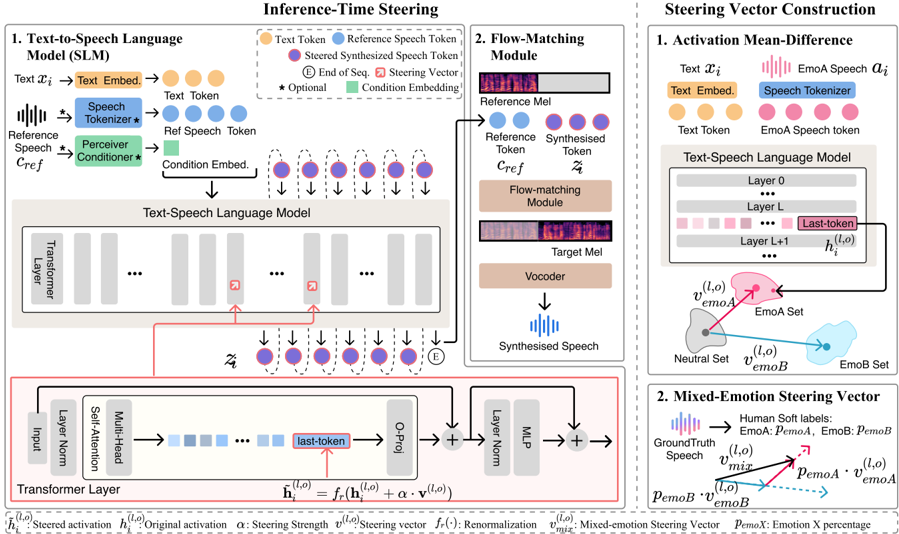

> [!abstract] arXiv · 2026 · Preprint
> **Siyi Wang et al.** · [→ Paper](https://arxiv.org/abs/2602.03420) · Demo: ? · Code: ?
>
> Presents the first systematic analysis of where and how to apply activation steering for emotional control in hybrid (language-model + flow-matching) TTS systems, and introduces a training-free steering framework that composes single-emotion direction vectors to produce quantitatively controllable mixed emotions and text-emotion mismatch.

## Problem

Most expressive TTS systems condition on a single, utterance-level emotion label, which forces the output toward one globally coherent affective state. This collapses two phenomena that are common in natural speech: mixed emotions, where multiple affective tendencies coexist within an utterance, and text-emotion mismatch, where the vocal affect diverges from the literal content (e.g., a strained "I'm fine"). Prior attempts to fix this by adding richer emotion labels or retraining with finer-grained annotations do not resolve the underlying issue, since emotion is still encoded as a single global condition. Activation steering, which perturbs a pretrained model's internal representations along a learned direction at inference time, offers a retraining-free alternative, but three questions were unresolved for TTS specifically: which module of a modular TTS pipeline (the token-generating language model vs. the acoustic flow-matching decoder) carries emotional information, at which layers and operations steering should be injected, and how to evaluate compositional, multi-dimensional emotional control given that standard single-label emotion classification cannot capture mixed or mismatched affect.

## Method

The paper targets modern two-stage hybrid TTS architectures, in which a text-to-speech language model (SLM) maps text and a conditioning reference into discrete speech tokens, and a flow-matching decoder converts those tokens into a mel-spectrogram that a vocoder renders to waveform. To determine where emotion is encoded, the authors design a cross-conditioning diagnostic: emotion is injected only at the SLM while the flow-matching module stays neutral (SLM-driven), or only at the flow-matching module while the SLM stays neutral (Flow-driven). Comparing F0 and energy contour consistency (via concordance correlation coefficient) and speaking-rate variability across the two conditions isolates which module actually shapes emotional prosody.

To find the best injection sites within the SLM, the method trains linear probes on last-token activations at every transformer layer and operation (attention projections, residual-stream points, MLP outputs) to predict emotion labels, using probe accuracy as a proxy for linear separability and thus steerability.

Steering vectors are constructed with a mean-difference approach: for each target emotion, the vector is the difference between the mean SLM activation of emotional utterances and the mean activation of speaker- and transcript-matched neutral utterances at the selected layer/operation, isolating acoustic-emotional variation from content or speaker identity. At inference, the vector is added to the corresponding activation with a scalar steering strength and the modified activation is renormalized to preserve its original magnitude. For mixed emotions, single-emotion vectors are linearly combined with weights derived from consensus mixing proportions; for text-emotion mismatch, a single-emotion vector overrides the text-implied emotion signal. To evaluate mixed-emotion synthesis without a discrete ground truth, the paper collects multi-rater one-hot emotion annotations and averages them into a soft consensus distribution used both as target mixing weights and as an evaluation reference.

The method is evaluated on two hybrid TTS backbones with different internal designs: CosyVoice2 (Qwen2-based SLM decoder, 24 layers, DiT flow-matching, HiFi-GAN vocoder) and IndexTTS2 (GPT2-style decoder operating directly on audio codebook tokens, 24 layers, DiT flow-matching, BigVGANv2 vocoder). No backbone parameters are retrained; steering is applied entirely at inference time.

## Key Results

The cross-conditioning diagnostic on CosyVoice2 (N=300) shows SLM-driven conditioning produces markedly divergent prosody across emotions (F0 CCC 0.109, energy CCC 0.308, speaking-rate STD 0.691), while Flow-driven conditioning yields largely overlapping contours (F0 CCC 0.305, energy CCC 0.737, speaking-rate STD 0.518), indicating the flow-matching module mainly performs acoustic rendering rather than emotional shaping. Linear-probe discriminability peaks at mid-to-late SLM layers and attention outputs, with the exact peak layer range differing by backbone (layers 10-17 for CosyVoice2, layers 5-10 for IndexTTS2).

On mixed-emotion synthesis (CREMA-D in-distribution and IEMOCAP out-of-distribution, both backbones), CoCoEmo steering improves E-SIM, H-Rate, and Spearman rank correlation over no-steering and over instruction-based or built-in emotion-vector control baselines, while preserving speaker similarity (S-SIM) and keeping WER comparable to baselines; naturalness MOS is maintained or improved (e.g., CosyVoice2 on CREMA-D: N-MOS 4.11 for no-steering vs. 4.25 for CoCoEmo at alpha=3.0). Steering can also be layered on top of instruction-based or emotion-vector conditioning for further gains in target-emotion probability and rank correlation. On high text-emotion mismatch (IEMOCAP), steering raises E-SIM and target-emotion probability further than instruction-only control does (e.g., CosyVoice2: E-SIM 0.802 no-steer vs. 0.862 at alpha=6.0; target-emotion probability 0.197 vs. 0.504).

## Novelty Assessment

The core novelty is methodological rather than architectural: the paper does not propose a new TTS backbone but a systematic, evidence-driven recipe for applying activation steering to existing hybrid TTS systems, including (1) an empirical localization of where emotional prosody is generated within a modular pipeline, (2) a discriminability-driven procedure for selecting steering layers/operations instead of heuristic placement, and (3) a compositional steering-vector construction and multi-rater evaluation protocol purpose-built for mixed and mismatched emotions, which prior single-label emotion classification could not assess. Activation steering itself, and its application to TTS emotion control, has prior precedent; this paper's distinct contribution is the systematic where/how analysis and the extension to quantitatively composable mixed emotions with a dedicated evaluation framework, validated across two structurally different backbones without any retraining.

## Field Significance

moderate — The paper provides a generalizable empirical finding (that emotional prosody in hybrid TTS is primarily carried by the language-model stage rather than the flow-matching decoder) together with a concrete, retraining-free technique for composable emotional control, both validated on two backbones with different internal architectures. Its scope is narrow (emotion control specifically) and it builds directly on existing activation-steering methods for TTS rather than introducing a new backbone or training paradigm.

## Claims

- **supports:** In modular hybrid TTS pipelines that separate a token-generating language model from an acoustic flow-matching decoder, emotional prosody is predominantly synthesized by the language-model stage rather than the acoustic decoder stage.
  > *Evidence:* Cross-conditioning diagnostic on CosyVoice2 (N=300) shows SLM-driven conditioning produces divergent F0/energy contours across emotions (F0 CCC 0.109, energy CCC 0.308) while Flow-driven conditioning yields largely overlapping contours (F0 CCC 0.305, energy CCC 0.737), indicating the flow-matching module mainly performs acoustic rendering. *(§2.1, Table 1, Figure 2)*
- **supports:** Emotion-specific directions in a TTS language model's internal representations are approximately linearly separable, and this separability is concentrated in mid-to-late transformer layers and attention-output activations, making them the most reliable sites for direction-vector steering.
  > *Evidence:* Layer- and operation-level linear probing identifies layers 10-17 and attention outputs as most discriminative for CosyVoice2, with an analogous but shifted peak (layers 5-10) for IndexTTS2; layer-wise steering effectiveness (TEP) correlates with this discriminability (rho = 0.5078). *(§2.2, §4.5, Figure 3, Figure 7)*
- **supports:** Weighted composition of single-emotion steering vectors, extracted via mean-difference contrast between speaker- and content-matched emotional and neutral activations, enables quantitative control over mixed-emotion proportions in synthesized speech beyond what discrete emotion labels or natural-language instructions provide.
  > *Evidence:* On CREMA-D (in-distribution) and IEMOCAP (out-of-distribution) with CosyVoice2 and IndexTTS2, CoCoEmo mixed-emotion steering improves E-SIM, H-Rate, and Spearman correlation over no-steering and over instruction-based/emotion-vector baselines, while instruction-based control biases toward the mixed direction without proportional quantitative control. *(§4.2, Table 2, Figure 4)*
- **complicates:** Increasing activation-steering strength to strengthen emotional control trades off against speech naturalness and intelligibility, so steering magnitude must be tuned per backbone rather than maximized freely.
  > *Evidence:* The paper reports a stable operating range of alpha in [0, 4.5] without quality degradation, but notes that larger values up to alpha=6.0 may occasionally reduce intelligibility; combining steering with instruction-based conditioning at alpha=5.0 on CosyVoice2/IEMOCAP drops naturalness MOS to 2.18-2.54 from a no-steer baseline of 3.94. *(§4.5, Table 2)*
- **complicates:** Steering vectors extracted for one backbone architecture do not transfer directly to another; the optimal injection layers and steering-strength operating range must be recalibrated per backbone.
  > *Evidence:* Optimal steering layers differ between CosyVoice2 (top-2 layers, 17 and 14) and IndexTTS2 (top-3 layers, 6, 8, and 1), and discriminability peaks at different depths (layers 10-17 vs. 5-10) due to differing internal architectures (Qwen2-based decoder vs. GPT2-style decoder operating directly on audio codebook tokens). *(§4.5, Appendix A.1, Table 4)*

## Limitations and Open Questions

The method is validated on only two hybrid (autoregressive language model + flow-matching decoder) TTS backbones; both share the same broad architectural family, so it is not established from this paper whether the SLM-carries-emotion finding or the steering recipe generalizes to non-autoregressive or purely diffusion-based TTS systems. Steering layers, operations, and the stable alpha range are backbone-specific and must be re-derived (via discriminability probing) for each new model rather than transferring directly. On the IEMOCAP out-of-distribution set, layering steering on top of instruction-based conditioning produced a slight decrease in E-SIM relative to steering alone, which the authors attribute to the subtler emotional expressions in that dataset. The Impact Statement notes that stronger emotional controllability in synthetic speech increases risk for more persuasive impersonation and social-engineering misuse, and recommends consent, disclosure, and abuse-prevention safeguards for deployed systems.

## Wiki Connections

- [[emotion-synthesis|Emotion Synthesis]] — introduces a training-free activation-steering technique for controllable, composable emotional TTS, including mixed-emotion and text-emotion-mismatch synthesis that static emotion-label conditioning cannot produce.
- [[autoregressive-codec-tts|Autoregressive Codec TTS]] — analyzes and steers the autoregressive speech-token-generating language-model stage of two hybrid codec-token TTS backbones, showing it is the primary carrier of emotional prosody.
- [[flow-matching|Flow Matching]] — shows via a cross-conditioning diagnostic that the flow-matching decoder stage of hybrid TTS pipelines contributes comparatively little to emotional prosody, mainly performing acoustic rendering.
- [[evaluation-metrics|Evaluation Metrics]] — introduces a multi-rater consensus annotation protocol and metrics (E-SIM, TEP, Spearman rank correlation, H-Rate) purpose-built for quantifying mixed-emotion and text-emotion-mismatch synthesis, which single-label emotion classification cannot capture.
- [[subjective-evaluation|Subjective Evaluation]] — conducts naturalness MOS listening tests with 10-13 human raters to confirm that steering-based emotional control does not degrade perceived speech quality.
- [[2506.21619|IndexTTS2]] — used as one of two backbones for steering experiments, contrasted against CosyVoice2 to show steering sites and operating ranges must be recalibrated per architecture.
- [[2412.10117|CosyVoice 2]] — used as the primary backbone for the cross-conditioning diagnostic, layer/operation discriminability analysis, and most reported steering results.
- [[2508.03543|EmoSteer-TTS]] — closest prior activation-steering approach for TTS emotion control; this paper extends the idea with systematic layer selection and compositional mixed-emotion control.
- [[2510.13293|Cross-modal Consistency Guidance for Robust Emotion Control]] — cited as related work on overcoming text-implied emotion bias in autoregressive TTS, which this paper's steering-based mismatch handling also targets.
