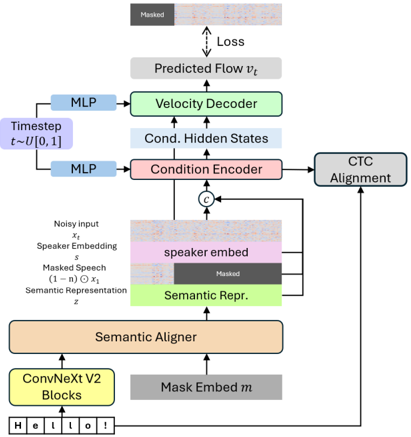

> [!abstract] arXiv · 2026 · Preprint
> **Chunyat Wu et al.** (The Chinese University of Hong Kong) · [→ Paper](https://arxiv.org/abs/2602.05207) · Demo: ✓ · Code: ✓
>
> Proposes ARCHI-TTS, a non-autoregressive flow-matching TTS model with a dedicated semantic aligner for text-speech alignment and a training-free inference acceleration mechanism that reuses encoder features across denoising steps.

## Problem

Non-autoregressive, diffusion/flow-matching-based TTS systems achieve strong zero-shot synthesis quality but face two persistent obstacles. First, text-speech alignment modeling is difficult: explicit duration predictors and monotonic alignment search can constrain naturalness, while simpler padding-based alignment strategies (used by E2-TTS and F5-TTS) sacrifice a dedicated alignment mechanism. Second, the iterative denoising process of flow-matching and diffusion decoders is computationally expensive; prior acceleration approaches rely on distillation, which requires a pretrained teacher model and additional forward passes during training, increasing training complexity.

## Method

ARCHI-TTS is a non-autoregressive TTS model built around two components: a semantic aligner and a flow-matching decoder split into a condition encoder and a velocity decoder, both built from Diffusion Transformer (DiT) blocks.

The semantic aligner is a transformer encoder that takes two input sequences: text tokens (character or pinyin, encoded through ConvNeXt V2 blocks) and a "speech-length" sequence formed by replicating a learnable mask embedding to match the target latent length. Full self-attention over these sequences lets the aligner aggregate text semantics onto a temporal canvas whose length is set independently of the text token count, decoupling audio duration from text length even in low-token-rate character tokenization scenarios where text tokens can be shorter than the corresponding audio frames.

Instead of mel-spectrograms, ARCHI-TTS operates on a highly compressed, low-token-rate continuous latent representation produced by a custom Variational Autoencoder trained following the Stable Audio recipe, encoding 24kHz speech into 12.5Hz latents with a KL-regularized latent space. This lets the same VAE serve as both encoder and decoder, removing the need for a separate vocoder.

The condition encoder is conditioned on the semantic features from the aligner, a global speaker embedding (extracted with a CAM++ model) replicated across the sequence, and an audio prompt formed by masking a segment of the target latent, all combined through a conditional flow matching (CFM) objective that learns the time-dependent velocity field along the optimal-transport path between noise and data. The velocity decoder injects the condition encoder's hidden states as a global condition (added to the timestep embedding, rather than concatenated) and predicts the flow velocity. An auxiliary CTC loss is applied to an intermediate DiT block of the condition encoder, providing explicit text-alignment supervision alongside the CFM loss and a cosine-similarity-based velocity-direction loss; logit-normal timestep sampling focuses training on the harder start/end points of the denoising trajectory. At inference, Classifier-Free Guidance and an Euler ODE solver generate the latent, which the VAE decoder converts to waveform.

For inference acceleration, the model reuses the condition encoder's hidden states across adjacent denoising steps: given N total NFE steps and K steps at which the encoder is actually recomputed, the "sharing ratio" 1 − K/N determines how much of the (typically encoder-dominated) computation is skipped, without any additional distillation training.

Training used the 100k-hour multilingual Emilia dataset for the base model (289M parameters, 8 RTX 5090 GPUs, 4 days, 800k updates), with the 50k-hour LibriHeavy and 600-hour LibriTTS corpora used for ablation studies at smaller scale.

## Key Results

On LibriSpeech-PC test-clean, ARCHI-TTS reaches WER 1.98% and speaker similarity (SSIM) 0.70 with an RTF of 0.21, outperforming CosyVoice, FireRedTTS, MaskGCT, E2-TTS, F5-TTS, and DiTAR on WER at this benchmark while using a smaller parameter count (289M) and a fraction of the training data and compute reported for several baselines *(Table 1)*. On the SeedTTS test set, it achieves WER 1.47%/1.42% and SSIM 0.68/0.70 on English/Chinese respectively, again improving WER over CosyVoice 2, FireRedTTS, MaskGCT, E2-TTS, and F5-TTS, though DiTAR and Seed-TTS DiT retain higher SSIM on at least one language pair *(Table 2)*.

In a human MOS evaluation against F5-TTS and CosyVoice2 on 10 SeedTTS samples (16 raters, naturalness/similarity/preference), ARCHI-TTS scores competitively (NMOS 3.53, SMOS 3.48) but trails both baselines slightly, and its CMOS preference score against ground truth (+0.09) is comparable to CosyVoice2's (+0.10) *(§3.4, Table 3)*.

Ablations on smaller LibriTTS/LibriHeavy-trained models show the auxiliary CTC loss speeds WER convergence (2.14% WER at 100k updates vs. later degradation without it), removing the speaker embedding significantly reduces SSIM (indicating low-token-rate VAE latents retain less speaker identity than mel-spectrograms), and applying vector quantization to the semantic features with a doubled codebook size slightly improves WER over the continuous baseline *(§3.4, Table 4)*. The sharing-ratio ablation shows a 75% sharing ratio drops RTF to 0.09 at 32 NFE while maintaining WER 1.98%/SIM 0.70, with higher NFE compensating for the quality loss introduced by more aggressive sharing *(§3.4, Fig. 2)*.

## Novelty Assessment

The core novelty is architectural: a dedicated transformer-based semantic aligner that decouples the output latent length from the text token count via a replicated mask-embedding canvas, combined with a condition-encoder/velocity-decoder DiT split that enables training-free inference acceleration by reusing encoder hidden states across denoising steps. The auxiliary CTC alignment loss is an incremental but effective addition on top of this architecture. The efficiency claim is genuinely training-free (no distillation, no extra teacher model), which differentiates it from prior acceleration approaches like DMDSpeech and E1-TTS that require teacher-student or adversarial distillation. The continuous VAE latent representation and CFM training recipe themselves are largely adopted from existing work (Stable Audio-style VAE, standard optimal-transport flow matching), so the contribution is best framed as a refinement of the encoder-decoder split and alignment mechanism rather than a new generative paradigm.

## Field Significance

moderate — ARCHI-TTS demonstrates that competitive zero-shot TTS quality is achievable with substantially less training compute and data than several contemporaneous systems, and its training-free encoder-reuse acceleration mechanism offers a general recipe applicable to other DiT-based flow-matching TTS architectures with a similarly separated encoder-decoder structure. Its own MOS results still trail established systems, positioning it as a solid but incremental engineering and architectural contribution rather than a new state of the art.

## Claims

- **supports:** Splitting a flow-matching TTS decoder into a condition encoder and a velocity decoder, with the encoder's hidden states injected as a global condition rather than concatenated per-frame, enables training-free inference acceleration by reusing encoder outputs across multiple denoising steps.
  > *Evidence:* Sharing condition-encoder hidden states across denoising steps at a 75% sharing ratio reduces RTF from 0.21 to 0.09 at 32 NFE while maintaining WER 1.98% and SSIM 0.70, with no additional distillation training required. *(§2.6, §3.4, Figure 2)*
- **supports:** An auxiliary CTC-based alignment loss applied to an intermediate layer of a flow-matching TTS encoder can supplement implicit alignment learning and accelerate WER convergence.
  > *Evidence:* Ablation shows the model reaches a WER of 2.14% at 100k training updates with the CTC alignment loss present, attributed to the loss providing a faster-converging alignment signal alongside the CFM objective. *(§3.4)*
- **complicates:** Replacing mel-spectrograms with a highly compressed, low-token-rate continuous VAE latent representation trades off some inherent speaker-identity information, making an explicit speaker-embedding conditioning signal more load-bearing than in mel-spectrogram-based pipelines.
  > *Evidence:* Removing the speaker embedding causes a significant drop in SSIM on the LibriHeavy-trained base model (0.71 → 0.62), a larger relative degradation than reported in comparable mel-spectrogram-based systems, suggesting 12.5Hz VAE latents compress mostly acoustic rather than speaker-identity information. *(§3.4, Table 4)*
- **complicates:** Strong objective metrics (WER, speaker-similarity) on standard TTS benchmarks do not guarantee parity with established systems on human-rated naturalness and similarity.
  > *Evidence:* Despite outperforming F5-TTS and CosyVoice2 on WER across LibriSpeech-PC and SeedTTS test sets, ARCHI-TTS's NMOS (3.53) and SMOS (3.48) in a 16-rater human evaluation trail both F5-TTS (3.62/3.54) and CosyVoice2 (3.57/3.32) on naturalness. *(§3.4, Table 3)*

## Limitations and Open Questions

The human evaluation is small in scale (10 samples, 5 English/5 Chinese, 16 raters), limiting statistical confidence in the MOS comparisons against F5-TTS and CosyVoice2. The paper's own MOS results show ARCHI-TTS "slightly lags behind" these baselines on naturalness despite leading on WER, an open tension the paper does not resolve. The inference-acceleration mechanism's quality-efficiency trade-off is only characterized at a single base model scale (289M parameters); it is not established whether the encoder-reuse strategy generalizes as favorably to substantially larger flow-matching TTS models. The paper also notes future work is needed on further sampling acceleration in the decoder itself, an unresolved bottleneck.

## Wiki Connections

- [[flow-matching|Flow Matching]] — ARCHI-TTS is a conditional flow-matching TTS system with a novel condition-encoder/velocity-decoder DiT split that enables training-free inference acceleration, extending the efficiency space of flow-matching decoders explored by systems like F5-TTS and E2-TTS.
- [[zero-shot-tts|Zero-Shot TTS]] — the model performs zero-shot voice cloning by conditioning on a reference audio prompt, reference transcription, and speaker embedding, estimating output duration from the reference audio's token-per-frame rate.
- [[multilingual-tts|Multilingual TTS]] — trained on the 100k-hour multilingual Emilia corpus and evaluated separately on English and Chinese SeedTTS test sets, reporting per-language WER and SSIM within a single model.
- [[subjective-evaluation|Subjective Evaluation]] — reports a 16-rater human MOS study (NMOS, SMOS, CMOS) against F5-TTS and CosyVoice2, finding the proposed model competitive but trailing on naturalness despite leading on WER.
- [[2407.05361|Emilia]] — used as the primary 100k-hour multilingual training corpus for the base ARCHI-TTS model.
- [[2025.acl-long.313|F5-TTS]] — used as a primary baseline across all three evaluation tables and the human MOS study, and its padding-based text-speech alignment approach is cited as the alternative to ARCHI-TTS's dedicated semantic aligner.
- [[2406.02430|Seed-TTS]] — its SeedTTS test set is used for zero-shot English/Chinese evaluation, and Seed-TTS DiT is reported as a comparison baseline in Table 2.
- [[2502.03930|DiTAR]] — used as a comparison baseline on both LibriSpeech-PC and SeedTTS benchmarks, outperforming ARCHI-TTS on SeedTTS SSIM in one language.
- [[2412.10117|CosyVoice 2]] — used as a baseline on the SeedTTS benchmark and in the human MOS evaluation.
- [[2409.00750|MaskGCT]] — used as a comparison baseline on both LibriSpeech-PC and SeedTTS benchmarks.
- [[2406.18009|E2 TTS]] — cited as a precedent for padding-based text-speech alignment and used as a comparison baseline across both benchmarks.
- [[2407.05407|CosyVoice]] — used as a comparison baseline on the LibriSpeech-PC benchmark.
