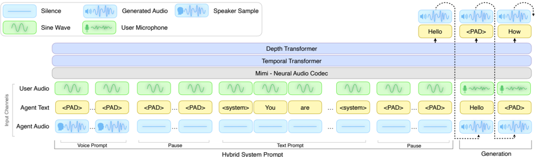

> [!abstract] arXiv · 2026 · Preprint
> **Rajarshi Roy et al.** (NVIDIA) · [→ Paper](https://arxiv.org/abs/2602.06053) · Demo: ? · Code: ✓
>
> Introduces PersonaPlex, a Moshi-based full-duplex conversational speech model conditioned on a Hybrid System Prompt combining text-based role description with audio-based zero-shot voice cloning, and extends Full-Duplex-Bench with a new multi-role customer-service evaluation (Service-Duplex-Bench), achieving state-of-the-art naturalness, role adherence, and speaker similarity among open duplex models.

## Problem

Full-duplex speech-to-speech models achieve natural, low-latency conversation with real-time turn-taking, but existing systems are restricted to a single fixed voice and a single fixed (typically generic assistant) role, which limits their use in structured, role-driven real-world applications like customer service or multi-character interaction, and prevents personalization. Voice-conditioned TTS and instruction-following text LLMs have independently made progress on speaker adaptation and role/instruction conditioning respectively, but full-duplex systems face additional latency constraints and coupled speech-text generation dynamics that have prevented these capabilities from being integrated into a single low-latency duplex model. Existing full-duplex evaluation, specifically Full-Duplex-Bench, also only tests a single generic assistant role, leaving role-conditioned behavior in structured multi-role scenarios unevaluated.

## Method

PersonaPlex follows the Moshi architecture unchanged (three input/output streams: user audio, agent text, agent audio, autoregressively generating text and audio jointly while receiving live user audio), initializing its weights directly from pretrained Moshi and fine-tuning only with a new conditioning format. This Hybrid System Prompt consists of two temporally concatenated segments: a text prompt segment that performs role conditioning by forcing scenario-specific text tokens onto the agent text channel while keeping the agent audio channel silent, and a voice prompt segment that performs voice cloning by supplying a short speech sample on the agent audio channel while padding the agent text channel; the user audio channel is replaced with a fixed 440Hz sine wave during the prompt for stable conditioning, with custom delimiters marking the prompt/dialogue boundary. The voice segment is placed first (no performance difference was observed either way) to enable prefilling and reduce latency when voice cloning isn't needed. Training masks loss backpropagation on the system prompt itself and, following Moshi, downweights non-semantic audio tokens (0.02x) and padded text tokens (0.3x) to address token-class imbalance.

Training data is entirely synthetic: dialog transcripts are generated hierarchically (service domain, then scenario, then full two-speaker transcript) using Qwen-3-32B and GPT-OSS-120B, alongside a separate fixed-role question-answering dataset ("wise and friendly teacher"). Corresponding audio is synthesized differently per dataset: service scenarios use Dia, a multi-speaker TTS model that jointly generates both speakers' audio from two speaker samples to better capture timing, interruptions, and room tone; question-answering scenarios use the single-speaker, zero-shot Chatterbox TTS with an audio-stitching step (including negative-duration silence padding to simulate barge-in). Voice samples for cloning come from VoxCeleb, Libriheavy, LibriTTS, CommonAccent, and Fisher (26,296 total, with 2,630 reserved for speaker-similarity test evaluation). The paper also introduces Service-Duplex-Bench, an extension to Full-Duplex-Bench adding 350 single-turn customer-service evaluation questions across 50 unique role scenarios (7 questions each, probing proper-noun recall, context adherence, unfulfillable-request handling, and customer-rudeness management), with training scenarios kept disjoint from evaluation scenarios.

## Key Results

PersonaPlex is initialized from Moshi and fine-tuned for 24,576 steps (batch size 32, max sequence length 2048 tokens / 163.84 seconds) on 8xA100 GPUs in 6 hours, on 1,840 hours of customer-service dialog (105,410 dialogs) plus 410 hours of QA dialog (39,322 dialogs). On dialog naturalness (human DMOS ratings via Amazon Mechanical Turk), PersonaPlex scores highest among compared systems on both Full-Duplex-Bench (3.90 vs. Gemini Live's 3.72, Qwen2.5-Omni's 3.70, Freeze-Omni's 3.51, Moshi's 3.11) and Service-Duplex-Bench (3.59 vs. Gemini's 3.22 and lower for other baselines). On voice-cloning speaker similarity (WavLM-TDNN cosine similarity), PersonaPlex reaches 0.57 SSIM versus 0.10 or lower for all baselines except itself. On Full-Duplex-Bench's turn-taking metrics (pause handling, backchannel, smooth turn-taking, interruption handling), PersonaPlex leads or is competitive with the best system on most dimensions. On Service-Duplex-Bench role-adherence (GPT-4o-judged), PersonaPlex scores 4.48, second only to Gemini Live's 4.73 and ahead of Freeze-Omni (4.02), Qwen2.5-Omni (2.76), and Moshi (1.75). A training-data-scale ablation shows Full-Duplex-Bench speaker similarity and naturalness are already strong at 25% of the full dataset, while Service-Duplex-Bench role adherence improves steadily and monotonically with more data up to 100%. The publicly released checkpoint incorporates further improvements (additional Fisher-corpus real-conversation training, synthetic pitch/formant-augmented voices via TortoiseTTS for privacy, and unified ChatterboxTTS-only synthetic audio generation), reaching an improved 0.65 SSIM and maintaining competitive naturalness in a separate evaluation.

## Novelty Assessment

The core claim, that role and voice conditioning can be integrated into an existing full-duplex architecture via prompt-format changes alone, without altering the underlying network structure, is directly supported by the experimental design: PersonaPlex is Moshi with identical architecture, differing only in the Hybrid System Prompt format and fine-tuning data. This is a meaningful demonstration that duplex conditioning is more a data-and-prompting problem than an architectural one, at least starting from a strong pretrained duplex backbone. The Service-Duplex-Bench extension is a genuine and useful benchmark contribution, addressing a real gap (Full-Duplex-Bench's single-role limitation) with a concrete, disjoint-from-training evaluation set the authors plan to release. The synthetic data construction pipeline (hierarchical scenario generation, multi-speaker TTS for natural timing, negative-duration-silence barge-in simulation) is a practical and reasonably validated methodology, citing prior work for the barge-in simulation technique specifically. The paper is candid that PersonaPlex does not fully match Gemini Live (a closed commercial system) on role-adherence, and that the released checkpoint's numbers are separately evaluated and "not directly comparable" to the main experimental results, an important caveat for readers.

## Field Significance

> [!tip]
> High, PersonaPlex demonstrates that fine-grained role and voice conditioning can be added to a full-duplex speech-to-speech model without architectural changes, achieving what the authors describe as the first open model to reach naturalness comparable to closed commercial systems (Gemini Live) while adding capabilities (multi-role, multi-voice) that even those commercial systems only partially support (fixed voice with role conditioning via prompts). The Service-Duplex-Bench extension and the public checkpoint release both increase the likelihood of follow-on work building directly on this paper's evaluation protocol and model.

## Claims

- **supports:** A hybrid system prompt combining a text-based role description segment with an audio-based voice-cloning segment can be integrated into an existing full-duplex speech-to-speech architecture without modifying its underlying network structure, enabling joint role and voice conditioning.
  > *Evidence:* PersonaPlex is initialized from unmodified Moshi weights and fine-tuned only with a new hybrid text-then-audio system prompt format, yet achieves both strong voice-cloning speaker similarity (0.57 SSIM) and role adherence (Service-Duplex-Bench score 4.48) far exceeding the unmodified Moshi baseline (0.10 SSIM, 1.75 score). *(§3.1, §4, Table 1, Table 4, Table 5)*
- **supports:** Full-duplex speech-to-speech models can be conditioned on structured, multi-role scenarios without sacrificing the turn-taking responsiveness and naturalness that distinguishes full-duplex architectures from cascaded or half-duplex systems.
  > *Evidence:* PersonaPlex achieves the highest dialogue naturalness MOS among compared systems on both Full-Duplex-Bench (3.90) and the role-focused Service-Duplex-Bench (3.59), while leading on multiple turn-taking metrics, and its Service-Duplex-Bench role-adherence score (4.48) approaches the best non-duplex commercial system (Gemini Live, 4.73). *(§4.2, Table 1, Table 2, Table 4)*
- **complicates:** A model's overall dialogue-naturalness ranking on a general full-duplex benchmark does not necessarily predict its ranking on role-adherence tasks specific to structured service scenarios.
  > *Evidence:* Qwen2.5-Omni scores third-highest (3.70 DMOS) on general Full-Duplex-Bench naturalness but drops to near-bottom (2.76 mean GPT-4o score) on Service-Duplex-Bench role-adherence, falling behind Freeze-Omni (4.02), a reversal in relative ranking between the two benchmark types. *(§4.2, Table 1, Table 4)*
- **supports:** Scaling the amount of synthetic role- and voice-conditioned training data continues to improve role adherence even after voice-cloning and general conversational quality gains have largely saturated.
  > *Evidence:* Full-Duplex-Bench speaker similarity and naturalness scores are already strong at 25% of the full synthetic dataset, while Service-Duplex-Bench role-adherence scores improve steadily and monotonically as data scale increases from 25% to 100%. *(§4.3, Table 5)*

## Limitations and Open Questions

- PersonaPlex does not exceed Gemini Live, a closed commercial system, on Service-Duplex-Bench role adherence (4.48 vs. 4.73), so the paper's "surpasses state-of-the-art" claim holds specifically relative to other open/hybrid duplex systems, not all commercial systems.
- The released checkpoint differs materially from the experimental setup described in the main paper (additional real-conversation training data, different synthetic voice/TTS pipeline for privacy), and its evaluation numbers are explicitly stated as not directly comparable to the main results, which could confuse readers comparing the two.
- Voice cloning for the released checkpoint uses only synthetic (TortoiseTTS-generated, pitch/formant-augmented) voices rather than real speaker recordings, a deliberate privacy-motivated trade-off whose effect on real-world voice-cloning generalization is not separately evaluated.
- Service-Duplex-Bench's 350 questions are single-turn probes within 50 role scenarios; multi-turn role-adherence robustness over longer structured conversations is not directly tested by this evaluation set.

## Wiki Connections

- [[speech-to-speech|Speech-to-Speech]] — extends a full-duplex speech-to-speech dialogue architecture with role and voice conditioning, addressing the fixed-role, fixed-voice limitation of prior duplex systems.
- [[zero-shot-tts|Zero-Shot TTS]] — enables zero-shot voice cloning within a duplex conversational model via an audio-based voice prompt segment in its Hybrid System Prompt.
- [[subjective-evaluation|Subjective Evaluation]] — collects Dialogue Mean Opinion Score ratings from Amazon Mechanical Turk evaluators across multiple benchmark categories.
- [[spoken-language-model|Spoken Language Model]] — processes live external user audio in a genuine full-duplex dialogue context via an LLM-based architecture that jointly generates text and speech tokens.
- [[2410.00037|Moshi]] — PersonaPlex's exact base architecture; its weights are initialized from pretrained Moshi and fine-tuned only with a new prompt format and training data.
- [[2503.04721|Full-Duplex-Bench]] — the benchmark this paper evaluates on and directly extends with Service-Duplex-Bench, a new multi-role customer-service evaluation.
- [[2503.20215|Qwen2.5-Omni]] — a baseline compared against on both Full-Duplex-Bench and Service-Duplex-Bench, notable for strong general naturalness but weak role adherence.
- [[2411.00774|Freeze-Omni]] — a baseline compared against across dialogue naturalness, turn-taking, and role-adherence evaluations.
- [[2410.17196|VoiceBench]] — cited in related work as a conversational speech evaluation benchmark focused on single-turn, half-duplex interaction, contrasted with this paper's full-duplex evaluation approach.
- [[2410.11190|Mini-Omni2]] — cited as a half-duplex approach that streams speech tokens for lower latency but remains reliant on external turn-taking mechanisms and fixed voices.
- [[2505.09388|Qwen3]] — Qwen3-32B is used to generate the hierarchical synthetic dialog transcripts and role contexts for training.
