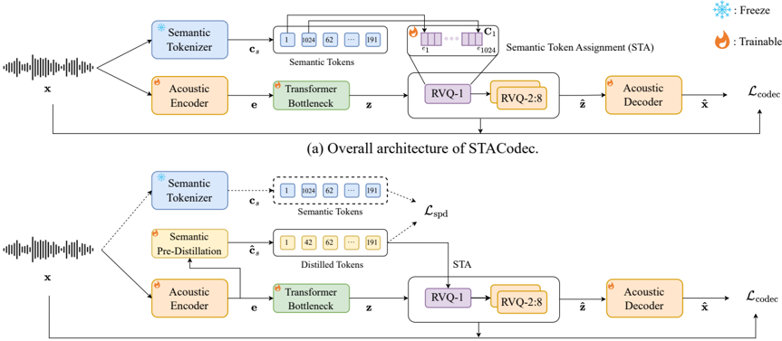

> [!abstract] arXiv · 2026 · Preprint
> **Kaiyuan Zhang et al.** (University of California, Los Angeles) · [→ Paper](https://arxiv.org/abs/2602.06180) · Demo: ? · Code: ?
>
> Introduces STACodec, a residual-vector-quantization audio codec that assigns externally derived semantic tokens directly to the first RVQ layer, and a pre-distillation module that predicts those tokens internally to remove the self-supervised tokenizer dependency at inference time.

## Problem

Neural audio codecs that feed token-based language models need discrete tokens that carry both fine acoustic detail (for high-fidelity reconstruction) and semantic content (for downstream tasks like ASR or spoken understanding). Pure acoustic codecs reconstruct audio well but the resulting tokens are semantically weak, while pure semantic tokens (obtained by clustering self-supervised learning representations) discard acoustic detail. Prior hybrid codecs try to close this gap by distilling semantic information into the residual vector quantizer (RVQ) codebooks, either by adding an auxiliary loss at RVQ-1 (SpeechTokenizer), summing a semantic loss across all RVQ layers (X-Codec), or supervising RVQ-1 directly with ASR/phoneme recognition labels (PAST). The paper argues that because these training targets do not correlate with fine acoustic structure, the added loss pulls codebook embeddings away from accurate reconstruction, degrading audio quality. A more recent approach, HASRD, avoids the extra loss by disentangling semantic features into the first codebook, but the paper argues this still leaves a feature-space mismatch between the semantic and acoustic representations across RVQ layers, producing a trade-off between reconstruction quality and downstream semantic performance (evidenced empirically by HASRD's own results, §4.1).

## Method

STACodec builds on an EnCodec-style encoder-decoder codec (temporal downscaling [8, 5, 4, 2], 50 Hz frame rate, 128-dim latent, 8-layer/768-dim Transformer bottleneck) with an 8-codebook, 1024-entry-per-codebook RVQ. Instead of adding a semantic distillation loss, STACodec performs semantic token assignment (STA): the first RVQ layer's code index at each time step is directly set equal to the externally computed semantic token index (from K-means clustering on WavLM-large layer 23 or HuBERT-base layer 9 features), and the corresponding first-layer quantized vector is looked up from a trainable codebook C1 rather than fixed to the SSL feature itself (§2.1.2). The residual after this assignment is then quantized by the remaining 7 RVQ layers as standard residual VQ, which the paper argues keeps the embedding space free to specialize toward acoustic reconstruction rather than being pulled toward semantic targets by a loss term.

To remove the dependency on an external SSL-based semantic tokenizer at inference time, the paper adds a Semantic Pre-Distillation (SPD) module: a transformer with the same configuration as the bottleneck, applied to the encoder output before quantization, which predicts the semantic token that would otherwise come from the SSL clustering pipeline (§2.2). The predicted tokens are then substituted into the STA assignment step. SPD is trained with span masking along both the time and feature dimensions of its input to reduce overfitting, and is optimized with a cross-entropy loss against the ground-truth semantic tokens, added to the base codec objective and weighted by λ=5. Training uses a two-stage schedule: the codec is trained first with only the reconstruction/perceptual/commitment objective inherited from EnCodec, then SPD is added and both losses are optimized jointly, with quantization now consuming the SPD-predicted tokens.

The codec is trained on 960 hours of LibriSpeech using 3-second segments, on a single NVIDIA A6000 GPU, for roughly 280,000 steps (STACodec) or 250,000 steps split 90,000/160,000 across the two SPD training stages.

## Key Results

Against four hybrid-codec baselines (SpeechTokenizer, X-Codec, PAST, HASRD) using HuBERT-base semantic features, STACodec improves reconstruction PESQ from 2.79 (X-Codec, the best baseline on this metric) to 3.61, and ViSQOL from 4.30 (HASRD) to 4.50, while also lowering ASR-WER on LibriSpeech test-clean relative to HASRD (10.94% vs. 11.30%) and raising intent-classification accuracy on SLURP from 66.49% (X-Codec) to 70.81% (§4.1, Table 1). Switching the semantic tokenizer from HuBERT-base to WavLM-large improves every reported metric further (PESQ 3.62, ASR-WER 9.35% on test-clean, IC accuracy 74.21%), with the paper reporting statistical significance at p<0.05 against the best open-source hybrid baselines. Codebook-utilization analysis (§4.2, Figure 2) shows STACodec keeps balanced usage across all 8 RVQ layers, in contrast to SpeechTokenizer and PAST, which show low utilization in layers 2–8, and X-Codec, which shows low utilization specifically in layer 1 — offered as an explanation for STACodec's more favorable acoustic/semantic balance.

The SPD variant (STACodec-SPD, no SSL tokenizer at inference) reduces the inference parameter count by 250M and 30 GFLOPs per second of audio relative to using WavLM-large K-means directly, while still outperforming SpeechTokenizer and X-Codec on reconstruction and outperforming PAST on both ASR-WER and IC accuracy (§4.1). However, STACodec-SPD's own numbers are clearly worse than the non-SPD STACodec variants (PESQ drops from 3.61–3.62 to 3.51; ASR-WER on test-clean rises from 9.35–10.94% to 15.39%), so the efficiency gain from removing the SSL tokenizer comes with a measurable quality cost relative to the paper's own best configuration.

## Novelty Assessment

The core contribution is architectural: assigning the first RVQ codebook index directly to an externally derived semantic token, rather than training the codebook toward semantic targets via an auxiliary loss, is a specific and testable design difference from the SpeechTokenizer/X-Codec/PAST family, and the paper's ablations (Table 2) isolate the individual effect of STA, the trainable RVQ-1 codebook, the transformer bottleneck, and input masking for SPD. The SPD module is a second, related contribution: predicting the semantic token before quantization (rather than distilling during or after quantization) is presented as a way to avoid the reconstruction-degrading side effects the paper attributes to prior distillation-based hybrid tokenizers. Both the codec backbone (EnCodec-style encoder/decoder, adversarial/perceptual training objective) and the semantic tokenizers (WavLM, HuBERT K-means) are existing components; the novelty is in how semantic information is injected into the RVQ pipeline, not in the underlying representation learning. The evaluation is limited to a single training corpus (LibriSpeech) and a single training run per configuration, which narrows how far the specific numeric improvements should be expected to generalize.

## Field Significance

moderate — the paper contributes a concrete architectural alternative to loss-based semantic distillation in hybrid audio codecs, with ablation evidence isolating the RVQ assignment mechanism from the trainable-codebook and bottleneck design choices it depends on. Its scope is a single four-page conference contribution evaluated on one dataset and one codec backbone, so it reads as a solid incremental step in the hybrid-codec design space rather than a new paradigm.

## Claims

- **supports:** Assigning an externally computed semantic token directly to the first residual-VQ codebook index, rather than training that codebook toward a semantic target via an auxiliary loss, can improve both reconstruction fidelity and downstream semantic task performance relative to loss-based semantic distillation.
  > *Evidence:* STACodec (HuBERT-base semantic tokens, direct RVQ-1 assignment) reaches PESQ 3.61 and ASR-WER 10.94% on LibriSpeech test-clean, versus PESQ 2.79 (X-Codec) and PESQ 2.60 (SpeechTokenizer), both of which use an auxiliary semantic loss on RVQ output. *(§4.1, Table 1)*
- **complicates:** Removing the dependency on an external self-supervised semantic tokenizer at inference time, by predicting semantic tokens internally, trades reconstruction and downstream-task accuracy for inference efficiency.
  > *Evidence:* Compared with the full STACodec using WavLM-large K-means semantic tokens, the SPD variant reduces inference parameters by 250M and compute by 30 GFLOPs/s, but PESQ drops from 3.62 to 3.51 and ASR-WER on test-clean rises from 9.35% to 15.39%. *(§4.1, Table 1)*
- **complicates:** Balancing acoustic fidelity and semantic information within a shared RVQ codebook space remains sensitive to how tightly the semantic feature is coupled to the codebook, independent of which method is used.
  > *Evidence:* For the HASRD baseline, switching the semantic source from HuBERT-base to BestRQ+ improves ViSQOL from 4.30 to 4.50 but increases ASR-WER from 11.30% to 21.00%, which the paper attributes to over-optimizing the disentangled semantic feature toward acoustic similarity at the expense of semantic content. *(§4.1)*
- **supports:** Component-level ablation of a hybrid codec's RVQ assignment mechanism, trainable first-layer codebook, and bottleneck architecture can each be attributed a distinct, measurable effect on the acoustic/semantic trade-off.
  > *Evidence:* Holding the transformer bottleneck off, removing STA raises ASR-WER from 9.27% to 40.62% while also raising PESQ from 3.58 to 3.88, showing STA trades some reconstruction quality for a large semantic-preservation gain; separately, removing the trainable RVQ-1 codebook lowers PESQ from 3.62 to 3.46, and removing the transformer bottleneck lowers PESQ from 3.62 to 3.58 while slightly improving ASR-WER from 9.35% to 9.27%. *(§4.3, Table 2)*

## Limitations and Open Questions

> [!warning] The evaluation is confined to a single training corpus (LibriSpeech, 960 hours), a single codec backbone configuration, and a single training run per setting, with no reported variance across seeds; the reported PESQ/WER/IC-accuracy improvements over baselines are therefore point estimates rather than results with quantified uncertainty, aside from the paper's own significance test against the best open-source baselines.

The comparison with HASRD relies on numbers copied from the HASRD paper rather than a re-run under matched conditions, since HASRD is not open-sourced (§4.1), which limits how directly its results can be compared to the other baselines that were re-evaluated from official checkpoints. The paper also does not report total model parameter counts for STACodec or STACodec-SPD, only the parameter and compute delta attributable to removing the SSL semantic tokenizer, and it evaluates downstream semantic capability only through ASR and intent classification, leaving open how the resulting tokens perform in other semantic tasks or in a full token-based language model.

## Wiki Connections

- [[neural-codec|Neural Audio Codec]] — proposes a new mechanism (semantic token assignment) for injecting semantic information into the residual vector quantizer of a neural audio codec while preserving acoustic reconstruction quality.
- [[self-supervised-speech|Self-Supervised Speech]] — derives its semantic tokens from K-means clustering on WavLM-large and HuBERT-base representations, and the pre-distillation module is trained to reproduce those self-supervised-derived tokens without runtime access to the SSL model.
- [[gan-vocoder|GAN Vocoder]] — trains the codec's encoder-decoder with the adversarial/perceptual discriminator objective inherited from EnCodec, alongside the reconstruction and RVQ commitment losses.
