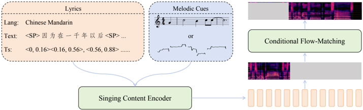

> [!abstract] arXiv · 2026 · Preprint
> **Jiale Qian et al.** (Soul AI Lab / Geely Automobile Research Institute (AI Center) / Tianjin University / Northwestern Polytechnical University (ASLP@NPU)) · [→ Paper](https://arxiv.org/abs/2602.07803) · Demo: ? · Code: ✓
>
> Introduces an open-source zero-shot singing voice synthesis system that unifies MIDI-score and melody-based control in one model and is trained on an order-of-magnitude larger multilingual singing corpus than prior work.

## Problem

Open-source singing voice synthesis (SVS) systems have struggled to reach industrial deployment standards, particularly for robustness and zero-shot generalization to unseen singers. Early systems such as DiffSinger were trained on small, carefully curated corpora and could not generalize beyond training-set singers. Later zero-shot-oriented systems (StyleSinger, the TCSinger series) were still trained on only a few hundred hours of singing data from a limited number of singers, which constrained their zero-shot robustness in practice. More recent large-scale systems (Vevo2, YingMusic-Singer) scaled training data to the thousand-hour range using Transformer or Diffusion Transformer backbones, but adopted a melody-driven synthesis paradigm exclusively, without note-level duration control. This creates two practical limitations: melody extraction from an existing recording is required (blocking pure score-and-lyrics song generation), and the absence of explicit note-duration modeling leaves syllable-level timing uncontrollable, causing temporal misalignment between synthesized vocals and instrumental accompaniment in music-production workflows.

## Method

SoulX-Singer is a non-autoregressive singing voice synthesis model built around a flow-matching decoder implemented as a Diffusion Transformer (DiT), which takes lyric and melody cues as input and predicts mel-spectrograms; a neural vocoder converts the predicted mel-spectrograms into waveform audio. A Singing Content Encoder fuses the multimodal input required for SVS (lyrics, musical score, note type, and F0) into a temporally aligned latent representation for the decoder.

Textual input is represented as character-level pinyin for Mandarin and Cantonese (with language tags to disambiguate pronunciation across the two) and as phonemes bounded by explicit word-boundary tokens for English. Melodic input consists of discrete note-pitch sequences and continuous F0 sequences, each passed through a binary gating layer before linear projection: during training, either the note-pitch or F0 stream is randomly dropped to force the model to extract robust features from a single modality, and at inference the corresponding gate is enabled to select melody-control mode (continuous F0 from a reference recording) or score-control mode (discrete MIDI input only). A length regulator expands note-type, note-pitch, and text embeddings according to each note's duration and combines them by element-wise addition into a single mel-aligned conditioning sequence, enforcing explicit note-to-mel synchronization.

Training proceeds in two stages. The first stage uses short segments (2-16s) with the acoustic prompt deliberately sampled from a non-adjacent segment of the target audio, encouraging the model to rely on linguistic and musical conditioning rather than local acoustic continuity. The second stage concatenates adjacent segments into longer training clips (30-90s) with the prompt sampled from the segment immediately preceding the target, strengthening long-form prompt-following and long-range temporal modeling. The training corpus is a custom pipeline output: raw songs are passed through a two-stage vocal separation and de-reverberation process (both stages built on Mel-Band RoFormer), lyrics are transcribed and word-aligned with language-specific ASR models (Paraformer for Mandarin/Cantonese, Parakeet-TDT for English) after language identification with a fine-tuned SenseVoiceSmall, and note-level pitch/duration tokens are derived with the ROSVOT transcription model, yielding over 42,000 hours of vocal data (~20K Mandarin, ~20K English, ~2K Cantonese).

The authors additionally derive SoulX-Singer-SVC, a singing voice conversion variant for scenarios lacking precise MIDI and time-aligned lyrics. It replaces the score and text encoders with a frozen Whisper-base encoder that extracts semantic representations directly from source singing audio, while the F0 encoder and flow-matching decoder are initialized from pretrained SoulX-Singer parameters and fine-tuned on a smaller high-quality singing dataset.

## Key Results

On the GMO-SVS benchmark (built from GTSinger, M4Singer, and Opencpop test splits, none used in training), SoulX-Singer outperforms all evaluated baselines (StyleSinger, TCSinger, YingMusic-Singer, Vevosing) in both Mandarin and English. In melody-control mode it achieves the lowest F0 Frame Error (0.044 Chinese, 0.036 English), substantially below the best baseline YingMusic-Singer (0.132 Chinese); in score-control mode it achieves the lowest WER (0.069 Chinese, 0.149 English), outperforming Vevosing and TCSinger. On SoulX-Singer-Eval, a newly constructed benchmark of 100 segments from 50 singers unseen by any evaluated model, score-controlled SoulX-Singer attains the highest speaker similarity (SIM 0.922 Mandarin, 0.914 English), evidencing robust zero-shot timbre cloning. In a cross-lingual synthesis setting (e.g. a Mandarin prompt used to synthesize English singing), SoulX-Singer reaches WER 0.110 with SIM 0.898, while the Vevosing baseline degrades to WER 0.717, indicating substantial linguistic leakage from the prompt language into the generated output. The derived SoulX-Singer-SVC variant is competitive with but does not exceed the melody-controlled base model on WER (0.107 vs. 0.065 Chinese, 0.267 vs. 0.151 English on GMO-SVS), while remaining close on speaker similarity and F0 Frame Error.

## Novelty Assessment

The core generative backbone, a DiT-based flow-matching decoder producing mel-spectrograms, is not new; it follows the same paradigm as F5-TTS-style flow-matching TTS and prior large-scale SVS systems such as Vevo2 and YingMusic-Singer. The genuine design contribution is the unified dual-mode conditioning scheme: a gated melody/score input path, trained with random single-modality dropout, that lets one model switch between continuous-F0 melody control and discrete-MIDI score control at inference, combined with an explicit note-level length regulator that prior melody-only systems lack. This directly addresses a specific, previously unmet capability gap (note-duration control) rather than introducing a fundamentally new architecture. The larger contributions, in the paper's own framing, are the data pipeline (an order-of-magnitude increase in training scale relative to prior zero-shot SVS work) and the SoulX-Singer-Eval benchmark, a dedicated, training-test-disentangled zero-shot evaluation set that fills a real gap given the field's lack of a standardized zero-shot SVS benchmark. The paper does not report any ablation isolating the individual contribution of the gating mechanism or the length regulator, so the extent to which the architectural change (versus data scale) drives the reported gains cannot be independently assessed from this report alone.

## Field Significance

Moderate — this technical report combines a modest but real architectural gap-filling contribution (unified score/melody dual-mode conditioning with explicit note-duration control) with a substantially larger training corpus and a new zero-shot evaluation benchmark, both of which are independently useful to the field regardless of whether the architecture itself sees adoption. Its primary value is as a data-scale and evaluation-methodology reference point for zero-shot SVS rather than as a new modeling paradigm.

## Claims

- **supports:** Providing complementary discrete (score/MIDI) and continuous (melody/F0) conditioning paths in a single singing voice synthesis model yields different controllability trade-offs rather than one path dominating the other.
  > *Evidence:* Melody-control mode achieves the lowest F0 Frame Error by leveraging continuous acoustic pitch contours, while score-control mode achieves the lowest WER because discrete MIDI timing constraints stabilize pronunciation and rhythm. *(§3.3.1, Table 1)*
- **supports:** Scaling zero-shot singing voice synthesis training data by an order of magnitude over prior work improves generalization to unseen singers.
  > *Evidence:* Trained on 42,000+ hours (versus a few hundred to a few thousand hours for StyleSinger, TCSinger, and YingMusic-Singer), the system outperforms these baselines on speaker similarity and intelligibility for singers unseen during training on both GMO-SVS and SoulX-Singer-Eval. *(§2.1.2, §3.3.1, §3.3.2, Table 1, Table 2)*
- **complicates:** Melody-driven singing voice synthesis that conditions on an acoustic pitch contour extracted from a reference recording is more brittle to lyric edits than score-driven synthesis, because the extracted melody remains entangled with the original lyrics.
  > *Evidence:* Under the Singing Voice Editing condition (rewritten lyrics), melody-control mode shows a marked WER increase relative to the unedited condition, while score-control mode, which conditions on explicit MIDI rather than the original acoustic melody, better preserves pronunciation accuracy under the same lyric rewrite. *(§3.3.1, Table 1)*
- **supports:** Separating language-dependent linguistic content from language-independent timbre in the conditioning representation supports cross-lingual timbre transfer in singing voice synthesis.
  > *Evidence:* Using a Mandarin prompt to synthesize English singing, the system reaches WER 0.110 and SIM 0.898, while a melody-driven baseline (Vevosing) degrades to WER 0.717 under the same cross-lingual setting, indicating leakage of prompt-language linguistic patterns into the baseline's output. *(§3.3.3, Table 3)*
- **complicates:** Adapting a score/melody-conditioned singing synthesis backbone into a voice conversion system by replacing explicit symbolic inputs with a frozen pretrained ASR encoder's semantic features trades some intelligibility for annotation-free operation.
  > *Evidence:* SoulX-Singer-SVC, which substitutes a frozen Whisper-base encoder for the score and text encoders and fine-tunes the F0 encoder and flow-matching decoder from pretrained SoulX-Singer weights, reports higher WER than the melody-controlled base model on GMO-SVS (0.107 vs. 0.065 Chinese, 0.267 vs. 0.151 English) at comparable speaker similarity. *(§SoulX-Singer-SVC, Table 4)*

## Limitations and Open Questions

> [!warning]
> No human listening test (e.g., MOS collected from real raters) is reported anywhere in the paper. Both quality metrics used (SingMOS and Sheet-SSQA) are automated, learned proxies trained to approximate human perception rather than direct human judgments, so the paper's naturalness and overall-quality claims rest entirely on model-based proxies.

The paper reports no ablation isolating the contribution of the gating mechanism or the length regulator from the effect of the much larger training corpus, leaving open how much of the reported improvement is attributable to the architectural change versus data scale. SoulX-Singer-Eval, while purpose-built for training-test disentanglement, is small (100 segments from 50 singers) relative to the scale of the training corpus. The SoulX-Singer-SVC variant, evaluated only against two baselines (YingMusic-SVC, Vevo-SVC), consistently trails the melody-controlled base model on WER, and the paper does not further analyze this intelligibility gap. No explicit code repository or demo link is given in the visible text of the report, despite the paper describing the system as open-source.

## Wiki Connections

- [[singing|Singing]] — introduces a zero-shot singing voice synthesis system trained on a 42,000+ hour multilingual corpus with a unified score/melody dual-mode conditioning design and a dedicated zero-shot evaluation benchmark.
- [[voice-conversion|Voice Conversion]] — derives SoulX-Singer-SVC, a singing voice conversion variant that substitutes a frozen semantic encoder for symbolic score/lyric inputs to operate without MIDI or lyric alignment.
- [[zero-shot-tts|Zero-Shot TTS]] — performs zero-shot timbre cloning from a short audio prompt to unseen singers, evaluated on a dedicated held-out benchmark of singers absent from training.
- [[flow-matching|Flow Matching]] — uses a Diffusion Transformer flow-matching decoder to predict mel-spectrograms conditioned on fused lyric and melody representations.
- [[prosody-control|Prosody Control]] — provides an explicit gated switch between continuous F0 melody control and discrete MIDI score control, with an explicit length regulator enforcing note-level timing independent of linguistic content.
- [[multilingual-tts|Multilingual TTS]] — trains and evaluates a single model across Mandarin, English, and Cantonese, including a dedicated cross-lingual timbre-transfer evaluation.
- [[2512.04779|YingMusic-Singer]] — is used as a direct baseline; SoulX-Singer surpasses its F0 Frame Error and matches or exceeds its intelligibility despite YingMusic-Singer's melody-only conditioning and reinforcement-learning post-training.
- [[2512.04793|YingMusic-SVC]] — is used as a baseline for the derived SoulX-Singer-SVC conversion variant on both GMO-SVS and SoulX-Singer-Eval.
