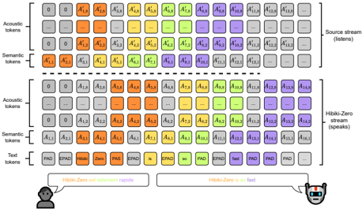

> [!abstract] arXiv · 2026 · Preprint
> **Tom Labiausse et al.** (Kyutai) · [→ Paper](https://arxiv.org/abs/2602.11072) · Demo: ✓ · Code: ✓
>
> Hibiki-Zero removes the need for word-level aligned interpretation data in simultaneous speech-to-speech translation by training a base model on coarse sentence-level alignments and then optimizing its latency/quality trade-off with a GRPO-based reinforcement learning stage driven purely by BLEU-based process rewards.

## Problem

State-of-the-art simultaneous speech-to-speech translation (S2ST) systems learn a translation policy, when to keep listening versus when to start speaking, through supervised training on data with word-level alignments between source and target speech. Because human interpretation data with such fine-grained alignments barely exists, prior systems (e.g. Hibiki, Seed LiveInterpret 2.0) rely on synthetic alignment pipelines built from language-specific heuristics: word-level text-to-translation alignment tools or LLM-based semantic chunking. These heuristics are brittle, must be redesigned for each new language's grammar, and become a bottleneck for scaling simultaneous translation to more languages. The paper asks whether the fine-grained alignment step can be removed from training entirely while retaining a system that reaches or exceeds the quality/latency trade-off of alignment-dependent baselines.

## Method

Hibiki-Zero models P[Y|X] where X is a source-language waveform and Y its target-language (English) translation. Both are encoded into low-framerate discrete token streams using the pretrained, causal, streaming Mimi codec (12.5Hz, one semantic level trained against WavLM features plus 16 acoustic RVQ levels). The system builds directly on the multistream RQ-Transformer framework of Défossez et al. (2024, Moshi) and the joint source/target/text-stream modeling scheme of Labiausse et al. (2025, Hibiki): a large Temporal Transformer models a "Inner Monologue" text stream, target audio tokens, and source audio tokens jointly along the time axis, while a smaller Depth Transformer autoregressively predicts the per-timestep codebook levels. At inference, the model consumes the real source audio tokens instead of predicting them, and voice identity is implicitly transferred from the source stream to the generated target stream without a separate speaker-embedding module.

Unlike Hibiki, Hibiki-Zero's training data is not constrained to be causal or word-aligned. Training proceeds in stages. First, a Temporal Transformer initialized from the Helium-1 text LLM (2B params) is extended with a Depth Transformer and audio projection layers and pretrained on single-stream multilingual audio. It is then trained on a large coarse speech-translation corpus (~40,000h per source language: French, Spanish, Portuguese, German) built by transcribing single-speaker utterances with Whisper large-v3, translating sentences with MADLAD-3B, and re-synthesizing the target with a TTS system that supports controllable word-level emission timestamps and 10-second voice-conditioning ("Natural Pauses TTS", following Zeghidour et al. 2025). Coarse sentence-level alignment is created by inserting randomly-sampled silence at sentence boundaries (δ ∈ [0,1] scales how much of each sentence's duration can be shifted) and at punctuation marks, giving the model exposure to diverse causality and latency patterns without requiring true word-level alignment.

On top of this coarse-aligned base model, the paper introduces a reinforcement learning stage that casts translation-policy optimization as GRPO (Shao et al., 2024) with process rewards computed purely from BLEU score, with no KL regularization. For a group of G sampled translations of the same input, a process reward at frame t blends an intermediate BLEU score (comparing the model's partial text-stream transcript against the reference translation of sentences processed so far) with the full-sequence BLEU score, controlled by a mixing weight α. Rewards are computed at regular word intervals (every n_w input words) and normalized within each group to produce per-frame advantages, which are then used in a standard PPO-style clipped objective applied independently to each of the model's audio and text codebook streams.

Before RL, the model is fine-tuned on a smaller (<200h) synthetic dataset built with the same Natural Pauses TTS pipeline and then distilled into a lighter copy via codebook weight-sharing in the Depth Transformer, reducing the model to 3B parameters for the RL phase.

## Key Results

On multilingual-to-English translation (French, Spanish, Portuguese, German), Hibiki-Zero outperforms Seamless and the causal-alignment-trained Hibiki baseline on both short-form (Europarl-ST) and long-form (the paper's own Audio-NTREX-4L benchmark) test sets. On long-form French, Hibiki-Zero reaches 30.6 ASR-BLEU and 61.3 speaker-similarity versus Seamless's 27.8 ASR-BLEU and 44.4 speaker-similarity, while also achieving lower latency (2.3s end offset vs. 3.2s). On short-form French, Hibiki-Zero beats Hibiki by roughly 3 ASR-BLEU points while being faster, and is roughly on par with Seamless on the quality/latency trade-off but ahead by more than 30 points of speaker similarity. Human evaluation (20 raters, 5 comparisons each, 4 languages) confirms these objective gains: Hibiki-Zero is rated substantially higher than Seamless on audio quality, speaker similarity, and naturalness, and reaches equivalent audio quality to Hibiki on French with better naturalness and speaker similarity.

Adapting the pipeline to a new input language (Italian) using less than 1000 hours of coarse-aligned data brings the fine-tuned-plus-RL model to parity with Seamless on the quality/latency trade-off (32.1 BLEU, 3.0s end offset) while retaining a large speaker-similarity advantage (54.2 vs. 22.2), and largely preserves performance on the original four languages.

## Novelty Assessment

The underlying multistream architecture (RQ-Transformer, joint text/audio stream modeling) is inherited essentially unchanged from Moshi and Hibiki; this is not an architectural contribution in the structural sense. The genuine novelty is in the training procedure: replacing word-level aligned interpretation data with coarse sentence-level alignment plus a GRPO-based RL stage that uses only automated, process-level BLEU rewards (no human interpretation data, no learned reward model) to sharpen the latency/quality trade-off. This is a real simplification relative to prior RL-for-simultaneous-translation work (e.g. Seed LiveInterpret 2.0's multi-reward PPO pipeline, which the paper notes required staged training to avoid reward hacking). The ablations (Section 4.7) are a genuine strength: they isolate the contribution of the sentence-delay hyperparameter δ and the coarse-alignment granularity µ, showing that RL alone cannot compensate for a base model trained with fully causal (δ=d_i) or overly coarse (µ=0) alignments. The released 45-hour Audio-NTREX-4L benchmark and model weights are a secondary but concrete contribution to the field's evaluation infrastructure.

## Field Significance

> [!tip]
> High — this paper demonstrates that the fine-grained alignment step long assumed necessary for training expressive simultaneous S2ST systems can be replaced by coarse sentence-level alignment plus outcome-driven RL, materially simplifying the path to scaling simultaneous translation across languages.

Hibiki-Zero directly targets the language-scaling bottleneck of the Hibiki/multistream lineage of S2ST systems: designing word-level alignment heuristics per language. By showing that a single RL recipe using only automated BLEU rewards can substitute for that alignment machinery, and that adapting to a new input language requires under 1000 hours of data, it provides a template that other groups building simultaneous translation or speech-to-speech systems on multistream/codec-LM backbones can reuse without redesigning language-specific alignment tooling.

## Claims

- **supports:** Simultaneous speech-to-speech translation policies can be learned from coarse sentence-level alignment plus reinforcement learning, without requiring word-level aligned training data.
  > *Evidence:* Hibiki-Zero, trained only on sentence-level aligned data followed by GRPO with BLEU-based process rewards, outperforms Hibiki (trained on synthetic word-level aligned data) by roughly 3 ASR-BLEU points at lower latency in the short-form French setting. *(§4.6, Table 1)*
- **supports:** A single automated reward signal (BLEU score computed at intermediate points during generation) is sufficient to jointly optimize translation quality and latency in an RL-tuned simultaneous translation system, without a multi-component or human-feedback reward.
  > *Evidence:* GRPO with only a BLEU-based process reward, no KL regularization, and no human interpretation or preference data, produces state-of-the-art quality/latency trade-offs across four languages, in contrast to prior RL approaches (e.g. Seed LiveInterpret 2.0) that required multiple reward components and staged training to avoid reward hacking. *(§3.3, §2.2)*
- **complicates:** The degree of causality permitted in the base model's training alignments bounds how much a subsequent RL stage can reduce translation latency.
  > *Evidence:* Ablation Experiment (B), which starts RL from a base model trained with fully causal alignment (δ_i = d_i), reduces latency only to around 6 seconds, far worse than the reference experiment's latency, because the base model was never exposed to starting translation before an input sentence ends. *(§4.7, Figure 7)*
- **supports:** Joint multistream modeling of source and target audio tokens can transfer speaker identity across languages implicitly, without an explicit speaker-conditioning module.
  > *Evidence:* Hibiki-Zero surpasses Seamless's speaker-similarity score by more than 30 points in the short-form setting and by roughly 17-20 points in the long-form setting across all four evaluated languages, despite having no dedicated speaker embedding component. *(§4.6, Table 1)*
- **complicates:** Systems trained to preserve source speaker identity in cross-lingual speech translation may still fail to give users control over paralinguistic transfer such as foreign accent.
  > *Evidence:* The paper reports that despite state-of-the-art speaker identity preservation, there is no mechanism to control the intensity of the input-language accent carried into the generated target speech. *(§4.8)*

## Limitations and Open Questions

The paper does not provide a mechanism to control the intensity of source-language accent transferred into the generated target speech, which the authors note would require accent-annotated training data and explicit conditioning. Evaluation is limited to X-to-English translation directions (French, Spanish, Portuguese, German, plus an Italian adaptation experiment); no results are reported for translation into non-English target languages or for many-to-many translation. The training and evaluation pipeline depends on cascaded automatic tools (Whisper transcription, MADLAD machine translation, a proprietary TTS for target synthesis) to build training data, so translation quality is implicitly upper-bounded by the quality of these upstream components. The paper also notes (Section 4.7) that BLEU scores on the held-out validation set are much higher than on the final evaluation benchmarks because both train and validation data were generated by the same MADLAD-3B-based pipeline, meaning some in-domain overfitting to the synthetic translation style is expected and not fully disentangled from genuine translation quality gains.

## Wiki Connections

- [[speech-to-speech|Speech-to-Speech]] — Hibiki-Zero is a direct-to-speech simultaneous S2ST system in the multistream/codec-LM sub-paradigm, extending the Moshi/Hibiki architecture lineage to training without word-level alignment.
- [[streaming-tts|Streaming TTS]] — the system generates target speech incrementally and synchronously with incoming source speech using a causal, streaming Mimi codec and a decoder-only multistream Transformer, directly optimizing latency via RL.
- [[neural-codec|Neural Audio Codec]] — the streaming Mimi codec (12.5Hz, semantic + 16 acoustic RVQ levels) is the token representation over which the entire translation model operates.
- [[rlhf-speech|RLHF Speech]] — the paper's central contribution is a GRPO-based reinforcement learning stage using automated BLEU-based process rewards to optimize the joint quality/latency trade-off of a speech translation policy.
- [[multilingual-tts|Multilingual TTS]] — Hibiki-Zero is trained across four source languages simultaneously and is shown to adapt to a new input language (Italian) with less than 1000 hours of data.
- [[subjective-evaluation|Subjective Evaluation]] — audio quality, cross-lingual speaker similarity, and speech naturalness are validated with a listening test using 20 human raters per model and language, not automated proxies alone.
- [[2410.00037|Moshi]] — Hibiki-Zero directly reuses the multistream RQ-Transformer joint sequence modeling framework introduced by Moshi for jointly modeling text and audio streams.
- [[2312.05187|Seamless]] — the paper's primary baseline for objective and human evaluation across all four source languages, on both short-form and long-form test sets.
- [[2509.08753|Streaming Sequence-to-Sequence Learning with Delayed Streams Modeling]] — the Natural Pauses TTS component used to synthesize target training speech with controllable word-level timestamps and voice conditioning follows this delayed-streams TTS approach.
- [[2308.16692|SpeechTokenizer]] — the semantic-plus-acoustic residual quantization scheme used by the Mimi codec follows the same design lineage of splitting the first codebook level to carry self-supervised semantic information.
- [[2306.12925|AudioPaLM]] — cited as part of the broader line of end-to-end speech translation systems that Hibiki-Zero's fully direct S2ST approach continues, in contrast to earlier cascaded ASR+MT+TTS pipelines.
