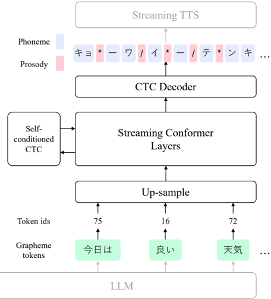
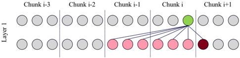

> [!abstract] arXiv · 2026 · Preprint
> **Yuma Shirahata et al.** (LY Corporation) · [→ Paper](https://arxiv.org/abs/2602.17157) · Demo: ? · Code: ?
>
> CC-G2PnP is a streaming Conformer-CTC model that converts grapheme text into phoneme and prosodic labels chunk by chunk, without depending on word boundaries, to connect an LLM to a TTS system in a low-latency cascade pipeline.

## Problem

Cascade spoken-dialogue pipelines that chain an LLM to a TTS system need low-latency text-to-speech conversion, but feeding raw graphemes directly to TTS requires very large paired text-speech corpora because the model must jointly learn pronunciation, prosody, speaker characteristics, and speaking style. Converting graphemes to phonemes and prosodic labels (G2PnP) before TTS gives the synthesizer more direct information and is more data-efficient, but this conversion step then becomes a second source of latency between the LLM and TTS. Prior streaming G2PnP work (LLM2PnP) reduces this latency by restricting Transformer attention to word-level boundaries, but that mechanism assumes explicit word segmentation and cannot be applied to unsegmented languages such as Japanese or Chinese, where word boundaries are not marked in the input text.

## Method

CC-G2PnP treats streaming G2PnP as a sequence-labeling problem solved with a stack of streaming Conformer layers followed by a connectionist temporal classification (CTC) decoder, rather than an encoder-decoder Transformer with explicit word-boundary masking. Because CTC learns the grapheme-to-phoneme alignment during training instead of relying on a predefined mapping, the model requires no word-segmentation information and is directly applicable to unsegmented languages. Self-conditioned CTC is applied at intermediate Conformer layers (2nd, 4th, and 6th of eight) to relax the conditional-independence assumption of CTC outputs, and the model is optimized on the sum of the final and intermediate CTC losses. Grapheme input is tokenized with the BPE tokenizer bundled with CALM2-7B-Chat (chosen for compatibility with an upstream LLM) and up-sampled by a factor of eight (repetition-based) before entering the Conformer stack, so the token-level output sequence has enough positions to cover all phoneme and prosodic symbols aligned to a single grapheme token.

Streaming is achieved with causal convolution in the Conformer's convolution layers and chunk-aware self-attention: the input is divided into chunks of size C, and each token attends to all other tokens within its own chunk plus a fixed number P of past-context tokens, which bounds the look-ahead per chunk (0 to C-1) instead of letting it grow linearly with depth as in naive look-ahead schemes. Because chunk-final tokens otherwise receive no look-ahead under this scheme, the authors found this caused inconsistent predictions at chunk boundaries specifically in the G2PnP task. To fix this, they introduce minimum look-ahead (MLA): in the first self-attention layer only, every token (including the last one in a chunk) is additionally permitted to attend to a fixed number M of future tokens outside its own chunk, guaranteeing at least M tokens of look-ahead for every position and raising the look-ahead range to M through C+M-1. MLA is restricted to the first layer because tokens in later layers already inherit indirect future dependencies through the attention computed by preceding layers.

At inference, the model begins predicting phoneme and prosodic labels for a chunk as soon as C (or C+M with MLA enabled) grapheme tokens are available. Training used eight Conformer layers with hidden dimension 512, dynamic batching up to 8,192 tokens per minibatch, and a learning rate decayed from 1e-4 to 1e-5 over 1.2M steps. Total parameter count is not reported. The model does not use an audio codec; its inputs and outputs are text-domain (grapheme, phoneme, and prosodic-label tokens).

## Key Results

On Japanese, using pseudo-labels derived from a dictionary-based morphological analyzer plus a DNN prosodic-label predictor (Dict-DNN) as training targets, CC-G2PnP with a chunk size of 5 and MLA of 1 (CC-G2PnP-5-1) achieves 1.79% CER on the expert-annotated 6D-Eval evaluation set, compared to 2.28% for the best streaming Dict-DNN baseline (chunk size 20) and 1.71% for a non-streaming Dict-DNN reference. Adding MLA consistently improves accuracy over MLA=0 at both tested chunk sizes (2 and 5), confirming its role in stabilizing chunk-boundary predictions. On latency, CC-G2PnP-5-1 reaches its best accuracy at a look-ahead of 6 LLM-generated tokens, a point the conventional streaming Dict-DNN baseline does not reach even at 20 tokens of look-ahead, indicating the proposed method can achieve both lower latency and higher accuracy simultaneously when combined with an LLM.

In a subjective listening test (15 native Japanese raters, 50 sentences from 6D-Eval) evaluating the naturalness of speech synthesized by a phoneme-and-prosody-conditioned TTS model (NANSY-based) fed with each system's predicted PnP sequence, CC-G2PnP-5-1 scores 4.02 MOS, close to non-streaming references (Dict-DNN-NS: 4.07, CC-G2PnP-NS: 4.02) and ground-truth labels (4.16 MOS), and clearly above the streaming Dict-DNN baselines (Dict-DNN-5: 2.73, Dict-DNN-10: 3.35). A data-scaling ablation shows CER improves consistently from 1% to 100% of the 14.96M-transcription ReazonSpeech training set, with the largest gains between 1% and 10%.

## Novelty Assessment

The core architectural novelty is minimum look-ahead (MLA): a small, targeted modification to chunk-aware streaming self-attention (adopted from prior streaming-ASR work) that guarantees every token, including chunk-final tokens, at least one token of future context, applied only in the first self-attention layer to avoid redundant look-ahead accumulation in later layers. The broader system, a Conformer encoder with a (self-conditioned) CTC decoder for a sequence-labeling formulation of G2PnP, is an application of an established ASR-style recipe to a new task rather than a new architecture in itself; its novelty relative to prior G2PnP work is that CTC's learned alignment removes the dependence on explicit word boundaries that limited the prior streaming G2PnP method (LLM2PnP) to segmented languages. The 6D-Eval evaluation set (2,722 expert-annotated sentences across six domains) is a secondary but genuine contribution, since it is the first evaluation resource used here to assess G2PnP accuracy on Japanese across varied domains rather than a single corpus.

## Field Significance

moderate — This paper contributes a specific, well-validated streaming mechanism (minimum look-ahead) for chunk-aware self-attention that removes a language-segmentation dependency limiting prior streaming G2PnP work, and demonstrates with both objective accuracy metrics and a TTS-naturalness listening test that streaming G2PnP need not sacrifice much quality relative to non-streaming alternatives. Its scope is a text-processing component upstream of TTS rather than a generative speech model, and its experiments are conducted on a single language (Japanese), so the generality of MLA to other unsegmented languages or to other chunk-aware streaming tasks (e.g., streaming ASR) is not directly demonstrated here.

## Claims

- **supports:** Guaranteeing a minimum amount of future look-ahead for every token in a chunk-aware streaming attention scheme, rather than allowing chunk-final tokens to have zero look-ahead, improves the consistency of chunk-boundary predictions in streaming sequence-labeling tasks.
  > *Evidence:* Adding minimum look-ahead (M=1 or M=2) consistently improves CER and SER over the M=0 configuration at both tested chunk sizes (2 and 5), with CC-G2PnP-5-1 reaching 1.79% CER versus 2.01% for CC-G2PnP-5-0. *(§3.2, Table 1)*
- **supports:** A CTC decoder that learns grapheme-to-phoneme(-and-prosody) alignment during training can remove the dependence on explicit word-boundary information that limits prior streaming text-to-phoneme methods to segmented languages.
  > *Evidence:* Unlike LLM2PnP, which applies a word-level restriction to the Transformer attention mask and cannot be directly applied to Japanese or Chinese, CC-G2PnP's CTC decoder learns the grapheme-phoneme alignment dynamically and is evaluated on Japanese, an unsegmented language with no explicit word boundaries. *(§1, §2.1)*
- **supports:** Streaming grapheme-to-phoneme-and-prosody conversion feeding a downstream TTS system can approach the perceived naturalness of non-streaming conversion, despite processing input incrementally.
  > *Evidence:* In a 15-rater MOS listening test on TTS speech synthesized from predicted PnP sequences, the best streaming configuration (CC-G2PnP-5-1) scores 4.02 MOS, matching the non-streaming CC-G2PnP-NS (4.02) and close to non-streaming Dict-DNN-NS (4.07) and ground-truth labels (4.16). *(§3.4, Table 2)*
- **complicates:** Streaming grapheme-to-phoneme-and-prosody accuracy gains from architectural improvements depend on having a large amount of training data, since the model cannot fall back on an external pronunciation dictionary.
  > *Evidence:* A data-scaling ablation on CC-G2PnP-5-1 shows CER degrades from 1.79% at 100% of the 14.96M-transcription training set to 2.34% at 10% and 4.55% at 1%, and the authors state the CTC-only approach requires large training data specifically because it does not rely on external dictionaries. *(§3.5, Table 3; §4)*

## Limitations and Open Questions

The evaluation is conducted on a single language (Japanese), so it is not established whether minimum look-ahead generalizes to other unsegmented languages (e.g., Chinese) or whether its benefit transfers to other chunk-aware streaming tasks such as streaming ASR, where the underlying chunk-aware streaming mechanism originated. Because CC-G2PnP does not rely on an external pronunciation dictionary, the authors note it requires a large volume of training data to cover a diverse grapheme vocabulary, and identify integrating external dictionary or LLM knowledge as future work. The TTS naturalness evaluation used a single female speaker and a non-streaming TTS backbone, so it isolates PnP-sequence quality but does not assess end-to-end streaming latency or quality when both G2PnP and TTS are streamed together. Code and demo availability are not reported in the paper.

## Wiki Connections

- [[streaming-tts|Streaming TTS]] — targets the same chunk-size/look-ahead latency-quality trade-off central to streaming TTS pipelines, introducing minimum look-ahead specifically to reduce quality loss from limited look-ahead in a chunk-aware streaming architecture.
- [[prosody-control|Prosody Control]] — predicts explicit prosodic labels (intonation-phrase and accent-phrase boundaries, accent nucleus) as an intermediate representation that conditions a downstream TTS model's prosody, separately from the phoneme (content) stream.
- [[subjective-evaluation|Subjective Evaluation]] — runs a 15-rater MOS listening test on TTS speech synthesized from each system's predicted phoneme-and-prosody sequences to validate that objective PnP accuracy gains translate to perceived naturalness.
- [[2407.05407|CosyVoice]] — cited as an example of TTS models that consume raw grapheme output directly from an LLM, a data-hungry alternative this paper's G2PnP-based approach is positioned against.
- [[2412.10117|CosyVoice 2]] — cited alongside CosyVoice as a grapheme-direct streaming TTS approach motivating the paper's argument that an explicit phoneme-and-prosody intermediate representation is more data-efficient.
