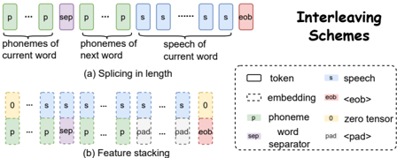

> [!abstract] arXiv · 2026 · Preprint
> **Hanwen Liu et al.** (Xinjiang University, Tsinghua University) · [→ Paper](https://arxiv.org/abs/2602.19574) · Demo: ✓ · Code: ✗
>
> Replaces MFA-based forced alignment with a lightweight CTC aligner and introduces a word-level ("bi-word") interleaving scheme for low-latency dual-streaming LLM-based TTS.

## Problem

LLM-based TTS systems that autoregressively predict neural-codec tokens are usually trained to emit all speech tokens only after the full text has been consumed, which is unsuitable for low-latency dual-streaming synthesis where speech must begin before the input text finishes arriving. Existing dual-streaming approaches fall into two camps, both with drawbacks. Fixed-ratio interleaving methods (e.g., CosyVoice2, StreamMel) interleave text and speech tokens at a constant ratio, which fails to capture the variable alignment regularities between text and speech. Alignment-aware interleaving methods (e.g., ELLA-V, SyncSpeech, SpeakStream) instead depend on the Montreal Forced Aligner (MFA), a GMM-HMM based forced-alignment toolkit that is pipeline-heavy, inflexible, and decoupled from the neural TTS model itself. The paper targets this gap: constructing text-speech training sequences for dual-streaming LLM-TTS using a lightweight neural aligner instead of MFA, while balancing synthesis quality against first-packet latency.

## Method

CTC-TTS replaces MFA with a Connectionist Temporal Classification (CTC)-based aligner. A CTC-based ASR acoustic model produces frame-level posteriors over phonemes plus a blank symbol; the Viterbi algorithm recovers the maximum-probability alignment path, which is then collapsed (merging repeats, removing blanks) to a phoneme sequence. Because CTC alignments are not frame-accurate (phoneme labels tend to lag their true onset and blanks correspond ambiguously to silence or adjacent phonemes), the authors reassign each blank label to its following phoneme (trailing blanks go to the final phoneme), producing a refined path. Since the CTC acoustic model operates at 25 frames/s and the neural audio codec (NAC) operates at 75 frames/s, each aligned phoneme maps deterministically to 3 consecutive codec tokens. The authors note this only provides a stable structural correspondence, not frame-accurate phoneme boundaries, but argue it suffices for constructing word-level phoneme-speech blocks.

From this alignment, the paper builds "bi-word" phoneme-speech blocks: for word *k*, a block contains the phonemes of word *k*, a word-separator token, the phonemes of word *k+1* (for local look-ahead context), the speech tokens aligned to word *k*, and a block-terminator token `<eob>`. Concatenating blocks for all words in an utterance forms the training sequence. Two interleaving variants realize this block structure differently:

- **CTC-TTS-L** concatenates text and speech tokens along the sequence-length dimension, prioritizing quality but only starting speech generation after the first two words' phonemes are available (higher first-packet latency).
- **CTC-TTS-F** stacks phoneme and speech embeddings along the feature dimension (following the LLMVoX design), padding the phoneme sequence to match the speech-token sequence length; generation can begin immediately after the first phoneme (stacked against a zero tensor), reducing first-packet latency at some cost to quality.

The backbone is a single autoregressive (AR) Transformer decoder that predicts codec tokens and the `<eob>` symbol via cross-entropy loss, computed only over speech-token and `<eob>` positions (text token positions are masked out of the loss). Because the system uses WavTokenizer, a single-codebook neural audio codec (75 Hz), a single AR Transformer suffices to predict all speech tokens rather than requiring multiple parallel codebook predictors. For zero-shot dual-streaming synthesis, the same interleaving scheme is applied to a pre-aligned speech-and-text prompt prepended to the sequence, which the authors note is typically reusable across generations for the same speaker.

Single-speaker streaming models use a 4-layer, 12-head, 768-dim Transformer decoder (256-dim phoneme / 512-dim speech embeddings for CTC-TTS-F), trained for 1M steps on VoiceAssistant400K (1750h train / 50h val / 5h test). Multi-speaker zero-shot models use a larger 12-layer, 16-head, 1024-dim decoder, trained for 320k steps on the 960-hour LibriSpeech corpus. The CTC aligner itself is a pretrained 115M-parameter Conformer-based "Whistle" ASR model trained with weak phonetic supervision on LibriSpeech; phonemization uses the WFST-based Phonetisaurus G2P toolkit.

## Key Results

In single-speaker streaming experiments (Table 1), both CTC-TTS variants outperform a reproduced LLMVoX baseline (fixed-ratio interleaving with feature-dimension stacking): CTC-TTS-F achieves 1.80% WER / 1.04% CER versus LLMVoX's 2.40% / 1.36%, with a slightly *lower* first-packet latency (159ms vs 167ms). CTC-TTS-L pushes WER/CER further down to 1.50% / 0.79% but at a higher first-packet latency of 210ms. All three systems report identical UTMOS (4.15), which the authors attribute to UTMOS primarily reflecting naturalness rather than content accuracy.

In multi-speaker zero-shot experiments on LibriSpeech-trained models (Tables 2-3), the paper runs a controlled ablation crossing alignment method (CTC vs. MFA) with sequence organization (ELLA-V's local-advance scheme vs. the paper's bi-word scheme). On the in-domain continuation task, CTC-TTS-L (CTC alignment + bi-word) achieves the best or near-best results across WER (4.82%), CER (2.47%), and MOS (4.33 ± 0.061), outperforming MFA+bi-word on all metrics except speaker similarity (SPK). On the out-of-domain cross-speaker task (using Seed-TTS test-en as prompts), CTC-TTS-L again performs best (WER 6.33%, CER 3.21%), and the CTC+ELLA-V ablation notably outperforms MFA+ELLA-V (20.86% vs. 34.89% WER), while the reverse holds on the in-domain continuation task (12.01% vs. 10.98% WER) — indicating that CTC alignment generalizes better out-of-domain while MFA alignment is stronger in-domain.

## Novelty Assessment

The core contribution is methodological: substituting a lightweight, already-pretrained CTC-based ASR aligner for the GMM-HMM MFA pipeline in dual-streaming LLM-TTS sequence construction, combined with a new bi-word interleaving unit that provides one-word look-ahead context. Neither CTC-based forced alignment nor word-level interleaving is individually new to speech processing, but their combination for LLM-TTS training-sequence construction, together with the controlled ablation isolating alignment method from sequence organization (CTC vs. MFA crossed with bi-word vs. ELLA-V's local-advance), is a genuine and carefully isolated empirical contribution. The two interleaving variants (length-wise vs. feature-wise) are largely adaptations of prior design choices (ELLA-V's concatenation, LLMVoX's feature stacking) repurposed onto the new bi-word block structure rather than fundamentally new mechanisms. The work is best characterized as a focused architectural refinement rather than a new paradigm, evaluated at modest scale (models from 33M to 160M parameters, single-GPU-class compute).

## Field Significance

moderate — The paper contributes a reusable, lightweight alternative to MFA for constructing alignment-aware training sequences in LLM-based streaming TTS, with a controlled ablation that cleanly separates the effect of alignment method from sequence organization. This is useful engineering and methodological evidence for a specific pain point (MFA's pipeline overhead) in dual-streaming TTS, but the evaluation is limited to English, small-to-medium model scales, and two specific baselines (LLMVoX, ELLA-V), so its generality across languages, codecs, and larger model scales is not yet demonstrated.

## Claims

- **supports:** A lightweight CTC-based phoneme-speech aligner, despite lacking frame-accurate boundaries, can substitute for GMM-HMM forced alignment (e.g., MFA) when constructing training sequences for LLM-based streaming text-to-speech.
  > *Evidence:* Replacing MFA with CTC alignment while keeping the same bi-word sequence organization (CTC-TTS-L/F vs. MFA+bi-word) yields comparable or better WER/CER on both continuation and cross-speaker tasks. *(§5.2, Table 2, Table 3)*
- **supports:** Word-level, alignment-aware interleaving of text and speech tokens with limited look-ahead outperforms both fixed-ratio interleaving and forced-alignment-based local-context interleaving schemes for streaming LLM-based TTS.
  > *Evidence:* CTC-TTS-F achieves lower WER/CER than the fixed-ratio LLMVoX baseline with comparable first-packet latency (1.80%/1.04% vs. 2.40%/1.36%), and bi-word interleaving with MFA alignment (MFA+bi-word) outperforms MFA+ELLA-V's local-advance scheme on both the continuation and cross-speaker tasks. *(§5.1, Table 1; §5.2, Table 2, Table 3)*
- **complicates:** The choice between concatenating interleaved text-speech tokens along the sequence length versus stacking them along the feature dimension involves a direct quality-latency trade-off rather than one variant dominating the other.
  > *Evidence:* CTC-TTS-L achieves lower WER/CER (1.50%/0.79%) than CTC-TTS-F (1.80%/1.04%) but at higher first-packet latency (210ms vs. 159ms) in single-speaker streaming experiments. *(§5.1, Table 1)*
- **complicates:** The relative advantage of neural CTC-based alignment over traditional forced alignment for LLM-TTS training-sequence construction depends on whether evaluation is in-domain or out-of-domain, rather than holding uniformly.
  > *Evidence:* With ELLA-V's sequence organization, CTC alignment (CTC+ELLA-V) underperforms MFA alignment (MFA+ELLA-V) on the in-domain continuation task (12.01% vs. 10.98% WER) but outperforms it on the out-of-domain cross-speaker task (20.86% vs. 34.89% WER). *(§5.2, Table 2, Table 3)*

## Limitations and Open Questions

The evaluation is limited to English (LibriSpeech, VoiceAssistant400K) and a single-codebook neural codec (WavTokenizer); the paper does not report results on other languages or on multi-codebook codecs where the 1:3 phoneme-to-token mapping ratio used for CTC-derived alignment would not directly apply. Model scales are modest (33M-160M parameters, trained on 4 RTX 3090 GPUs), so it is not established whether the CTC-alignment and bi-word interleaving advantages persist at the scale of production LLM-TTS systems. The CTC aligner itself is a pretrained ASR model (Whistle, 115M parameters) trained on the same LibriSpeech-family data used for the multi-speaker experiments, which may inflate in-domain alignment quality relative to genuinely out-of-domain deployment settings. Code is not yet released ("will be released upon paper acceptance"), limiting immediate reproducibility. The authors themselves flag two open directions: replacing the WFST-based Phonetisaurus G2P with a neural G2P model, and using more precise neural forced-alignment or speech-text alignment models to further refine sequence construction.

## Wiki Connections

- [[autoregressive-codec-tts|Autoregressive Codec TTS]] — CTC-TTS is a single-codebook AR codec-token LM, directly extending this method family with a new alignment-aware training-sequence construction procedure.
- [[streaming-tts|Streaming TTS]] — the paper's central contribution is a text-speech interleaving scheme designed specifically to reduce first-packet latency in dual-streaming synthesis.
- [[zero-shot-tts|Zero-Shot TTS]] — multi-speaker experiments condition generation on a pre-aligned speech-and-text prompt to synthesize speech for unseen speakers without fine-tuning.
- [[neural-codec|Neural Audio Codec]] — the system relies on WavTokenizer, a single-codebook 75Hz codec, to keep speech-token prediction tractable for a single AR Transformer.
- [[2025.findings-acl.1051|LLMVoX]] — CTC-TTS-F's feature-dimension stacking design follows LLMVoX, and LLMVoX is the direct baseline reproduced for single-speaker streaming comparison in Table 1.
- [[2401.07333|ELLA-V]] — CTC-TTS reproduces ELLA-V's local-advance alignment-aware interleaving as the multi-speaker zero-shot baseline and ablates it against the paper's bi-word scheme.
- [[2408.16532|WavTokenizer]] — the codec used to tokenize speech for all CTC-TTS experiments, enabling single-codebook autoregressive modeling.
- [[2406.02430|Seed-TTS]] — Seed-TTS's test-en split is used as the cross-speaker zero-shot evaluation set (Table 3).
- [[2412.10117|CosyVoice 2]] — cited as a representative fixed-ratio interleaving dual-streaming TTS system that CTC-TTS's alignment-aware approach is positioned against.
- [[2407.05407|CosyVoice]] — cited as background on LLM-based zero-shot TTS using supervised semantic tokens.
