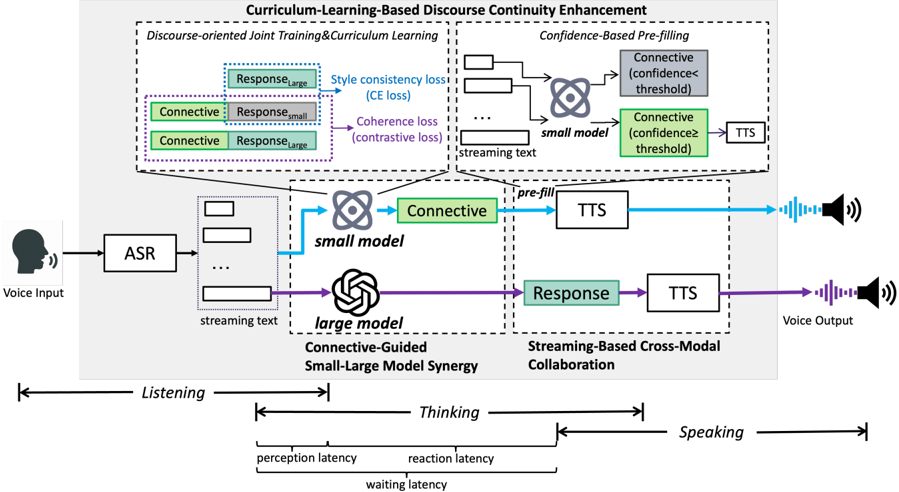

> [!abstract] arXiv · 2026 · Preprint
> **Liu et al.** (Tongji University / The Hong Kong Polytechnic University / Shenzhen University of Advanced Technology / The Chinese University of Hong Kong, Shenzhen) · [→ Paper](https://arxiv.org/abs/2602.23266) · Demo: ? · Code: ?
>
> A dual-track streaming architecture for cascaded spoken dialogue systems that lets a lightweight model speak safe discourse connectives while a large model reasons in parallel, cutting perceived response latency without retraining the underlying ASR or TTS modules.

## Problem

Cascaded ASR-LLM-TTS spoken dialogue systems remain the dominant practical architecture because of their modularity and ease of component replacement, but their strictly sequential execution (full transcription, then full reasoning, then synthesis) pushes response onset well beyond the sub-second latency window required for natural human turn-taking. Prior latency-reduction work either accelerates per-token decoding (speculative decoding, multi-token prediction), which does not change the sequential dependency structure, or streams partial ASR/LLM hypotheses to trigger earlier synthesis, but still waits for enough semantic content to be available before anything can be spoken. The authors observe that human speakers instead often begin a turn with short, low-risk discourse connectives ("well," "I see") while still formulating the substantive content of their response, and ask whether this behavior can be operationalized as a system-level mechanism for cascaded pipelines.

## Method

The paper proposes Discourse-Aware Dual-Track Streaming Response (DDTSR), built from three integrated mechanisms.

**Connective-guided small-large model synergy.** Response generation is split into two roles handled by models of different capacity: a lightweight model produces short, discourse-appropriate connective prefixes that carry no propositional content and are therefore safe to emit before reasoning is complete, while a large model performs the knowledge-intensive reasoning needed for the substantive answer. The two run concurrently on the same input, and the final spoken output concatenates the connective's synthesized audio with the main response's synthesized audio (`y = TTS(f_s(u)) ⊕ TTS(f_l(u))`).

**Streaming-based cross-modal collaboration.** Rather than waiting for a finalized ASR transcript, the lightweight model consumes evolving partial ASR hypotheses at each streaming decoding step and, at each step, predicts both a candidate connective and a binary "commit" signal. TTS is triggered on the earliest step at which the commit signal fires, often before the user has finished speaking. Meanwhile the large model begins its own reasoning only once the transcript is finalized, and its output is queued to play immediately after the connective's audio finishes, so the two model outputs across ASR/LLM/TTS stages overlap rather than execute strictly in sequence.

**Curriculum-learning-based discourse continuity enhancement.** To keep early connectives coherent with the eventual full response, the lightweight model (initialized from Qwen3-0.6B) is fine-tuned with LoRA on a purpose-built connective-annotated dialogue dataset constructed via POS-based heuristic extraction plus LLM-prompted generation for turns lacking an explicit connective. Training jointly optimizes three losses: a style-consistency loss that supervises connective choice using the large model's anticipated continuation as an auxiliary signal, a coherence loss that transfers the low-perplexity discourse compatibility of the untuned base model's connective-response pairs to the fine-tuned model, and a KL-based prior-regularization loss that prevents the fine-tuned connective distribution from collapsing. Training proceeds under a curriculum that progresses from full-context dialogues to increasingly truncated (partial-input) segments, so the model learns to commit under the same incomplete-context conditions it will face at streaming inference time. At inference, a candidate connective is only emitted once its confidence score, derived from the normalized token-level predictive entropy of the top-m candidates, exceeds a dataset-specific threshold.

Main-content reasoning uses Qwen3-8B or Qwen3-32B accessed via remote API; streaming ASR uses a sherpa-onnx streaming Zipformer; incremental TTS synthesis uses CosyVoice2 ([[2412.10117|CosyVoice 2]]). The connective model, ASR, and TTS are deployed locally on a single RTX 4090D GPU, while the large reasoning model runs remotely.

## Key Results

On SD-Eval with an 8B backbone, DDTSR reduces average waiting latency (perception + reaction latency, the total perceived delay) from 1003 ms under a standard single-stream cascade (SSC) and 861 ms under a dual-stream cascade without streaming collaboration (SDC) to 548 ms, a 45.4% reduction; in the "optimal" setting where a connective is generated, waiting latency drops to 515 ms (§5, Table 2). On SpokenNativQA with the same backbone, DDTSR reduces waiting latency from 931 ms (SSC) to 741 ms, a 17.5% reduction (§5, Table 2). Gains are driven by two components: reaction latency (LLM reasoning + first-chunk TTS) falls from 615 ms to 435 ms on SD-Eval/8B via small-large model synergy, and perception latency (time from end-of-audio to first content-carrying output) falls from ~388 ms to 102–113 ms via streaming cross-modal collaboration, with the 89–90 ms optimal-setting figure driven by triggering before ASR finalizes (§5, Table 2). Latency reductions hold across both the 8B and 32B backbones, since the early-response path depends on the lightweight connective model rather than the main reasoning model's scale (§5, "Effect of Model Scale and Datasets"). Stratifying SD-Eval by input audio length (0–3s / 3–6s / 6–9+s) shows the waiting-latency reduction grows from 38.3% to 58.3% as utterances lengthen, because DDTSR's perception latency stays roughly flat (~100 ms) while baseline perception latency grows with input length (§5, "Audio Length Effects on Improvement Ratio", Figure 3).

On output quality, DDTSR is compared against SSC, SDC, and a gold-standard reference using G-Eval-based text consistency/coherence and UTMOSv2 speech naturalness. On SD-Eval/8B, DDTSR scores 4.77/4.49 (consistency/coherence) versus 4.76/4.54 (SSC) and 4.77/4.46 (SDC), close to the 4.77/4.43 gold standard; UTMOSv2 is 3.12 for DDTSR versus 3.16 (SSC) and 3.20 (SDC) (§5, Table 3). The paper also reports three commercial end-to-end realtime systems (Doubao Realtime, GLM-Realtime, Qwen3-Omni-Flash-Realtime) as reference points, with waiting latencies of 352–763 ms depending on system and dataset, but these are not directly comparable since they use different backbones and are evaluated as black-box APIs (§5, Table 2).

## Novelty Assessment

The contribution is primarily architectural and training-recipe: DDTSR does not modify the underlying ASR or TTS components, and its LLM backbones are off-the-shelf Qwen3 models, so at the component level nothing is new. What is new is the formalization of connective-guided dual-track response generation as an explicit inference-time decoupling mechanism (a commit-triggered small model running concurrently with a large model across streaming ASR/LLM/TTS stages), paired with a purpose-built curriculum-learning training objective (style-consistency, coherence-transfer, and prior-regularization losses) that specifically targets discourse compatibility between an early connective and a not-yet-generated main response. This combination of a temporal-reordering mechanism with a matching training procedure is what the paper claims as novel, distinguishing it from prior incremental-dialogue and early-TTS-triggering work that still waits for sufficient semantic content before speaking anything.

## Field Significance

moderate — DDTSR demonstrates that decoupling low-risk discourse-level speech from full semantic reasoning is a viable, retrofit-friendly mechanism for reducing perceived latency in cascaded spoken dialogue systems, without requiring changes to the ASR or TTS components or full end-to-end retraining. Its benefit is shown to be domain-dependent (proportional to how often natural responses in a given dataset actually begin with a turn-initial connective), which bounds its generality to conversational settings where such connectives are common.

## Claims

- **supports:** Decoupling low-risk, non-content-bearing response initiation from full semantic reasoning can substantially reduce perceived latency in cascaded speech-dialogue pipelines without retraining the ASR or TTS modules.
  > *Evidence:* Connective-guided small-large model synergy plus streaming cross-modal collaboration reduces average waiting latency from 1003 ms (single-stream cascade) to 548 ms on SD-Eval with an 8B backbone, a 45.4% reduction. *(§5, Table 2)*
- **supports:** Triggering downstream generation on partial, still-updating upstream hypotheses rather than waiting for a finalized transcript can reduce turn-initial latency independently of the main reasoning model's scale.
  > *Evidence:* Perception latency drops from ~388 ms under sequential baselines to 102–113 ms once the lightweight model consumes streaming partial ASR hypotheses, and this reduction is consistent across both 8B and 32B backbones since early-response latency depends on the small model rather than the large one. *(§5, "Effect of Model Scale and Datasets", Table 2)*
- **complicates:** The latency benefit of connective-guided early emission is not uniform across conversational domains and scales with how frequently ground-truth responses in that domain naturally begin with a turn-initial discourse connective.
  > *Evidence:* SD-Eval (94% connective frequency) and SpokenNativQA (38% connective frequency) show markedly different waiting-latency reductions (45.4% vs. 17.5%), indicating the technique favors casual conversational domains over settings with fewer natural connective opportunities. *(§5, "Effect of Model Scale and Datasets")*
- **supports:** Emitting a short, non-truth-conditional discourse connective before full response reasoning completes does not measurably degrade downstream text coherence or speech naturalness relative to waiting for the complete response.
  > *Evidence:* Consistency/coherence (G-Eval) and UTMOSv2 scores for DDTSR are nearly identical to single-stream and dual-stream cascade baselines and close to the gold-standard reference across both datasets and both backbone scales. *(§5, Table 3)*

## Limitations and Open Questions

> [!warning] Quality preservation is assessed only with automated proxies (G-Eval LLM-as-judge for text coherence, UTMOSv2 for speech naturalness); no human listening test or human coherence rating is reported, so the claim that early connective emission does not degrade perceived quality has not been verified against human raters.

The framework remains fundamentally cascaded: it reduces perceived latency by overlapping and masking existing ASR/LLM/TTS stages rather than eliminating the sequential dependency, and the large-model reaction-latency component itself (LLM reasoning plus first-chunk synthesis, ~430–590 ms in the reported settings) is largely unchanged by DDTSR. The connective-annotated training data is constructed by an automatic two-stage pipeline (POS-based extraction plus LLM-prompted generation) whose fidelity to genuinely natural conversational connective usage is not independently validated against human annotation. Evaluation is limited to English-language benchmarks (SD-Eval's non-emotion subsets and SpokenNativQA's English subset), so cross-lingual applicability, where connective frequency and discourse marker inventories differ substantially, is untested.

## Wiki Connections

- [[speech-to-speech|Speech-to-Speech]] — DDTSR is a cascaded (ASR-LLM-TTS) spoken dialogue system that targets the response-latency bottleneck specific to the cascade sub-paradigm, rather than replacing it with an end-to-end model.
- [[streaming-tts|Streaming TTS]] — the framework's core mechanism triggers incremental TTS synthesis on partial, still-evolving upstream content (partial ASR hypotheses and an early connective) before the full response is finalized.
- [[evaluation-metrics|Evaluation Metrics]] — introduces a latency decomposition (perception, reaction, waiting latency) specifically designed to isolate where delay arises in streaming cascaded spoken dialogue, alongside G-Eval and UTMOSv2 quality scoring.
- [[2412.10117|CosyVoice 2]] — used directly as DDTSR's incremental TTS synthesis backend for both the connective and main-response audio tracks.
- [[2509.06502|FireRedChat]] — cited as a representative practical cascaded full-duplex voice interaction system that motivates DDTSR's focus on reducing cascaded-pipeline response latency while preserving modularity.
- [[2512.18706|X-Talk]] — cited alongside FireRedChat as an example of a modular cascaded speech-to-speech dialogue system that the cascaded paradigm continues to rely on despite end-to-end alternatives.
