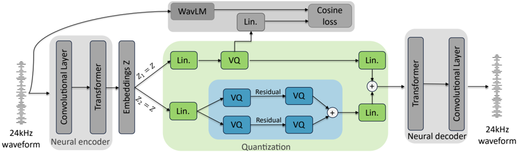
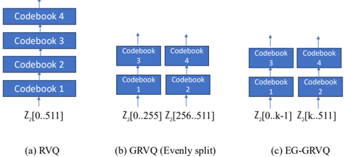

> [!abstract] arXiv · 2026 · Preprint
> **Yanzhou Ren et al.** (Waseda University / NTT, Inc.) · [→ Paper](https://arxiv.org/abs/2603.01476) · Demo: ? · Code: ?
>
> Introduces an entropy-guided grouping rule for residual vector quantization in a Mimi-style neural speech codec, using per-channel encoder variance as a proxy for information content to balance the acoustic branch under ultra-low bitrate.

## Problem

Neural audio codecs that combine a semantic branch (linguistic content, useful for downstream speech language models) with an acoustic branch (fine-grained signal detail, needed for waveform fidelity) face a capacity trade-off: allocating bits to the semantic branch reduces what remains for acoustic reconstruction, and this tension sharpens under ultra-low bitrate constraints. Grouped residual vector quantization (GRVQ), introduced by HiFi-Codec to improve codebook efficiency over plain RVQ, splits the acoustic branch into multiple coding groups but does so by evenly dividing channels, without regard to how much information each channel actually carries. The paper targets this specific inefficiency: even channel splits under-utilize low-variance channels and over-burden high-variance ones, limiting perceptual quality and intelligibility at the low bitrates needed for real-time communication.

## Method

The paper adopts Mimi (the codec used in Moshi) as its backbone: a causal, low-latency encoder-decoder built from residual convolutional blocks followed by Transformer blocks at the bottleneck, converting 24 kHz waveforms into 512-dimensional latent frames at 12.5 Hz, with a symmetric transposed-convolutional decoder. The encoder output is duplicated into two branches — a semantic branch quantized with a single codebook to preserve linguistic content cheaply, and an acoustic branch quantized to capture fine-grained detail needed for reconstruction.

The paper's contribution, entropy-guided group residual vector quantization (EG-GRVQ, the authors' term), targets the acoustic branch. Under an assumption that encoder channel activations are approximately Gaussian (so differential entropy is a monotonic function of variance), the authors use per-channel variance, computed over the training set, as a proxy for the information content of each channel. Channels are then partitioned into two groups such that each group carries an approximately equal share of total variance (in their 512-channel setup, the split point falls at channel 237, yielding a 55.3%/44.7% variance split versus a 50/50 channel-count split), rather than the even channel-count split used by conventional GRVQ (the authors' term for the HiFi-Codec grouping scheme). Each group is then quantized with its own residual codebook pair.

The grouping is fixed as a hyperparameter for all data at training and inference time; the paper notes that an adaptive per-frame split is possible if signaling bits were spent on it, but this is not explored. The semantic and acoustic quantized features are summed before decoding. Training uses a composite generator loss combining an adversarial loss (MSE between discriminator output and the real-label target), a feature-matching loss (L1 distance between real and generated intermediate discriminator features, weighted 15x relative to the adversarial term), and a vector-quantization commitment loss to stabilize codebook usage. The semantic branch is trained with a distillation objective following SpeechTokenizer's approach: its quantized output is projected to 1024 dimensions and matched to WavLM-derived embeddings via a cosine similarity loss. All models use a 5-codebook setting and are trained on 8 NVIDIA A6000 GPUs with a batch size of 12 per GPU; parameter count is not reported.

## Key Results

At 0.6875 kbps, the proposed EG-GRVQ improves PESQ and STOI over all four baselines while remaining competitive on ViSQOL (Table 1). Relative to the official pretrained Mimi codec, EG-GRVQ improves PESQ by 0.01 and ViSQOL by 0.49; relative to a from-scratch Mimi retrained on the same data, it improves PESQ by 0.1 and STOI by 0.01 with comparable SDR (-7.31 vs. -6.97); relative to the authors' own re-implementation of conventional GRVQ within the Mimi framework, PESQ improves from 1.85 to 1.88 and ViSQOL from 2.46 to 2.50 *(§3.4, Table 1)*. A separate normalized mean squared error (NMSE) analysis against the oracle (unquantized) encoder output shows EG-GRVQ achieving the lowest total NMSE (0.819) of the three quantizer types compared, versus 0.852 for GRVQ and 0.884 for RVQ *(§3.4, Table 2)*. Codebook utilization analysis shows EG-GRVQ maintains consistently high utilization across all quantizer layers, in contrast to RVQ's sharp utilization decline in deeper layers and GRVQ's partial, still layer-imbalanced improvement *(§3.5, Figure 3)*. A grouping-count ablation with a fixed total of 4 quantizers shows the 2-groups-of-2 configuration outperforming a 4-groups-of-1 configuration across all metrics, and outperforming a 1-group-of-4 (plain RVQ) configuration on PESQ and STOI with a small SDR trade-off *(§3.5, Table 3)*. An 8-participant MUSHRA listening test on LibriTTS test-clean samples shows EG-GRVQ preferred over official Mimi by 21 points and over Mimi-GRVQ by 11 points, with 95% confidence intervals for both differences excluding zero *(§3.6, Figures 4-5)*.

## Novelty Assessment

The core contribution is narrow and well-scoped: replacing an even channel-count split in GRVQ's acoustic branch with a variance-equalized split, motivated by an explicit (if simplifying) Gaussian-entropy argument. This is a genuine, if incremental, architectural refinement of an established quantizer design (HiFi-Codec's GRVQ) within an established codec backbone (Mimi); the encoder-decoder, semantic-branch distillation, and adversarial training recipe are inherited rather than newly proposed. The paper's strength is methodological completeness for such a narrow change: it isolates the grouping-strategy variable with matched training data and codebook budgets across RVQ, GRVQ, and EG-GRVQ, and backs the objective gains with a controlled MUSHRA listening test and an NMSE/utilization diagnostic that together support the claimed mechanism (more balanced information allocation improves both reconstruction accuracy and codeword usage). The information-theoretic justification, treating channel variance as an entropy proxy, gives the grouping rule a principled basis rather than being purely empirical, but the underlying Gaussianity assumption is not itself verified against the actual encoder activation distributions in the paper.

## Field Significance

moderate — the paper provides a targeted, well-validated improvement to grouped residual vector quantization for ultra-low bitrate speech codecs, with consistent gains on objective and subjective metrics over both the official Mimi codec and the authors' own GRVQ re-implementation. Its contribution is a specific quantizer-design refinement rather than a new codec architecture or training paradigm, and the reported gains at the tested bitrate are modest in absolute terms even where statistically distinguishable in the listening test.

## Claims

- **supports:** Allocating residual-vector-quantization groups by equalizing information content across channels, rather than splitting channels evenly, improves codebook utilization and reconstruction fidelity in low-bitrate neural speech codecs.
  > *Evidence:* EG-GRVQ's variance-equalized channel split (55.3%/44.7% variance vs. an even 50/50 channel count) improves PESQ, STOI, and NMSE over both plain RVQ and evenly-split GRVQ at 0.6875 kbps, and sustains higher, more layer-uniform codebook utilization than either baseline. *(§3.4-3.5, Tables 1-2, Figure 3)*
- **supports:** Per-channel activation variance can serve as a practical, training-time-computable proxy for a channel's information content when designing quantizer group boundaries.
  > *Evidence:* Under an assumed approximately-Gaussian channel distribution, differential entropy is shown to be a monotonic function of variance, and the resulting variance-based group split (computed once over the training set) yields consistent downstream quality gains. *(§2.2, Eq. 1-2)*
- **complicates:** Objective quantizer-design improvements at ultra-low bitrate can be small in absolute magnitude even when a matched subjective listening test finds a statistically significant preference.
  > *Evidence:* EG-GRVQ's PESQ gain over the retrained Mimi baseline is only 0.1 (1.881 vs. 1.779) and its STOI gain is 0.01, while SDR is not improved (-7.31 vs. -6.97); the MUSHRA test is what most clearly separates EG-GRVQ from the baselines. *(§3.4, §3.6, Table 1, Figures 4-5)*
- **complicates:** Grouping-strategy choices for residual vector quantization interact with the number of groups, not just how channels are partitioned within a fixed group count.
  > *Evidence:* Under a fixed budget of 4 quantizers, a 2-groups-of-2 split outperforms a 4-groups-of-1 split on every metric, showing that shallow quantization within many groups degrades quality independent of how those groups are chosen. *(§3.5, Table 3)*

## Limitations and Open Questions

The evaluation is confined to a single ultra-low bitrate operating point (0.6875 kbps, 5-codebook setting); the paper does not report whether the entropy-guided grouping advantage persists, grows, or shrinks at higher bitrates where the acoustic branch has more codebooks to work with. The Gaussian-activation assumption underlying the variance-as-entropy argument is stated but not empirically verified against the encoder's actual channel distributions. The grouping split is computed once and fixed for all inputs and time frames; the paper explicitly notes that an adaptive, signaling-bit-dependent split was considered but not implemented or evaluated. The subjective evaluation is small in scale (8 listening-test participants, 8 audio samples), and code or demo availability is not stated in the paper.

## Wiki Connections

- [[neural-codec|Neural Audio Codec]] — proposes a variance-based grouping refinement to grouped residual vector quantization for the acoustic branch of a semantic/acoustic dual-branch neural speech codec.
- [[gan-vocoder|GAN Vocoder]] — trains the codec decoder with an adversarial plus feature-matching loss in the same GAN-based reconstruction recipe used by comparable codec systems.
- [[self-supervised-speech|Self-Supervised Speech]] — distills the semantic quantizer branch against WavLM-derived embeddings, following SpeechTokenizer's semantic distillation design.
- [[subjective-evaluation|Subjective Evaluation]] — validates the proposed quantizer with an 8-participant MUSHRA listening test showing statistically significant preference over baselines.
- [[evaluation-metrics|Evaluation Metrics]] — compares quantizer designs across PESQ, STOI, ViSQOL, SDR, NMSE, and MUSHRA to isolate the effect of the grouping strategy.
- [[2410.00037|Moshi]] (Mimi codec) — adopts Mimi's causal encoder-decoder and semantic/acoustic dual-branch design as its baseline architecture and strengthens the acoustic branch's grouping strategy.
- [[2305.02765|HiFi-Codec]] — extends HiFi-Codec's grouped residual vector quantization (GRVQ) design, replacing its even channel split with a variance-equalized split.
- [[2308.16692|SpeechTokenizer]] — follows SpeechTokenizer's semantic distillation loss design, projecting the semantic quantizer output and matching it to WavLM embeddings via cosine similarity.
- [[2210.13438|EnCodec]] (High Fidelity Neural Audio Compression) — cites EnCodec as an example RVQ-based neural codec and uses RVQ as one of the compared quantizer configurations.
