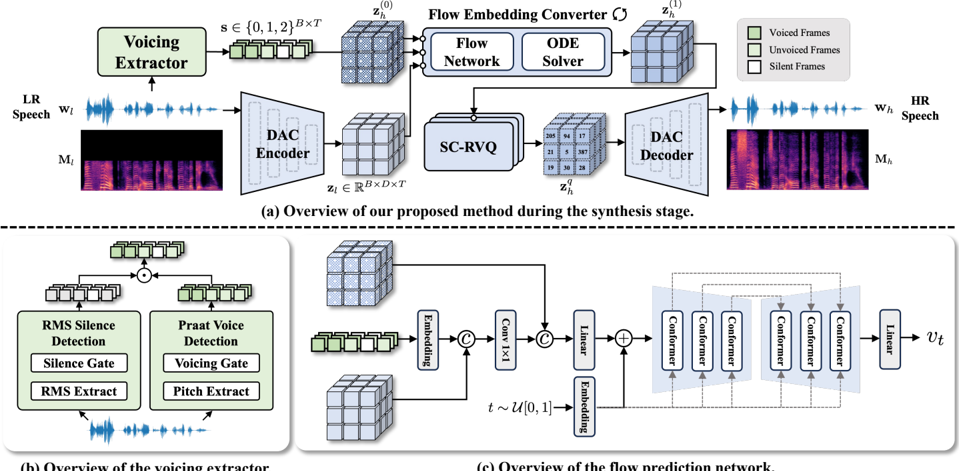

> [!abstract] arXiv · 2026 · Preprint
> **Bowen Zhang et al.** (Singapore Institute of Technology / Nanyang Technological University / National University of Singapore) · [→ Paper](https://arxiv.org/abs/2603.02022) · Demo: ? · Code: ?
>
> Performs speech bandwidth extension by converting continuous neural codec embeddings with a voicing-aware conditional flow matching model, rather than operating directly on waveforms or spectrograms.

## Problem

Speech bandwidth extension (BWE) reconstructs missing high-frequency content from low-bandwidth speech to improve clarity and intelligibility. Prior neural approaches operate either on waveforms directly, which is computationally expensive for full-band generation, or on mel-spectrograms, which discard phase information that must be reconstructed separately. Neural audio codecs offer a compact latent alternative that better preserves acoustic detail, and recent work has begun converting codec representations for BWE. However, existing codec-based conversion methods, whether on discrete tokens or continuous embeddings, suffer from representation mismatch between low-resolution (LR) and high-resolution (HR) latents, limiting the perceptual quality of the reconstructed speech.

## Method

CodecFlow performs BWE entirely within a Descript Audio Codec (DAC) latent space rather than on the raw waveform. Given LR speech, a voicing extractor first derives a frame-level voiced/unvoiced/silent label sequence by combining RMS-based silence detection with pitch-based voiced/unvoiced detection (via Parselmouth), motivated by the observation that LR and HR codec embeddings are more similar in voiced regions than in unvoiced ones. In parallel, the DAC encoder produces a continuous LR latent embedding. A Flow Embedding Converter (FEC), a conditional flow-matching (CFM) model with a U-Net-style Conformer encoder-decoder backbone, is conditioned on both the LR embedding and the voicing sequence (fused via a lightweight convolutional projection, with classifier-free guidance) to transport a base distribution toward the HR embedding distribution. At inference, a 25-step Euler ODE solver integrates the learned velocity field to recover the HR latent.

To stabilize the mapping between continuous embeddings and their discretized codes, the paper also introduces a Structure-Constrained Residual Vector Quantizer (SC-RVQ), which augments standard RVQ with a margin loss that sharpens codebook decision boundaries and a monotonic-decay loss that enforces coarse-to-fine residual energy across RVQ stages. Training proceeds in three stages: (1) the DAC codec augmented with SC-RVQ is trained with reconstruction, adversarial, and structural-regularization losses, initialized from a pretrained DAC checkpoint; (2) the FEC is trained with the CFM objective on paired LR/HR embeddings extracted from the frozen stage-1 codec; (3) the full pipeline is fine-tuned end-to-end, unfreezing the DAC encoder/decoder while keeping the FEC and SC-RVQ fixed.

## Key Results

On the 8 kHz → 16 kHz task, CodecFlow achieves the lowest overall and high-frequency Log-Spectral Distance (LSD 1.01, LSD-HF 1.27) among all baselines (Nu-Wave2, AP-BWE, Fre-Painter, CFM-based FlowHigh) and the highest VISQOL (2.72), NISQA-predicted MOS (4.25), and Colouration (4.04) scores. On the more demanding 8 kHz → 44.1 kHz task, CodecFlow attains the lowest LSD (0.93) and LSD-HF (0.98), though FlowHigh reports a higher VISQOL and AP-BWE a higher MOS at that setting; CodecFlow's MOS (4.42) and Colouration (4.25) remain comparable to or matching the strongest baseline *(§4.1, Table 1)*. An ablation isolating the conversion module shows that direct latent residual regression (CodecReg) degrades sharply at 44.1 kHz (LSD 4.86) relative to CFM-based converters (LSD ≈1.0-1.3), and that adding the U-Conformer backbone and end-to-end fine-tuning yields further, consistent gains across both settings *(§4.2, Table 2)*. A gender-stratified breakdown found no statistically meaningful disparity in reconstruction quality between male and female speakers *(§4.1, Figure 5)*.

## Novelty Assessment

The core generative mechanism, conditional flow matching, is an established paradigm already used for audio super-resolution (e.g., FlowHigh) and speech enhancement. CodecFlow's contribution is applying CFM specifically to continuous neural-codec latents rather than mel-spectrograms, combined with two targeted engineering additions: explicit voicing conditioning motivated by an empirical observation about LR/HR embedding similarity in voiced vs. unvoiced regions, and a structural regularizer (SC-RVQ) addressing a specific failure mode of standard RVQ (continuous-embedding alignment diverging from discrete-token alignment). The three-stage training recipe, and the finding that end-to-end fine-tuning meaningfully improves over a frozen-codec pipeline, are incremental but concretely validated via ablation. This is best characterized as architectural-novelty at the level of a specialized conversion module and quantizer regularizer within an existing codec framework, not a new generative paradigm.

## Field Significance

moderate — This paper provides a concrete demonstration that flow matching in a codec's continuous latent space can outperform both direct spectrogram/waveform BWE methods and prior codec-token-based conversion approaches, with an ablation that isolates the individual contributions of voicing conditioning, flow-based conversion, and joint fine-tuning. Its scope is narrow (bandwidth extension specifically) and evaluated on a small set of held-out utterances against a handful of specialized baselines, so its significance is confined to the BWE sub-problem within codec-based speech processing rather than the broader TTS/VC generative pipeline.

## Claims

- **supports:** Performing latent-space conversion with conditional flow matching, rather than direct residual regression, produces more stable reconstructions under large resolution gaps between low- and high-fidelity codec embeddings.
  > *Evidence:* In the ablation, CodecReg (direct residual regression) degrades severely at 8kHz→44.1kHz (LSD 4.86) while CFM-based converters with the same backbone stay in the 1.0-1.3 LSD range at the same setting. *(§4.2, Table 2)*
- **supports:** Conditioning a bandwidth-extension model on explicit voiced/unvoiced state information improves recovery of high-frequency content, because voiced and unvoiced regions exhibit systematically different low-to-high-resolution embedding similarity.
  > *Evidence:* The paper reports higher LR-HR codec embedding cosine similarity in voiced than unvoiced regions and shows the full voicing-aware CodecFlow model achieves the lowest LSD-HF among all compared systems at both 16 kHz (1.27) and 44.1 kHz (0.98) targets. *(§2.2, §4.1, Figure 2, Table 1)*
- **complicates:** Gains from flow-matching-based latent conversion in a codec pipeline depend substantially on jointly fine-tuning the codec encoder/decoder end-to-end, not solely on the conversion module's architecture.
  > *Evidence:* In the ablation, the U-Conformer CFM variant trained without end-to-end fine-tuning ("CFM-UConf w/o FT") underperforms the fully fine-tuned CodecFlow on every reported metric at both bandwidth settings. *(§4.2, Table 2)*
- **complicates:** Automated objective and perceptual metrics for bandwidth extension can disagree on which system performs best, complicating single-metric model selection.
  > *Evidence:* At the 8kHz→44.1kHz setting, FlowHigh attains the highest VISQOL and AP-BWE the highest NISQA-predicted MOS, while CodecFlow leads on LSD and LSD-HF; no single baseline dominates across all reported metrics. *(§4.1, Table 1)*

## Limitations and Open Questions

The evaluation set is small (50 TIMIT utterances plus 50 utterances from four held-out VCTK speakers), and perceptual quality is reported via NISQA-predicted MOS and Colouration scores rather than human listening tests, so the perceptual claims rest on automated predictors rather than subjective ratings. The paper reports no total parameter count or inference latency comparison against baselines, leaving the framework's claimed efficiency advantage over waveform- and spectrogram-domain methods unquantified. Training and evaluation are also restricted to two fixed upsampling settings (8kHz→16kHz and 8kHz→44.1kHz); generalization to arbitrary-scale bandwidth extension, a capability some baselines (e.g., Nu-Wave2) target explicitly, is not addressed.

## Wiki Connections

- [[flow-matching|Flow Matching]] — applies conditional flow matching to convert low-resolution codec embeddings into high-resolution ones, extending CFM's use beyond mel-spectrogram or waveform super-resolution into codec latent space.
- [[neural-codec|Neural Audio Codec]] — builds on a DAC-based codec and proposes a Structure-Constrained RVQ variant to improve alignment between continuous embeddings and discrete tokens for a downstream conversion task.
- [[gan-vocoder|GAN Vocoder]] — fine-tunes the codec's adversarially-trained encoder/decoder end-to-end alongside the flow-based converter, showing that joint optimization with the vocoder stage improves reconstruction quality over a frozen-codec pipeline.
