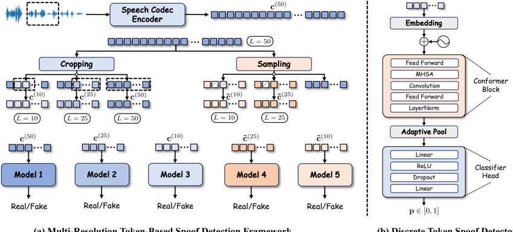

> [!abstract] arXiv · 2026 · Preprint
> **Junchuan Zhao et al.** (National University of Singapore) · [→ Paper](https://arxiv.org/abs/2603.05373) · Demo: ✓ · Code: ?
>
> Introduces a training-free, inference-time framework that guides discrete codec-token speech synthesis with multi-resolution spoof detectors, pruning and re-ranking candidate token sequences during decoding to reduce token-level artifacts without retraining the base TTS model.

## Problem

Neural codec language models generate speech by predicting discrete codec tokens autoregressively, but because training is teacher-forced while inference is not, generated token sequences can drift from the natural codec distribution as decoding proceeds. This drift produces token-level artifacts, locally unnatural transitions, and perceptual degradation. Existing mitigations either retrain or fine-tune the backbone with preference optimization or reward signals (e.g. SpeechAlign-style approaches), which adds cost and complexity, or apply decoding-time heuristics such as repetition-aware sampling that target specific failure patterns without explicitly assessing whether a generated sequence remains globally consistent or locally natural. Separately, spoofed/deepfake speech detectors are well studied for post-hoc classification of reconstructed audio waveforms, but none operate directly on discrete codec token sequences or are designed to steer generation during decoding.

## Method

The paper proposes MSpoof-TTS, which keeps a pretrained codec-based autoregressive TTS backbone (NeuTTS) entirely fixed and instead guides its decoding with a separately trained spoof detector. The approach has two components.

First, a multi-resolution token-level spoof detection framework trains discriminators to distinguish golden (ground-truth) from synthesized codec token sequences using segments built at multiple temporal scales: contiguous crops of length 10, 25, and 50 tokens, plus skip-sampled (strided) variants of the 50-token span at downsampling rates 2 and 5. Each segment is passed through an embedding layer and stacked Conformer blocks, pooled adaptively, and classified as real or synthetic with a binary cross-entropy objective, yielding five independently trained detectors (M10, M25, M50, M50→25, M50→10) that share architecture but not parameters.

Second, a hierarchical spoof-guided sampling procedure (Algorithm 2) builds on a proposed Entropy-Aware Sampling (EAS) base decoder (Algorithm 1), an adaptation of VALL-E 2's repetition-aware sampling that penalizes competing candidate tokens using inverse-rank weighting and exponential temporal decay with clipping, rather than heuristic repetition counts. During decoding, the framework generates multiple candidate continuations with EAS, prunes them progressively using the short-span detector (M10) and then the mid-range detector (M25) across successive extension stages, and finally selects among surviving full-length candidates by aggregating ranks from the long-span detector (M50) and its strided variants (M50→25, M50→10) with weighted rank aggregation. This coarse-to-fine, multi-resolution pruning is applied at inference time only; the underlying codec language model and its parameters are never modified. The default speech tokenizer for both training and inference is NeuCodec.

## Key Results

On LibriSpeech and LibriTTS, both EAS and RAS (repetition-aware sampling) individually outperform the vanilla top-k sampling baseline (Original), and adding hierarchical spoof-guided ranking (HierEAS, i.e. MSpoof-TTS; HierRAS) yields further gains, most consistently in perceptual-quality metrics: on LibriSpeech, HierEAS reaches NISQA 4.602 and MOSNET 4.4158 versus 4.462 and 4.3418 for the Original baseline, while also lowering WER from 0.0694 to 0.0532 and improving SIM from 0.894 to 0.901 (Table 1). Gains in WER and speaker similarity are described by the authors as comparatively modest given the baseline decoder's already strong lexical accuracy and speaker consistency. On the TwistList tongue-twister stress test, EAS attains the lowest WER (0.1433) among all methods, and HierEAS achieves the best NISQA (4.513) and MOSNET (3.9802) while keeping WER competitive (0.1531 vs. 0.1654 for Original), though HierRAS's WER (0.1702) is worse than the non-hierarchical baseline on this harder set (Table 2). Subjective listening tests with 15 participants (MOS-N, MOS-Q, SMOS) show hierarchical variants achieving higher naturalness and, to a smaller degree, overall quality than non-hierarchical counterparts, while speaker similarity remains high across all methods without MSpoof-TTS obtaining the top score. Detector ablations (Table 3) show the full-resolution (L=50) discriminator achieves the strongest standalone performance (AUROC 0.9199), with shorter segments and strided variants retaining moderate but reduced discriminative capability.

## Novelty Assessment

The contribution is primarily architectural at the inference-time level: a genuinely new way to extend spoof detection to discrete codec token sequences (prior spoof/deepfake detectors operate on reconstructed audio, not token sequences) and a new hierarchical, multi-resolution discriminator-guided decoding procedure that combines progressive pruning with rank aggregation across detector resolutions. The base entropy-aware sampler (EAS) is an incremental refinement of VALL-E 2's repetition-aware sampling, and the overall strategy of steering a frozen generator with an external classifier during decoding echoes plug-and-play approaches from controllable text generation, so the framing borrows ideas from adjacent literatures. The training-free property (no backbone fine-tuning, no preference optimization) is the paper's main practical selling point relative to retraining-based robustness methods.

## Field Significance

moderate — The paper contributes a novel, training-free decoding-time mechanism for improving codec-LM speech synthesis robustness, and demonstrates it consistently improves perceptual quality metrics while preserving intelligibility and speaker similarity across three benchmarks. The gains on standard intelligibility and similarity metrics are modest by the authors' own account, and the framework is evaluated on a single backbone (NeuTTS) and codec (NeuCodec), which limits generalization claims from the paper's own evidence.

## Claims

- **supports:** Training-free, inference-time discriminator guidance can improve perceptual quality of autoregressive codec-token speech synthesis without modifying or retraining the underlying language model.
  > *Evidence:* HierEAS improves NISQA and MOSNET over the vanilla top-k baseline on both LibriSpeech (4.602 vs. 4.462 NISQA; 4.4158 vs. 4.3418 MOSNET) and LibriTTS, while keeping the codec language model parameters fixed. *(§4.1, Table 1)*
- **refines:** The training/inference mismatch in autoregressive codec-token generation manifests as a distributional gap between golden and synthesized tokens that is detectable at multiple temporal resolutions, not just at the full-utterance level.
  > *Evidence:* Token embeddings pooled at 50-, 25-, and 10-token segment lengths all show a consistent golden-vs-synthesized statistical gap via t-SNE visualization, motivating detectors trained separately at each resolution. *(§2.1, Figure 2)*
- **complicates:** Discriminator-guided decoding improvements are uneven across metric types, with larger gains in perceptual-quality estimators than in intelligibility or speaker-similarity metrics.
  > *Evidence:* On LibriSpeech and LibriTTS, WER and SIM improvements from hierarchical sampling are described as modest given the already strong baseline performance on those metrics, while NISQA/MOSNET gains are more consistent. *(§4.1)*
- **complicates:** Hierarchical hypothesis pruning does not uniformly help every base sampler under challenging phonetic conditions.
  > *Evidence:* On the TwistList tongue-twister test set, HierRAS has a higher WER (0.1702) than its non-hierarchical counterpart RAS (0.1572), even though HierEAS still improves over EAS on perceptual-quality metrics. *(§4.2, Table 2)*

## Limitations and Open Questions

> [!warning] Results are demonstrated on a single frozen backbone (NeuTTS) and a single codec tokenizer (NeuCodec); the paper does not report whether the multi-resolution spoof-guided decoding strategy transfers to other codec language model architectures or tokenizers.

The subjective evaluation uses a small listener pool (15 participants), and MOS-N/MOS-Q/SMOS results are reported only via a bar chart (Figure 3) rather than as tabulated values, limiting the precision with which the reported perceptual gains can be verified. On the TwistList stress test, hierarchical variants do not always achieve the lowest WER, and the paper does not fully explain why HierRAS underperforms RAS in this setting while HierEAS still improves over EAS. The spoof detectors themselves are trained on LibriTTS-derived synthetic speech from the same base generator used at inference, so detector generalization to synthetic artifacts from other TTS systems is not evaluated.

## Wiki Connections

- [[autoregressive-codec-tts|Autoregressive Codec TTS]] — proposes an inference-time, discriminator-guided decoding strategy specifically for autoregressive codec-token language models, targeting the token-level drift that arises from their teacher-forced training versus autoregressive inference mismatch.
- [[zero-shot-tts|Zero-Shot TTS]] — builds on and evaluates against a zero-shot codec-LM TTS backbone (NeuTTS) that synthesizes speech conditioned on a reference utterance from an unseen speaker.
- [[neural-codec|Neural Audio Codec]] — operates directly on NeuCodec discrete token sequences, training spoof detectors and applying pruning/re-ranking in the codec token space rather than on reconstructed waveforms.
- [[subjective-evaluation|Subjective Evaluation]] — reports a listening test with 15 human participants rating naturalness, quality, and speaker similarity across decoding strategies.
- [[2407.05407|CosyVoice]] — cited among the neural codec language model TTS systems whose autoregressive decoding is the target failure mode this paper's framework addresses.
- [[2601.03170|TED-TTS]] — a related National University of Singapore training-free inference-time TTS control method, cited alongside this paper's own line of training-free, decoding-time approaches to codec-LM speech synthesis.
