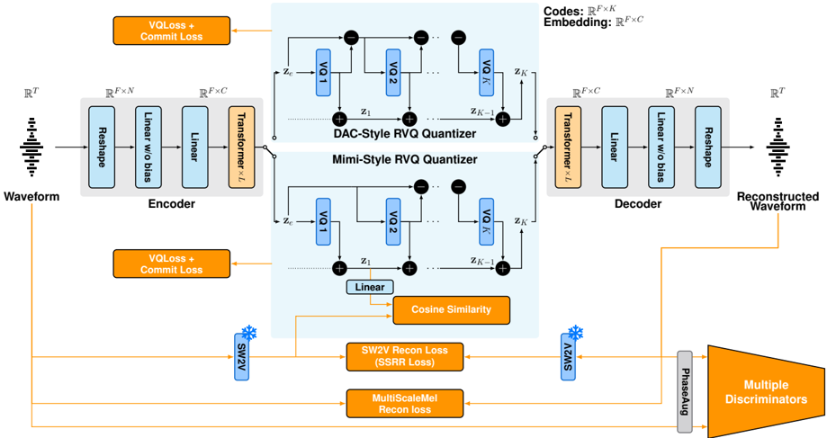

> [!abstract] arXiv · 2026 · Preprint
> **Junhyeok Lee et al.** (Johns Hopkins University / University of Southern California) · [→ Paper](https://arxiv.org/abs/2603.05887) · Demo: ✓ · Code: ✓
>
> Introduces a self-supervised representation reconstruction (SSRR) loss that trains a streaming neural audio codec to reconstruct distilled self-supervised representations from its own decoded output, substantially improving intelligibility and training speed under a zero-lookahead, low-latency constraint.

## Problem

Neural audio codecs trained primarily with mel-spectrogram reconstruction and adversarial losses often fail to preserve intelligibility, particularly at low bitrates and under streaming constraints. Semantic encoder distillation (SED), used by codecs such as Mimi, aligns the encoder's quantized representations with a self-supervised speech model but imposes no loss on the decoder, so it does not guarantee that the reconstructed audio itself remains intelligible. Prior work has also observed a "semantic-acoustic conflict," where semantic distillation tends to degrade acoustic quality at low bitrates. Streaming codecs compound the problem: architectures that avoid lookahead or use large frame sizes to hit low-bitrate operating points tend to show lower intelligibility than their non-streaming counterparts, and codecs that report competitive results typically require large multi-GPU, multi-node training budgets. The paper targets a streaming, zero-lookahead codec that preserves intelligibility without those training costs.

## Method

The authors propose JHCodec, a fully causal Transformer-based residual-vector-quantized codec (RVQ-VAE) built on the TS3-Codec architecture, with FlashAttention, Pre-LayerNorm, rotary positional embeddings, SwiGLU feed-forward layers, and LayerScale. The encoder and decoder each use 8 Transformer layers (1024-dim, 4096-dim FFN) operating on 320-sample input windows, giving a 50 Hz frame rate with 8 RVQ codebooks (V=1024, low-rank projection dimension M=16). Two RVQ variants are compared: a DAC-style RVQ (acoustic-only codebooks) and a Mimi-style RVQ (one semantic codebook plus acoustic codebooks, summed).

For the semantic component, the authors first train a causal self-supervised representation extractor (SW2V) that distills multilingual W2V-BERT 2.0 (17th-layer features) into a causal encoder via cosine-similarity maximization, choosing W2V-BERT 2.0 over WavLM for its multilingual training data. SW2V shares the codec encoder's architecture for efficiency and causality.

The core contribution is the self-supervised representation reconstruction (SSRR) loss: rather than distilling the encoder's quantized representations toward a self-supervised target (SED), SSRR minimizes the L1 distance between SW2V features extracted from the original waveform and from the codec's *reconstructed* waveform. Because the gradient of this loss propagates through the decoder, quantizer, and encoder jointly, it directly constrains the decoder to preserve phonetic content, unlike mel-spectrogram or feature-matching losses, which only indirectly encourage intelligibility. SSRR is combined with the standard codec objective (multi-scale mel L1 loss, VQ/commitment losses, adversarial and feature-matching losses from MPD and MS-STFTD discriminators, plus PhaseAug augmentation and input noise injection for denoising). Training uses one H200 GPU for the first 600k steps (two H200 GPUs afterward, to 1M steps), staged so that GAN and SSRR losses are introduced only after 10k warmup steps and masking is applied between 10k and 100k steps.

## Key Results

On LibriSpeech test-clean, JHCodec-M-8 (Mimi-style RVQ, 8 codebooks, 271M params) reaches WER 3.19 / CER 1.25 / S-SIM 0.9826 / UTMOS 3.3229, outperforming Mimi-32 on WER and CER despite using far fewer codebooks and a fraction of Mimi's reported training budget (1 H200 GPU vs. 8 A100s at 1M steps). Ablations at matched training steps show SSRR roughly halving WER for both RVQ variants at 300k steps, with both variants reaching within 1% of ground-truth WER after only 300k steps when SSRR is enabled (§3.4, Table 1). At 300k steps, models trained with SSRR from early on already approach the intelligibility of models trained twice as long without it. On the noisier LibriSpeech test-other, TITW-Hard, and MLS non-English test sets, JHCodec-M-8 remains competitive with or ahead of most streaming and non-streaming baselines (Tables 4-6), though Mimi-32's larger 32-codebook configuration still wins on WER/CER/S-SIM in the noisiest conditions. A downstream ASR probe (fine-tuned Whisper Small on frozen codec features) shows JHCodec's encoder features outperform Mimi-32 and NanoCodec features for WER (Table 7). Latency and compute comparisons (Table 2) show JHCodec-M-8 achieves the lowest measured end-to-end latency (26.8 ms) among the reported streaming baselines with zero lookahead, at a real-time factor around 0.001.

## Novelty Assessment

The architecture itself is largely an engineering combination of known components: a TS3-Codec-style causal Transformer backbone, RVQ-VAE quantization following DAC and Mimi conventions, and standard GAN-based codec training. The genuinely new element is the SSRR loss and its systematic study. The paper explicitly distinguishes SSRR from SED (Mimi's approach, which only constrains the encoder) and from TAAE (the only other codec applying a similar reconstruction-of-self-supervised-features loss), noting that TAAE applies the loss only at the final training stage and does not analyze its effect on training dynamics. This paper's contribution is applying SSRR from early training across multiple RVQ configurations and showing it substantially accelerates convergence as well as improving intelligibility, enabling single-GPU training that is competitive with codecs trained on much larger multi-GPU budgets. This is a training-recipe/loss-function contribution rather than a structural architecture innovation.

## Field Significance

moderate — This paper provides a concrete, ablated demonstration that reconstructing self-supervised representations from a codec's own decoded output (rather than only distilling them into the encoder) is a more effective route to intelligibility than existing semantic-distillation approaches, and that this benefit is largest early in training. It extends and systematically evaluates an idea previously used only narrowly (TAAE, late-stage only) and demonstrates a practical benefit: state-of-the-art streaming, zero-lookahead performance trainable on a single GPU. This lowers the resource barrier for codec research and provides a directly reusable training-objective recipe, but the underlying architecture is not itself new.

## Claims

- **supports:** Reconstructing self-supervised representations from a codec's decoded output, rather than only distilling them into the encoder, more directly enforces intelligibility because the resulting loss gradient propagates through the decoder and quantizer.
  > *Evidence:* SSRR (L1 distance between SW2V features of original vs. reconstructed audio) roughly halves WER relative to the same architecture without SSRR at 300k training steps, for both DAC-style and Mimi-style RVQ configurations *(§3.4, Table 1)*.
- **supports:** Applying a self-supervised representation reconstruction loss from early in training accelerates codec convergence, reducing the compute budget needed to reach competitive intelligibility.
  > *Evidence:* With SSRR enabled, both RVQ variants reach WER within 1% of ground truth after only 300k steps (a single H200 GPU), while the paper reports that prior competitive streaming codecs (e.g., Mimi) require multi-node budgets of 8+ A100 GPUs over comparable or longer step counts *(§3.4, §3.5, Table 2)*.
- **complicates:** Improving intelligibility via a self-supervised representation reconstruction objective can come at a small cost to perceptual quality as measured by naturalness predictors.
  > *Evidence:* SSRR is reported to slightly reduce UTMOS in some configurations even as WER, CER, and S-SIM improve; the paper characterizes this as a favorable but non-free trade-off *(§3.4)*.
- **complicates:** RVQ codebook depth remains a stronger lever than a semantic reconstruction loss for intelligibility and speaker similarity under acoustically challenging or noisy conditions.
  > *Evidence:* On LibriSpeech test-other and TITW-Hard, Mimi-32 (32 codebooks) achieves the best WER, CER, and S-SIM among streaming models, outperforming JHCodec-M-8's 8-codebook configuration despite JHCodec's SSRR training and much smaller training budget *(§4.1, §4.2, Tables 4-5)*.

## Limitations and Open Questions

> [!warning] The reported training-efficiency comparisons are not fully controlled: JHCodec is compared against baselines' self-reported GPU budgets, datasets, and training schedules, which differ across models, so the single-GPU competitiveness claim should be read as directional rather than a matched ablation against any one baseline.

The paper also notes an unexplained optimization anomaly: gradient norms in the RVQ pathway are consistently around two orders of magnitude larger than typical Transformer decoder gradient norms, and the theoretical expectation that residual quantization error should shrink with codebook depth is not observed in practice; the authors leave analysis of this behavior to future work (§3.4). The model is trained exclusively on English speech, and while it generalizes reasonably to MLS non-English test sets, it is consistently outperformed by higher-capacity RVQ baselines (Mimi-32) on non-English intelligibility (§4.3, Table 6). Finally, evaluation relies on Whisper-based WER/CER as an intelligibility proxy and WavLM cosine similarity for speaker similarity, rather than human listening tests.

## Wiki Connections

- [[neural-codec|Neural Audio Codec]] — Proposes a streaming RVQ-VAE codec and an SSRR training loss aimed at improving intelligibility preservation, a core neural-codec design problem.
- [[streaming-tts|Streaming TTS]] — Targets a fully causal, zero-lookahead codec architecture explicitly motivated by low-latency streaming and real-time speech-to-speech deployment.
- [[self-supervised-speech|Self-Supervised Speech]] — Depends on a causal self-supervised representation extractor (SW2V, distilled from W2V-BERT 2.0) both as an SED-style codebook target and as the reconstruction target for the SSRR loss.
- [[2411.18803|TS3-Codec]] — JHCodec's causal Transformer architecture is directly built on TS3-Codec, replacing its single-codebook VQ with RVQ and reducing window sizes.
- [[2410.00037|Moshi]] — Used as the primary SED baseline and streaming comparison point (Mimi codec); JHCodec's Mimi-style RVQ variant and SSRR are framed as improvements over Mimi's encoder-only semantic distillation.
- [[2411.19842|Scaling Transformers for Low-Bitrate Speech Coding]] — The only identified prior codec applying a similar self-supervised reconstruction loss (TAAE); this paper contrasts its early-and-systematic use of SSRR against TAAE's late-stage-only application.
- [[2409.05377|BigCodec]] — Used as a non-streaming baseline for intelligibility, speaker similarity, and perceptual quality comparisons.
- [[2509.16195|FocalCodec-Stream]] — Used as a streaming baseline for latency, intelligibility, and computational-efficiency comparisons.
- [[2506.23325|XY-Tokenizer]] — Cited as prior evidence for the semantic-acoustic conflict that SSRR is designed to mitigate.
- [[2210.13438|EnCodec]] — Its multi-scale STFT discriminator (MS-STFTD) is adopted directly as part of JHCodec's adversarial training objective.
- [[2509.17143|MaskVCT]] — Related prior work from the same research group on codec-based zero-shot voice conversion.
