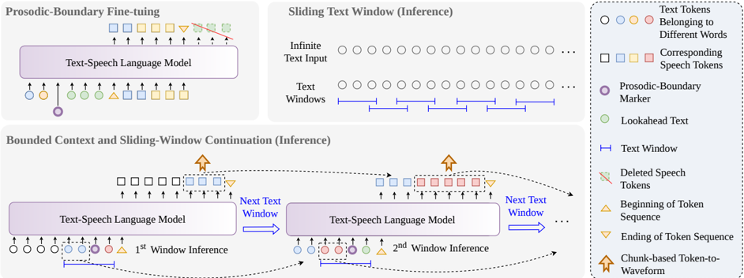

> [!abstract] arXiv · 2026 · Preprint
> **Changsong Liu et al.** · [→ Paper](https://arxiv.org/abs/2603.06444) · Demo: ✓ · Code: ?
>
> Adapts a pretrained LLM-based TTS model with a prosodic-boundary marker and bounded sliding-window prompting so that streaming synthesis from streaming text avoids both prosody degradation from missing lookahead and long-form collapse from unbounded generation context.

## Problem

Streaming text-to-speech that consumes streaming text (rather than a full sentence or utterance available up front) faces two compounding problems. First, natural prosody depends on lookahead: the model needs some amount of future text to place stress and pauses correctly, so restricting the receptive field to minimize latency produces unnatural prosody. Existing local-context approaches address this with causal attention modifications and precise forced text-speech alignment, which are complex to implement and depend on high-quality alignment annotations. Second, LLM-based TTS systems that interleave text and speech tokens in a single autoregressive sequence (e.g., the CosyVoice family, streaming Qwen3-TTS) accumulate unbounded generation history as synthesis proceeds. Because the speech length corresponding to a given text token varies, the physical distance between text and its associated speech tokens widens over a long utterance, eventually causing generation failure. Prior mitigations such as SpeakStream rely on precise character-level alignment annotations. The paper asks whether robust long-form streaming can be achieved using only weakly time-aligned data and no architectural modification to the base LLM-TTS model.

## Method

The approach is a post-training adaptation of an existing LLM-based TTS model, combined with a bounded-context inference procedure; it does not modify the base architecture.

During fine-tuning, a prosodic-boundary marker token is inserted into the text sequence at word-level positions derived from off-the-shelf forced alignment (WhisperX). With probability 1 − p_full, a word index m is sampled and the marker is spliced into the text after that word's span; the target speech sequence is then truncated to the corresponding aligned audio position (with a minimum length floor). The language model is fine-tuned to predict this truncated speech stream conditioned on the marker-augmented text, teaching it to treat the marker as both a segmentation cue and a prosodic anchor — i.e., to generate audio for only the segment preceding the marker while still using any text after the marker as lookahead context for prosodic planning.

At inference, streaming text is processed in fixed-size chunks of k words with a lookahead window of f future words; the chunk and lookahead are concatenated with the boundary marker in between. Cross-chunk continuity is maintained with a sliding-window prompt: the first chunk conditions on a reference utterance for zero-shot voice cloning, and each subsequent chunk conditions on the previously generated text and speech tokens for that chunk (excluding the lookahead portion). Because the prompt is always the fixed-size preceding chunk rather than the full generation history, the effective KV-cache size is bounded by O(k + f) regardless of total utterance length, which the authors argue prevents both latency growth and long-form instability. Generated speech tokens are passed to a streaming vocoder for incremental waveform synthesis.

The base architecture is CosyVoice2 (a Qwen-based LLM producing speech tokens, followed by a flow-matching module and a pretrained HiFi-GAN vocoder). Only the LLM component is fine-tuned with the proposed method; the flow-matching module and vocoder remain frozen. Training data is the English subset of CommonVoice 13.0 (approximately 930k utterances, ~1,000 hours), with any utterances overlapping the Seed-TTS-Eval test set removed. Fine-tuning uses p_full = 0.15, a speech-token frame rate of 25 Hz, and a minimum truncated length of 5 frames.

## Key Results

The proposed Boundary-Aware method is compared against two baselines built on the same CosyVoice2 backbone: an Interleaved baseline (CosyVoice2's native streaming implementation, growing KV cache) and a Sliding-Window baseline (prompts on previous-chunk tokens only, no boundary marker or lookahead, offline batch vocoding).

On standard-form Seed-TTS-Eval, the proposed method reaches WER 4.03% versus 7.48% (Interleaved) and 6.03% (Sliding-Window), with the highest speaker similarity (SPK-SIM 0.64) and emotion similarity (EMO-SIM 0.918). The largest gap appears on the paper's own LLM-expanded long-form benchmark: the Interleaved baseline collapses to WER 70.97% with severe deletion errors from context-driven hallucination, while the Sliding-Window baseline stays linguistically stable (WER 7.83%) but its speaker similarity drops sharply (SPK-SIM from 0.57 to 0.22) due to prosodic drift across chunk boundaries. The proposed method remains stable on both axes in long-form (WER 4.77%, SPK-SIM 0.65, EMO-SIM 0.912). Subjective MOS/SMOS/EMOS ratings from 20 listeners corroborate the objective pattern, with the proposed method scoring highest across all six standard/long-form cells (e.g., MOS 4.28 → 4.13 standard-to-long-form, versus the Interleaved baseline's 3.99 → 3.18 and the Sliding-Window baseline's 3.43 → 1.60).

On streaming efficiency, the proposed method achieves the lowest time-to-first-audio (1296 ms) among the three systems and a lower real-time factor than the Interleaved baseline (0.782 vs. 0.843) under streaming vocoding; the Sliding-Window baseline reports a lower RTF (0.718) only because it uses offline batch vocoding rather than incremental synthesis, which the authors note is not a fair comparison for streaming latency. An ablation over chunk size k and lookahead f shows WER is highly sensitive to minimal context (33.27% at k=1, f=1) but stabilizes below 5% for k≥3, and that excessive lookahead relative to chunk size can destabilize generation (long-form WER rises from 3.03% to 12.98% as f increases from 2 to 6 at k=10).

## Novelty Assessment

The contribution is a post-training adaptation and a bounded-context inference procedure applied to an existing LLM-based TTS architecture (CosyVoice2), not a new model structure. The core idea — a learned boundary marker plus fixed-size sliding-window prompting to bound KV-cache growth — is a genuinely new training/inference recipe rather than a novel network component, and it is deliberately designed to avoid the causal-attention modifications and precise forced-alignment requirements that prior local-context streaming methods rely on. The comparisons are against the authors' own reimplementations of an interleaved baseline and a naive sliding-window baseline (both also built on CosyVoice2) rather than against a broad set of independently published streaming TTS systems, and the method is validated on a single base architecture. The long-form evaluation set is itself constructed by the authors (Seed-TTS-Eval sentences expanded via an LLM into 280-320 word paragraphs), which is a reasonable stress test but not an external benchmark.

## Field Significance

Moderate — the paper isolates and directly measures a specific, previously under-quantified failure mode (catastrophic long-form WER degradation from unbounded interleaved generation context in streaming LLM-TTS) and demonstrates a training/inference recipe that avoids it using only weakly time-aligned data, without architectural changes to the base model. Its contribution is primarily a training-recipe and inference-procedure advance rather than a new architecture; the evaluation is thorough on its own benchmarks but limited to one base model and author-constructed baselines.

## Claims

- **supports:** Interleaving text and speech tokens with unbounded generation history in autoregressive LLM-based TTS causes catastrophic degradation on long-form synthesis, even when short-form quality is acceptable.
  > *Evidence:* The Interleaved CosyVoice2 baseline's WER rises from 7.48% (standard-form) to 70.97% (long-form), attributed to KV-cache accumulation causing semantic drift, hallucination, and premature termination. *(§4.2.1, Table 2)*
- **supports:** Bounding the generation context to a fixed-size sliding window while separately supplying a small amount of future text as lookahead can preserve both linguistic stability and speaker/prosodic consistency in long-form streaming synthesis.
  > *Evidence:* The proposed boundary-aware method keeps WER at 4.77% and SPK-SIM at 0.65 in long-form evaluation, matching its own standard-form performance (WER 4.03%, SPK-SIM 0.64), while bounding effective context to O(k+f). *(§4.2.1, Table 2; §2.3)*
- **complicates:** Bounding context to only past history, without any forward lookahead, avoids catastrophic collapse but does not prevent prosodic and speaker-identity drift across chunk boundaries.
  > *Evidence:* The Sliding-Window baseline (past-history-only prompting, no boundary marker or lookahead) keeps long-form WER stable (7.83%) but SPK-SIM collapses from 0.57 to 0.22 between standard and long-form settings, and MOS drops to 1.60 ± 0.18. *(§4.2.1-4.2.2, Tables 2-3)*
- **complicates:** The amount of lookahead context used for prosodic planning in streaming TTS has a non-monotonic effect on quality: some lookahead helps, but too much relative to the current chunk destabilizes generation.
  > *Evidence:* In the chunk-size/lookahead ablation, increasing lookahead f from 2 to 6 at chunk size k=10 raises long-form WER from 3.03% to 12.98%. *(§4.3, Figure 2)*

## Limitations and Open Questions

The method is validated on a single base architecture (CosyVoice2) and against the authors' own reimplemented baselines rather than a broader set of published streaming TTS systems. The long-form evaluation benchmark is constructed by the authors themselves (Seed-TTS-Eval sentences expanded to paragraphs via an LLM), so it is not an independently established test set. The paper explicitly proposes generalization to other LLM-based TTS architectures, multilingual settings, and adaptive (rather than fixed-interval) boundary prediction as future work, indicating these are untested in the current study.

## Wiki Connections

- [[streaming-tts|Streaming TTS]] — introduces a post-training and inference strategy specifically targeting the two core failure modes of streaming text-to-speech with streaming text input: prosody loss from missing lookahead and long-form collapse from unbounded context.
- [[autoregressive-codec-tts|Autoregressive Codec TTS]] — adapts an autoregressive LLM-based codec-token TTS model (CosyVoice2) via post-training rather than proposing a new autoregressive architecture.
- [[prosody-control|Prosody Control]] — introduces an explicit mechanism (the boundary marker plus lookahead window) for controlling how much future textual context informs prosodic planning during streaming generation.
- [[zero-shot-tts|Zero-Shot TTS]] — retains zero-shot voice cloning via a reference-utterance prompt for the first chunk, carried forward through sliding-window continuation for subsequent chunks.
- [[evaluation-metrics|Evaluation Metrics]] — constructs a long-form stress-test benchmark by LLM-expanding Seed-TTS-Eval sentences into paragraphs, to separately measure standard-form and long-form streaming quality.
- [[2412.10117|CosyVoice 2]] — used as the frozen base architecture and as the source of the Interleaved baseline that this paper's method is fine-tuned to outperform.
- [[2601.15621|Qwen3-TTS]] — cited as another interleaved-arrangement streaming LLM-TTS system that faces the same unbounded-context long-form collapse problem the paper addresses.
- [[2406.02430|Seed-TTS]] — its Seed-TTS-Eval benchmark and evaluation protocol (WER, SPK-SIM, EMO-SIM) are used directly, and its test sentences are expanded to build the paper's long-form evaluation set.
