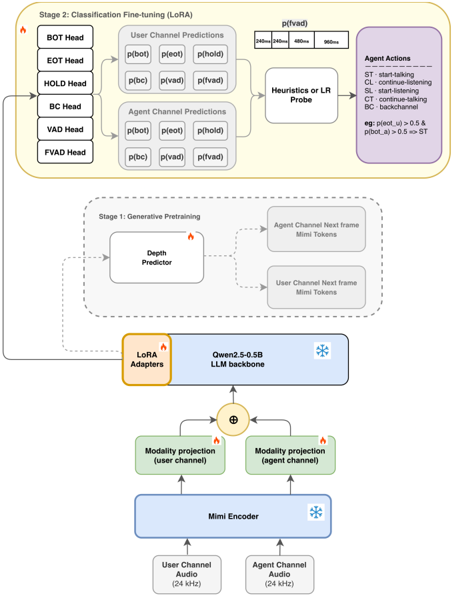

> [!abstract] arXiv · 2026 · Preprint
> **Shangeth Rajaa** (Anyreach AI) · [→ Paper](https://arxiv.org/abs/2603.08216) · Demo: ? · Code: ?
>
> Uses generative pretraining on dual-channel conversational audio as a representation-learning stage for explicit, label-free turn-taking signal prediction, letting a modular ASR-LLM-TTS pipeline anticipate turn boundaries the way end-to-end speech-to-speech systems do implicitly.

## Problem

Production voice agents built as modular ASR-LLM-TTS pipelines retain the reasoning and tool-calling capabilities of text LLMs but still trigger turn transitions with silence timeouts, which are purely reactive and produce delayed responses and interruptions. End-to-end speech-to-speech (S2S) models handle turn-taking more naturally because their generative pretraining forces them to predict what either speaker will say next, but they lack the reasoning and instruction-following abilities of text LLMs and their turn-taking competence cannot be transferred back into modular pipelines. Prior explicit turn-taking models are also incomplete: text-based predictors ignore prosody, single-channel audio classifiers cannot access the other speaker's context and so can only detect that a turn ended rather than what should happen next, and the closest existing dual-channel model (Voice Activity Projection, VAP) collapses all conversational phenomena into a single binary voice-activity signal, cannot distinguish backchannels from turn ends, and needed additional fine-tuning to exceed chance on backchannel prediction.

## Method

DualTurn encodes both speakers' 24kHz channels with the frozen Mimi neural codec, using the continuous 512-dimensional encoder embeddings (rather than discrete RVQ indices) at 12.5 frames/s. Each channel's features pass through a channel-specific MLP before being concatenated and fed into a Qwen2.5-0.5B backbone, trained in two stages. In Stage-1, the backbone and a lightweight (~10.6M-parameter) depth predictor are pretrained with LoRA adapters, then full fine-tuning, to autoregressively predict both speakers' next audio token simultaneously from the concatenated dual-channel stream; this generative objective is intended to force the model to learn semantic, prosodic, and interaction-pattern information useful for turn-taking. The depth predictor is discarded after Stage-1 and only the representation backbone is retained.

In Stage-2, twelve lightweight classification heads (six per channel) are attached to the backbone's final hidden state and fine-tuned, with the generative loss dropped, to predict self-supervised turn-taking signals derived purely from voice-activity alignment (no manual annotation): end-of-turn (EOT) and hold (mutually exclusive by construction at every speech offset), beginning-of-turn (BOT), backchannel (BC), voice activity (VAD), and future voice activity at four lookahead horizons (FVAD). A 4-second lookahead is used instead of VAP's 1-second window to avoid discarding the 12% of Switchboard turn transfers with pauses longer than 1s. Focal loss is applied to the sparse signals and binary cross-entropy to VAD/FVAD, with labels temporally smoothed by an asymmetric Gaussian so the model learns to anticipate events up to 240ms early.

At inference, the eighteen scalar signal outputs are mapped to five agent actions (start-talking, continue-listening, start-listening, continue-talking, backchannel) either via a zero-parameter domain-knowledge heuristic that thresholds individual signals, or via a multinomial logistic-regression probe fit on held-out validation data that linearly combines the signal probabilities. The model runs continuously on both channels with a 240ms stride (3 audio frames per step) using KV-caching, reporting 78ms latency on CPU and 27ms on an A100 GPU.

## Key Results

On the Switchboard 138-session test split, DualTurn (LoRA variant) reaches wF1 0.633 versus VAP's best logistic-regression variant at 0.389 on the 5-class agent-action task, and 0.707 versus VAP's 0.461 on the otoSpeech 113-session split. The largest gap is on backchannel detection, where VAP scores BC F1 = 0.000 (it has no dedicated backchannel signal) while DualTurn reaches 0.349 against a chance level of about 0.080. Against Wang et al.'s 3.1B-parameter audio-text fusion model on word-level turn prediction, DualTurn's single EOT signal alone (zero additional parameters) already exceeds it (AUC 0.914 vs. 0.880), a multi-signal heuristic reaches AUC 0.930, and the logistic-regression probe over all signal heads reaches AUC 0.963 with EER 9.7% versus the baseline's 19.3%. Re-evaluated under VAP's original 1-second event definitions (rather than DualTurn's broader 4-second window), DualTurn still outperforms VAP on all four of VAP's own protocol tasks, with the largest gain on shift/hold (+0.142 wF1). DualTurn anticipates turn boundaries about 220ms earlier than VAP (median -360ms vs. -140ms relative to turn end), with false start-for-continue-listening confusions dropping from 27.4% to 22.4% and interruptions falling by 5 percentage points.

Ablations isolate the source of these gains: an 8M-parameter LSTM backbone without pretraining performs almost identically to the unpretrained 0.5B LLM (wF1 0.602 vs. 0.604, BC F1 0.077 vs. 0.079), while adding Stage-1 pretraining to the LLM produces the entire backchannel gain (BC F1 0.079 to 0.349), so over 99% of the backchannel improvement is attributed to pretraining rather than architecture. A codebook-ablation on a discrete-input variant attributes 56% of turn-end discrimination to the first (semantic) Mimi codebook and 26% to the second, with the remaining six fine-acoustic codebooks jointly contributing only 18%.

## Novelty Assessment

The architectural components (Mimi codec, Qwen2.5-0.5B backbone, LoRA fine-tuning, classification heads) are all standard building blocks; the contribution is not a new architecture per se but a specific training-recipe choice: using dual-channel generative next-token-pair speech pretraining, which prior work has only used to train end-to-end speech-to-speech agents, as an unsupervised representation-learning stage for an explicit, interpretable turn-taking predictor deployable inside a modular ASR-LLM-TTS pipeline. The controlled ablations (pretrained vs. unpretrained, LLM vs. LSTM backbone, continuous vs. discrete codec input, auxiliary generative loss vs. none, text-aware pretraining vs. audio-only) are a genuine strength: they isolate that the gains come almost entirely from the pretraining objective and not from backbone capacity, which is a more rigorous causal claim than most papers in this area attempt. The evaluation, however, is limited to a single author's own comparisons on two datasets and 453 hours of English two-party audio, and both training datasets are described only briefly.

## Field Significance

> [!tip]
> High — demonstrates that a training recipe borrowed from end-to-end speech-to-speech models can be repurposed as an unsupervised representation-learning stage for explicit turn-taking prediction, closing a capability gap between S2S systems and modular ASR-LLM-TTS pipelines without any manual annotation.

This paper provides one of the first controlled demonstrations that dual-channel generative speech pretraining, previously used only to train the speaker-turn dynamics of end-to-end S2S agents, transfers as a representation-learning stage into a small, interpretable, CPU-deployable turn-taking module usable by production voice pipelines. Its ablation design (pretrained vs. not, architecture-matched LSTM vs. LLM) gives a causal account of where turn-taking competence comes from, which is a useful methodological template for future work on endpointing and full-duplex dialogue systems, beyond its own reported numbers.

## Claims

- **supports:** Generative pretraining on dual-channel conversational audio, without any turn-taking labels, produces representations that transfer effectively to explicit, interpretable turn-taking signal prediction.
  > *Evidence:* Adding Stage-1 generative pretraining to an otherwise identical Stage-2 classification setup raises backchannel F1 from 0.079 to 0.349 (chance ≈0.080) while leaving the backbone architecture unchanged. *(§3.3, Table 3)*
- **complicates:** Model capacity alone, without a matching pretraining objective, does not confer turn-taking competence, even when the capacity difference is large.
  > *Evidence:* An 8M-parameter LSTM and the unpretrained 0.5B-parameter LLM backbone perform nearly identically (wF1 0.602 vs. 0.604, BC F1 0.077 vs. 0.079); the LLM's capacity advantage becomes useful only once Stage-1 pretraining is applied. *(§3.3)*
- **supports:** Semantic content, not fine acoustic detail, is the dominant source of information for anticipating turn boundaries in codec-based dual-channel representations.
  > *Evidence:* A codebook-ablation on the discrete-input variant attributes 56% of shift/hold AUC discrimination to the first (semantic) Mimi codebook and 26% to the second, with the remaining six codebooks contributing only 18% jointly. *(§3.3)*
- **complicates:** Self-supervised generative pretraining can enable rare, sparse conversational event prediction (e.g. backchannels) without solving it outright, leaving low precision that limits standalone deployment.
  > *Evidence:* The pretrained model's backchannel signal reaches recall 0.458 (up from 0.045) but precision only 0.282 given that backchannels are under 8% of evaluation events, so the paper recommends the signal be used with a higher threshold or as a soft input rather than a sole trigger. *(§3.3)*
- **complicates:** Combining a generative pretraining loss with a discriminative fine-tuning objective in the same training stage can degrade the discriminative task through competing gradients, even when both objectives target related signals.
  > *Evidence:* Retaining the Stage-1 generative loss as an auxiliary loss during Stage-2 fine-tuning drops backchannel F1 from 0.349 to 0.077 and wF1 from 0.633 to 0.613, compared to dropping the generative loss entirely in Stage-2. *(§3.4)*

## Limitations and Open Questions

> [!warning]
> Training and evaluation are limited to 453 hours of English, two-party conversational audio (otoSpeech and Switchboard); the paper does not report results on multilingual, multi-party, or noisy real-world deployment conditions, and explicitly names scaling to larger multilingual/multi-party corpora as future work (§Conclusion).

The evaluation is conducted entirely by a single author against external baselines re-implemented or reported from prior papers (VAP, Wang et al.), rather than through independent third-party replication. Backchannel prediction, while substantially improved over the VAP baseline, remains low-precision (0.282) given the class's rarity in the evaluation data, so the paper itself cautions against using it as a sole deployment trigger. The paper does not report code or demo availability, limiting external reproducibility of the exact training pipeline.

## Wiki Connections

- [[spoken-language-model|Spoken Language Model]] — repurposes a dual-channel autoregressive audio-pretraining objective, the same class of objective used to train speech-text foundation models for real-time dialogue, as an unsupervised representation-learning stage for a downstream discriminative task.
- [[speech-to-speech|Speech-to-Speech]] — argues that generative dual-channel pretraining, the mechanism that gives end-to-end S2S dialogue systems their natural turn-taking, can be extracted and transplanted into modular ASR-LLM-TTS pipelines that otherwise rely on silence timeouts.
- [[neural-codec|Neural Audio Codec]] — relies on the frozen Mimi codec's continuous encoder embeddings as the input representation, and shows via codebook ablation that the codec's semantic (early) codebooks carry most of the turn-taking-relevant signal.
- [[self-supervised-speech|Self-Supervised Speech]] — derives all turn-taking training labels (EOT, HOLD, BOT, BC, VAD, FVAD) automatically from voice-activity alignment, with no manual annotation, and uses a self-supervised generative pretraining stage as the primary source of the model's turn-taking competence.
- [[evaluation-metrics|Evaluation Metrics]] — introduces per-channel turn-taking signal definitions and a 5-class agent-action taxonomy, and benchmarks against both a frame-level protocol (VAP) and a word-level protocol (Wang et al.) to show its own evaluation is not an artifact of a redefined label window.
- [[2509.23938|Easy Turn]] — a contemporaneous full-duplex turn-taking system that DualTurn does not directly benchmark against but which addresses the same problem of robust turn-taking in modular spoken dialogue pipelines by fusing acoustic and linguistic modalities, versus DualTurn's audio-only dual-channel generative pretraining approach.
