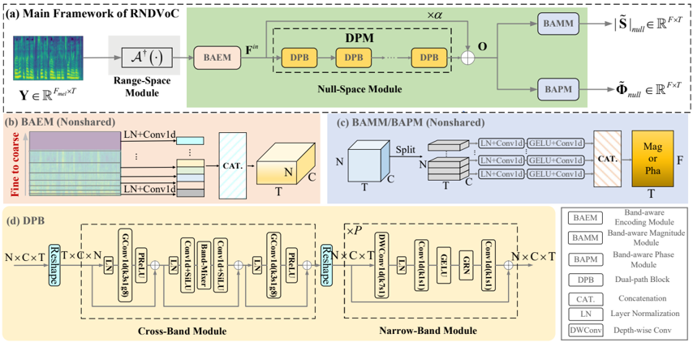

> [!abstract] arXiv · 2026 · Preprint
> **Andong Li et al.** (Chinese Academy of Sciences, Tencent AI Lab) · [→ Paper](https://arxiv.org/abs/2603.08574) · Demo: ✓ · Code: ✓
>
> Bridges classical range-null space decomposition (RND) theory with neural vocoding, reconstructing the target spectrogram as an explicit superimposition of a linear-algebra-derived range-space component and a learned null-space component, yielding a lighter, more interpretable, and inference-time-scalable time-frequency (T-F) domain vocoder.

## Problem

Neural vocoders that map mel-spectrograms to time-domain waveforms face three intertwined limitations. First, existing T-F domain approaches (Vocos, APNet) treat the mel-to-spectrogram mapping as an opaque, fully learned transformation, discarding the fact that the mel-spectrogram is a *known linear degradation* of the target linear-scale spectrogram; this black-box modeling distorts acoustic information during reconstruction. Second, once a vocoder is trained for a specific mel configuration (number of mel bands, maximum frequency), it cannot generalize to a different configuration without retraining, forcing projects like BigVGAN to ship separate checkpoints per configuration. Third, existing T-F domain vocoders lag behind mainstream time-domain GAN vocoders (e.g., BigVGAN) in reconstruction quality because they typically apply full-band modules (ResNet, ConvNext) rather than explicitly modeling the sub-band structure of speech spectra.

## Method

The authors formalize the mel-spectrogram extraction process as a linear compression problem `Y = A|S|`, where `A` is the mel-filter matrix and `S` is the target linear-scale spectrogram. Because `A` is known, its pseudo-inverse `A†` can project the mel-spectrogram back into a "range-space" component that is a lossless (in the orthogonal-projection sense) reconstruction of the linear-scale magnitude, leaving a complementary "null-space" component representing the spectral detail that the pseudo-inverse cannot recover. The framework, RNDVoC, computes the target spectrogram as the explicit sum of this range-space projection and a neural network-estimated null-space component (§III-A–C), rather than learning the full mel-to-spectrum mapping end to end.

The null-space module (NSM) that estimates the missing detail consists of a Band-aware Encoding Module (BAEM), a Dual-Path Module (DPM), and Band-aware Magnitude/Phase decoding Modules (BAMM/BAPM). BAEM splits the frequency axis into sub-bands using a fine-to-coarse partition (more, narrower bands at low frequency where harmonic structure is dense) and encodes each sub-band's gain-shape representation independently. The DPM stacks dual-path blocks (DPBs) that alternate a cross-band module (lightweight grouped-convolution mixing across sub-bands) and a narrow-band module (stacked ConvNeXt V2 blocks applied independently per sub-band, with shared parameters across bands) to capture correlations along both the frequency and time axes (§III-D). A parameter-sharing variant replaces per-sub-band encoding/decoding with region-based Conv2d/TrConv2d operators, trading a small amount of representational flexibility for a large reduction in parameter count (9.48M → 3.14M).

Training combines a reconstruction loss (log-spectral amplitude, phase, real-imaginary, mel, and STFT-consistency terms) with adversarial loss from a multi-period discriminator and a multi-resolution spectrogram discriminator, following the hinge-GAN formulation used in HiFi-GAN-style vocoders (§III-E1). The authors also introduce an "omnidirectional phase loss" that implements the phase differential as a fixed 9-kernel Conv2d operator over all eight neighboring time-frequency bins (rather than only the two directions used in prior anti-wrapping phase losses), improving phase reconstruction at negligible extra cost (§III-E2).

To address the retraining problem, the paper proposes a multiple-condition-as-data-augmentation (MCDA) strategy: because RND lets any mel configuration be projected into a shared linear-scale domain via its own pseudo-inverse, the model can be trained by randomly sampling different mel configurations (number of bands, maximum frequency) as a form of data augmentation, after which a single trained model generalizes to both seen and unseen mel configurations at inference without retraining (§III-D3).

## Key Results

On LJSpeech, RNDVoC-shared (3.14M params) reaches PESQ 3.987 and UTMOS 4.161, exceeding Vocos (13.46M params, PESQ 3.522) and matching or exceeding the 112M-parameter BigVGAN (PESQ 4.107) at 2.8% of its parameters and 8.17% of its computational cost (Table IV). On LibriTTS, RNDVoC-shared attains PESQ 4.226 and UTMOS 3.657, outperforming BigVGAN trained for the same 1M steps and reaching performance comparable to BigVGAN trained for 5M steps (Table V). In a MUSHRA listening test on LibriTTS (43 recruited raters, 35 valid responses after filtering), RNDVoC-shared scores 80.74±0.99, statistically significantly higher than BigVGAN's 54.95±1.11 (p<0.05) (Table VI). Against diffusion/flow-matching baselines, RNDVoC-shared reduces computational cost by over 99% relative to PeriodWave while achieving competitive objective scores (Table IX). On out-of-distribution data (EARS, VCTK, unseen at training time; models pretrained on LibriTTS), RNDVoC-shared outperforms BigVGAN on MUSHRA in both cases (Table VII). Ablations show that removing either the narrow-band or cross-band module degrades PESQ by 2.066 or 0.606 respectively (Table III), and that increasing sub-band count from 6 to 96 monotonically improves quality while a 200M-parameter full-band baseline (no sub-band split) underperforms all sub-band variants (Table X), which the authors term "sub-band scaling" as distinct from parameter scaling. A lightweight variant, RNDVoC-UltraLite (0.08M params), is reported as the smallest end-to-end neural vocoder to date and still outperforms the comparably-sized HiFiGAN-V2 (0.92M params) on PESQ and VISQOL (Table XII). Retrofitting the RND strategy into existing T-F domain vocoders (APNet, APNet2) also improves their performance with negligible added cost (§V-G), suggesting the decomposition is usable as a plug-in component.

## Novelty Assessment

The core contribution is the introduction of range-null space decomposition, an established tool from inverse-problem and diffusion-restoration literature, into the vocoder task, and the resulting reformulation of spectrum reconstruction as an explicit superimposition of a closed-form range-space projection and a learned null-space residual. This is a genuine architectural and conceptual novelty rather than incremental tuning: the paper shows in ablation that removing the explicit RND superimposition (replacing it with an implicit target mapping, or making the projection matrices learnable) degrades performance, and that the null-space component learns to be sparse and physically interpretable only when the projection matrices are held fixed (Table III, Id8–Id13, §V-B2). The sub-band-based dual-path architecture (band-aware encoding, cross-band/narrow-band modules, parameter-sharing scheme) and the MCDA training strategy for configuration-agnostic inference are secondary but non-trivial engineering contributions built on top of the RND framing. The paper is an extension of an earlier IJCAI 2025 conference version, adding the MCDA strategy, sub-band scaling analysis, and expanded evaluation (including out-of-distribution and music-domain results) as the paper's own stated new contributions relative to that prior work (§I).

## Field Significance

> [!tip] high
> high — introduces a reusable theoretical bridge (RND) between classical linear inverse-problem theory and neural vocoding that yields measurable gains when retrofitted into pre-existing T-F domain vocoders (APNet, APNet2), suggesting the framing is transferable beyond the specific RNDVoC architecture. It also demonstrates a concrete configuration-agnostic inference strategy (MCDA) that removes a practical retraining burden identified in widely-used vocoders like BigVGAN.

The paper demonstrates that decomposing vocoder output into a closed-form, information-preserving linear projection plus a learned residual can substantially reduce parameter count and computational cost relative to prevailing GAN vocoders while matching or exceeding their reconstruction quality, both objectively and in controlled listening tests. It also introduces sub-band scaling (increasing sub-band granularity without increasing parameter count) as a scaling axis distinct from the parameter-count scaling used by BigVGAN, providing an alternative lever for vocoder quality improvement that this paper's own ablations validate up to 96 sub-bands.

## Claims

- **supports:** Explicitly decomposing spectrogram reconstruction into a closed-form linear projection (recovering information already present in the input) plus a learned residual for the remaining detail can outperform end-to-end black-box mapping, both in efficiency and quality.
  > *Evidence:* Removing the explicit range-null superimposition (Id8) and replacing it with an implicit mapping degrades PESQ from 3.987 to 3.655 and Pitch RMSE from 21.346 to 26.012 on LJSpeech relative to the full RNDVoC-shared configuration (Id5) *(§V-B2, Table III)*.
- **supports:** Explicit sub-band-wise modeling of spectral structure, rather than full-band processing, improves vocoder reconstruction quality independently of parameter count.
  > *Evidence:* A 200M-parameter full-band baseline (N=1 sub-band) underperforms all sub-band variants (N=6 to 96) on PESQ, MCD, and UTMOS on LibriTTS, despite having roughly 64x more parameters than the default RNDVoC-shared configuration *(§V-D, Table X)*.
- **supports:** A single vocoder trained with randomized mel-configuration augmentation can generalize to unseen mel-spectrogram configurations (band count, max frequency) at inference without retraining, when the underlying degradation is linear and known.
  > *Evidence:* Without the MCDA strategy, UTMOS on an unseen configuration (F_m=72, f_max=12kHz) falls below 2.6; with MCDA (three pool variants of increasing size) scores recover and generalize across both seen and unseen mel configurations, with wider pools yielding consistently better results *(§V-E, Figure 14)*.
- **complicates:** The information-preserving benefit of a fixed linear projection depends on keeping the projection matrices non-learnable; allowing them to adapt during training reintroduces the reconstruction error the decomposition was meant to eliminate.
  > *Evidence:* Making the pseudo-inverse or the mel-filter matrix learnable (Id11–Id13) degrades PESQ relative to the fixed-matrix configuration (Id5), and visualized mel-spectrogram reconstruction error is near zero only when both matrices are fixed, non-zero even with an explicit idempotent constraint added *(§V-B2, Figure 10)*.
- **complicates:** Vocoder quality gains from explicit range-null decomposition diminish as the underlying network's own generative capacity increases, since a stronger network can partially compensate for the black-box mapping the decomposition is designed to avoid.
  > *Evidence:* Retrofitting the RND strategy into existing T-F domain vocoders shows a larger performance gap for the smaller RNDVoC-UltraLite than for the larger RNDVoC-Lite, indicating the decomposition's benefit is more pronounced when the network's intrinsic generation capability is limited *(§V-G, Figure 16)*.

## Limitations and Open Questions

> [!warning] The RND formulation depends on the mel-spectrogram degradation being linear and known in closed form (a fixed mel-filter matrix). The authors explicitly note this restricts the approach to acoustic features with a linear degradation structure; extending RND to more general acoustic features, where this assumption may not hold, is left as future work *(§Concluding Remarks)*.

The MCDA strategy is validated only for two configuration factors (number of mel bands and maximum frequency); its generalization to other mel-extraction hyperparameters (e.g., window size, hop size) or to entirely different acoustic feature pipelines is not evaluated. The parameter-sharing (shared) scheme, while substantially reducing parameter count, was shown in the complexity analysis to incur higher computational cost than the non-shared scheme, making it a trade-off rather than a strict improvement. The paper is a preprint extension of an IJCAI 2025 conference paper; the extension itself (MCDA, sub-band-scaling analysis, expanded OOD and music-domain evaluation) has not yet undergone the venue's peer review at the time of ingestion.

## Wiki Connections

- [[gan-vocoder|GAN Vocoder]] — RNDVoC is trained with the same hinge-GAN, multi-period/multi-resolution discriminator setup used by mainstream GAN vocoders, but restructures the generator around an explicit linear-projection-plus-residual decomposition rather than a black-box mapping.
- [[evaluation-metrics|Evaluation Metrics]] — the paper systematically compares eight objective metrics (M-STFT, PESQ, MCD, periodicity RMSE, V/UV F1, pitch RMSE, UTMOS, VISQOL) alongside MUSHRA and A/B preference tests across multiple in-domain and out-of-domain benchmarks.
- [[subjective-evaluation|Subjective Evaluation]] — conducts MUSHRA and A/B preference listening tests with 35 filtered human raters and reports statistical significance via one-tailed Kolmogorov-Smirnov tests.
- [[1609.03499|WaveNet]] — cited as the pioneering autoregressive neural vocoder whose slow sample-level generation motivated the shift toward non-autoregressive T-F domain approaches like RNDVoC.
- [[2010.05646|HiFi-GAN]] — RNDVoC adopts the same multi-period discriminator and multi-resolution spectrogram discriminator adversarial training setup introduced by HiFi-GAN.
- [[2206.04658|BigVGAN]] — used as the primary time-domain GAN baseline throughout; RNDVoC matches or exceeds BigVGAN's quality at a fraction of its parameters and compute, and is directly compared on MUSHRA and out-of-distribution evaluation.
- [[2306.00814|Vocos]] — the leading prior T-F domain GAN vocoder baseline; RNDVoC is shown to outperform Vocos by a large margin across all objective metrics on both LJSpeech and LibriTTS.
- [[iclr-2025-tQ1PmLfPBL|PeriodWave]] — used as the state-of-the-art flow-matching-based vocoder baseline; RNDVoC-shared achieves competitive quality at over 99% lower computational cost.
- [[2025.naacl-long.110|WaveFM]] — a flow-matching vocoder baseline compared against on the LibriTTS, EARS, and VCTK benchmarks in the diffusion/flow-matching comparison table.
