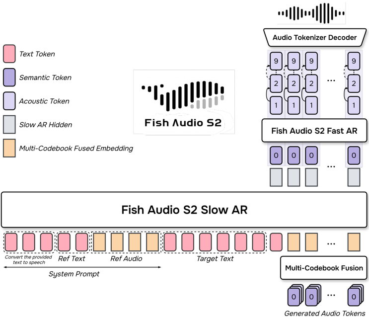
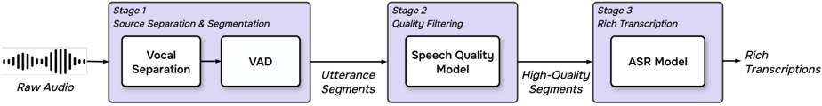

> [!abstract] arXiv · 2026 · Preprint
> **Shijia Liao et al.** (Fish Audio) · [→ Paper](https://arxiv.org/abs/2603.08823) · Demo: ✓ · Code: ✓
>
> Fish Audio S2 is a fully open-source multilingual TTS system that achieves instruction-following controllability, native multi-speaker multi-turn generation, and ultra-low latency (RTF 0.195, TTFA <100ms) via a Dual-AR architecture, a dual-purpose data pipeline where quality and ASR models serve both as pretraining filters and RL reward signals, and GRPO-based multi-dimensional RL post-training.

## Problem

High-quality, controllable TTS at production scale requires simultaneously solving three hard sub-problems: (1) fine-grained natural language instruction following for vocal attributes; (2) stable long-form and multi-speaker synthesis; (3) real-time streaming inference. Prior open-source systems (Fish Audio S1, CosyVoice 2) handle some of these but not all together. A further bottleneck is the *distribution shift* between pretraining data and RL reward models — the reward models are typically trained independently, causing them to penalize outputs that are actually reasonable under the pretraining distribution. Fish Audio S2 addresses all three functional requirements while eliminating the distribution shift problem through a unified data pipeline.

## Method

**Architecture — Dual-AR.** The system has two autoregressive components operating at different scales:

- *Slow AR (Temporal Semantic Backbone)*: A Qwen3-4B decoder-only transformer that autoregressively generates one semantic token per time step (first RVQ codebook). Text, system prompts, and reference audio tokens are interleaved in the input; reference audio tokens are masked from the loss to prevent memorization. Fine-grained vocal instructions (e.g., `[angry]`, `[whisper]`, `[laugh]`) are injected inline at specific token positions.
- *Fast AR (Depth-wise Acoustic Decoder)*: A lightweight 4-layer transformer that, conditioned on the Slow AR's hidden state, autoregressively generates the remaining 9 acoustic codebook tokens per time step. The Slow AR's hidden state is linearly projected and placed as a prefix; all codebooks share one embedding table within the Fast AR, with codebook layer identity encoded via RoPE. After all 10 codebook tokens are generated, a Multi-Codebook Fusion (MCF) step sums their embeddings into one vector as input to the Slow AR at the next step.

**Audio tokenizer.** A streaming variant of the DAC architecture (446M parameters, 1M training steps): causal convolutions replace standard convolutions; causal sliding-window Transformer bottleneck blocks surround the RVQ layers; ConvNeXt V2 layers extend the downsampling to 2048× (~21Hz); EVA-GAN replaces the DAC decoder for improved acoustic quality. The first codebook undergoes semantic distillation: an auxiliary head is trained to predict 16th-layer w2v-BERT 2.0 activations. Training uses composite GAN loss with multi-period, multi-resolution, and multi-scale STFT discriminators.

**Data pipeline — dual-purpose.** A three-stage pipeline (vocal separation + VAD → quality filtering → rich transcription) produces speech-text pairs with fine-grained vocal annotations. The pipeline is built around two core engines: (1) a *speech quality model* (w2v-BERT 2.0 + MLP, trained on proprietary quality-labelled data) and (2) a *rich-transcription ASR model* (Qwen3-Omni-30B fine-tuned to simultaneously transcribe speech and annotate speaker turns and vocal events like emotion and prosody). These same models are directly reused as RL reward signals in post-training, eliminating distribution shift by construction.

**Training — four stages.**
1. Audio tokenizer training.
2. Pretraining: 10M+ hours across 80+ languages, two phases (8K then 16K context), Qwen3-4B vocabulary extended with 4,096 semantic tokens.
3. SFT on curated high-quality labelled data.
4. RL post-training using a GRPO variant (Dr.GRPO, no value network): composite multi-dimensional reward R_total = λ_STT · R_STT + λ_Pref · R_Pref + λ_SIM · R_SIM, where R_STT (intelligibility + instruction-following from the ASR model), R_Pref (acoustic quality from the speech quality model), and R_SIM (cosine speaker similarity from a voiceprint model) are orthogonal, anti-hacking signals. A LoRA weight-swap mechanism (rsLoRA, r=16, α=64) computes KL divergence without a redundant reference model in VRAM.

**Inference engine.** SGLang-based, with multi-token indexing keys extending RadixCache to joint semantic+acoustic token prefixes. GPU co-scheduling of vocoder decoding with LLM decoding via MPS. Mean prefix-cache hit rate 86.4% (>90% peak) for repeated voices.

## Key Results

On Seed-TTS-Eval (Table 1), Fish Audio S2 achieves WER 0.54% (zh), 0.99% (en), 5.99% (zh-hard) — best among compared systems, outperforming CosyVoice 3-1.5B (1.12%/2.21%) and Qwen3-TTS (0.77%/1.24%). On CV3-Eval multilingual voice cloning (Table 2), average WER improves 23.9% relative over Fish Audio S1 (3.01 vs. 3.96), while achieving highest SIM in most languages. On Long-Audio Benchmark (Table 4), WER 4.38% (en) and CER 5.95% (zh) — best in class.

On Audio Turing Test (Table 5), Fish Audio S2 posterior mean 0.483 exceeds Fish Audio S1 (0.479) and all closed-source comparisons except itself; with instruction rewriting, 0.515 — surpassing previous SOTA by 30%. On EmergentTTS-Eval (Table 6), overall win rate 81.88%, highest among 20+ compared systems including Gemini 2.5 Flash TTS (79.1%) and GPT-4o-audio (77.36%); particularly strong on paralinguistics (91.61%) and questions (84.41%). On Fish Audio Instruction Benchmark (Table 7), TAR 0.984/0.881 (zh/en), Naturalness 4.40/4.21, Expressiveness 4.94/4.50 — substantially above Fish Audio S1.

RTF 0.195, TTFA <100ms on NVIDIA H200, sustained throughput 3000+ acoustic tokens/second.

## Novelty Assessment

Fish Audio S2's primary novelty is architectural engineering rather than a new fundamental technique: the Dual-AR decoupling (slow temporal backbone + fast depth-wise decoder) resembles IndexTTS2 and other multi-scale AR designs, and GRPO for TTS follows GLM-TTS. What is distinctive is the *dual-purpose data pipeline* design — reusing the same quality and ASR models as both data filters and RL rewards is an elegant solution to the distribution-shift problem that has not been systematically addressed elsewhere in the open-source TTS literature. The inline vocal tag injection (as opposed to global style prompts) is also practically significant, enabling position-specific prosodic control learned entirely from data. The full open-source release (weights + fine-tuning code + inference engine) with production-grade streaming performance sets a new capability baseline for the open-source community.

## Field Significance

> [!tip]
> High — Fish Audio S2 demonstrates that a single unified data pipeline can simultaneously solve the distribution shift problem between pretraining and RL post-training, while delivering production-grade streaming performance from a fully open-source system. It introduces the Fish Audio Instruction Benchmark, providing a dedicated testbed for inline tag-following evaluation that existing WER/MOS metrics cannot capture. The open release of weights, fine-tuning code, and inference engine lowers the barrier to high-quality instruction-controllable TTS for the research community.

## Claims

- Reusing the same quality and ASR models as both pretraining data filters and RL reward signals eliminates the distribution shift between pretraining and post-training in autoregressive TTS. *(§3, §4.3)*
- Decoupling temporal semantic generation (slow AR) from depth-wise acoustic generation (fast AR) enables efficient long-sequence codec modeling without a tenfold increase in sequence length. *(§2.2)*
- Multi-dimensional RL rewards combining intelligibility, acoustic quality, and speaker similarity provide more stable and coherent training signals than single-objective RL in speech generation. *(§4.3, Table 7)*
- Instruction-following capability, learned through rich-transcription ASR annotation at scale, is a key driver of human-likeness as measured by Audio Turing Test scores. *(§6.2.1, Table 5)*
- Open-source multilingual TTS systems can match or exceed closed-source systems on objective benchmarks when trained on sufficiently large and carefully curated multilingual corpora. *(§6.1, Table 1, Table 2)*

## Limitations and Open Questions

Performance on some low-resource languages (Hindi, Greek, Romanian, Vietnamese) lags behind closed-source systems like MiniMax, suggesting the 10M hour multilingual corpus has uneven coverage. The RL reward system relies on proprietary quality and ASR models not released separately. The 8K/16K context limit bounds long-form synthesis to roughly 185 seconds per pass. The instruction-following capability is learned implicitly via the rich-transcription ASR outputs; out-of-distribution instruction formats may not generalize reliably. No ablation isolates the individual contribution of the dual-purpose pipeline design vs. the multi-dimensional RL reward.

## Wiki Connections

Fish Audio S2 sits at the intersection of [[autoregressive-codec-tts]], [[streaming-tts]], [[instruction-conditioned-tts]], and [[rlhf-speech]]. The Dual-AR decoupling is architecturally similar to approaches in [[autoregressive-codec-tts]] that separate coarse (semantic) and fine (acoustic) generation. The multi-dimensional GRPO reward parallels [[2512.14291|GLM-TTS]], which also applies multi-reward RL to TTS. The streaming custom codec connects to [[neural-codec]].

In-corpus references: [[2301.02111|VALL-E]] (codec LM baseline), [[2406.02430|Seed-TTS]] (evaluation benchmark), [[2407.05407|CosyVoice]] (compared directly), [[2412.10117|CosyVoice 2]] (compared in multilingual eval), [[2509.02020|FireRedTTS-2]] (compared in Table 1), [[2601.03888|IndexTTS 2.5]] (related Dual-AR design), [[2601.15621|Qwen3-TTS]] (compared in Seed-TTS-Eval and Long-Audio), [[2508.19205|VibeVoice]] (compared in long-form eval), [[2025.acl-long.313|F5-TTS]] (compared in EmergentTTS-Eval).
