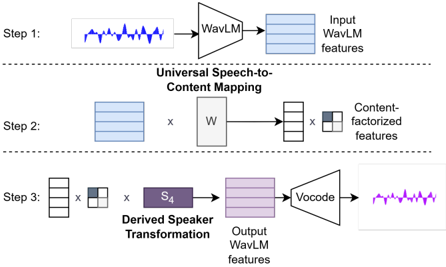

> [!abstract] arXiv · 2026 · Preprint
> **Henry Li Xinyuan et al.** (Johns Hopkins University) · [→ Paper](https://arxiv.org/abs/2603.08977) · Demo: ✓ · Code: ✓
>
> Extends a closed-set linear speech-content factorization method to an open-set setting, enabling zero-shot voice conversion and a training-efficient, speaker-agnostic acoustic feature for TTS, using only least-squares linear algebra with no additional neural training.

## Problem

Prior work showed that WavLM feature spaces have a useful geometric property: frames belonging to the same phoneme cluster tightly across speakers, which enabled training-free voice conversion methods such as kNN-VC and Speech Content Factorization (SCF). SCF in particular projects content-aligned WavLM features from a fixed pool of speakers into a shared low-rank content representation via SVD, then reconstructs speaker-specific features through per-speaker linear transformation matrices. This gives high-quality VC without training a neural network, but SCF is closed-set: computing or reconstructing the content-factorized representation requires the target speaker to have been part of the original SVD-derived speaker pool. That restriction makes SCF impractical for open-set VC or timbre-prompted TTS on large, diverse, crowd-sourced corpora (e.g. CommonVoice, Emilia), where recomputing the factorization for every new speaker is prohibitively expensive and many speakers lack enough data to be included in the first place.

## Method

Universal Speech Content Factorization (USCF) extends SCF's linear factorization to unseen speakers by decoupling two steps: (1) a single, speaker-agnostic linear mapping W from any speaker's WavLM features to the shared content space, fit once via least-squares over a fixed speaker pool, and (2) a per-speaker transformation matrix S_m, derived analytically from only a small amount (as little as a few seconds) of previously-unseen target-speaker speech.

The paper tests three formulations for W. W1 directly targets the SVD content factors U after factoring out the singular-value magnitudes Σ, which the authors argue prevents the least-squares objective from treating content dimensions unequally. W2 instead solves for a matrix that approximately inverts the known speaker transformation matrices S_j (from the closed-set SVD-derived speakers) toward the identity. W3 exploits an assumed linear separability of content and speaker-timbre subspaces to show that the Moore-Penrose pseudoinverse of any single closed-set speaker's transformation matrix approximately serves as a universal content mapping, requiring no explicit optimization at all. Given W, the speaker-specific reconstruction matrix S_m for an unseen speaker m is recovered in closed form from a small set of that speaker's WavLM frames via `S_m ≈ (X'_m W)† X'_m`.

At inference, VC proceeds by projecting source speech into the shared content space with W, then reconstructing it in the target speaker's acoustic space with the target's derived S_m, followed by a WavLM-based vocoder (vocoder identity not specified in the paper). Because every step is linear algebra (SVD, least-squares, pseudoinverse), no gradient-based training or neural network is required beyond the pretrained WavLM encoder and vocoder already used by prior SSL-space VC methods.

As a secondary application, the paper trains a flow-matching TTS model (following the ZipVoice architecture and training recipe) using USCF features as the target acoustic representation instead of mel filterbank features, testing whether a speaker-suppressed but content-preserving feature space makes for a better or more efficient synthesis target.

## Key Results

On LibriSpeech VC (20 source, target, and two held-out speaker sets of 20 each), USCF W1 reaches WER 2.7%, UTMOS 2.805, and speaker-similarity cosine 0.524, broadly competitive with kNN-VC (WER 3.16, UTMOS 2.855, Spk Sim 0.666), LinearVC (WER 2.69, UTMOS 2.765, Spk Sim 0.621), and closed-set SCF (WER 2.18, UTMOS 2.886, Spk Sim 0.603), and clearly ahead of SeedVC, a diffusion-transformer zero-shot VC baseline, on WER (2.7 vs. 6.24) (§4.1, Table 1). Speaker similarity is consistently the weakest metric for USCF relative to the closed-set and SSL-structure baselines; a control experiment with partially open-set SCF (open-set source, closed-set target) recovers closed-set-level speaker similarity, isolating the content-to-speaker transformation step (not the content mapping itself) as the source of the gap (§4.1). In a MOS/SMOS listening test, listeners show no statistically significant preference between USCF and kNN-VC, LinearVC, or SCF, and disfavor only SeedVC (§4.1, Table 2).

Among the three universal mappings, W1 offers the most balanced trade-off, W2 favors speaker similarity at the cost of quality and content preservation, and W3 favors content preservation but is weaker on speaker similarity; W3's performance is stable (WER SD 0.10%, UTMOS SD 0.015 across 10 runs) regardless of which closed-set speaker's transformation it is derived from (§4.1). A phoneme/speaker-ID probing analysis on TIMIT shows USCF matches WavLM on phoneme classification while removing substantially more speaker information (Spk EER 36.4% vs. WavLM's 21.77%, at rank 75) than either raw WavLM or ContentVec, and this speaker-information removal persists even at rank 1024, ruling out low-dimensionality as the explanation (§4.2, Table 3). USCF is stable across ranks 50-100 but degrades below rank 50 (§4.3.1, Table 4), and target-speaker similarity degrades sharply below 500 WavLM frames (~10 seconds) of target speech, with diminishing returns beyond 2000 frames (~40 seconds) (§4.3.2, Table 5). In the downstream TTS experiment, a flow-matching model trained with USCF target features reaches 11.44% ASR WER in 25 epochs, versus 27.93% WER at 39 epochs for mel filterbank features and 11.92% WER at 33 epochs for kNN-VC-normalized mel filterbank features (§4.4, Table 6), indicating comparable or better intelligibility with less training time.

## Novelty Assessment

The contribution is a focused algorithmic extension rather than a new architecture: USCF takes SCF's existing linear factorization and derives a closed-form, least-squares route to generalize it to unseen speakers, contributing three concrete formulations (W1, W2, W3) with different quality/speaker-similarity trade-offs and an analytical closed-set-to-open-set adaptation step. No neural network is trained at any point, which is itself notable given that most competing zero-shot VC systems (SeedVC, prior diffusion/flow approaches) require substantial neural training. The evaluation is reasonably thorough for a short paper (objective and subjective VC metrics, a phoneme/speaker probing analysis, rank and data-efficiency ablations, and a downstream TTS feature-quality test), though the TTS application in §4.4 is a single-configuration proof of concept rather than a systematic study, and the paper does not report the vocoder used to reconstruct waveforms from output WavLM features.

## Field Significance

Moderate — this paper closes a practical gap in the SSL-space VC line of work (kNN-VC, LinearVC, SCF) by removing the closed-set restriction without introducing any additional model training, and provides a concrete demonstration that a speaker-suppressed linear feature space can serve as a more training-efficient TTS acoustic target than mel filterbanks. Its speaker-similarity trade-off relative to closed-set methods leaves room for follow-up work, and the paper itself frames the current formulations as a step toward more stable or lower-data-requirement variants.

## Claims

- **supports:** A speaker-agnostic linear mapping can be fit once via least-squares over a fixed pool of speakers and then reused, without retraining, to project the WavLM features of entirely unseen speakers into a shared phonetic-content space.
  > *Evidence:* USCF's universal mapping W is fit only on speakers from two held-out LibriSpeech sets, yet is applied unmodified to disjoint source and target speaker sets at test time, achieving WER as low as 2.31-2.7%. *(§2.2, §4.1, Table 1)*
- **supports:** Per-speaker acoustic reconstruction from a shared content representation can be estimated in closed form from a very small amount of target-speaker speech, without gradient-based adaptation.
  > *Evidence:* The speaker transformation matrix S_m is derived analytically via a pseudoinverse from as few as 500 WavLM frames (~10 seconds) of target speech, with only modest further gains up to ~40 seconds and sharp degradation below 10 seconds. *(§2.3, §4.3.2, Table 5)*
- **complicates:** Removing the closed-set constraint from a linear speech-content factorization degrades target speaker similarity relative to the closed-set version, even though content preservation and naturalness are largely retained.
  > *Evidence:* USCF W1's speaker-similarity cosine (0.524) trails closed-set SCF (0.603), kNN-VC (0.666), and LinearVC (0.621); a partially open-set SCF control isolates the content-to-speaker transformation step, not the universal content mapping, as the source of this degradation. *(§4.1, Table 1)*
- **supports:** A linear, speaker-suppressed, content-preserving SSL-derived feature can serve as a more training-efficient acoustic target for TTS than mel-spectrogram features.
  > *Evidence:* A flow-matching TTS model trained with USCF target features reaches lower ASR WER (11.44%) in fewer epochs (25) than the same architecture trained on raw mel filterbank features (27.93% WER, 39 epochs), and matches speaker-normalized mel features while training faster. *(§4.4, Table 6)*
- **complicates:** Reducing the rank of a linear content-factorized representation trades off against reconstruction quality below a moderate threshold, even though very high ranks provide no additional benefit.
  > *Evidence:* USCF is stable for rank 50-100 (WER 2.69-2.7%, UTMOS 2.738-2.805) but degrades sharply at rank 20-30 (WER up to 3.98%, UTMOS down to 2.388), while doubling rank from 75 to 1024 in the phoneme/speaker probing task does not change phoneme classification accuracy. *(§4.2, §4.3.1, Tables 3-4)*

## Limitations and Open Questions

> [!warning]
> USCF trades away speaker similarity relative to the closed-set method it extends and to several training-based baselines; the paper's own control experiment localizes this gap to the open-set content-to-speaker transformation step, but does not resolve it (§4.1).

The paper does not report which vocoder converts output WavLM features back to a waveform, leaving a gap in reproducibility for the final synthesis step. The downstream TTS experiment (§4.4) uses a single architecture (ZipVoice-style flow matching) and a single training corpus (LibriSpeech), so the generality of USCF as a training-efficient acoustic target for other TTS architectures or noisier, larger-scale corpora (the CommonVoice/Emilia-style motivating scenario from the introduction) is untested. The authors note as future work that simple neural methods might yield a more stable universal mapping or reduce the amount of target-speaker speech required for the S_m derivation, and that USCF could be extended toward zero-shot, style-conditioned, timbre-agnostic TTS training.

## Wiki Connections

- [[voice-conversion|Voice Conversion]] — extends a closed-set linear SSL-space VC method (SCF) to an open-set, zero-shot setting without any additional neural training.
- [[disentanglement|Disentanglement]] — the least-squares mapping W explicitly separates phonetic content from speaker-timbre information within the WavLM feature space, verified by phoneme and speaker-ID probing.
- [[self-supervised-speech|Self-Supervised Speech]] — the entire method operates on frozen, pretrained WavLM features rather than features learned end-to-end for the VC task.
- [[flow-matching|Flow Matching]] — demonstrates that USCF features can replace mel filterbanks as the training target for a flow-matching TTS model built on the ZipVoice architecture, improving WER and training efficiency.
- [[speaker-adaptation|Speaker Adaptation]] — derives a target speaker's acoustic reconstruction transform analytically from only a few seconds of that speaker's speech, without gradient-based fine-tuning.
- [[subjective-evaluation|Subjective Evaluation]] — reports MOS and SMOS listening tests comparing USCF against kNN-VC, LinearVC, closed-set SCF, and SeedVC.
- [[interspeech-2025-0438|LinearVC]] — USCF is a direct open-set extension of the closed-set Speech Content Factorization method and universal mapping introduced in this paper, which also serves as a primary baseline.
- [[2411.09943|SeedVC]] — used as the diffusion-transformer zero-shot VC baseline; USCF outperforms it on WER and is preferred in the subjective listening test.
- [[2506.13053|ZipVoice]] — provides the flow-matching TTS architecture and training recipe used to test USCF features as an acoustic training target.
