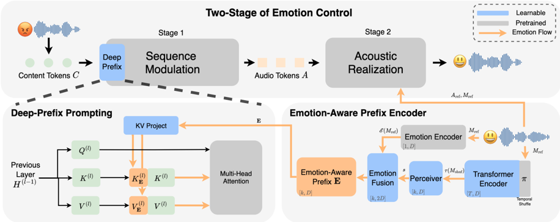

> [!abstract] arXiv · 2026 · Preprint
> **Haoyuan Yang et al.** (Center for Robust Speech Systems (CRSS), University of Texas at Dallas) · [→ Paper](https://arxiv.org/abs/2603.09120) · Demo: ? · Code: ?
>
> Introduces an Emotion-Aware Prefix that gives a two-stage zero-shot voice conversion backbone explicit, controllable emotion conditioning, roughly doubling emotion conversion accuracy while preserving speaker identity, content, and quality.

## Problem

Zero-shot voice conversion systems can mimic the overall speaking style of a reference prompt, but the paper's authors find that existing two-stage VC backbones exhibit suboptimal or inconsistent emotion controllability: they can approximate a speaker's general style but cannot be reliably steered toward a specific, high-intensity target emotion. The authors trace this to the sequence-modulation stage lacking any explicit emotion signal, leaving emotion conversion overly dependent on implicit cues (e.g., global energy or average pitch) carried passively by the acoustic prompt rather than an explicit control mechanism.

## Method

The paper extends VEVO [[2502.07243|Vevo]], a two-stage zero-shot voice conversion framework, with an Emotion-Aware Prefix and a Deep-Prefix Prompting mechanism, without modifying VEVO's core architecture. Stage 1 (Sequence Modulation) is an autoregressive Transformer that predicts discrete, style-rich audio tokens conditioned on content tokens and the new emotion-aware prefix; Stage 2 (Acoustic Realization) is a Flow-Matching Transformer that reconstructs a mel-spectrogram from the predicted tokens, conditioned on a reference audio token/mel-spectrogram pair, followed by a neural vocoder.

The Emotion-Aware Prefix Encoder produces an utterance-level, content-invariant emotion style embedding from a reference mel-spectrogram through three components: (1) a Temporal-Shuffle Transformer that randomly permutes the temporal indices of the reference mel-spectrogram before encoding, disrupting phonetic/linguistic structure while retaining frame-level acoustic statistics related to prosody and timbre, reducing content leakage; (2) a Perceiver Layer (following GenVC's design) that cross-attends k=32 learnable latent tokens to the shuffled-frame representations, compressing them into a fixed-length style embedding independent of utterance duration; and (3) an Emotion Fusion Layer that concatenates this style embedding with an embedding from a pretrained Emotion2Vec+ Large encoder [[2312.15185|emotion2vec]] and projects the result to the language model's hidden dimension, producing the final Emotion-Aware Prefix.

Rather than simply prepending this prefix to the AR Transformer's input sequence, Deep-Prefix Prompting (inspired by P-Tuning v2) injects it as layerwise key/value pairs in the AR Transformer's KV-cache: at each layer, independent learned projections map the prefix to layer-specific key and value vectors, which are prepended to the standard key/value matrices before attention. All VEVO backbone parameters remain frozen during fine-tuning; the Emotion-Aware Prefix Encoder is fully trainable and LoRA (rank r=32) is applied to the AR Transformer for lightweight adaptation. Training uses the Emotion Speech Dataset (10 English speakers, 5 emotions, 300 parallel utterances per speaker-emotion) for 46k steps with AdamW at a learning rate of 2e-5.

## Key Results

Against the VEVO backbone and three other baselines (GenVC, a customized StarGANv2-VC-EVC, and StepAudioEditX iter 2), the proposed method raises Emotion Conversion Accuracy (ECA, measured with an Emotion2Vec+ classifier) from VEVO's 42.40% to 85.50%, roughly doubling it, while Emotion Similarity rises to 0.850 (highest among all systems). Speaker identity, quality, and intelligibility are preserved or improved relative to VEVO: EER falls from 5.40% to 4.50%, WER falls from 10.08% to 6.28%, and DNSMOS overall quality improves slightly (3.093 -> 3.152), though UTMOSv2 naturalness dips slightly (3.06 -> 2.96). A variant without Deep-Prefix Prompting (prefix simply prepended to the input) already reaches 83.50% ECA, showing most of the gain comes from the Emotion-Aware Prefix itself, with Deep-Prefix Prompting contributing a smaller additional improvement.

In a 10-subject listening test (120 utterances each), the proposed method scored a higher subjective MOS than VEVO (4.018 vs. 3.878) and was strongly preferred in ABX/rating comparisons for both emotion similarity (75.2% vs. 17.5%) and speaker similarity (58.7% vs. 16.8%).

A stage-wise isolation experiment (prompting only Stage 1, only Stage 2, or both jointly with the target emotion) shows that, for the proposed method, Control Sequence alone reaches 47.00% ECA versus Control Acoustic alone at 34.50%, while joint control reaches 85.50%, a gain well beyond the sum of the two isolated conditions. Applying the same Emotion-Aware Prefix to GenVC, a single-stage VC model without a decoupled acoustic realization stage, improves ECA (32.48% -> 58.35%) but severely degrades speaker identity (EER 20.87% -> 44.51%), in contrast to VEVO where identity is preserved.

## Novelty Assessment

The contribution is primarily architectural: a new Emotion-Aware Prefix Encoder (Temporal-Shuffle Transformer + Perceiver + Emotion Fusion Layer) and a Deep-Prefix Prompting injection mechanism, added on top of an existing state-of-the-art VC backbone (VEVO) with the backbone itself left unmodified and frozen. Individually, permutation-based content leakage reduction, Perceiver-based style compression (borrowed from GenVC), and P-Tuning-v2-style deep prompting are each adapted from prior work rather than newly invented; the novelty lies in composing them into a lightweight, LoRA-adapted module purpose-built for explicit emotion control in a two-stage VC pipeline. Beyond the architecture, the paper's stage-wise isolation study and the acoustic-decoupling comparison (VEVO vs. GenVC) are a genuine empirical/conceptual contribution: they give a mechanistic account of where and how emotion control operates in two-stage VC systems, rather than only reporting an accuracy improvement.

## Field Significance

moderate — This paper demonstrates that explicit, prefix-based emotion conditioning injected into the sequence-modulation stage of a two-stage VC architecture substantially improves controllable emotion conversion without a corresponding loss in speaker identity or content fidelity, when the architecture retains a decoupled acoustic realization stage. It also provides a mechanistic account, via stage isolation and a cross-architecture comparison, of why acoustic decoupling matters for identity preservation under strong emotion control. The contribution is a focused, well-ablated extension of an existing backbone rather than a new VC paradigm.

## Claims

- **supports:** Injecting an explicit, learned emotion-conditioning signal into the sequence-modulation stage of a two-stage voice conversion architecture substantially improves controllable emotion conversion accuracy without degrading speaker identity, linguistic content, or perceptual quality.
  > *Evidence:* Adding the Emotion-Aware Prefix and Deep-Prefix Prompting to VEVO raises Emotion Conversion Accuracy from 42.40% to 85.50% while EER improves (5.40% -> 4.50%), WER improves (10.08% -> 6.28%), and DNSMOS overall quality improves slightly (3.093 -> 3.152). *(§5.1, Table 1)*
- **refines:** In two-stage (sequence-modulation + acoustic-realization) voice conversion architectures, controllable emotional expression is primarily determined at the sequence-modulation stage, with the acoustic-realization stage acting as a faithful but subordinate renderer.
  > *Evidence:* Isolating emotion prompts to each stage shows Control Sequence reaches 47.00% ECA versus Control Acoustic at 34.50% for the proposed method, and joint control of both stages yields a non-additive jump to 85.50% ECA. *(§5.2, Table 2)*
- **complicates:** Explicit emotion-conditioning mechanisms designed for two-stage VC backbones do not transfer safely to single-stage, acoustically coupled architectures; without a decoupled acoustic stage, improving emotion control can come at the cost of severe speaker identity degradation.
  > *Evidence:* Applying the same Emotion-Aware Prefix to GenVC (a single-stage architecture without acoustic decoupling) improves ECA from 32.48% to 58.35% but nearly doubles EER, from 20.87% to 44.51%, whereas the same prefix applied to VEVO's decoupled architecture preserves identity. *(§5.3, Table 3)*
- **complicates:** Explicit, high-intensity emotion control in voice conversion can introduce a small naturalness cost even when other objective and subjective quality metrics improve.
  > *Evidence:* The proposed method's UTMOSv2 naturalness score is slightly lower than the VEVO backbone's (2.96 vs. 3.06) despite simultaneous improvements in WER, EER, and DNSMOS. *(§5.1)*

## Limitations and Open Questions

The evaluation trains and tests on a single dataset (ESD: 10 English speakers, 5 categorical emotions), with test utterances drawn from the same speakers seen during fine-tuning rather than held-out speakers, so the paper does not directly demonstrate that the Emotion-Aware Prefix generalizes to unseen speakers or to emotions/intensities beyond ESD's five categorical labels. The comparative acoustic-decoupling analysis uses only two VC backbones (VEVO and GenVC), which the authors treat as representative of decoupled vs. coupled designs, but this leaves open how the finding generalizes across other two-stage or end-to-end VC architectures. The subjective evaluation involved a small pool of ten listeners.

## Wiki Connections

- [[voice-conversion|Voice Conversion]] — proposes an explicit emotion-conditioning module for the emotion voice conversion (EVC) subtask, aiming to fix a known controllability gap in zero-shot VC backbones.
- [[emotion-synthesis|Emotion Synthesis]] — introduces the Emotion-Aware Prefix and Deep-Prefix Prompting as a dedicated mechanism for controllable emotion expression in generated speech.
- [[zero-shot-tts|Zero-Shot TTS]] — builds on a zero-shot voice conversion backbone and preserves its prompt-based, non-fine-tuned-speaker conversion paradigm while adding emotion control.
- [[self-supervised-speech|Self-Supervised Speech]] — relies on a pretrained self-supervised Emotion2Vec+ encoder as a core component of its Emotion Fusion Layer.
- [[2502.07243|Vevo]] — the two-stage zero-shot voice conversion backbone this paper extends without modifying its core architecture.
- [[2312.15185|emotion2vec]] — used as the pretrained emotion encoder inside the Emotion Fusion Layer to extract explicit emotion embeddings.
- [[2511.03601|Step-Audio-EditX]] — used as one of the state-of-the-art baseline systems (foundation-model-based audio editing) in the objective evaluation.
