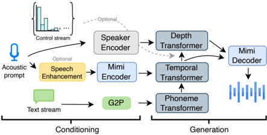
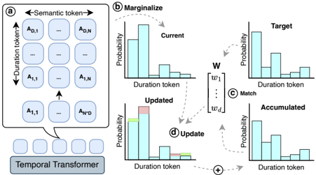

> [!abstract] arXiv · 2026 · Preprint
> **Nikita Torgashov et al.** (KTH Royal Institute of Technology) · [→ Paper](https://arxiv.org/abs/2603.13518) · Demo: ✓ · Code: ✓
>
> Introduces a full-stream zero-shot TTS system whose speaking rate can be raised or lowered mid-utterance while it is generating, without a separate control model or retraining pass.

## Problem

Most streaming-capable TTS systems assume a static speaking rate across an entire utterance, offering at best coarse, utterance-level speed control. This is a poor match for spontaneous human speech, where rate fluctuates within a sentence as speakers slow down to formulate thoughts, insert fillers, or accelerate through well-rehearsed content. Separately, most zero-shot TTS architectures remain fundamentally offline, requiring the full input text before synthesis can begin, which is incompatible with real-time conversational agents and speech-to-speech translation where text arrives incrementally from an upstream language model. The paper identifies dynamic (mid-utterance, on-the-fly) speaking-rate control as largely unexplored in modern TTS, and notes that existing full-stream systems generally still require a text transcription of the acoustic prompt, which is unreliable when the prompt itself is spoken quickly.

## Method

VoXtream2 extends the authors' earlier VoXtream architecture with three additions: dynamic speaking-rate control (SRC), prompt text masking, and classifier-free guidance (CFG) applied across every conditioning signal. The backbone consists of an incremental Phoneme Transformer (PT) that encodes an IPA phoneme sequence with a look-ahead of up to 25 phonemes, an autoregressive Temporal Transformer (TT) that jointly predicts a semantic token and a 6-way duration-token distribution over Mimi codec frames (12.5 Hz), and an autoregressive Depth Transformer (DT), initialized from a frozen Sesame-CSM checkpoint, that predicts 15 additional Mimi acoustic tokens per frame conditioned on the TT output, a speaker embedding, and the semantic token.

Speaking-rate control uses a distribution matching mechanism operating on the duration-token histogram the TT produces at each step. The current duration distribution is marginalized from the joint semantic/duration output, then reweighted toward a target syllables-per-second (SPS) value using an exponential weighting term that compares the target distribution to an accumulated distribution tracked over a 3-second sliding window of already-generated speech. A strength parameter β trades off control tightness against intelligibility; the authors fix β = 5.

To remove the dependency on an external phoneme aligner for the acoustic prompt, the model is trained with prompt text masking: the transcript of a randomly selected 3-10 second prompt segment is replaced with `<UNK>` tokens that participate in gradient computation, which also enables applying CFG at generation time. CFG is applied separately to text conditioning on the PT input, audio conditioning on the TT input, and the speaker embedding on the DT input, with different guidance scales for TT (γ=1.5, favoring prosodic variation) and DT (γ=3.0, favoring speaker fidelity); speaker-embedding conditioning weight is additionally increased by 50%. Because increasing speaker similarity via CFG can propagate acoustic-prompt noise into the output, the prompt is optionally denoised with the Sidon speech-enhancement model before encoding. The model is trained on 40k hours combined from the Emilia English subset and HiFiTTS-2 (LibriVox-derived), using a Llama-3.2-based transformer backbone (462M parameters total), AdamW, and 28 GPU-hours on 2xH200. At inference, CUDA Graphs and a cached streaming Mimi codec state give 74 ms first-packet latency and roughly 4x real-time throughput on a consumer GPU.

## Key Results

On zero-shot TTS benchmarks (SEED-TTS test-en and LibriSpeech-PC test-clean), VoXtream2 is competitive with larger, more heavily trained public systems: on SEED-TTS test-en it reaches WER 1.32%, SPK-SIM 0.656, and UTMOS 4.05, versus e.g. CosyVoice2 (618M params, 167k hours multilingual: WER 2.27, SPK-SIM 0.658, UTMOS 4.16) and F5-TTS (336M params, 100k hours multilingual: WER 1.26, SPK-SIM 0.67, UTMOS 3.69), despite using only 462M parameters and 40k hours of English-only training data (Table 2). In a MUSHRA-like naturalness study, VoXtream2 obtains the highest preference score among compared systems (68.8 ± 2.3), ahead of CosyVoice2, F5-TTS, and VoiceStar.

In full-stream mode, VoXtream2 achieves the lowest first-packet latency and real-time factor among publicly available full-stream baselines (74 ms FPL / 0.256 RTF with CUDA Graphs, 63 ms / 0.173 with Torch Compile), improving on the original VoXtream and substantially outperforming CosyVoice2 and Kyutai-TTS on word-level streaming WER (Table 4, §5.1).

For speaking-rate control specifically, VoXtream2 provides continuous control in a 2-5 SPS range, compared to Spark-TTS's five discrete rate states or CosyVoice2's narrow instructed-generation range, and clearly outperforms MaskGCT and VoiceStar in subjective preference at slow rates while maintaining comparable or better voice-cloning similarity (§5.2). For dynamic (mid-utterance) control, Pearson correlation between the target rate signal and the measured generated rate ranges from 0.619 to 0.826 across four transition scenarios, with WER increasing at extreme and fast-transition conditions (Table 5).

## Novelty Assessment

The core architectural pattern (phoneme transformer + temporal transformer + depth transformer over Mimi codec tokens) is inherited directly from the authors' prior VoXtream model; VoXtream2's genuine contribution is the addition of three specific, evaluated mechanisms on top of that base: (1) a histogram-based distribution matching procedure for speaking-rate control that generalizes from static (utterance-level) to dynamic (frame-level, mid-utterance) control without retraining a separate control head, (2) prompt text masking that removes the need for prompt transcription while remaining compatible with CFG, and (3) a systematic application of CFG across text, audio, and speaker-embedding conditioning in a full-stream AR TTS setting, building on prior CFG-in-TTS work (Koel-TTS) but adapting the guidance scales per module. The paper is honest that the underlying architecture is incremental relative to VoXtream, and that dynamic SRC specifically is the main new capability; the ablation table (Table 6) attributes most of the quality gains to CFG and prompt enhancement rather than to a new backbone design. The paper also releases a new evaluation resource, the Emilia speaking-rate test set, purpose-built for evaluating rate control under multiple speaking-rate conditions and dynamic transitions.

## Field Significance

moderate — This paper is a focused technical contribution rather than a new architectural paradigm: it takes an existing full-stream AR TTS design and adds a specific, well-evaluated mechanism (distribution-matching-based dynamic speaking-rate control) that several concurrent works in the same subfield had not yet addressed at the frame level. It demonstrates that mid-utterance rate control is achievable without a separate control network or model retraining, and it releases a dedicated public benchmark for evaluating both static and dynamic speaking-rate control, which could be reused by future rate-control work independent of this specific architecture.

## Claims

- **supports:** Mid-utterance (dynamic) speaking-rate control can be implemented as a lightweight histogram reweighting step applied to an autoregressive model's own duration-token distribution, without training a separate control network.
  > *Evidence:* The distribution matching mechanism marginalizes the TT's joint semantic/duration output into a duration histogram, then reweights it toward a target SPS value using an exponential comparison against a sliding-window accumulated distribution, achieving Pearson correlations of 0.619-0.826 between the control signal and the measured generated rate across four dynamic transition scenarios. *(§3.5, §5.3, Table 5)*
- **supports:** Applying classifier-free guidance separately to text, audio-prompt, and speaker-embedding conditioning in autoregressive zero-shot TTS improves intelligibility and speaker similarity, at a measurable cost to signal quality that must be compensated separately.
  > *Evidence:* Ablations show text CFG reduces WER from 2.29% to 1.37%; adding audio CFG raises SPK-SIM from 0.578 to 0.661 but lowers UTMOS from 3.91 to 3.65; adding speaker-embedding CFG raises SPK-SIM further to 0.674. *(§6, Table 6)*
- **complicates:** Speaking-rate control mechanisms operating on top of an autoregressive codec-token model are not fully disentangled from the speaking rate of the acoustic prompt, because the same model both encodes the prompt and continues it under a next-token objective.
  > *Evidence:* Even with the proposed SRC applied, prompts with a slow speaking rate increase WER when the target rate is fast and vice versa; the authors attribute this to the prompt-encoding and generation pathways sharing the same next-token-prediction model. *(§7, Figure 7)*
- **supports:** Removing the acoustic prompt's text transcription during training, by masking it with placeholder tokens that are still included in the gradient, can reduce a zero-shot TTS system's sensitivity to the prompt's own speaking rate without degrading average intelligibility.
  > *Evidence:* On the Emilia speaking-rate test set, the prompt-text-masked model achieves more stable WER across slow/normal/fast prompt conditions (2.14/2.20/2.13%) than the transcription-dependent baseline (2.80/2.10/4.21%), which spikes sharply for fast prompts. *(§3.2, Table 3)*
- **complicates:** Extending duration-based rate control to extreme target rates increases the risk of hallucinated or repeated output, because those rate regions are underrepresented in typical training corpora.
  > *Evidence:* At a very slow target rate (1 SPS) WER rises to 16.51%, versus 3.2% at a normal rate (4 SPS), attributed by manual inspection to underrepresentation of slow duration states in training data plus increased word repetition and filler insertion. *(§5.3, Table 5)*

## Limitations and Open Questions

> [!warning]
> The system's speaking-rate control is not fully disentangled from the acoustic prompt's own rate: prompts recorded at one rate measurably bias intelligibility when the target rate diverges strongly from it (§7), so the reported rate-control ranges should be read as conditional on prompt/target rate combinations rather than uniformly reliable across the full 2-6 SPS operating range.

The training data pipeline is also non-trivial to reproduce: forced alignment with the Clap-IPA aligner discards roughly 35% of the initially collected 62k hours due to invalid alignments, and the paper flags this preprocessing complexity as an open problem for future work. Translingual prompt masking (any-language-to-English generation) is mentioned as an emergent capability but is not quantitatively evaluated, only demonstrated via audio samples. The reliable operating range for dynamic control is also bounded in practice (roughly 1-5/6 SPS), with WER increasing markedly outside that range and under fast-to-slow transitions specifically.

## Wiki Connections

- [[streaming-tts|Streaming TTS]] — VoXtream2 is a full-stream architecture that begins generating audio before the full input text is available, and specifically evaluates robustness to variable incoming text token rates simulating an upstream LLM.
- [[zero-shot-tts|Zero-Shot TTS]] — the system performs zero-shot voice cloning from a short acoustic prompt, evaluated against public zero-shot baselines on SEED-TTS and LibriSpeech-PC.
- [[prosody-control|Prosody Control]] — introduces an explicit distribution-matching mechanism that controls speaking rate independently of content and speaker identity, extending prior utterance-level rate control to frame-level, mid-utterance adjustment.
- [[autoregressive-codec-tts|Autoregressive Codec TTS]] — its Temporal and Depth Transformers autoregressively predict Mimi codec tokens (semantic and acoustic), following the AR codec-LM paradigm.
- [[neural-codec|Neural Audio Codec]] — relies on the Mimi neural codec as its core audio tokenizer, including a cached streaming codec state to minimize inference latency.
- [[2509.15969|VoXtream]] — VoXtream2 is a direct extension of this earlier full-stream TTS model, adding dynamic SRC, prompt text masking, and CFG on top of its architecture.
- [[2412.10117|CosyVoice2]] — used as a primary full-stream and instructed speaking-rate-control baseline throughout the zero-shot TTS and full-stream evaluations.
- [[2406.02430|SEED-TTS]] — SEED-TTS test-en supplies one of the two standard zero-shot TTS evaluation protocols used to benchmark VoXtream2.
- [[2506.21619|IndexTTS2]] — cited as a recent duration-controlled autoregressive zero-shot TTS system in the related-work discussion of static speaking-rate control approaches.
- [[2602.05770|Zero-shot TTS with Enhanced Audio Prompts]] — VoXtream2's acoustic-prompt enhancement step follows the approach introduced in this paper.
- [[2509.14579|Cross-lingual F5-TTS]] — cited in related work among prior full-stream and prompt-based zero-shot TTS approaches.
- [[2601.10629|VoiceSculptor]] — cited as an example of the text-description-based speaking-rate control category that lacks voice cloning capability.
